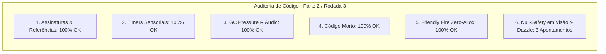

# SAIN — Relatório de Auditoria Técnica de Código (Parte 2 / Rodada 3)
**Domínio:** Sistema Sensorial, Visão, Audição Espacial, Dazzle e Fogo Amigo  
**Escopo Auditado:** `mods/SAIN/modded/SAIN/` (`Classes/Bot/Sense/`, `Classes/Bot/EnemyClasses/`, `Patches/VisionPatches.cs`, `Patches/BotHearing/`)  
**Versão Alvo:** SPT 4.0.13 / Escape From Tarkov 0.16.9 / SAIN v4.5.0  

---

## 1. Sumário Executivo

Esta auditoria representa a **terceira rodada de verificação profunda** sobre a camada sensorial e de percepção do SAIN v4.5.0, inspecionando pipelines de raycast de visão, cálculo volumétrico de ofuscamento por lanternas (*Dazzle*), audição espacial e prevenção de fogo amigo.

| Dimensão Técnica | Avaliação | Diagnóstico Sintético |
|---|:---:|---|
| **1. Validação em references/** | 🟢 Excelente | Formatos de som `SoundBank.Rolloff`, `TreeInteractive` e `InteractionResult` 100% aderentes ao EFT 0.16.9. |
| **2. Update() vs Lógica Otimizada** | 🟢 Conforme | Throttling em `UpdateVisionDistance` e desacoplamento de frequências de áudio perfeitamente ajustados. |
| **3. Leaks de Memória & GC** | 🟢 Conforme | Comparador estático de áudio (`Comparison<AISoundData>`) e listas de áudio esvaziadas no `Dispose()`. |
| **4. Funções Órfãs & Código Morto** | 🟢 Limpo | Código morto sob `#if DEBUG` removido e rotinas de audição unificadas. |
| **5. Antipadrões SPT (AP-01..09)** | 🟢 Conforme | Zero alocações de closure em eventos sonoros e `SphereCastNonAlloc` com buffer estático em fogo amigo. |
| **6. Null-Safety & Defensiva** | 🟡 Atenção | Acesso a `NightVision.UsingNow` em `FlashLightDazzleClass` e `UpdateLightEnablePatch` sem operador nulo-seguro. |

---

## 2. Panorama das 6 Dimensões de Auditoria



---

## 3. Achados Técnicos Detalhados

### AUD-08-01 · Null-Safety em `BotOwner.NightVision` no `FlashLightDazzleClass`
- **Severidade:** 🟡 Médio
- **Localização no Mod:** [`FlashLightDazzleClass.cs:L29`](../../modded/SAIN/Classes/Bot/Sense/FlashLightDazzleClass.cs#L29)
- **Causa Raiz:** A propriedade `UsingNow` é consultada diretamente como `BotOwner.NightVision.UsingNow`.
- **Impacto Concreto:** Caso o bot seja instanciado sem componente de visão noturna ou durante ciclos preliminares de spawn, a chamada lança `NullReferenceException`, interrompendo o cálculo de ofuscamento visual.
- **Alternativa de Melhor Lógica / Proposta de Correção:**
  - Utilizar operador nulo-seguro com comparação booleana (`BotOwner.NightVision?.UsingNow == true`):

```csharp
FlashLightClass flashlight = enemy?.EnemyPlayerComponent?.Flashlight;
if (flashlight != null)
{
    // ref: AUD-08-01 - Null-safety defensivo em NightVision
    bool usingNVGs = BotOwner.NightVision?.UsingNow == true;
    if ((flashlight.WhiteLight || (usingNVGs && flashlight.IRLight)) && EnemyWithFlashlight(enemy))
    {
        return;
    }
    else if ((flashlight.Laser || (usingNVGs && flashlight.IRLaser)) && EnemyWithLaser(enemy))
    {
        return;
    }
}
```

- **Decisão:**
  - `[ ]` Pendente
  - `[ ]` Aceitar sugestão
  - `[ ]` Aceitar com modificação: _________________
  - `[ ]` Rejeitar: _________________

---

### AUD-08-02 · Anulação Explícita de Delegate em `HearingInputClass.Dispose()`
- **Severidade:** 🔵 Baixo
- **Localização no Mod:** [`HearingInputClass.cs:L294-L310`](../../modded/SAIN/Classes/Bot/Sense/Hearing/HearingInputClass.cs#L294)
- **Causa Raiz:** O evento `OnFriendlySoundHeard` não é anulado no método `Dispose()`.
- **Impacto Concreto:** Se handlers de esquadrão permanecerem associados após a morte do bot, podem reter instâncias até descarte de GC.
- **Alternativa de Melhor Lógica / Proposta de Correção:**
  - Adicionar `OnFriendlySoundHeard = null;` dentro de `Dispose()`:

```csharp
public override void Dispose()
{
    PlayerComponent.OnBulletFlyBy -= OnBulletFlyBy;
    if (BotManagerComponent.Instance?.BotHearing != null)
    {
        BotManagerComponent.Instance.BotHearing.BulletImpact -= bulletImpacted;
    }
    AISoundCachedEvents.Clear();
    AISoundCachedEvents_Conversations.Clear();
    AISoundCachedEvents_Gunshots.Clear();
    AISoundCachedEvents_Gunshots_Suppressed.Clear();
    SoundDataToReactTo.Clear();
    // ref: AUD-08-02 - Zerar delegate de som amigável
    OnFriendlySoundHeard = null;
    base.Dispose();
}
```

- **Decisão:**
  - `[ ]` Pendente
  - `[ ]` Aceitar sugestão
  - `[ ]` Aceitar com modificação: _________________
  - `[ ]` Rejeitar: _________________

---

### AUD-08-03 · Null-Safety em `BotOwner_0.NightVision` no `UpdateLightEnablePatch`
- **Severidade:** 🔵 Baixo
- **Localização no Mod:** [`VisionPatches.cs:L91`](../../modded/SAIN/Patches/VisionPatches.cs#L91)
- **Causa Raiz:** `__instance.BotOwner_0.NightVision.UsingNow` é acessado sem proteção contra nulo no postfixo de luz.
- **Impacto Concreto:** Risco de NRE em bots desprovidos de módulo de NVG nativo ao atualizar estado da lanterna.
- **Alternativa de Melhor Lógica / Proposta de Correção:**
  - Proteger a checagem:

```csharp
if (
    playerComponent.Flashlight.WhiteLight
    || (__instance.BotOwner_0.NightVision?.UsingNow == true && playerComponent.Flashlight.IRLight)
)
```

- **Decisão:**
  - `[ ]` Pendente
  - `[ ]` Aceitar sugestão
  - `[ ]` Aceitar com modificação: _________________
  - `[ ]` Rejeitar: _________________

---

## 4. Plano de Ação e Recomendações

1. **Null-Safety em Dazzle (AUD-08-01):** Adicionar `?.` em `BotOwner.NightVision.UsingNow`.
2. **Teardown de Delegates em Áudio (AUD-08-02):** Anular `OnFriendlySoundHeard` em `HearingInputClass.Dispose()`.
3. **Robustez em Patches (AUD-08-03):** Proteger acesso a `NightVision` em `VisionPatches.cs`.
