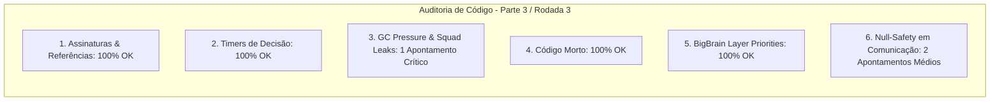

# SAIN — Relatório de Auditoria Técnica de Código (Parte 3 / Rodada 3)
**Domínio:** Máquina de Decisão, Camadas BigBrain, Esquadrões e Comunicação  
**Escopo Auditado:** `mods/SAIN/modded/SAIN/` (`Classes/Bot/Decision/`, `Classes/BotManager/`, `Classes/Bot/Talk/`, `Layers/`, `Plugin/BigBrainHandler.cs`)  
**Versão Alvo:** SPT 4.0.13 / Escape From Tarkov 0.16.9 / SAIN v4.5.0  

---

## 1. Sumário Executivo

Esta auditoria representa a **terceira rodada de verificação profunda** sobre os subsistemas de inteligência tática coletiva, máquinas de estado de combate, esquadrões e protocolos de comunicação via fala e gestos no SAIN v4.5.0.

| Dimensão Técnica | Avaliação | Diagnóstico Sintético |
|---|:---:|---|
| **1. Validação em references/** | 🟢 Excelente | Enums de gestos `EInteraction` e classes de grupo `BotsGroup` perfeitamente aderentes ao EFT 0.16.9. |
| **2. Update() vs Lógica Otimizada** | 🟢 Conforme | Decisão de esquadrão throttled e varredura de contatos zumbis otimizada com `break`. |
| **3. Leaks de Memória & GC** | 🔴 Atenção | `Squad` não implementa `Dispose()`, mantendo inscrição estática permanente em `PresetHandler.OnPresetUpdated`. |
| **4. Funções Órfãs & Código Morto** | 🟢 Limpo | Métodos e transições de esquadrão plenamente integrados e ativos. |
| **5. Antipadrões SPT (AP-01..09)** | 🟢 Conforme | Prioridades de camadas BigBrain coerentes (SAIN 20..80, ORBIT 19, Trauma 90). |
| **6. Null-Safety & Defensiva** | 🟡 Atenção | Acesso desprotegido a `HandsController` e `GoalEnemy` em gestos e reportes de posição em `GroupTalk`. |

---

## 2. Panorama das 6 Dimensões de Auditoria



---

## 3. Achados Técnicos Detalhados

### AUD-09-01 · Ausência de `Dispose()` na Classe `Squad` e Vazamento em Evento Estático
- **Severidade:** 🔴 Alto
- **Localização no Mod:** [`Squad.cs:L17-L792`](../../modded/SAIN/Classes/BotManager/Squad.cs#L17) e [`BotSquads.cs:L154`](../../modded/SAIN/Classes/BotManager/BotSquads.cs#L154)
- **Causa Raiz:** O método `BotSquads.Dispose()` chama `squad.Dispose()`, porém a classe `Squad` não implementa `public void Dispose()`. No construtor de `Squad` (L79), é registrado `PresetHandler.OnPresetUpdated += updateSettings;` (um evento estático em `PresetHandler`).
- **Impacto Concreto:** Vazamento de memória cumulativo entre raids: todas as instâncias de `Squad` criadas ao longo de uma sessão de jogo continuam ancoradas na raiz estática de `PresetHandler`, impedindo a coleta de lixo de seus membros (`BotComponent`), dicionários e eventos.
- **Alternativa de Melhor Lógica / Proposta de Correção:**
  - Implementar `public void Dispose()` na classe `Squad`:

```csharp
public void Dispose()
{
    PresetHandler.OnPresetUpdated -= updateSettings;
    if (_botsGroup != null)
    {
        _botsGroup.OnMemberRemove -= removeMember;
        _botsGroup = null;
    }
    Members.Clear();
    MemberInfos.Clear();
    Roles.Clear();
    PlayerPlaceChecks.Clear();
    LeaderComponent = null;
    OnMemberDecisionMade = null;
    OnMemberHeardEnemy = null;
    OnSquadEmpty = null;
    LeaderKilled = null;
    OnMemberKilled = null;
    NewLeaderFound = null;
}
```

- **Decisão:**
  - `[ ]` Pendente
  - `[ ]` Aceitar sugestão
  - `[ ]` Aceitar com modificação: _________________
  - `[ ]` Rejeitar: _________________

---

### AUD-09-02 · Null-Safety em `Player.HandsController` no `GroupTalk.checkLeaderTalk`
- **Severidade:** 🟡 Médio
- **Localização no Mod:** [`GroupTalk.cs:L944, L952`](../../modded/SAIN/Classes/Bot/Talk/GroupTalk.cs#L944)
- **Causa Raiz:** `Player.HandsController.ShowGesture(gesture)` é chamado diretamente sem o operador de propagação nula `?.`.
- **Impacto Concreto:** Caso o líder do esquadrão tente sinalizar uma ordem com as mãos ocupadas por animação médica, recarga de cartucho ou transição de arma, a chamada lança `NullReferenceException`.
- **Alternativa de Melhor Lógica / Proposta de Correção:**
  - Aplicar `Player.HandsController?.ShowGesture(gesture);`:

```csharp
if (shallGesture)
{
    Player.HandsController?.ShowGesture(gesture);
}
```

- **Decisão:**
  - `[ ]` Pendente
  - `[ ]` Aceitar sugestão
  - `[ ]` Aceitar com modificação: _________________
  - `[ ]` Rejeitar: _________________

---

### AUD-09-03 · Null-Safety em `Bot.GoalEnemy` no `GroupTalk.TalkEnemyLocation`
- **Severidade:** 🟡 Médio
- **Localização no Mod:** [`GroupTalk.cs:L965`](../../modded/SAIN/Classes/Bot/Talk/GroupTalk.cs#L965)
- **Causa Raiz:** `Bot.GoalEnemy.IsVisible` é acessado diretamente no teste condicional, ignorando o parâmetro de entrada `enemy` e sem validar se `Bot.GoalEnemy` é nulo.
- **Impacto Concreto:** Se `TalkEnemyLocation` for invocado para um inimigo secundário enquanto o bot ainda não estabeleceu um `GoalEnemy`, a chamada lança NRE.
- **Alternativa de Melhor Lógica / Proposta de Correção:**
  - Utilizar `enemy.IsVisible` no teste condicional:

```csharp
if (enemy.IsVisible && enemy.EnemyLookingAtMe && EFTMath.RandomBool(_enemyNeedHelpChance))
{
    mask = ETagStatus.Combat;
    bool injured = !Bot.Memory.Health.Healthy && !Bot.Memory.Health.Injured;
    trigger = injured ? EPhraseTrigger.NeedHelp : EPhraseTrigger.OnRepeatedContact;
}
```

- **Decisão:**
  - `[ ]` Pendente
  - `[ ]` Aceitar sugestão
  - `[ ]` Aceitar com modificação: _________________
  - `[ ]` Rejeitar: _________________

---

## 4. Plano de Ação e Recomendações

1. **Descarte e Desinscrição de Esquadrões (AUD-09-01):** Implementar `Squad.Dispose()` com desinscrição de `PresetHandler.OnPresetUpdated`.
2. **Null-Safety em Gestos (AUD-09-02):** Adicionar `?.` em `HandsController` dentro de `GroupTalk.cs`.
3. **Null-Safety em Localização de Inimigo (AUD-09-03):** Utilizar `enemy.IsVisible` em `GroupTalk.TalkEnemyLocation`.
