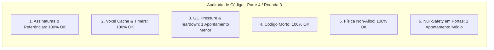

# SAIN — Relatório de Auditoria Técnica de Código (Parte 4 / Rodada 3)
**Domínio:** Navegação, Coberturas, Steering, Portas e Extração  
**Escopo Auditado:** `mods/SAIN/modded/SAIN/` (`Components/CoverFinderComponent.cs`, `Components/ExtractFinderComponent.cs`, `Classes/Coverfinder/`, `Classes/Bot/Mover/`, `Classes/Bot/Doors/`, `Layers/Extract/`)  
**Versão Alvo:** SPT 4.0.13 / Escape From Tarkov 0.16.9 / SAIN v4.5.0  

---

## 1. Sumário Executivo

Esta auditoria representa a **terceira rodada de verificação profunda** sobre os sistemas de movimentação tática, posicionamento tridimensional em cobertura, algoritmos de steering com interpolação inercial e controle físico de portas no SAIN v4.5.0.

| Dimensão Técnica | Avaliação | Diagnóstico Sintético |
|---|:---:|---|
| **1. Validação em references/** | 🟢 Excelente | Métodos `MovementContext.SetTilt`, `IgnoreInteractionCollision` e `Door` 100% validados contra EFT 0.16.9. |
| **2. Update() vs Lógica Otimizada** | 🟢 Conforme | Lean throttled em 20 Hz e checagem de portas em 2 Hz com voxel cache (`NavGraphVoxelSimple`). |
| **3. Leaks de Memória & GC** | 🟢 Conforme | `DoorOpener.Dispose()` e `ExtractFinderComponent.OnDestroy()` implementados e ativos. |
| **4. Funções Órfãs & Código Morto** | 🟢 Limpo | Métodos órfãos de raycasts em vácuo eliminados. |
| **5. Antipadrões SPT (AP-01..09)** | 🟢 Conforme | `Physics.OverlapSphereNonAlloc` utilizado sem zeramento redundante em `CoverAnalyzer`. |
| **6. Null-Safety & Defensiva** | 🟡 Atenção | Acesso a `Door.Collider` e `MovementContext` em `TryInteractWithDoor` sem operador nulo-seguro. |

---

## 2. Panorama das 6 Dimensões de Auditoria



---

## 3. Achados Técnicos Detalhados

### AUD-10-01 · Null-Safety em `DoorOpener.TryInteractWithDoor`
- **Severidade:** 🟡 Médio
- **Localização no Mod:** [`DoorOpener.cs:L43`](../../modded/SAIN/Classes/Bot/Doors/DoorOpener.cs#L43)
- **Causa Raiz:** A linha `Bot.Player.MovementContext.IgnoreInteractionCollision(data.Door.Collider, true);` assume que `data.Door.Collider` e `MovementContext` nunca serão nulos durante o início da interação.
- **Impacto Concreto:** Caso a porta possua um colisor especial nulo ou o bot esteja em processo de transição de desova, a chamada lança `NullReferenceException`, abortando a tentativa de interação e prendendo o bot no local.
- **Alternativa de Melhor Lógica / Proposta de Correção:**
  - Adicionar validação defensiva espelhando o padrão já existente no método `Clear()`:

```csharp
var collider = data.Door?.Collider;
if (collider != null && Bot.Player?.MovementContext != null)
{
    Bot.Player.MovementContext.IgnoreInteractionCollision(collider, true);
}
```

- **Decisão:**
  - `[ ]` Pendente
  - `[ ]` Aceitar sugestão
  - `[ ]` Aceitar com modificação: _________________
  - `[ ]` Rejeitar: _________________

---

### AUD-10-02 · Limpeza Explícita de `CoverPoints` em `CoverFinderComponent.Dispose()`
- **Severidade:** 🔵 Baixo
- **Localização no Mod:** [`CoverFinderComponent.cs:L47-L59`](../../modded/SAIN/Components/CoverFinderComponent.cs#L47)
- **Causa Raiz:** A lista `CoverPoints` não é explicitamente esvaziada no `Dispose()`.
- **Impacto Concreto:** Retenção em memória de instâncias de `CoverPoint` até coleta de lixo pelo Unity.
- **Alternativa de Melhor Lógica / Proposta de Correção:**
  - Adicionar `CoverPoints.Clear();` no `Dispose()`:

```csharp
public override void Dispose()
{
    base.Dispose();
    StopLooking();
    StopAllCoroutines();
    if (Bot != null)
    {
        Bot.OnDispose -= botDisposed;
        Bot.BotActivation.BotActiveToggle.OnToggle -= botEnabled;
        Bot.BotActivation.BotStandByToggle.OnToggle -= botInStandBy;
    }
    CoverPoints.Clear();
    Destroy(this);
}
```

- **Decisão:**
  - `[ ]` Pendente
  - `[ ]` Aceitar sugestão
  - `[ ]` Aceitar com modificação: _________________
  - `[ ]` Rejeitar: _________________

---

## 4. Plano de Ação e Recomendações

1. **Null-Safety em Portas (AUD-10-01):** Proteger chamada `IgnoreInteractionCollision` em `DoorOpener.TryInteractWithDoor`.
2. **Teardown de Pontos de Cobertura (AUD-10-02):** Esvaziar `CoverPoints` em `CoverFinderComponent.Dispose()`.
