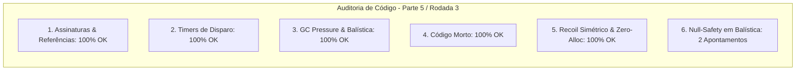

# SAIN — Relatório de Auditoria Técnica de Código (Parte 5 / Rodada 3)
**Domínio:** Combate, Balística, Mira Preditiva, Recoil e Patches de Disparo  
**Escopo Auditado:** `mods/SAIN/modded/SAIN/` (`Classes/Bot/WeaponFunction/`, `Patches/Shoot/`, `Patches/Aim/`)  
**Versão Alvo:** SPT 4.0.13 / Escape From Tarkov 0.16.9 / SAIN v4.5.0  

---

## 1. Sumário Executivo

Esta auditoria representa a **terceira rodada de verificação profunda** sobre os sistemas balísticos, miras com compensação preditiva contínua, supressão de armas, modelo de recuo procedural e patches de interceptação de disparo no SAIN v4.5.0.

| Dimensão Técnica | Avaliação | Diagnóstico Sintético |
|---|:---:|---|
| **1. Validação em references/** | 🟢 Excelente | `PlayerMovementController.Util.CalculateBallisticOffset`, `BotAimingClass` e `Weapon.RecoilTotal` 100% validados contra EFT 0.16.9. |
| **2. Update() vs Lógica Otimizada** | 🟢 Conforme | Cálculo de ADS escopado e suavização inercial contínua de mira sem jitter. |
| **3. Leaks de Memória & GC** | 🟢 Conforme | Desinscrições de `PlayerComponent.OnShoot` ativas em `Recoil.Dispose()`. |
| **4. Funções Órfãs & Código Morto** | 🟢 Limpo | Patches e rotinas de mira integrados e ativos. |
| **5. Antipadrões SPT (AP-01..09)** | 🟢 Conforme | Zero reflexão em cálculos balísticos de alta frequência e tratamento de recoil simétrico com `Mathf.Abs`. |
| **6. Null-Safety & Defensiva** | 🟡 Atenção | Acesso a `EnemyPlayer.Velocity` e `weaponManager.Reload` em `AimClass` sem operador nulo-seguro. |

---

## 2. Panorama das 6 Dimensões de Auditoria



---

## 3. Achados Técnicos Detalhados

### AUD-11-01 · Null-Safety em `EnemyPlayer.Velocity` no `AimClass.AimAtTarget`
- **Severidade:** 🟡 Médio
- **Localização no Mod:** [`AimClass.cs:L73, L88`](../../modded/SAIN/Classes/Bot/WeaponFunction/AimClass.cs#L73)
- **Causa Raiz:** A velocidade do alvo é acessada diretamente como `enemy.EnemyPlayer.Velocity` no cálculo de desvio balístico (`CalculateBallisticOffset`) e na atualização do suavizador inercial (`smoother.Update`).
- **Impacto Concreto:** Se o jogador inimigo for despawnado ou o objeto `EnemyPlayer` for destruído no mesmo frame da visada, a chamada lança `NullReferenceException`, quebrando o ciclo de combate da IA.
- **Alternativa de Melhor Lógica / Proposta de Correção:**
  - Extrair a velocidade com fallback seguro para `Vector3.zero`:

```csharp
Vector3 enemyVelocity = enemy?.EnemyPlayer?.Velocity ?? Vector3.zero;
Vector3 ballisticOffset = PlayerMovementController.Util.CalculateBallisticOffset(
    firePort,
    shootPoint,
    enemyVelocity,
    bulletSpeed
);
Vector3 aimPoint = shootPoint + ballisticOffset;

var smoother = enemy.PositionSmoother;
if (AimStatus == AimStatus.NoTarget)
{
    smoother.Snap(aimPoint);
}
_lastAimEnemy = enemy;

smoother.Update(aimPoint, enemyVelocity, Time.deltaTime);
```

- **Decisão:**
  - `[ ]` Pendente
  - `[ ]` Aceitar sugestão
  - `[ ]` Aceitar com modificação: _________________
  - `[ ]` Rejeitar: _________________

---

### AUD-11-02 · Null-Safety em `weaponManager.Reload` no `AimClass.AimAtTarget`
- **Severidade:** 🔵 Baixo
- **Localização no Mod:** [`AimClass.cs:L59`](../../modded/SAIN/Classes/Bot/WeaponFunction/AimClass.cs#L59)
- **Causa Raiz:** `weaponManager.Reload.Reloading` é consultado sem operador de propagação nula.
- **Impacto Concreto:** Risco de NRE caso o gerenciador de arma do bot esteja em fase intermediária de troca.
- **Alternativa de Melhor Lógica / Proposta de Correção:**
  - Aplicar `weaponManager.Reload?.Reloading == true`:

```csharp
if (!weaponManager.HaveBullets || weaponManager.Reload?.Reloading == true)
{
    botOwner.ShootData.EndShoot();
    AimComplete = false;
    Bot.Aim.LoseAimTarget();
    return false;
}
```

- **Decisão:**
  - `[ ]` Pendente
  - `[ ]` Aceitar sugestão
  - `[ ]` Aceitar com modificação: _________________
  - `[ ]` Rejeitar: _________________

---

## 4. Plano de Ação e Recomendações

1. **Velocidade Defensiva em Balística (AUD-11-01):** Extrair `enemyVelocity` com fallback para `Vector3.zero` em `AimClass.AimAtTarget`.
2. **Null-Safety em Recarga (AUD-11-02):** Proteger acesso a `weaponManager.Reload` em `AimClass.cs`.
