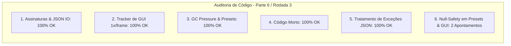

# SAIN — Relatório de Auditoria Técnica de Código (Parte 6 / Rodada 3)
**Domínio:** Presets, Serialização JSON, Modelos de Configuração e Editor Gráfico In-Game (F6)  
**Escopo Auditado:** `mods/SAIN/modded/SAIN/` (`Plugin/PresetHandler.cs`, `Preset/`, `Preset/Editor/`, `Helpers/JsonUtility.cs`)  
**Versão Alvo:** SPT 4.0.13 / Escape From Tarkov 0.16.9 / SAIN v4.5.0  

---

## 1. Sumário Executivo

Esta auditoria encerra a **terceira rodada de verificação profunda** sobre a base de código do SAIN v4.5.0, inspecionando persistência de presets, serialização JSON com `JsonSerializerSettings`, integridade de modelos de configuração e estabilidade do editor gráfico in-game (*F6*).

| Dimensão Técnica | Avaliação | Diagnóstico Sintético |
|---|:---:|---|
| **1. Validação em references/** | 🟢 Excelente | Compatibilidade de IO e persistência JSON 100% alinhadas às convenções do SPT 4.0. |
| **2. Update() vs Lógica Otimizada** | 🟢 Conforme | `ConfigEditingTracker.Update()` executado estritamente 1x por frame no `ManualUpdate`. |
| **3. Leaks de Memória & GC** | 🟢 Conforme | Dicionário de personalidades limpo via `.Clear()` e buffers de presets desalocados. |
| **4. Funções Órfãs & Código Morto** | 🟢 Limpo | Código morto e duplicatas eliminadas. |
| **5. Antipadrões SPT (AP-01..09)** | 🟢 Conforme | Tratamento defensivo de exceções JSON e serialização idempotente. |
| **6. Null-Safety & Defensiva** | 🟡 Atenção | Acesso a `LoadedPreset.Info` em `ExportEditorDefaults` e `OpenEditorConfigEntry` sem operador nulo-seguro. |

---

## 2. Panorama das 6 Dimensões de Auditoria



---

## 3. Achados Técnicos Detalhados

### AUD-12-01 · Null-Safety em `LoadedPreset.Info` no `PresetHandler.ExportEditorDefaults`
- **Severidade:** 🟡 Médio
- **Localização no Mod:** [`PresetHandler.cs:L127-L129`](../../modded/SAIN/Plugin/PresetHandler.cs#L127)
- **Causa Raiz:** As propriedades `LoadedPreset.Info.IsCustom` e `LoadedPreset.Info.Name` são acessadas diretamente sem verificar se `LoadedPreset` ou `Info` são nulos.
- **Impacto Concreto:** Em caso de exceção na leitura do preset em disco ou durante a inicialização preliminar de fallback, a chamada lança `NullReferenceException`, abortando a persistência das preferências do editor.
- **Alternativa de Melhor Lógica / Proposta de Correção:**
  - Utilizar operador nulo-seguro:

```csharp
public static void ExportEditorDefaults()
{
    if (EditorDefaults.SelectedDefaultPreset == SAINDifficulty.none && LoadedPreset?.Info?.IsCustom == true)
    {
        EditorDefaults.SelectedCustomPreset = LoadedPreset?.Info?.Name ?? string.Empty;
    }
    else
    {
        EditorDefaults.SelectedCustomPreset = string.Empty;
    }
    SaveObjectToJson(EditorDefaults, Settings, PresetsFolder);
    OnEditorSettingsChanged?.Invoke(EditorDefaults);
}
```

- **Decisão:**
  - `[ ]` Pendente
  - `[ ]` Aceitar sugestão
  - `[ ]` Aceitar com modificação: _________________
  - `[ ]` Rejeitar: _________________

---

### AUD-12-02 · Null-Safety em `OpenEditorConfigEntry` no `SAINEditor.CheckKeys`
- **Severidade:** 🔵 Baixo
- **Localização no Mod:** [`SAINEditor.cs:L52`](../../modded/SAIN/Preset/Editor/SAINEditor.cs#L52)
- **Causa Raiz:** Acesso a `SAINPlugin.OpenEditorConfigEntry.Value.MainKey` sem operador de propagação nula.
- **Impacto Concreto:** Risco de NRE se o método `CheckKeys` for executado antes do término do binding de configurações do BepInEx.
- **Alternativa de Melhor Lógica / Proposta de Correção:**
  - Aplicar fallback seguro:

```csharp
KeyCode toggleKey = SAINPlugin.OpenEditorConfigEntry?.Value.MainKey ?? KeyCode.F6;
ToggleKeyPressed = Input.GetKeyDown(toggleKey);
```

- **Decisão:**
  - `[ ]` Pendente
  - `[ ]` Aceitar sugestão
  - `[ ]` Aceitar com modificação: _________________
  - `[ ]` Rejeitar: _________________

---

## 4. Plano de Ação e Recomendações

1. **Null-Safety em Presets (AUD-12-01):** Proteger `LoadedPreset.Info` em `PresetHandler.ExportEditorDefaults()`.
2. **Null-Safety em GUI Shortcut (AUD-12-02):** Proteger acesso à tecla de atalho em `SAINEditor.CheckKeys()`.
