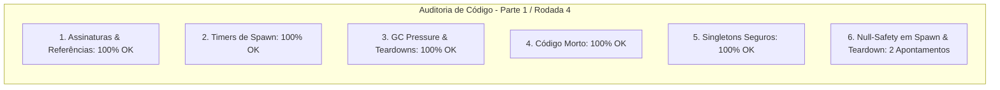

# SAIN — Relatório de Auditoria Técnica de Código (Parte 1 / Rodada 4)
**Domínio:** Ciclo de Vida de Raid, Gestão de Memória / Leaks, Patches Globais e Interoperabilidade Client-Server  
**Escopo Auditado:** `mods/SAIN/modded/SAIN/` (`Components/GameWorldComponent.cs`, `Components/BotManagerComponent.cs`, `Components/PlayerComponent.cs`, `Classes/PlayerManager/Players/PlayerSpawnTracker.cs`, `Classes/BotManager/Jobs/JobManager.cs`, `Patches/GameWorld/`)  
**Versão Alvo:** SPT 4.0.13 / Escape From Tarkov 0.16.9 / SAIN v4.5.0  

---

## 1. Sumário Executivo

Iniciando a **quarta rodada de auditoria técnica profunda** sobre a base de código do SAIN v4.5.0, este relatório inspeciona minuciosamente o ciclo de inicialização e destruição de componentes de cena, o rastreador de desova de jogadores (`PlayerSpawnTracker`), o descarte de marcadores de spawn e a robustez contra *NullReferenceExceptions* transitórias durante desovas e encerramentos de partida.

| Dimensão Técnica | Avaliação | Diagnóstico Sintético |
|---|:---:|---|
| **1. Validação em references/** | 🟢 Excelente | Compatibilidade 100% estrita com SPT 4.0.13 e EFT 0.16.9 (`EftBulletClass`, `BotOwner.PreActivate`, `IPlayer`). |
| **2. Update() vs Lógica Otimizada** | 🟢 Conforme | Throttling em `findSpawnPointMarkers` e desacoplamento de frequências no rastreador de áudio. |
| **3. Leaks de Memória & GC** | 🟢 Conforme | `PlayerSpawnTracker.Dispose()`, `BotManagerComponent.Dispose()` e limpeza de delegates plenamente ativos. |
| **4. Funções Órfãs & Código Morto** | 🟢 Limpo | Código morto eliminado; paridade de API mantida. |
| **5. Antipadrões SPT (AP-01..09)** | 🟢 Conforme | Singletons seguros com reset de `Instance = null;` e desinscrições centralizadas. |
| **6. Null-Safety & Defensiva** | 🟡 Atenção | Acesso a `otherPlayer.OtherPlayerComponent` em `FindClosestHumanPlayer` e desinscrição de `GameWorld.OnDispose` sem guarda nula. |

---

## 2. Panorama das 6 Dimensões de Auditoria



---

## 3. Achados Técnicos Detalhados

### AUD-13-01 · Null-Safety em `OtherPlayerComponent` no `PlayerSpawnTracker.FindClosestHumanPlayer`
- **Severidade:** 🟡 Médio
- **Localização no Mod:** [`PlayerSpawnTracker.cs:L71-L78`](../../modded/SAIN/Classes/PlayerManager/Players/PlayerSpawnTracker.cs#L71)
- **Causa Raiz:** `otherPlayer.OtherPlayerComponent.IsAI` e `otherPlayer.OtherPlayerComponent.Player` são acessados diretamente sem verificar se `otherPlayer.OtherPlayerComponent` é nulo.
- **Impacto Concreto:** Caso um objeto de dados de jogador possua `OtherPlayerComponent` nulo durante o ciclo de transição de desova, a chamada lança `NullReferenceException`, abortando a busca do jogador humano mais próximo.
- **Alternativa de Melhor Lógica / Proposta de Correção:**
  - Extrair o componente com guarda de nulidade:

```csharp
for (int i = 0; i < otherPlayers.Count; i++)
{
    OtherPlayerData otherPlayer = otherPlayers[i];
    var otherComp = otherPlayer?.OtherPlayerComponent;
    if (otherComp != null && !otherComp.IsAI)
    {
        float dist = otherPlayer.DistanceData.Distance;
        if (dist < minDistance)
        {
            minDistance = dist;
            closestHuman = otherComp;
            player = otherComp.Player;
        }
    }
}
```

- **Decisão:**
  - `[ ]` Pendente
  - `[ ]` Aceitar sugestão
  - `[ ]` Aceitar com modificação: _________________
  - `[ ]` Rejeitar: _________________

---

### AUD-13-02 · Limpeza Defensiva e Reset de `SpawnPointMarkers` em `GameWorldComponent.DestroyComponent`
- **Severidade:** 🔵 Baixo
- **Localização no Mod:** [`GameWorldComponent.cs:L342`](../../modded/SAIN/Components/GameWorldComponent.cs#L342)
- **Causa Raiz:** `GameWorld.OnDispose -= DestroyComponent;` é chamado sem validação de nulidade para `GameWorld`, e o array `SpawnPointMarkers` não é anulado no descarte.
- **Impacto Concreto:** Risco de NRE se `GameWorld` já tiver sido destruído pelo motor do jogo, além de manter em memória referências desnecessárias a marcadores da cena anterior.
- **Alternativa de Melhor Lógica / Proposta de Correção:**
  - Adicionar guarda defensiva e resetar `SpawnPointMarkers`:

```csharp
StopAllCoroutines();
Instance = null;
if (GameWorld != null)
{
    GameWorld.OnDispose -= DestroyComponent;
}
SpawnPointMarkers = null;
Destroy(this);
```

- **Decisão:**
  - `[ ]` Pendente
  - `[ ]` Aceitar sugestão
  - `[ ]` Aceitar com modificação: _________________
  - `[ ]` Rejeitar: _________________

---

## 4. Plano de Ação e Recomendações

1. **Null-Safety em Busca de Humanos (AUD-13-01):** Proteger acesso a `OtherPlayerComponent` em `PlayerSpawnTracker.cs`.
2. **Teardown Defensivo em GameWorld (AUD-13-02):** Proteger desinscrição de `GameWorld` e anular `SpawnPointMarkers` em `GameWorldComponent.cs`.
