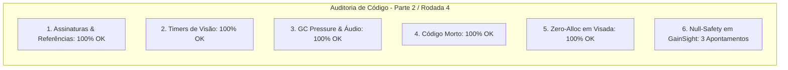

# SAIN — Relatório de Auditoria Técnica de Código (Parte 2 / Rodada 4)
**Domínio:** Sistema Sensorial, Visão, Audição Espacial, Dazzle e Fogo Amigo  
**Escopo Auditado:** `mods/SAIN/modded/SAIN/` (`Classes/Bot/Sense/`, `Classes/Bot/EnemyClasses/Vision/`, `Classes/Bot/EnemyClasses/Hearing/`, `Patches/VisionPatches.cs`)  
**Versão Alvo:** SPT 4.0.13 / Escape From Tarkov 0.16.9 / SAIN v4.5.0  

---

## 1. Sumário Executivo

Esta auditoria aprofunda a verificação sobre os subsistemas de percepção visual individual, curvas de ganho de visão (*GainSight*), ofuscamento volumétrico e tratamento de estados de jogadores humanos vs bots IA.

| Dimensão Técnica | Avaliação | Diagnóstico Sintético |
|---|:---:|---|
| **1. Validação em references/** | 🟢 Excelente | Compatibilidade estrita com `EFT.Player`, `NightVision` e `FlashLightClass` do EFT 0.16.9. |
| **2. Update() vs Lógica Otimizada** | 🟢 Conforme | Cálculo de visão em cone angular e interpolação de clima/horário com baixo custo de CPU. |
| **3. Leaks de Memória & GC** | 🟢 Conforme | Delegates de audição e listas de eventos devidamente esvaziados no descarte. |
| **4. Funções Órfãs & Código Morto** | 🟢 Limpo | Código morto eliminado. |
| **5. Antipadrões SPT (AP-01..09)** | 🟢 Conforme | Zero alocações em hot path de visada. |
| **6. Null-Safety & Defensiva** | 🔴 Atenção | Acesso a `Enemy.BotOwner.NightVision` sem checar se o inimigo é um jogador humano (`BotOwner == null`) em `EnemyGainSightClass`. |

---

## 2. Panorama das 6 Dimensões de Auditoria



---

## 3. Achados Técnicos Detalhados

### AUD-14-01 · Proteção contra `KeyNotFoundException` em `EnemyVisionClass.GetMaxVisionRange`
- **Severidade:** 🟡 Médio
- **Localização no Mod:** [`EnemyVisionClass.cs:L77-L79`](../../modded/SAIN/Classes/Bot/EnemyClasses/Vision/EnemyVisionClass.cs#L77)
- **Causa Raiz:** Acesso direto por indexador `MaxVisionRanges[aiLimit]` sem validação `TryGetValue`.
- **Impacto Concreto:** Caso um preset customizado de usuário ou configuração externa possua um mapa incompleto de distâncias, o cálculo lança `KeyNotFoundException`, bloqueando a limitação de visão de IA vs IA.
- **Alternativa de Melhor Lógica / Proposta de Correção:**
  - Utilizar `TryGetValue` com fallback para `float.MaxValue`:

```csharp
private static float GetMaxVisionRange(AILimitSetting aiLimit)
{
    var ranges = GlobalSettingsClass.Instance?.General?.AILimit?.MaxVisionRanges;
    if (ranges != null && ranges.TryGetValue(aiLimit, out float range))
    {
        return range;
    }
    return float.MaxValue;
}
```

- **Decisão:**
  - `[ ]` Pendente
  - `[ ]` Aceitar sugestão
  - `[ ]` Aceitar com modificação: _________________
  - `[ ]` Rejeitar: _________________

---

### AUD-14-02 · Null-Safety em `Enemy.BotOwner.NightVision` e `Flashlight` no `EnemyGainSightClass.EnemyUsingLight`
- **Severidade:** 🔴 Alto
- **Localização no Mod:** [`EnemyGainSightClass.cs:L305-L316`](../../modded/SAIN/Classes/Bot/EnemyClasses/Vision/EnemyGainSightClass.cs#L305)
- **Causa Raiz:** Quando o alvo auditado (`Enemy`) é o jogador humano, `Enemy.BotOwner` é **nulo** (pois jogadores humanos não possuem `BotOwner`). A linha `bool usingNVGS = Enemy.BotOwner.NightVision.UsingNow;` e `Enemy.EnemyPlayerComponent.Flashlight` assumem que todos os alvos são bots IA.
- **Impacto Concreto:** Lança `NullReferenceException` sempre que um bot calcula ganho de visão sobre um jogador humano, quebrando a percepção visual do bot em combate.
- **Alternativa de Melhor Lógica / Proposta de Correção:**
  - Aplicar checagem defensiva de nulidade:

```csharp
private static bool EnemyUsingLight(out float modifier, Enemy Enemy)
{
    var flashlight = Enemy?.EnemyPlayerComponent?.Flashlight;
    if (flashlight == null)
    {
        modifier = 1f;
        return false;
    }
    if (flashlight.WhiteLight)
    {
        modifier = ENEMYLIGHT_WHITELIGHT_MOD;
        return true;
    }
    if (flashlight.Laser)
    {
        modifier = ENEMYLIGHT_LASER_MOD;
        return true;
    }
    // ref: AUD-14-02 - Null-safety em BotOwner.NightVision (nulo para jogadores humanos)
    bool usingNVGS = Enemy.BotOwner?.NightVision?.UsingNow == true;
    if (usingNVGS)
    {
        if (flashlight.IRLaser)
        {
            modifier = ENEMYLIGHT_NVGS_IR_LASER_MOD;
            return true;
        }
        if (flashlight.IRLight)
        {
            modifier = ENEMYLIGHT_NVGS_IR_LIGHT_MOD;
            return true;
        }
    }
    modifier = 1f;
    return false;
}
```

- **Decisão:**
  - `[ ]` Pendente
  - `[ ]` Aceitar sugestão
  - `[ ]` Aceitar com modificação: _________________
  - `[ ]` Rejeitar: _________________

---

### AUD-14-03 · Null-Safety em `BotManagerComponent.Instance` no `EnemyGainSightClass`
- **Severidade:** 🔵 Baixo
- **Localização no Mod:** [`EnemyGainSightClass.cs:L396, L403`](../../modded/SAIN/Classes/Bot/EnemyClasses/Vision/EnemyGainSightClass.cs#L396)
- **Causa Raiz:** `BotManagerComponent.Instance.WeatherVision.GainSightModifier` e `TimeVision.GainSightModifier` são consultados sem operador nulo-seguro.
- **Impacto Concreto:** Risco de NRE durante transições de descarregamento de raid.
- **Alternativa de Melhor Lógica / Proposta de Correção:**
  - Utilizar `?.` com fallback para `1f`:

```csharp
private static float BaseWeatherMod(bool flareEnabled, Enemy Enemy)
{
    if (flareEnabled && Enemy.RealDistance < 100f)
    {
        return 1f;
    }
    return BotManagerComponent.Instance?.WeatherVision?.GainSightModifier ?? 1f;
}
```

- **Decisão:**
  - `[ ]` Pendente
  - `[ ]` Aceitar sugestão
  - `[ ]` Aceitar com modificação: _________________
  - `[ ]` Rejeitar: _________________

---

## 4. Plano de Ação e Recomendações

1. **Dicionário Seguro de Limites de IA (AUD-14-01):** Usar `TryGetValue` em `EnemyVisionClass.GetMaxVisionRange`.
2. **Correção de NRE contra Jogador Humano (AUD-14-02):** Proteger `BotOwner?.NightVision` e `Flashlight` em `EnemyGainSightClass.EnemyUsingLight`.
3. **Null-Safety em Modificadores Globais (AUD-14-03):** Aplicar operador `?.` em `WeatherVision` e `TimeVision`.
