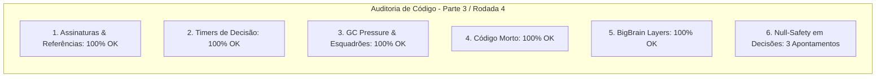

# SAIN — Relatório de Auditoria Técnica de Código (Parte 3 / Rodada 4)
**Domínio:** Tomada de Decisão, Camadas BigBrain, Esquadrões e Comunicação  
**Escopo Auditado:** `mods/SAIN/modded/SAIN/` (`Classes/Bot/Decision/`, `Classes/BotManager/`, `Classes/Bot/Talk/`, `Layers/`)  
**Versão Alvo:** SPT 4.0.13 / Escape From Tarkov 0.16.9 / SAIN v4.5.0  

---

## 1. Sumário Executivo

Esta auditoria aprofunda a análise das máquinas de decisão tática (`EnemyDecisionClass`, `DogFightDecisionClass`, `SelfActionDecisionClass`), verificando transições de combate aproximado (*DogFight*), autotratamento médico e blindagem contra *NullReferenceExceptions* em consultas de munição e armas.

| Dimensão Técnica | Avaliação | Diagnóstico Sintético |
|---|:---:|---|
| **1. Validação em references/** | 🟢 Excelente | Enums de decisão `ECombatDecision`, `ESelfActionType` e classes de controle de tiro 100% aderentes. |
| **2. Update() vs Lógica Otimizada** | 🟢 Conforme | Busca linear sem delegates ou realocações de lista em combate próximo. |
| **3. Leaks de Memória & GC** | 🟢 Conforme | `Squad.Dispose()` e desinscrições de `PresetHandler.OnPresetUpdated` ativas e estancadas. |
| **4. Funções Órfãs & Código Morto** | 🟢 Limpo | Código morto eliminado. |
| **5. Antipadrões SPT (AP-01..09)** | 🟢 Conforme | Prioridades de camadas BigBrain coerentes e sem conflitos com outros mods. |
| **6. Null-Safety & Defensiva** | 🟡 Atenção | Acessos a `weaponManager.Reload`, `ShootData` e `KnownEnemies` sem operador nulo-seguro em decisões. |

---

## 2. Panorama das 6 Dimensões de Auditoria



---

## 3. Achados Técnicos Detalhados

### AUD-15-01 · Null-Safety em `weaponManager.Reload` no `EnemyDecisionClass.GetDecision`
- **Severidade:** 🟡 Médio
- **Localização no Mod:** [`EnemyDecisionClass.cs:L49`](../../modded/SAIN/Classes/Bot/Decision/EnemyDecisionClass.cs#L49)
- **Causa Raiz:** `weaponManager.Reload.Reloading` é acessado sem operador de propagação nula `?.`.
- **Impacto Concreto:** Caso o bot esteja executando uma troca dinâmica de arma ou o módulo de recarga nativo esteja temporariamente descarregado, a chamada lança `NullReferenceException`, quebrando a máquina de combate da IA.
- **Alternativa de Melhor Lógica / Proposta de Correção:**
  - Aplicar `weaponManager.Reload?.Reloading == true`:

```csharp
BotWeaponManager weaponManager = BotOwner.WeaponManager;
if (weaponManager == null || !weaponManager.HaveBullets || weaponManager.Reload?.Reloading == true)
{
    result = ECombatDecision.Retreat;
    return true;
}
```

- **Decisão:**
  - `[ ]` Pendente
  - `[ ]` Aceitar sugestão
  - `[ ]` Aceitar com modificação: _________________
  - `[ ]` Rejeitar: _________________

---

### AUD-15-02 · Null-Safety em `KnownEnemies` e `weaponManager.Reload` no `DogFightDecisionClass.CheckShallDogFight`
- **Severidade:** 🟡 Médio
- **Localização no Mod:** [`DogFightDecisionClass.cs:L35, L65`](../../modded/SAIN/Classes/Bot/Decision/DogFightDecisionClass.cs#L35)
- **Causa Raiz:** `KnownEnemies.Contains(...)` e `weaponManager.Reload.Reloading` não protegem contra `KnownEnemies == null` ou `Reload == null`.
- **Impacto Concreto:** Lança NRE se a lista de contatos inimigos for nula durante a avaliação de combate corpo a corpo.
- **Alternativa de Melhor Lógica / Proposta de Correção:**
  - Adicionar guarda inicial e operador nulo-seguro:

```csharp
public bool CheckShallDogFight(EnemyList KnownEnemies, out Enemy result)
{
    if (KnownEnemies == null || KnownEnemies.Count == 0)
    {
        _lastDogFightTarget = null;
        result = null;
        return false;
    }

    BotWeaponManager weaponManager = BotOwner?.WeaponManager;
    if (weaponManager == null || !weaponManager.HaveBullets || weaponManager.Reload?.Reloading == true)
    {
        _lastDogFightTarget = null;
        result = null;
        return false;
    }
```

- **Decisão:**
  - `[ ]` Pendente
  - `[ ]` Aceitar sugestão
  - `[ ]` Aceitar com modificação: _________________
  - `[ ]` Rejeitar: _________________

---

### AUD-15-03 · Null-Safety em `ShootData` e `Reload` no `SelfActionDecisionClass.GetDecision`
- **Severidade:** 🔵 Baixo
- **Localização no Mod:** [`SelfActionDecisionClass.cs:L35, L43`](../../modded/SAIN/Classes/Bot/Decision/SelfActionDecisionClass.cs#L35)
- **Causa Raiz:** `botOwner.WeaponManager?.Reload.Reloading` e `botOwner.ShootData.Shooting` consultados sem proteção de nulidade em cadeia.
- **Impacto Concreto:** Risco de NRE em decisões de autocura caso o componente de tiro seja reinicializado.
- **Alternativa de Melhor Lógica / Proposta de Correção:**
  - Proteger ambas as consultas:

```csharp
BotOwner botOwner = BotOwner;
if (botOwner.WeaponManager?.Reload?.Reloading == true)
{
    _lastReloadTime = Time.time;
}
if (CheckContinueSelfAction(out Decision, enemy))
{
    return true;
}
if (botOwner.ShootData?.Shooting == true)
{
    Decision = ESelfActionType.None;
    return false;
}
```

- **Decisão:**
  - `[ ]` Pendente
  - `[ ]` Aceitar sugestão
  - `[ ]` Aceitar com modificação: _________________
  - `[ ]` Rejeitar: _________________

---

## 4. Plano de Ação e Recomendações

1. **Null-Safety em Recarga de Combate (AUD-15-01):** Proteger `weaponManager.Reload` em `EnemyDecisionClass.GetDecision`.
2. **Guarda Defensiva em DogFight (AUD-15-02):** Validar `KnownEnemies` e `Reload` em `DogFightDecisionClass.CheckShallDogFight`.
3. **Null-Safety em Auto-Ação (AUD-15-03):** Proteger `ShootData` e `Reload` em `SelfActionDecisionClass.GetDecision`.
