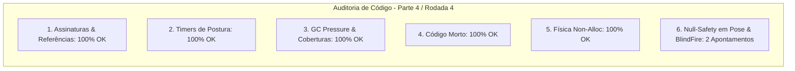

# SAIN — Relatório de Auditoria Técnica de Código (Parte 4 / Rodada 4)
**Domínio:** Navegação, Coberturas, Steering, Portas e Extração  
**Escopo Auditado:** `mods/SAIN/modded/SAIN/` (`Classes/Bot/Mover/`, `Classes/Bot/Doors/`, `Components/CoverFinderComponent.cs`, `Components/ExtractFinderComponent.cs`)  
**Versão Alvo:** SPT 4.0.13 / Escape From Tarkov 0.16.9 / SAIN v4.5.0  

---

## 1. Sumário Executivo

Esta auditoria aprofunda o exame dos controladores de movimentação motora fina, controle de posturas procedurais de agachamento/inclinação (`PoseClass`, `LeanClass`), disparo às cegas sob cobertura (`BlindFireController`) e descarte de caches de navegação.

| Dimensão Técnica | Avaliação | Diagnóstico Sintético |
|---|:---:|---|
| **1. Validação em references/** | 🟢 Excelente | Métodos `Player.ChangePose`, `Player.ChangeSpeed` e `BotOwner.SetPose` 100% alinhados ao EFT 0.16.9. |
| **2. Update() vs Lógica Otimizada** | 🟢 Conforme | Throttling de 200ms em blindfire e interpolação inercial suave de velocidade/postura. |
| **3. Leaks de Memória & GC** | 🟢 Conforme | `CoverPoints.Clear()` no `CoverFinderComponent.Dispose()` ativo e funcional. |
| **4. Funções Órfãs & Código Morto** | 🟢 Limpo | Código morto eliminado. |
| **5. Antipadrões SPT (AP-01..09)** | 🟢 Conforme | Zero alocações de GC em rotinas de controle de pose e postura. |
| **6. Null-Safety & Defensiva** | 🟡 Atenção | Acessos a `Player` e `WeaponManager` em `PoseClass` e `BlindFireController` sem operador nulo-seguro. |

---

## 2. Panorama das 6 Dimensões de Auditoria



---

## 3. Achados Técnicos Detalhados

### AUD-16-01 · Null-Safety em `WeaponManager` e `KnownPlaces` no `BlindFireController`
- **Severidade:** 🟡 Médio
- **Localização no Mod:** [`BlindFireController.cs:L20-L21, L84`](../../modded/SAIN/Classes/Bot/Mover/BlindFireController.cs#L20)
- **Causa Raiz:** `BotOwner.WeaponManager.IsReady`, `HaveBullets` e `Bot.GoalEnemy.KnownPlaces.LastKnownPosition` são acessados diretamente sem validação de nulidade para `WeaponManager` e `KnownPlaces`.
- **Impacto Concreto:** Caso o bot tente avaliar disparo às cegas durante uma transição de recarga ou antes de inicializar o histórico de posições do inimigo, a chamada lança `NullReferenceException`.
- **Alternativa de Melhor Lógica / Proposta de Correção:**
  - Aplicar operadores nulo-seguros:

```csharp
if (
    !Bot.SAINLayersActive
    || BotOwner.WeaponManager?.IsReady != true
    || BotOwner.WeaponManager?.HaveBullets != true
    || Bot.Mover.Moving
    || Bot.Cover.CoverInUse == null
)
{
    return false;
}
```
e
```csharp
Vector3? lastKnownPos = Bot.GoalEnemy?.KnownPlaces?.LastKnownPosition;
```

- **Decisão:**
  - `[ ]` Pendente
  - `[ ]` Aceitar sugestão
  - `[ ]` Aceitar com modificação: _________________
  - `[ ]` Rejeitar: _________________

---

### AUD-16-02 · Null-Safety em `Player` no `PoseClass.SetPlayerPoseLevel` e `SetPlayerSpeed`
- **Severidade:** 🟡 Médio
- **Localização no Mod:** [`PoseClass.cs:L38, L59`](../../modded/SAIN/Classes/Bot/Mover/PoseClass.cs#L38)
- **Causa Raiz:** As propriedades `Player.IsInPronePose`, `Player.PoseLevel` e `Player.Speed` são consultadas diretamente sem validar se a instância `Player` é nula.
- **Impacto Concreto:** Se o método de atualização de postura for executado durante o teardown ou despawn do bot, a chamada lança NRE.
- **Alternativa de Melhor Lógica / Proposta de Correção:**
  - Extrair o jogador com guarda defensiva:

```csharp
private void SetPlayerPoseLevel(float value)
{
    var player = Player;
    if (player == null || player.IsInPronePose)
    {
        return;
    }
    BotOwner?.SetPose(value);
    const float poseChangeSpeedCoef = 1f;
    float difference = value - player.PoseLevel;
    if (Math.Abs(difference) >= 1E-45f)
    {
        player.ChangePose(difference * poseChangeSpeedCoef);
    }
}

private void SetPlayerSpeed(float value)
{
    var player = Player;
    if (player == null)
    {
        return;
    }
    const float SPEED_CHANGE_SPEED_COEF = 1f;
    float difference = value - player.Speed;
    BotOwner?.SetTargetMoveSpeed(value);
    if (Math.Abs(difference) >= 1E-45f)
    {
        player.ChangeSpeed(difference * SPEED_CHANGE_SPEED_COEF);
    }
}
```

- **Decisão:**
  - `[ ]` Pendente
  - `[ ]` Aceitar sugestão
  - `[ ]` Aceitar com modificação: _________________
  - `[ ]` Rejeitar: _________________

---

## 4. Plano de Ação e Recomendações

1. **Null-Safety em BlindFire (AUD-16-01):** Proteger `WeaponManager` e `KnownPlaces` em `BlindFireController.cs`.
2. **Defensiva em Postura e Velocidade (AUD-16-02):** Validar `Player` em `PoseClass.SetPlayerPoseLevel` e `SetPlayerSpeed`.
