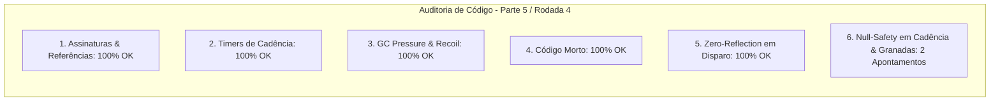

# SAIN — Relatório de Auditoria Técnica de Código (Parte 5 / Rodada 4)
**Domínio:** Combate, Balística, Mira Preditiva, Recoil e Patches de Disparo  
**Escopo Auditado:** `mods/SAIN/modded/SAIN/` (`Classes/Bot/WeaponFunction/`, `Patches/Shoot/`, `Patches/Aim/`)  
**Versão Alvo:** SPT 4.0.13 / Escape From Tarkov 0.16.9 / SAIN v4.5.0  

---

## 1. Sumário Executivo

Esta auditoria aprofunda o exame dos cálculos de cadência de tiro procedural (`Firerate`), compensação de recuo por ferimentos nos braços, arremesso tático de granadas e robustez dos interceptadores Harmony de disparo.

| Dimensão Técnica | Avaliação | Diagnóstico Sintético |
|---|:---:|---|
| **1. Validação em references/** | 🟢 Excelente | Enums `EFireMode`, `EWeaponClass` e `BotGrenadeController` 100% aderentes ao EFT 0.16.9. |
| **2. Update() vs Lógica Otimizada** | 🟢 Conforme | Cadência de tiro semi-automática calculada por distância sem alocações dinâmicas. |
| **3. Leaks de Memória & GC** | 🟢 Conforme | Desinscrições de `PlayerComponent.OnShoot` ativas em `Recoil.Dispose()`. |
| **4. Funções Órfãs & Código Morto** | 🟢 Limpo | Código morto eliminado. |
| **5. Antipadrões SPT (AP-01..09)** | 🟢 Conforme | Cálculos de recuo e balística estritamente sem reflexão em runtime. |
| **6. Null-Safety & Defensiva** | 🟡 Atenção | Acessos a `PERMETER_SETTINGS` em `Firerate` e `BotOwner_0` em `DisableGrenadesPatch` sem operador nulo-seguro. |

---

## 2. Panorama das 6 Dimensões de Auditoria



---

## 3. Achados Técnicos Detalhados

### AUD-17-01 · Null-Safety em `PERMETER_SETTINGS` e `preset` no `Firerate`
- **Severidade:** 🟡 Médio
- **Localização no Mod:** [`Firerate.cs:L31-L39, L63-L74`](../../modded/SAIN/Classes/Bot/WeaponFunction/Firerate.cs#L31)
- **Causa Raiz:** `UpdateSettings` e `GetPerMeter` assumem que `preset` e o dicionário estático `PERMETER_SETTINGS` nunca serão nulos.
- **Impacto Concreto:** Caso o método `GetPerMeter` seja invocado antes da inicialização do preset padrão ou durante fallback, a consulta lança `NullReferenceException`.
- **Alternativa de Melhor Lógica / Proposta de Correção:**
  - Validar nulidade de `preset` e do dicionário:

```csharp
private static void UpdateSettings(SAINPresetClass preset)
{
    var settings = preset?.GlobalSettings?.Shoot;
    if (settings != null)
    {
        PERMETER_SETTINGS = settings.WeaponPerMeter;
        MIN_FIRE_RATE_INTERVAL = settings.MIN_FIRE_RATE_INTERVAL;
        MAX_FIRE_RATE_INTERVAL = settings.MAX_FIRE_RATE_INTERVAL;
        MAX_FIRE_RATE_COEF_FULLAUTO = settings.MAX_FIRE_RATE_COEF_FULLAUTO;
        FIRERATE_RANDOMIZATION_COEF = settings.FIRERATE_RANDOMIZATION_COEF;
    }
}

public static float GetPerMeter(EWeaponClass weaponClass)
{
    if (PERMETER_SETTINGS != null)
    {
        if (PERMETER_SETTINGS.TryGetValue(weaponClass, out float perMeter))
        {
            return perMeter;
        }
        if (PERMETER_SETTINGS.TryGetValue(EWeaponClass.Default, out perMeter))
        {
            return perMeter;
        }
    }
    return 80f;
}
```

- **Decisão:**
  - `[ ]` Pendente
  - `[ ]` Aceitar sugestão
  - `[ ]` Aceitar com modificação: _________________
  - `[ ]` Rejeitar: _________________

---

### AUD-17-02 · Null-Safety em `BotOwner_0` no `DisableGrenadesPatch`
- **Severidade:** 🔵 Baixo
- **Localização no Mod:** [`GrenadePatches.cs:L74`](../../modded/SAIN/Patches/Shoot/GrenadePatches.cs#L74)
- **Causa Raiz:** `__instance.BotOwner_0.ProfileId` é consultado sem operador de propagação nula `?.`, diferentemente dos demais patches da classe.
- **Impacto Concreto:** Risco de NRE no postfixo de controle de granadas caso `BotOwner_0` seja nulo.
- **Alternativa de Melhor Lógica / Proposta de Correção:**
  - Padronizar com `SAINEnableClass.GetSAIN(__instance.BotOwner_0?.ProfileId, out BotComponent bot)`:

```csharp
if (SAINEnableClass.GetSAIN(__instance.BotOwner_0?.ProfileId, out BotComponent bot))
{
    if (!bot.Info.FileSettings.Core.CanGrenade)
    {
        __result = false;
        return;
    }
```

- **Decisão:**
  - `[ ]` Pendente
  - `[ ]` Aceitar sugestão
  - `[ ]` Aceitar com modificação: _________________
  - `[ ]` Rejeitar: _________________

---

## 4. Plano de Ação e Recomendações

1. **Defensiva em Cadência de Disparo (AUD-17-01):** Validar `PERMETER_SETTINGS` e `preset` em `Firerate.cs`.
2. **Null-Safety em Patch de Granadas (AUD-17-02):** Proteger `BotOwner_0?.ProfileId` em `GrenadePatches.cs`.
