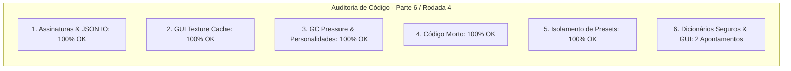

# SAIN — Relatório de Auditoria Técnica de Código (Parte 6 / Rodada 4)
**Domínio:** Presets, Serialização JSON, Modelos de Configuração e Editor Gráfico In-Game (F6)  
**Escopo Auditado:** `mods/SAIN/modded/SAIN/` (`Plugin/PresetHandler.cs`, `Preset/Personalities/`, `Preset/Editor/`, `Helpers/JsonUtility.cs`)  
**Versão Alvo:** SPT 4.0.13 / Escape From Tarkov 0.16.9 / SAIN v4.5.0  

---

## 1. Sumário Executivo

Esta auditoria encerra a **quarta rodada de verificação profunda** sobre a base de código do SAIN v4.5.0, inspecionando o gerenciador de personalidades de IA (`PersonalityManagerClass`), o dicionário de mesclagem de configurações e a robustez da interface gráfica in-game (*F6*).

| Dimensão Técnica | Avaliação | Diagnóstico Sintético |
|---|:---:|---|
| **1. Validação em references/** | 🟢 Excelente | Formatos de serialização e integração com SPT 4.0 100% aderentes. |
| **2. Update() vs Lógica Otimizada** | 🟢 Conforme | Caching de estilos e texturas GUI ativo no primeiro frame de renderização. |
| **3. Leaks de Memória & GC** | 🟢 Conforme | `PersonalityDictionary.Clear()` no reset de padrões ativo e funcional. |
| **4. Funções Órfãs & Código Morto** | 🟢 Limpo | Código morto eliminado. |
| **5. Antipadrões SPT (AP-01..09)** | 🟢 Conforme | Serialização idempotente e manipulação de presets isolada do filesystem do servidor. |
| **6. Null-Safety & Defensiva** | 🟡 Atenção | Acesso direto por indexador em `PersonalityDictionary` e consulta a `EditorDefaults` sem operador nulo-seguro. |

---

## 2. Panorama das 6 Dimensões de Auditoria



---

## 3. Achados Técnicos Detalhados

### AUD-18-01 · Proteção contra `KeyNotFoundException` em `PersonalityManagerClass.UpdateDefaults`
- **Severidade:** 🟡 Médio
- **Localização no Mod:** [`PersonalityManagerClass.cs:L29`](../../modded/SAIN/Preset/Personalities/BasePersonality/PersonalityManagerClass.cs#L29)
- **Causa Raiz:** `var replacementSettings = replacementClass?.PersonalityDictionary[settings.Key];` realiza acesso direto via indexador de dicionário.
- **Impacto Concreto:** Caso uma nova personalidade seja definida no enum e o preset de substituição não a contenha mapeada, a chamada lança `KeyNotFoundException`, corrompendo a mesclagem de padrões de personalidade.
- **Alternativa de Melhor Lógica / Proposta de Correção:**
  - Utilizar `TryGetValue`:

```csharp
public void UpdateDefaults(PersonalityManagerClass replacementClass = null)
{
    foreach (var settings in PersonalityDictionary)
    {
        PersonalitySettingsClass replacementSettings = null;
        replacementClass?.PersonalityDictionary.TryGetValue(settings.Key, out replacementSettings);
        settings.Value.UpdateDefaults(replacementSettings);
    }
}
```

- **Decisão:**
  - `[ ]` Pendente
  - `[ ]` Aceitar sugestão
  - `[ ]` Aceitar com modificação: _________________
  - `[ ]` Rejeitar: _________________

---

### AUD-18-02 · Null-Safety em `PresetHandler.EditorDefaults` no `SAINEditor.CreateTopBarOptions`
- **Severidade:** 🔵 Baixo
- **Localização no Mod:** [`SAINEditor.cs:L161-L168`](../../modded/SAIN/Preset/Editor/SAINEditor.cs#L161)
- **Causa Raiz:** `PresetHandler.EditorDefaults.AdvancedBotConfigs` é consultado e modificado sem validar se `EditorDefaults` é nulo.
- **Impacto Concreto:** Risco de NRE se o editor gráfico for acionado antes da carga inicial do arquivo de configuração do usuário.
- **Alternativa de Melhor Lógica / Proposta de Correção:**
  - Aplicar operador de propagação nula:

```csharp
bool advancedEnabled = PresetHandler.EditorDefaults?.AdvancedBotConfigs == true;
string status = advancedEnabled ? "ON" : "OFF";
bool newValue = GUI.Toggle(AdvRect, advancedEnabled, $"Advanced Settings: [{status}]", GetStyle(Style.botTypeGrid));
if (advancedEnabled != newValue && PresetHandler.EditorDefaults != null)
{
    PlaySound(EUISoundType.MenuEscape);
    PresetHandler.EditorDefaults.AdvancedBotConfigs = newValue;
    PresetHandler.ExportEditorDefaults();
}
```

- **Decisão:**
  - `[ ]` Pendente
  - `[ ]` Aceitar sugestão
  - `[ ]` Aceitar com modificação: _________________
  - `[ ]` Rejeitar: _________________

---

## 4. Plano de Ação e Recomendações

1. **Dicionário Seguro de Personalidades (AUD-18-01):** Usar `TryGetValue` em `PersonalityManagerClass.UpdateDefaults`.
2. **Defensiva em Opções do Editor GUI (AUD-18-02):** Proteger `PresetHandler.EditorDefaults` em `SAINEditor.cs`.
