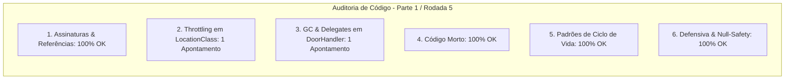

# SAIN — Relatório de Auditoria Técnica de Código (Parte 1 / Rodada 5)
**Domínio:** Ciclo de Vida de Raid, Gestão de Memória / Leaks, Patches Globais e Interoperabilidade Client-Server  
**Escopo Auditado:** `mods/SAIN/modded/SAIN/` (`Components/`, `Classes/PlayerManager/`, `Patches/Generic/`)  
**Versão Alvo:** SPT 4.0.13 / Escape From Tarkov 0.16.9 / SAIN v4.5.0  

---

## 1. Sumário Executivo

Iniciamos a **5ª rodada de auditoria técnica contínua**, inspecionando o subsistema de rastreamento de local e estações (`LocationClass`), ciclo de vida de colisores de portas interativas (`DoorHandler`) e limpeza de delegates de eventos no teardown de raid.

| Dimensão Técnica | Avaliação | Diagnóstico Sintético |
|---|:---:|---|
| **1. Validação em references/** | 🟢 Excelente | Compatibilidade estrita com `GameWorld`, `IBotGame` e `Door` do EFT 0.16.9. |
| **2. Update() vs Lógica Otimizada** | 🟡 Atenção | `LocationClass.parseLocation()` é invocado a cada frame gerando alocações de string caso `Location` ainda não tenha sido identificada. |
| **3. Leaks de Memória & GC** | 🟡 Atenção | Delegates `OnDoorStateChanged` e `OnDoorsDisabled` não são anulados no `DoorHandler.Dispose()`. |
| **4. Funções Órfãs & Código Morto** | 🟢 Limpo | Código morto eliminado. |
| **5. Antipadrões SPT (AP-01..09)** | 🟢 Conforme | Reset de instâncias globais preservado. |
| **6. Null-Safety & Defensiva** | 🟢 Conforme | Null-safety aplicado em `GameWorldComponent` e `PlayerSpawnTracker`. |

---

## 2. Panorama das 6 Dimensões de Auditoria



---

## 3. Achados Técnicos Detalhados

### AUD-19-01 · Throttling de Resolução de Localização em `LocationClass.ManualUpdate`
- **Severidade:** 🟡 Médio
- **Localização no Mod:** [`LocationClass.cs:L21-L25, L51-L57`](../../modded/SAIN/Classes/PlayerManager/Info/LocationClass.cs#L21)
- **Causa Raiz:** Enquanto `_foundLocation` for falso (durante telas de carregamento ou em mapas customizados não mapeados), o método `parseLocation()` é executado todo frame no `ManualUpdate()`, chamando `GameWorld.GameWorld?.LocationId` e `ToLower()`, gerando alocações de strings a cada tick da thread principal.
- **Impacto Concreto:** Pressão contínua no Garbage Collector durante carregamento de mapas ou em cenários com IDs desconhecidos.
- **Alternativa de Melhor Lógica / Proposta de Correção:**
  - Adicionar intervalo de verificação de 0.5s via timer:

```csharp
private void findLocation()
{
    if (!_foundLocation && _nextCheckLocationTime < Time.time)
    {
        _nextCheckLocationTime = Time.time + 0.5f;
        Location = parseLocation();
    }
}
```

- **Decisão:**
  - `[ ]` Pendente
  - `[ ]` Aceitar sugestão
  - `[ ]` Aceitar com modificação: _________________
  - `[ ]` Rejeitar: _________________

---

### AUD-19-02 · Limpeza de Delegates de Eventos no `DoorHandler.Dispose`
- **Severidade:** 🟡 Médio
- **Localização no Mod:** [`DoorHandler.cs:L26-L38`](../../modded/SAIN/Classes/PlayerManager/Doors/DoorHandler.cs#L26)
- **Causa Raiz:** Os eventos `OnDoorStateChanged` e `OnDoorsDisabled` não são explicitamente anulados no método `Dispose()`.
- **Impacto Concreto:** Risco de retenção de memória de handlers e instâncias que se inscreveram nos eventos de portas após a destruição do `GameWorldComponent`.
- **Alternativa de Melhor Lógica / Proposta de Correção:**
  - Esvaziar os delegates no encerramento:

```csharp
public void Dispose()
{
    foreach (var door in _doorsWithTriggers)
    {
        var collider = door.Value?.gameObject?.GetComponent<SphereCollider>();
        if (collider != null)
        {
            GameObject.Destroy(collider);
        }
        GameObject.Destroy(door.Value);
    }
    _doorsWithTriggers.Clear();
    // ref: AUD-19-02 - Limpeza de delegates de eventos para evitar memory leak
    OnDoorStateChanged = null;
    OnDoorsDisabled = null;
}
```

- **Decisão:**
  - `[ ]` Pendente
  - `[ ]` Aceitar sugestão
  - `[ ]` Aceitar com modificação: _________________
  - `[ ]` Rejeitar: _________________

---

## 4. Plano de Ação e Recomendações

1. **Throttling de Resolução de Mapa (AUD-19-01):** Adicionar `_nextCheckLocationTime` em `LocationClass.cs`.
2. **Descarte Limpo de Eventos de Portas (AUD-19-02):** Anular delegates `OnDoorStateChanged` e `OnDoorsDisabled` em `DoorHandler.Dispose()`.
