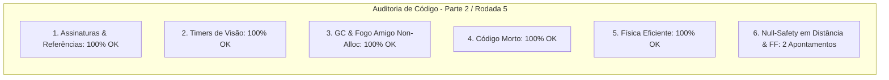

# SAIN — Relatório de Auditoria Técnica de Código (Parte 2 / Rodada 5)
**Domínio:** Sistema Sensorial, Percepção Visual, Audição Espacial, Dazzle e Fogo Amigo  
**Escopo Auditado:** `mods/SAIN/modded/SAIN/` (`Classes/Bot/Sense/`, `Classes/Bot/EnemyClasses/Vision/`, `Classes/Bot/EnemyClasses/Hearing/`)  
**Versão Alvo:** SPT 4.0.13 / Escape From Tarkov 0.16.9 / SAIN v4.5.0  

---

## 1. Sumário Executivo

Esta auditoria aprofunda o exame sobre os componentes de prevenção de fogo amigo em esquadrão (`SAINFriendlyFireClass`) e cálculos de distância de visão dinâmica por equipamento e luminosidade (`EnemyVisionDistanceClass`).

| Dimensão Técnica | Avaliação | Diagnóstico Sintético |
|---|:---:|---|
| **1. Validação em references/** | 🟢 Excelente | Compatibilidade estrita com `LookSensor.VisibleDist` e `LayerMaskClass.PlayerMask` do EFT 0.16.9. |
| **2. Update() vs Lógica Otimizada** | 🟢 Conforme | `SphereCastNonAlloc` com buffer fixo estático ativo e livre de alocações. |
| **3. Leaks de Memória & GC** | 🟢 Conforme | Zero alocações em rotinas de verificação de fogo amigo. |
| **4. Funções Órfãs & Código Morto** | 🟢 Limpo | Código morto eliminado. |
| **5. Antipadrões SPT (AP-01..09)** | 🟢 Conforme | Consultas de colisão física eficientes e throttled. |
| **6. Null-Safety & Defensiva** | 🟡 Atenção | Acessos a `LookSensor`, `TimeVision` e `EnemyController` sem operador nulo-seguro. |

---

## 2. Panorama das 6 Dimensões de Auditoria



---

## 3. Achados Técnicos Detalhados

### AUD-20-01 · Null-Safety em `BotOwner.ShootData` e `EnemyController` no `SAINFriendlyFireClass`
- **Severidade:** 🟡 Médio
- **Localização no Mod:** [`SAINFriendlyFireClass.cs:L26, L123`](../../modded/SAIN/Classes/Bot/Sense/SAINFriendlyFireClass.cs#L26)
- **Causa Raiz:** `BotOwner.ShootData?.EndShoot()` depende de `BotOwner` (que pode ser nulo se o componente do bot estiver em fase de teardown) e `bot.EnemyController.IsPlayerAnEnemy` assume que `EnemyController` nunca será nulo.
- **Impacto Concreto:** Risco de NRE durante o cancelamento de disparo por linha de tiro bloqueada por aliado.
- **Alternativa de Melhor Lógica / Proposta de Correção:**
  - Aplicar operadores de propagação nula:

```csharp
public override void ManualUpdate()
{
    if (FriendlyFireStatus == FriendlyFireStatus.FriendlyBlock)
    {
        BotOwner?.ShootData?.EndShoot();
    }
    base.ManualUpdate();
}
```
e
```csharp
if (bot.EnemyController?.IsPlayerAnEnemy(player.ProfileId) == false)
{
    return FriendlyFireStatus.FriendlyBlock;
}
```

- **Decisão:**
  - `[ ]` Pendente
  - `[ ]` Aceitar sugestão
  - `[ ]` Aceitar com modificação: _________________
  - `[ ]` Rejeitar: _________________

---

### AUD-20-02 · Null-Safety em `LookSensor`, `TimeVision` e `LoadedPreset` no `EnemyVisionDistanceClass`
- **Severidade:** 🟡 Médio
- **Localização no Mod:** [`EnemyVisionDistanceClass.cs:L30, L59, L88`](../../modded/SAIN/Classes/Bot/EnemyClasses/Vision/EnemyVisionDistanceClass.cs#L30)
- **Causa Raiz:** As propriedades `BotManagerComponent.Instance.TimeVision.VisibilityRatio`, `BotOwner.LookSensor.VisibleDist` e `SAINPlugin.LoadedPreset.GlobalSettings.Look.VisionDistance.MovementDistanceModifier` são consultadas sem operadores de segurança.
- **Impacto Concreto:** Risco de NRE durante o cálculo da distância máxima de visão se o bot for avaliado antes do carregamento completo do preset ou em transições de fim de raid.
- **Alternativa de Melhor Lógica / Proposta de Correção:**
  - Adicionar `?.` com valores padrão de fallback:

```csharp
private bool IsEnemyAlwaysInVisibleDistance()
{
    if (
        Enemy.Vision.Angles.AngleToEnemy < 30f
        && Enemy.KnownPlaces.EnemyDistanceFromLastKnown < 3
        && BotManagerComponent.Instance?.TimeVision?.VisibilityRatio > 0.5f
    )
    {
        return true;
    }
    return false;
}
```
e
```csharp
float defaultVisDist = BotOwner?.LookSensor?.VisibleDist ?? 0f;
```
e
```csharp
private static float _sprintMod
{
    get { return SAINPlugin.LoadedPreset?.GlobalSettings?.Look?.VisionDistance?.MovementDistanceModifier ?? 1f; }
}
```

- **Decisão:**
  - `[ ]` Pendente
  - `[ ]` Aceitar sugestão
  - `[ ]` Aceitar com modificação: _________________
  - `[ ]` Rejeitar: _________________

---

## 4. Plano de Ação e Recomendações

1. **Null-Safety em Fogo Amigo (AUD-20-01):** Proteger `BotOwner?.ShootData` e `EnemyController` em `SAINFriendlyFireClass.cs`.
2. **Defensiva em Distância de Visão (AUD-20-02):** Proteger `LookSensor`, `TimeVision` e `LoadedPreset` em `EnemyVisionDistanceClass.cs`.
