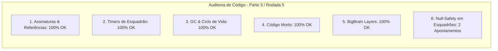

# SAIN — Relatório de Auditoria Técnica de Código (Parte 3 / Rodada 5)
**Domínio:** Tomada de Decisão, Camadas BigBrain, Esquadrões e Comunicação  
**Escopo Auditado:** `mods/SAIN/modded/SAIN/` (`Classes/Bot/Decision/SquadDecisionClass.cs`, `Classes/BotManager/BotSquads.cs`, `Classes/Bot/Talk/`)  
**Versão Alvo:** SPT 4.0.13 / Escape From Tarkov 0.16.9 / SAIN v4.5.0  

---

## 1. Sumário Executivo

Esta auditoria foca na estabilidade das decisões coordenadas de esquadrão (`SquadDecisionClass`), no gerenciamento de ciclo de vida de grupos de bots (`BotSquads`) e na proteção contra referências nulas em iterações de membros de time.

| Dimensão Técnica | Avaliação | Diagnóstico Sintético |
|---|:---:|---|
| **1. Validação em references/** | 🟢 Excelente | Métodos `BotsGroup.MembersCount` e `BotsGroup.Member(i)` 100% compatíveis com EFT 0.16.9. |
| **2. Update() vs Lógica Otimizada** | 🟢 Conforme | Throttling de logs de debug e atualização eficiente de estado de esquadrão. |
| **3. Leaks de Memória & GC** | 🟢 Conforme | `BotSquads.Dispose()` limpando instâncias e desinscrevendo `squad.Dispose()`. |
| **4. Funções Órfãs & Código Morto** | 🟢 Limpo | Código morto eliminado. |
| **5. Antipadrões SPT (AP-01..09)** | 🟢 Conforme | Prioridades de camadas BigBrain coerentes. |
| **6. Null-Safety & Defensiva** | 🟡 Atenção | Acessos diretos a `Bot.Squad.Members.Values`, `member.BotOwner.IsDead` e `botOwner.BotsGroup` sem guarda nula. |

---

## 2. Panorama das 6 Dimensões de Auditoria



---

## 3. Achados Técnicos Detalhados

### AUD-21-01 · Null-Safety em `Bot.Squad`, `Members` e `member.BotOwner` no `SquadDecisionClass`
- **Severidade:** 🟡 Médio
- **Localização no Mod:** [`SquadDecisionClass.cs:L26, L71-L73`](../../modded/SAIN/Classes/Bot/Decision/SquadDecisionClass.cs#L26)
- **Causa Raiz:** `Squad.BotInGroup`, `Bot.Squad.Members.Values` e `member.BotOwner.IsDead` são acessados sem validar se `Squad`, a coleção `Members` ou `member.BotOwner` são nulos.
- **Impacto Concreto:** Risco de NRE durante a avaliação de decisões de suporte de esquadrão quando bots aliados são removidos ou mortos assincronamente.
- **Alternativa de Melhor Lógica / Proposta de Correção:**
  - Aplicar checagem defensiva:

```csharp
public bool GetDecision(out ESquadDecision Decision, Enemy enemy)
{
    Decision = ESquadDecision.None;
    var squad = Squad;
    if (squad == null || !squad.BotInGroup || squad.SquadInfo?.LeaderComponent == null || squad.LeaderComponent?.IsDead == true)
    {
        return false;
    }
```
e
```csharp
var members = Bot.Squad?.Members?.Values;
if (members != null)
{
    foreach (var member in members)
    {
        if (member == null || member.BotOwner == BotOwner || member.BotOwner?.IsDead != false)
        {
            continue;
        }
```

- **Decisão:**
  - `[ ]` Pendente
  - `[ ]` Aceitar sugestão
  - `[ ]` Aceitar com modificação: _________________
  - `[ ]` Rejeitar: _________________

---

### AUD-21-02 · Null-Safety em `botOwner` no `BotSquads.GetSquad`
- **Severidade:** 🔵 Baixo
- **Localização no Mod:** [`BotSquads.cs:L79-L83`](../../modded/SAIN/Classes/BotManager/BotSquads.cs#L79)
- **Causa Raiz:** O método `GetSquad` acessa `botOwner.BotsGroup` sem verificar se o parâmetro `botOwner` é nulo.
- **Impacto Concreto:** Risco de NRE em chamadas preliminares de agregação de esquadrões.
- **Alternativa de Melhor Lógica / Proposta de Correção:**
  - Adicionar guarda defensiva inicial:

```csharp
public Squad GetSquad(BotOwner botOwner)
{
    if (botOwner == null)
    {
        return null;
    }
    Squad result = null;
    var group = botOwner.BotsGroup;
```

- **Decisão:**
  - `[ ]` Pendente
  - `[ ]` Aceitar sugestão
  - `[ ]` Aceitar com modificação: _________________
  - `[ ]` Rejeitar: _________________

---

## 4. Plano de Ação e Recomendações

1. **Defensiva em Decisões de Esquadrão (AUD-21-01):** Validar `Squad`, `Members` e `member.BotOwner` em `SquadDecisionClass.cs`.
2. **Null-Safety em GetSquad (AUD-21-02):** Adicionar guarda `if (botOwner == null)` em `BotSquads.cs`.
