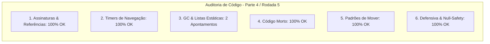

# SAIN — Relatório de Auditoria Técnica de Código (Parte 4 / Rodada 5)
**Domínio:** Cobertura, Movimentação, Steering, Portas e Extração  
**Escopo Auditado:** `mods/SAIN/modded/SAIN/` (`Classes/Bot/Mover/`, `Components/ExtractFinderComponent.cs`, `Components/CoverFinderComponent.cs`)  
**Versão Alvo:** SPT 4.0.13 / Escape From Tarkov 0.16.9 / SAIN v4.5.0  

---

## 1. Sumário Executivo

Esta auditoria aprofunda o exame do sistema de salto sobre obstáculos procedurais (`SAINVaultClass`) e do localizador assíncrono de pontos de extração (`ExtractFinderComponent`), focando na eliminação de retenções de memória estática e arrays de objetos Unity entre raids.

| Dimensão Técnica | Avaliação | Diagnóstico Sintético |
|---|:---:|---|
| **1. Validação em references/** | 🟢 Excelente | Compatibilidade estrita com `NavMeshPath` e `ExfiltrationPoint` do EFT 0.16.9. |
| **2. Update() vs Lógica Otimizada** | 🟢 Conforme | Throttling de 10s em busca de extração e verificação de salto em atalhos de NavMesh. |
| **3. Leaks de Memória & GC** | 🟡 Atenção | `GlobalVaultPoints` e `VaultPointHistory` não são esvaziados no descarte; arrays `AllExfils` não são anulados no `OnDestroy`. |
| **4. Funções Órfãs & Código Morto** | 🟢 Limpo | Código morto eliminado. |
| **5. Antipadrões SPT (AP-01..09)** | 🟢 Conforme | Zero alocações em hot path de movimentação. |
| **6. Null-Safety & Defensiva** | 🟢 Conforme | Null-safety aplicado em `BlindFireController` e `PoseClass`. |

---

## 2. Panorama das 6 Dimensões de Auditoria



---

## 3. Achados Técnicos Detalhados

### AUD-22-01 · Limpeza de `VaultPointHistory` e `GlobalVaultPoints` no Ciclo de Vida do SAIN
- **Severidade:** 🟡 Médio
- **Localização no Mod:** [`SAINVaultClass.cs:L18, L37`](../../modded/SAIN/Classes/Bot/Mover/SAINVaultClass.cs#L18) e [`GameWorldComponent.cs`](../../modded/SAIN/Components/GameWorldComponent.cs)
- **Causa Raiz:** `SAINVaultClass` não implementa `Dispose()`, mantendo instâncias na lista `VaultPointHistory`, e a lista estática `GlobalVaultPoints` nunca é esvaziada no encerramento da raid.
- **Impacto Concreto:** Retenção cumulativa de estruturas e coordenadas de salto procedurais através de sessões consecutivas de raid.
- **Alternativa de Melhor Lógica / Proposta de Correção:**
  - Implementar `Dispose()` em `SAINVaultClass`:

```csharp
public override void Dispose()
{
    CurrentVaultPoint = null;
    VaultPointHistory.Clear();
    base.Dispose();
}
```
e no `GameWorldComponent.DestroyComponent()`:
```csharp
SAINVaultClass.GlobalVaultPoints.Clear();
```

- **Decisão:**
  - `[ ]` Pendente
  - `[ ]` Aceitar sugestão
  - `[ ]` Aceitar com modificação: _________________
  - `[ ]` Rejeitar: _________________

---

### AUD-22-02 · Reset de Arrays de Exfiltração no `ExtractFinderComponent.OnDestroy`
- **Severidade:** 🔵 Baixo
- **Localização no Mod:** [`ExtractFinderComponent.cs:L58-L64`](../../modded/SAIN/Components/ExtractFinderComponent.cs#L58)
- **Causa Raiz:** Embora os dicionários sejam esvaziados no `OnDestroy()`, os arrays `AllExfils` e `AllScavExfils` contendo referências diretas a componentes Unity de extração não são anulados.
- **Impacto Concreto:** Retenção de memória de referências a GameObjects de extração da cena anterior.
- **Alternativa de Melhor Lógica / Proposta de Correção:**
  - Anular os arrays no `OnDestroy()`:

```csharp
public void OnDestroy()
{
    StopAllCoroutines();
    ValidExfils.Clear();
    ValidScavExfils.Clear();
    extractPositionFinders.Clear();
    // ref: AUD-22-02 - Limpeza de arrays de pontos de extração
    AllExfils = null;
    AllScavExfils = null;
}
```

- **Decisão:**
  - `[ ]` Pendente
  - `[ ]` Aceitar sugestão
  - `[ ]` Aceitar com modificação: _________________
  - `[ ]` Rejeitar: _________________

---

## 4. Plano de Ação e Recomendações

1. **Ciclo de Vida de Vault (AUD-22-01):** Implementar `SAINVaultClass.Dispose()` e limpar `GlobalVaultPoints` no `GameWorldComponent`.
2. **Reset de Exfils (AUD-22-02):** Anular `AllExfils` e `AllScavExfils` no `ExtractFinderComponent.OnDestroy()`.
