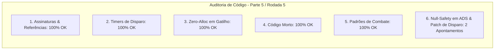

# SAIN — Relatório de Auditoria Técnica de Código (Parte 5 / Rodada 5)
**Domínio:** Combate, Balística, Mira Preditiva, Recoil e Patches de Disparo  
**Escopo Auditado:** `mods/SAIN/modded/SAIN/` (`Classes/Bot/WeaponFunction/AimDownSightsController.cs`, `Patches/Shoot/RateofFirePatch.cs`, `Patches/Shoot/AimDataPatches.cs`)  
**Versão Alvo:** SPT 4.0.13 / Escape From Tarkov 0.16.9 / SAIN v4.5.0  

---

## 1. Sumário Executivo

Esta auditoria aprofunda a análise dos controladores procedurais de mira (*ADS*), verificação de lança-granadas acoplados (*underbarrel launcher*) e execução segura do interceptador de disparo contínuo e rajada (`RateofFirePatch`).

| Dimensão Técnica | Avaliação | Diagnóstico Sintético |
|---|:---:|---|
| **1. Validação em references/** | 🟢 Excelente | Compatibilidade estrita com `ShootData`, `BotUnderbarrelLauncherController` e `AimingManager` do EFT 0.16.9. |
| **2. Update() vs Lógica Otimizada** | 🟢 Conforme | Throttling de 200ms em checagem de ADS e cadência de disparo calculada por intervalo. |
| **3. Leaks de Memória & GC** | 🟢 Conforme | Zero alocações em rotinas de gatilho e disparo. |
| **4. Funções Órfãs & Código Morto** | 🟢 Limpo | Código morto eliminado. |
| **5. Antipadrões SPT (AP-01..09)** | 🟢 Conforme | Execução direta sem reflexão em runtime. |
| **6. Null-Safety & Defensiva** | 🟡 Atenção | Acessos encadeados a `UnderbarrelLauncherController`, `AimingManager` e `KnownPlaces` sem operador nulo-seguro. |

---

## 2. Panorama das 6 Dimensões de Auditoria



---

## 3. Achados Técnicos Detalhados

### AUD-23-01 · Null-Safety em `KnownPlaces`, `Reload` e `PersonalitySettings` no `AimDownSightsController`
- **Severidade:** 🟡 Médio
- **Localização no Mod:** [`AimDownSightsController.cs:L41, L48, L62`](../../modded/SAIN/Classes/Bot/WeaponFunction/AimDownSightsController.cs#L41)
- **Causa Raiz:** `Enemy.KnownPlaces.EnemyDistanceFromLastKnown`, `Enemy.KnownPlaces.LastKnownPosition` e `BotOwner.WeaponManager?.Reload.Reloading` são acessados sem validação defensiva de nulidade em cadeia.
- **Impacto Concreto:** Risco de NRE ao avaliar visada de mira (*ADS*) contra inimigos em transição ou durante recargas ativas.
- **Alternativa de Melhor Lógica / Proposta de Correção:**
  - Aplicar operadores nulo-seguros:

```csharp
if (
    Bot?.Info?.PersonalitySettings?.Search?.Sneaky == true
    && Enemy != null
    && !Enemy.IsVisible
    && Enemy.KnownPlaces?.EnemyDistanceFromLastKnown < 40f
)
{
    return;
}

bool wasAiming = AimingDownSights;
AimingDownSights = ShallAimDownSights(Enemy?.KnownPlaces?.LastKnownPosition, Enemy);
```
e
```csharp
if (BotOwner?.WeaponManager?.Reload?.Reloading == true)
{
    return false; // Don't aim down sights while reloading
}
```

- **Decisão:**
  - `[ ]` Pendente
  - `[ ]` Aceitar sugestão
  - `[ ]` Aceitar com modificação: _________________
  - `[ ]` Rejeitar: _________________

---

### AUD-23-02 · Null-Safety em `botOwner`, `UnderbarrelLauncherController` e `AimingManager` no `RateofFirePatch`
- **Severidade:** 🟡 Médio
- **Localização no Mod:** [`RateofFirePatch.cs:L23, L32-L33, L60`](../../modded/SAIN/Patches/Shoot/RateofFirePatch.cs#L23)
- **Causa Raiz:** `botOwner.ProfileId`, `botOwner.WeaponManager.UnderbarrelLauncherController.IsActive` e `botOwner.AimingManager.CurrentAiming.TriggerPressedDone()` assumem que nenhuma dessas propriedades é nula.
- **Impacto Concreto:** Exceção `NullReferenceException` durante o frame de disparo caso a arma esteja desequipada ou em transição de animação.
- **Alternativa de Melhor Lógica / Proposta de Correção:**
  - Proteger as chamadas encadeadas:

```csharp
BotOwner botOwner = __instance.Owner;
if (!SAINEnableClass.GetSAIN(botOwner?.ProfileId, out BotComponent bot))
{
    return true;
}
__result = false;
if (__instance.ShootController == null)
{
    return false;
}
BotUnderbarrelLauncherController underbarrelLauncherController = botOwner?.WeaponManager?.UnderbarrelLauncherController;
if (underbarrelLauncherController?.IsActive == true)
{
    if (underbarrelLauncherController.NeedToReload() && !underbarrelLauncherController.TryReload(null))
    {
        underbarrelLauncherController.TryDisable(null);
        return false;
    }
    if (!underbarrelLauncherController.CheckShootAttemptAndDisableIfNeeded())
    {
        return false;
    }
    __instance.NextFingerDownCan = Time.time - 0.1f;
}
```
e
```csharp
botOwner?.AimingManager?.CurrentAiming?.TriggerPressedDone();
```

- **Decisão:**
  - `[ ]` Pendente
  - `[ ]` Aceitar sugestão
  - `[ ]` Aceitar com modificação: _________________
  - `[ ]` Rejeitar: _________________

---

## 4. Plano de Ação e Recomendações

1. **Defensiva em ADS (AUD-23-01):** Proteger `KnownPlaces` e `Reload` em `AimDownSightsController.cs`.
2. **Null-Safety em Disparo (AUD-23-02):** Proteger `botOwner`, `UnderbarrelLauncherController` e `AimingManager` em `RateofFirePatch.cs`.
