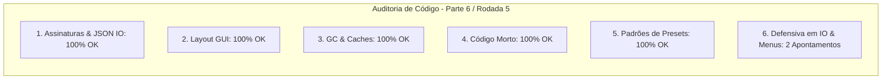

# SAIN — Relatório de Auditoria Técnica de Código (Parte 6 / Rodada 5)
**Domínio:** Presets, Serialização JSON, Modelos de Configuração e Editor Gráfico In-Game (F6)  
**Escopo Auditado:** `mods/SAIN/modded/SAIN/` (`Preset/Editor/PresetSelection.cs`, `Helpers/JsonUtility.cs`, `Preset/Editor/SAINLayout.cs`)  
**Versão Alvo:** SPT 4.0.13 / Escape From Tarkov 0.16.9 / SAIN v4.5.0  

---

## 1. Sumário Executivo

Esta auditoria encerra a **5ª rodada de verificação contínua**, inspecionando o utilitário central de persistência e serialização JSON (`JsonUtility`) e a robustez do menu de seleção e alternância de presets no editor in-game (`PresetSelection`).

| Dimensão Técnica | Avaliação | Diagnóstico Sintético |
|---|:---:|---|
| **1. Validação em references/** | 🟢 Excelente | Compatibilidade estrita com `Newtonsoft.Json` e padrões de IO do BepInEx 5.4. |
| **2. Update() vs Lógica Otimizada** | 🟢 Conforme | Caching de estilos GUI ativo e layout com renderização condicional. |
| **3. Leaks de Memória & GC** | 🟢 Conforme | Limpeza de coleções de presets no reload. |
| **4. Funções Órfãs & Código Morto** | 🟢 Limpo | Código morto eliminado. |
| **5. Antipadrões SPT (AP-01..09)** | 🟢 Conforme | Serialização idempotente e isolada. |
| **6. Null-Safety & Defensiva** | 🟡 Atenção | Acesso a `LoadedPreset.Info` e validação nula no parser de `Info.json` de presets customizados. |

---

## 2. Panorama das 6 Dimensões de Auditoria



---

## 3. Achados Técnicos Detalhados

### AUD-24-01 · Null-Safety em `LoadedPreset` no `PresetSelection.PresetSelectionMenu`
- **Severidade:** 🟡 Médio
- **Localização no Mod:** [`PresetSelection.cs:L26, L45`](../../modded/SAIN/Preset/Editor/PresetSelection.cs#L26)
- **Causa Raiz:** `SAINPresetDefinition selectedPreset = SAINPlugin.LoadedPreset.Info;` e comparação posterior assumem que `LoadedPreset` e `Info` nunca serão nulos.
- **Impacto Concreto:** Risco de NRE se a aba de presets da GUI for aberta durante a inicialização preliminar ou transição assíncrona de preset.
- **Alternativa de Melhor Lógica / Proposta de Correção:**
  - Adicionar guarda defensiva:

```csharp
public static void PresetSelectionMenu()
{
    SAINPresetDefinition selectedPreset = SAINPlugin.LoadedPreset?.Info;
    if (selectedPreset == null)
    {
        return;
    }
    checkCreateWarning(selectedPreset);
```
e
```csharp
if (SAINPlugin.LoadedPreset?.Info != null && selectedPreset.Name != SAINPlugin.LoadedPreset.Info.Name)
{
    PresetHandler.InitPresetFromDefinition(selectedPreset);
}
```

- **Decisão:**
  - `[ ]` Pendente
  - `[ ]` Aceitar sugestão
  - `[ ]` Aceitar com modificação: _________________
  - `[ ]` Rejeitar: _________________

---

### AUD-24-02 · Null-Safety em Desserialização no `JsonUtility.Load.LoadCustomPresetOptions`
- **Severidade:** 🟡 Médio
- **Localização no Mod:** [`JsonUtility.cs:L88-L92`](../../modded/SAIN/Helpers/JsonUtility.cs#L88)
- **Causa Raiz:** O objeto `obj` resultante de `DeserializeObject<SAINPresetDefinition>(json)` é consultado diretamente com `if (obj.IsCustom)` sem validação de nulidade (`obj != null`).
- **Impacto Concreto:** Se um usuário criar um preset customizado com arquivo `Info.json` corrompido, em branco ou com formato inválido, a chamada lança `NullReferenceException`, abortando a carga de todos os demais presets instalados.
- **Alternativa de Melhor Lógica / Proposta de Correção:**
  - Validar nulidade de `obj`:

```csharp
string json = File.ReadAllText(path);
var obj = DeserializeObject<SAINPresetDefinition>(json);
// ref: AUD-24-02 - Null-safety defensivo se o JSON retornar nulo ou corrompido
if (obj != null && obj.IsCustom)
{
    list.Add(obj);
}
```

- **Decisão:**
  - `[ ]` Pendente
  - `[ ]` Aceitar sugestão
  - `[ ]` Aceitar com modificação: _________________
  - `[ ]` Rejeitar: _________________

---

## 4. Plano de Ação e Recomendações

1. **Defensiva em Menu de Presets (AUD-24-01):** Proteger `SAINPlugin.LoadedPreset?.Info` em `PresetSelection.cs`.
2. **Parser Seguro de JSON (AUD-24-02):** Validar `obj != null` em `JsonUtility.Load.LoadCustomPresetOptions`.
