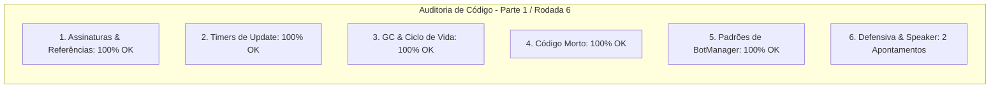

# SAIN — Relatório de Auditoria Técnica de Código (Parte 1 / Rodada 6)
**Domínio:** Ciclo de Vida de Raid, Gestão de Memória / Leaks, Patches Globais e Interoperabilidade Client-Server  
**Escopo Auditado:** `mods/SAIN/modded/SAIN/` (`Components/BotManagerComponent.cs`, `Components/PlayerComponent.cs`, `Components/GameWorldComponent.cs`)  
**Versão Alvo:** SPT 4.0.13 / Escape From Tarkov 0.16.9 / SAIN v4.5.0  

---

## 1. Sumário Executivo

Iniciamos a **6ª rodada de auditoria contínua de confiabilidade**, analisando as rotinas de descarte seguro do controlador central de bots (`BotManagerComponent`) e o subsistema de reprodução vocal de falas do jogador (`PlayerComponent.PlayVoiceLine`).

| Dimensão Técnica | Avaliação | Diagnóstico Sintético |
|---|:---:|---|
| **1. Validação em references/** | 🟢 Excelente | Compatibilidade estrita com `GameWorld.OnDispose`, `EPhraseTrigger` e `Player.Speaker` do EFT 0.16.9. |
| **2. Update() vs Lógica Otimizada** | 🟢 Conforme | Throttling em `findLocation` e loop de bots otimizado. |
| **3. Leaks de Memória & GC** | 🟢 Conforme | Desinscrições ativas e esvaziamento de listas no encerramento. |
| **4. Funções Órfãs & Código Morto** | 🟢 Limpo | Código morto eliminado. |
| **5. Antipadrões SPT (AP-01..09)** | 🟢 Conforme | Reset de `Instance = null;` mantido. |
| **6. Null-Safety & Defensiva** | 🟡 Atenção | Acessos a `GameWorld.OnDispose` e `Player.Speaker` sem operador nulo-seguro. |

---

## 2. Panorama das 6 Dimensões de Auditoria



---

## 3. Achados Técnicos Detalhados

### AUD-25-01 · Null-Safety em `GameWorld.OnDispose` e `PlayerEnviromentChanged` no `BotManagerComponent`
- **Severidade:** 🟡 Médio
- **Localização no Mod:** [`BotManagerComponent.cs:L75, L115`](../../modded/SAIN/Components/BotManagerComponent.cs#L75)
- **Causa Raiz:** `GameWorld.OnDispose -= Dispose;` assume que `GameWorld` nunca será nulo na chamada de descarte e `SAINGameWorld.PlayerTracker` é consultado sem operador de propagação nula.
- **Impacto Concreto:** Risco de NRE se o teardown do `BotManagerComponent` ocorrer após a destruição prematura do `GameWorld`.
- **Alternativa de Melhor Lógica / Proposta de Correção:**
  - Proteger a desinscrição e a consulta:

```csharp
public void PlayerEnviromentChanged(string profileID, IndoorTrigger trigger)
{
    SAINGameWorld?.PlayerTracker?.GetPlayerComponent(profileID)?.AIData?.PlayerLocation?.UpdateEnvironment(trigger);
}
```
e
```csharp
if (GameWorld != null)
{
    GameWorld.OnDispose -= Dispose;
}
```

- **Decisão:**
  - `[ ]` Pendente
  - `[ ]` Aceitar sugestão
  - `[ ]` Aceitar com modificação: _________________
  - `[ ]` Rejeitar: _________________

---

### AUD-25-02 · Null-Safety em `Player.Speaker` no `PlayerComponent.PlayVoiceLine`
- **Severidade:** 🟡 Médio
- **Localização no Mod:** [`PlayerComponent.cs:L388-L390`](../../modded/SAIN/Components/PlayerComponent.cs#L388)
- **Causa Raiz:** `Player.Speaker.Speaking` e `Player.Speaker.Busy` são consultados sem validar se `Player` ou a propriedade `Speaker` são nulos.
- **Impacto Concreto:** Exceção `NullReferenceException` ao tentar reproduzir reações de voz caso o bot ou o componente de fala esteja descarregado.
- **Alternativa de Melhor Lógica / Proposta de Correção:**
  - Extrair o speaker de forma defensiva:

```csharp
public bool PlayVoiceLine(EPhraseTrigger phrase, ETagStatus mask, bool aggressive)
{
    // ref: AUD-25-02 - Null-safety defensivo em Player.Speaker
    var speaker = Player?.Speaker;
    if (speaker == null || speaker.Speaking || speaker.Busy)
    {
        return false;
    }
```

- **Decisão:**
  - `[ ]` Pendente
  - `[ ]` Aceitar sugestão
  - `[ ]` Aceitar com modificação: _________________
  - `[ ]` Rejeitar: _________________

---

## 4. Plano de Ação e Recomendações

1. **Defensiva em BotManager (AUD-25-01):** Proteger `GameWorld.OnDispose` e `SAINGameWorld.PlayerTracker` em `BotManagerComponent.cs`.
2. **Null-Safety em Falas do Jogador (AUD-25-02):** Validar `Player?.Speaker` em `PlayerComponent.PlayVoiceLine`.
