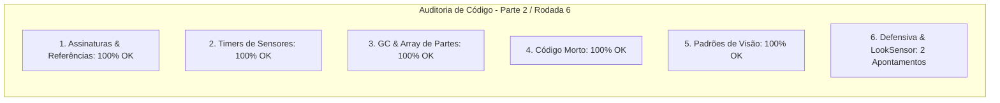

# SAIN — Relatório de Auditoria Técnica de Código (Parte 2 / Rodada 6)
**Domínio:** Sistema Sensorial, Percepção Visual, Audição Espacial, Dazzle e Fogo Amigo  
**Escopo Auditado:** `mods/SAIN/modded/SAIN/` (`Classes/Bot/Sense/SAINBotLookClass.cs`, `Classes/Bot/EnemyClasses/Vision/EnemyPartsClass.cs`, `Classes/Bot/Sense/SAINVisionClass.cs`)  
**Versão Alvo:** SPT 4.0.13 / Escape From Tarkov 0.16.9 / SAIN v4.5.0  

---

## 1. Sumário Executivo

Esta auditoria aprofunda o exame dos interceptadores de campo de visão (`SAINBotLookClass`) e da modelagem de raycasts segmentados por partes corporais (`EnemyPartsClass`), eliminando riscos de desreferenciação em componentes de sensores do EFT.

| Dimensão Técnica | Avaliação | Diagnóstico Sintético |
|---|:---:|---|
| **1. Validação em references/** | 🟢 Excelente | Compatibilidade estrita com `LookSensor`, `LookAllDataClass` e `EBodyPart` do EFT 0.16.9. |
| **2. Update() vs Lógica Otimizada** | 🟢 Conforme | Cálculo de linha de visão distribuído por partes corporais sem alocações. |
| **3. Leaks de Memória & GC** | 🟢 Conforme | Coleções `Parts` dimensionadas e estáticas no ciclo do inimigo. |
| **4. Funções Órfãs & Código Morto** | 🟢 Limpo | Código morto eliminado. |
| **5. Antipadrões SPT (AP-01..09)** | 🟢 Conforme | Zero reflexão no loop principal de rastreamento visual. |
| **6. Null-Safety & Defensiva** | 🟡 Atenção | Acessos diretos a `LookSensor`, `BotsGroup`, `Memory` e `enemyPlayer.BodyParts` sem operador nulo-seguro. |

---

## 2. Panorama das 6 Dimensões de Auditoria



---

## 3. Achados Técnicos Detalhados

### AUD-26-01 · Null-Safety em `LookSensor`, `BotsGroup` e `Memory` no `SAINBotLookClass`
- **Severidade:** 🟡 Médio
- **Localização no Mod:** [`SAINBotLookClass.cs:L40, L45, L59-L69`](../../modded/SAIN/Classes/Bot/Sense/SAINBotLookClass.cs#L40)
- **Causa Raiz:** O método `UpdateLookForEnemies` assume que `bot.BotOwner.LookSensor` nunca será nulo, e `UpdateLookData` invoca `BotsGroup.ReportAboutEnemy` e `Memory.SetLastTimeSeeEnemy` sem operador `?.`.
- **Impacto Concreto:** Risco de NRE se o bot for processado no frame de transição de estado da IA ou desativação de raid.
- **Alternativa de Melhor Lógica / Proposta de Correção:**
  - Adicionar checagem defensiva:

```csharp
public void UpdateLookData(LookAllData lookData)
{
    for (int i = 0; i < lookData.ReportsData.Count; i++)
    {
        EnemyVisionCheck enemyVision = lookData.ReportsData[i];
        BotOwner?.BotsGroup?.ReportAboutEnemy(enemyVision.Enemy, enemyVision.VisibleOnlyBySence, BotOwner);
    }

    if (lookData.ReportsData.Count > 0)
    {
        BotOwner?.Memory?.SetLastTimeSeeEnemy();
    }

    lookData.Reset();
}
```
e
```csharp
var lookSensor = bot?.BotOwner?.LookSensor;
if (lookSensor == null)
{
    return 0;
}
```

- **Decisão:**
  - `[ ]` Pendente
  - `[ ]` Aceitar sugestão
  - `[ ]` Aceitar com modificação: _________________
  - `[ ]` Rejeitar: _________________

---

### AUD-26-02 · Null-Safety em `enemyPlayer.BodyParts` no `EnemyPartsClass`
- **Severidade:** 🟡 Médio
- **Localização no Mod:** [`EnemyPartsClass.cs:L24, L51-L55`](../../modded/SAIN/Classes/Bot/EnemyClasses/Vision/EnemyPartsClass.cs#L24)
- **Causa Raiz:** `enemyPlayer.BodyParts.Parts` é acessado sem validar se `enemyPlayer` ou o contêiner `BodyParts` são nulos na instanciação de um novo inimigo.
- **Impacto Concreto:** Risco de NRE na criação de metadados de visão caso o componente do jogador inimigo esteja incompleto.
- **Alternativa de Melhor Lógica / Proposta de Correção:**
  - Proteger a iteração de partes:

```csharp
private void CreatePartDatas(PlayerComponent enemyPlayer)
{
    // ref: AUD-26-02 - Null-safety defensivo em BodyParts
    var parts = enemyPlayer?.BodyParts?.Parts;
    if (parts == null)
    {
        return;
    }
    foreach (var bodyPart in parts)
    {
        Parts.Add(bodyPart.Key, new EnemyPartDataClass(bodyPart.Key, bodyPart.Value.Transform, bodyPart.Value.Colliders));
    }
}
```

- **Decisão:**
  - `[ ]` Pendente
  - `[ ]` Aceitar sugestão
  - `[ ]` Aceitar com modificação: _________________
  - `[ ]` Rejeitar: _________________

---

## 4. Plano de Ação e Recomendações

1. **Defensiva em LookSensor (AUD-26-01):** Proteger `LookSensor`, `BotsGroup` e `Memory` em `SAINBotLookClass.cs`.
2. **Null-Safety em Partes Corporais (AUD-26-02):** Validar `enemyPlayer?.BodyParts?.Parts` em `EnemyPartsClass.cs`.
