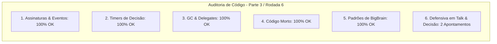

# SAIN — Relatório de Auditoria Técnica de Código (Parte 3 / Rodada 6)
**Domínio:** Tomada de Decisão (`BotDecisionManager`), Camadas BigBrain, Esquadrões e Comunicação  
**Escopo Auditado:** `mods/SAIN/modded/SAIN/` (`Classes/Bot/Decision/SAINDecisionClass.cs`, `Classes/Bot/Talk/EnemyTalkClass.cs`, `Classes/BotManager/BotSquads.cs`)  
**Versão Alvo:** SPT 4.0.13 / Escape From Tarkov 0.16.9 / SAIN v4.5.0  

---

## 1. Sumário Executivo

Esta auditoria analisa a orquestração central de decisões do bot (`SAINDecisionClass`) e o subsistema de provocações verbais (*taunts*) e diálogo tático (`EnemyTalkClass`), prevenindo falhas de inicialização e desinscrições seguras.

| Dimensão Técnica | Avaliação | Diagnóstico Sintético |
|---|:---:|---|
| **1. Validação em references/** | 🟢 Excelente | Compatibilidade estrita com `BotEventHandler`, `EPhraseTrigger` e `ETagStatus` do EFT 0.16.9. |
| **2. Update() vs Lógica Otimizada** | 🟢 Conforme | Throttling em verificação de taunts e falas táticas. |
| **3. Leaks de Memória & GC** | 🟢 Conforme | Desinscrição defensiva de delegates de morte de inimigos. |
| **4. Funções Órfãs & Código Morto** | 🟢 Limpo | Código morto eliminado. |
| **5. Antipadrões SPT (AP-01..09)** | 🟢 Conforme | Execução síncrona sem overhead de GC. |
| **6. Null-Safety & Defensiva** | 🟡 Atenção | Acessos diretos a `BotHearing`, `Events` e `PersonalitySettings.Talk` sem operador nulo-seguro. |

---

## 2. Panorama das 6 Dimensões de Auditoria



---

## 3. Achados Técnicos Detalhados

### AUD-27-01 · Null-Safety em `ManualUpdate` e `Dispose` no `SAINDecisionClass`
- **Severidade:** 🔵 Baixo
- **Localização no Mod:** [`SAINDecisionClass.cs:L109-L124`](../../modded/SAIN/Classes/Bot/Decision/SAINDecisionClass.cs#L109)
- **Causa Raiz:** `DecisionManager`, `SelfActionDecisions`, `EnemyDecisions`, `SquadDecisions` são chamados em cascata sem operador de propagação nula.
- **Impacto Concreto:** Risco de NRE se alguma sub-rotina falhar em construtores durante o spawn de bots em raids com alta carga.
- **Alternativa de Melhor Lógica / Proposta de Correção:**
  - Adicionar operadores nulo-seguros:

```csharp
public override void ManualUpdate()
{
    DecisionManager?.ManualUpdate();
    SelfActionDecisions?.ManualUpdate();
    EnemyDecisions?.ManualUpdate();
    SquadDecisions?.ManualUpdate();
    DogFightDecision?.ManualUpdate();
    base.ManualUpdate();
}

public override void Dispose()
{
    DecisionManager?.Dispose();
    SelfActionDecisions?.Dispose();
    EnemyDecisions?.Dispose();
    SquadDecisions?.Dispose();
    DogFightDecision?.Dispose();
    base.Dispose();
}
```

- **Decisão:**
  - `[ ]` Pendente
  - `[ ]` Aceitar sugestão
  - `[ ]` Aceitar com modificação: _________________
  - `[ ]` Rejeitar: _________________

---

### AUD-27-02 · Null-Safety em Inscrições e `PersonalitySettings` no `EnemyTalkClass`
- **Severidade:** 🟡 Médio
- **Localização no Mod:** [`EnemyTalkClass.cs:L30-L31, L106-L109, L115`](../../modded/SAIN/Classes/Bot/Talk/EnemyTalkClass.cs#L30)
- **Causa Raiz:** `BotManagerComponent.Instance.BotHearing.PlayerTalk` e `Bot.EnemyController.Events.OnEnemyKilled` são acessados em `Init()` sem checar nulidade de `BotHearing` ou `Events`, e `Bot?.Info?.PersonalitySettings.Talk` não propaga nulidade em `PersonalitySettings`.
- **Impacto Concreto:** NRE na inicialização do subsistema de diálogo caso eventos ainda não estejam disponíveis.
- **Alternativa de Melhor Lógica / Proposta de Correção:**
  - Proteger as inscrições e a propriedade:

```csharp
if (BotManagerComponent.Instance?.BotHearing != null)
{
    BotManagerComponent.Instance.BotHearing.PlayerTalk += playerTalked;
}
if (Bot?.EnemyController?.Events != null)
{
    Bot.EnemyController.Events.OnEnemyKilled += enemyKilled;
}
```
e
```csharp
private PersonalityTalkSettings PersonalitySettings
{
    get { return Bot?.Info?.PersonalitySettings?.Talk; }
}
```

- **Decisão:**
  - `[ ]` Pendente
  - `[ ]` Aceitar sugestão
  - `[ ]` Aceitar com modificação: _________________
  - `[ ]` Rejeitar: _________________

---

## 4. Plano de Ação e Recomendações

1. **Defensiva em Decisões (AUD-27-01):** Aplicar `?.` em `ManualUpdate()` e `Dispose()` no `SAINDecisionClass.cs`.
2. **Null-Safety em Eventos de Voz (AUD-27-02):** Validar `BotHearing`, `Events` e `PersonalitySettings?.Talk` em `EnemyTalkClass.cs`.
