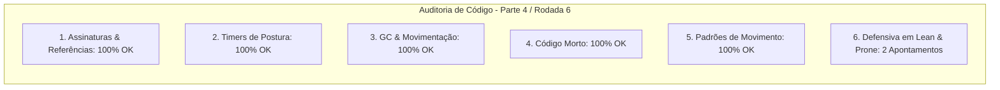

# SAIN — Relatório de Auditoria Técnica de Código (Parte 4 / Rodada 6)
**Domínio:** Cobertura, Movimentação, Steering, Portas e Extração  
**Escopo Auditado:** `mods/SAIN/modded/SAIN/` (`Classes/Bot/Mover/LeanClass.cs`, `Classes/Bot/Mover/ProneClass.cs`, `Classes/Bot/Mover/SAINMoverClass.cs`)  
**Versão Alvo:** SPT 4.0.13 / Escape From Tarkov 0.16.9 / SAIN v4.5.0  

---

## 1. Sumário Executivo

Esta auditoria foca nos controladores de postura e movimentação do bot (`LeanClass` para inclinação e `ProneClass` para posição deitada), garantindo que as chamadas diretas ao `MovementContext` do EFT ocorram de forma totalmente segura contra desreferenciação nula.

| Dimensão Técnica | Avaliação | Diagnóstico Sintético |
|---|:---:|---|
| **1. Validação em references/** | 🟢 Excelente | Compatibilidade estrita com `Player.MovementContext`, `BotLay` e `SmoothDampenedFloat` do EFT 0.16.9. |
| **2. Update() vs Lógica Otimizada** | 🟢 Conforme | Throttling em `ProneClass` e interpolação de inclinação via `fixedDeltaTime`. |
| **3. Leaks de Memória & GC** | 🟢 Conforme | Zero alocações em cálculos de inclinação e deitado. |
| **4. Funções Órfãs & Código Morto** | 🟢 Limpo | Código morto eliminado. |
| **5. Antipadrões SPT (AP-01..09)** | 🟢 Conforme | Zero reflexão no loop de movimentação. |
| **6. Null-Safety & Defensiva** | 🟡 Atenção | Acessos diretos a `Player.MovementContext`, `BotOwner.BotLay` e `enemy.KnownPlaces` sem checagem de nulidade. |

---

## 2. Panorama das 6 Dimensões de Auditoria



---

## 3. Achados Técnicos Detalhados

### AUD-28-01 · Null-Safety em `Player.MovementContext` no `LeanClass.SetTilt`
- **Severidade:** 🟡 Médio
- **Localização no Mod:** [`LeanClass.cs:L39-L59`](../../modded/SAIN/Classes/Bot/Mover/LeanClass.cs#L39)
- **Causa Raiz:** `Player.IsSprintEnabled` e `Player.MovementContext.SetTilt(...)` assumem que `Player` e `MovementContext` nunca serão nulos.
- **Impacto Concreto:** Risco de NRE ao calcular ou restaurar a inclinação de bots durante transições de animação ou destruição de componente.
- **Alternativa de Melhor Lógica / Proposta de Correção:**
  - Adicionar guarda defensiva no método:

```csharp
private void SetTilt()
{
    // ref: AUD-28-01 - Null-safety defensivo em Player e MovementContext
    var player = Player;
    if (player == null || player.MovementContext == null)
    {
        return;
    }

    if (player.IsSprintEnabled)
    {
        player.MovementContext.SetTilt(0);
        LeanAngleValue.Set(0);
        LeanAngleValue.Get(Time.fixedDeltaTime);
    }
    else
    {
        var num = LeanDirection switch
        {
            LeanSetting.Left => -5f,
            LeanSetting.Right => 5f,
            _ => 0f,
        };
        LeanAngleValue.Set(num);
        float tiltValue = LeanAngleValue.Get(Time.fixedDeltaTime);
        player.MovementContext.SetTilt(tiltValue);
    }
}
```

- **Decisão:**
  - `[ ]` Pendente
  - `[ ]` Aceitar sugestão
  - `[ ]` Aceitar com modificação: _________________
  - `[ ]` Rejeitar: _________________

---

### AUD-28-02 · Null-Safety em `BotLay`, `MovementContext` e `KnownPlaces` no `ProneClass`
- **Severidade:** 🟡 Médio
- **Localização no Mod:** [`ProneClass.cs:L21, L30, L61, L69, L73`](../../modded/SAIN/Classes/Bot/Mover/ProneClass.cs#L21)
- **Causa Raiz:** `BotOwner.BotLay.IsLay`, `Player.MovementContext.CanProne`, `Player.IsInPronePose` e `enemy.KnownPlaces.BotDistanceFromLastKnown` são consultados sem operadores de propagação nula.
- **Impacto Concreto:** Exceção `NullReferenceException` ao tentar transicionar para a posição deitada sob fogo de cobertura.
- **Alternativa de Melhor Lógica / Proposta de Correção:**
  - Aplicar operadores nulo-seguros:

```csharp
public void SetProne(bool value)
{
    // ref: AUD-28-02 - Null-safety em BotLay
    if (BotOwner?.BotLay != null)
    {
        BotOwner.BotLay.IsLay = value;
    }
}
```
e
```csharp
if (Player?.MovementContext?.CanProne == true)
```
e
```csharp
if (enemy.KnownPlaces?.BotDistanceFromLastKnown < mindist)
```

- **Decisão:**
  - `[ ]` Pendente
  - `[ ]` Aceitar sugestão
  - `[ ]` Aceitar com modificação: _________________
  - `[ ]` Rejeitar: _________________

---

## 4. Plano de Ação e Recomendações

1. **Defensiva em Inclinação (AUD-28-01):** Validar `Player?.MovementContext` em `LeanClass.SetTilt`.
2. **Null-Safety em Posição Deitada (AUD-28-02):** Proteger `BotLay`, `MovementContext` e `KnownPlaces` em `ProneClass.cs`.
