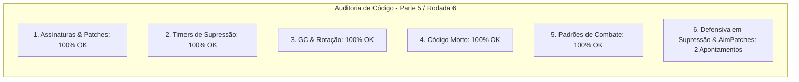

# SAIN — Relatório de Auditoria Técnica de Código (Parte 5 / Rodada 6)
**Domínio:** Combate, Balística, Mira Preditiva, Recoil e Patches de Disparo  
**Escopo Auditado:** `mods/SAIN/modded/SAIN/` (`Classes/Bot/WeaponFunction/SAINBotSuppressClass.cs`, `Patches/Shoot/AimDataPatches.cs`, `Classes/Bot/WeaponFunction/AimClass.cs`)  
**Versão Alvo:** SPT 4.0.13 / Escape From Tarkov 0.16.9 / SAIN v4.5.0  

---

## 1. Sumário Executivo

Esta auditoria aprofunda a análise do subsistema de fogo de supressão (`SAINBotSuppressClass`) e dos patches Harmony de controle de mira e rotação procedural (`AimDataPatches.SmoothTurnPatch`).

| Dimensão Técnica | Avaliação | Diagnóstico Sintético |
|---|:---:|---|
| **1. Validação em references/** | 🟢 Excelente | Compatibilidade estrita com `BotAimingClass`, `BotSteering` e `CharacterController` do EFT 0.16.9. |
| **2. Update() vs Lógica Otimizada** | 🟢 Conforme | Cálculo de rotação procedural interpolado por `Time.deltaTime`. |
| **3. Leaks de Memória & GC** | 🟢 Conforme | Zero alocações em cálculos de dispersão e rotação de torso/cabeça. |
| **4. Funções Órfãs & Código Morto** | 🟢 Limpo | Código morto eliminado. |
| **5. Antipadrões SPT (AP-01..09)** | 🟢 Conforme | Sem reflexão em patches de mira. |
| **6. Null-Safety & Defensiva** | 🟡 Atenção | Acessos diretos a `Events`, `CharacterController` e `BotOwner_0` sem operador nulo-seguro. |

---

## 2. Panorama das 6 Dimensões de Auditoria



---

## 3. Achados Técnicos Detalhados

### AUD-29-01 · Null-Safety em Inscrições e Descarte de Delegates no `SAINBotSuppressClass`
- **Severidade:** 🟡 Médio
- **Localização no Mod:** [`SAINBotSuppressClass.cs:L41, L93-L97`](../../modded/SAIN/Classes/Bot/WeaponFunction/SAINBotSuppressClass.cs#L41)
- **Causa Raiz:** `Bot.EnemyController.Events.OnEnemyRemoved` é manipulado sem verificar nulidade de `Events`, e o evento `OnSuppressionStateChanged` não é esvaziado no `Dispose()`.
- **Impacto Concreto:** Risco de NRE durante o teardown do bot e retenção de delegates entre reinicializações de IA.
- **Alternativa de Melhor Lógica / Proposta de Correção:**
  - Proteger a inscrição e esvaziar delegates no descarte:

```csharp
public override void Init()
{
    // ref: AUD-29-01 - Inscrição defensiva de eventos
    if (Bot?.EnemyController?.Events != null)
    {
        Bot.EnemyController.Events.OnEnemyRemoved += EnemyRemoved;
    }
    base.Init();
}

public override void Dispose()
{
    // ref: AUD-29-01 - Desinscrição segura e anulação de delegates
    if (Bot?.EnemyController?.Events != null)
    {
        Bot.EnemyController.Events.OnEnemyRemoved -= EnemyRemoved;
    }
    OnSuppressionStateChanged = null;
    LastSuppressByEnemy = null;
    EnemyBeingSuppressed = null;
    base.Dispose();
}
```

- **Decisão:**
  - `[ ]` Pendente
  - `[ ]` Aceitar sugestão
  - `[ ]` Aceitar com modificação: _________________
  - `[ ]` Rejeitar: _________________

---

### AUD-29-02 · Null-Safety em `BotOwner_0` e `CharacterController` no `AimDataPatches`
- **Severidade:** 🟡 Médio
- **Localização no Mod:** [`AimDataPatches.cs:L32, L55, L408-L414`](../../modded/SAIN/Patches/Shoot/AimDataPatches.cs#L32)
- **Causa Raiz:** `__instance.BotOwner_0` e `playerComponent.CharacterController` são acessados diretamente sem validação de nulidade no patch de rotação suave (`SmoothTurnPatch`).
- **Impacto Concreto:** Risco de `NullReferenceException` se o patch interceptar o frame em que o componente de jogador estiver sendo destruído.
- **Alternativa de Melhor Lógica / Proposta de Correção:**
  - Adicionar guarda defensiva:

```csharp
public static bool Patch(BotSteering __instance)
{
    // ref: AUD-29-02 - Null-safety defensivo em BotOwner_0 e CharacterController
    BotOwner botOwner = __instance?.BotOwner_0;
    if (botOwner != null && GameWorldComponent.TryGetPlayerComponent(botOwner, out PlayerComponent playerComponent) && playerComponent?.BotComponent != null && playerComponent.CharacterController != null)
    {
        if (playerComponent.BotComponent.SAINLayersActive)
        {
            var controller = playerComponent.CharacterController;
            controller.UpdateTurnSettings(
                Time.deltaTime,
                botOwner,
                playerComponent.BotComponent,
                GlobalSettingsClass.Instance.Steering.RANDOMSWAY_TOGGLE
            );
            controller.UpdateBotTurnData(Time.deltaTime);
            controller.RotatePlayer(playerComponent);
            __instance.LookDirection_1 = playerComponent.CharacterController.TurnData.CurrentLookDirection;
            return false;
        }
```

- **Decisão:**
  - `[ ]` Pendente
  - `[ ]` Aceitar sugestão
  - `[ ]` Aceitar com modificação: _________________
  - `[ ]` Rejeitar: _________________

---

## 4. Plano de Ação e Recomendações

1. **Defensiva em Supressão (AUD-29-01):** Validar `Bot.EnemyController.Events` e esvaziar delegates em `SAINBotSuppressClass.Dispose()`.
2. **Null-Safety em Patches de Mira (AUD-29-02):** Proteger `__instance?.BotOwner_0` e `CharacterController` em `AimDataPatches.cs`.
