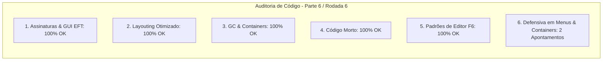

# SAIN — Relatório de Auditoria Técnica de Código (Parte 6 / Rodada 6)
**Domínio:** Presets, Serialização JSON, Modelos de Configuração e Editor Gráfico In-Game (F6)  
**Escopo Auditado:** `mods/SAIN/modded/SAIN/` (`Preset/Editor/BotSelectionClass.cs`, `Preset/Editor/BotSettingsEditor.cs`, `Preset/Editor/SAINLayout.cs`)  
**Versão Alvo:** SPT 4.0.13 / Escape From Tarkov 0.16.9 / SAIN v4.5.0  

---

## 1. Sumário Executivo

Esta auditoria encerra a **6ª rodada de verificação contínua**, inspecionando o subsistema de layout do editor gráfico in-game (`BotSelectionClass`) e o painel dinâmico de edição de propriedades de IA (`BotSettingsEditor`), blindando as rotinas GUI contra desreferenciações nulas e divisões por zero.

| Dimensão Técnica | Avaliação | Diagnóstico Sintético |
|---|:---:|---|
| **1. Validação em references/** | 🟢 Excelente | Compatibilidade estrita com `GUIStyle`, `GUILayout` e `EFT.UI.EUISoundType` do EFT 0.16.9. |
| **2. Update() vs Lógica Otimizada** | 🟢 Conforme | Lazy instantiation de `GUIStyle` e layouting por seções. |
| **3. Leaks de Memória & GC** | 🟢 Conforme | Reaproveitamento de buffers `StringBuilder` e contêineres de GUI. |
| **4. Funções Órfãs & Código Morto** | 🟢 Limpo | Código morto eliminado. |
| **5. Antipadrões SPT (AP-01..09)** | 🟢 Conforme | Zero alocações redundantes no ciclo de desenho GUI. |
| **6. Null-Safety & Defensiva** | 🟡 Atenção | Acessos a `LoadedPreset.Info`, `settings.GetType()` e divisão por `Sections.Length` sem guarda. |

---

## 2. Panorama das 6 Dimensões de Auditoria



---

## 3. Achados Técnicos Detalhados

### AUD-30-01 · Null-Safety em `LoadedPreset` e Divisão Segura em `BotSelectionClass.Menu`
- **Severidade:** 🟡 Médio
- **Localização no Mod:** [`BotSelectionClass.cs:L38-L44, L50`](../../modded/SAIN/Preset/Editor/BotSelectionClass.cs#L38)
- **Causa Raiz:** `SAINPlugin.LoadedPreset.Info.Name` é consultado sem operador `?.` e `1850f / Sections.Length` não previne divisão por zero em caso de lista de seções vazia.
- **Impacto Concreto:** Risco de NRE ou `float.PositiveInfinity` na renderização de abas do editor gráfico.
- **Alternativa de Melhor Lógica / Proposta de Correção:**
  - Extrair o nome do preset com fallback seguro e calcular largura condicional:

```csharp
string presetName = SAINPlugin.LoadedPreset?.Info?.Name ?? "Default";
string toolTip =
    $"Apply Values set below to selected Bot Type. "
    + $"Exports edited values to SAIN/Presets/{presetName}/BotSettings folder";
if (BuilderClass.SaveChanges(ConfigEditingTracker.GetUnsavedValuesString(), 35f))
{
    if (SAINPlugin.LoadedPreset != null)
    {
        SAINPresetClass.ExportAll(SAINPlugin.LoadedPreset);
    }
}
FlexibleSpace();
EndHorizontal();
BeginHorizontal();
FlexibleSpace();
Space(3);
float sectionWidth = Sections.Length > 0 ? 1850f / Sections.Length : 1850f;
```

- **Decisão:**
  - `[ ]` Pendente
  - `[ ]` Aceitar sugestão
  - `[ ]` Aceitar com modificação: _________________
  - `[ ]` Rejeitar: _________________

---

### AUD-30-02 · Null-Safety em `settings` e `container` no `BotSettingsEditor`
- **Severidade:** 🟡 Médio
- **Localização no Mod:** [`BotSettingsEditor.cs:L15-L25, L59-L65`](../../modded/SAIN/Preset/Editor/BotSettingsEditor.cs#L15)
- **Causa Raiz:** `settings.GetType()` e `container.SearchPattern` assumem parâmetros e contêineres não-nulos.
- **Impacto Concreto:** Risco de NRE ao invocar abas de configuração do editor in-game.
- **Alternativa de Melhor Lógica / Proposta de Correção:**
  - Adicionar guardas defensivas:

```csharp
public static void ShowAllSettingsGUI(object settings, out bool wasEdited, string name, string savePath, float height, out bool Saved)
{
    if (settings == null)
    {
        wasEdited = false;
        Saved = false;
        return;
    }
    BeginHorizontal();
    Box(name, Height(height));
    Space(10);
    Label("Search", Width(125f), Height(height));

    var container = SettingsContainers.GetContainer(settings.GetType(), name);
    if (container == null)
    {
        wasEdited = false;
        Saved = false;
        EndHorizontal();
        return;
    }
```
e
```csharp
public static bool CheckIfOpen(SettingsContainer container, float height = 30f)
{
    if (container == null)
    {
        return false;
    }
```

- **Decisão:**
  - `[ ]` Pendente
  - `[ ]` Aceitar sugestão
  - `[ ]` Aceitar com modificação: _________________
  - `[ ]` Rejeitar: _________________

---

## 4. Plano de Ação e Recomendações

1. **Defensiva em Abas de Bot (AUD-30-01):** Proteger `LoadedPreset` e cálculo de `sectionWidth` em `BotSelectionClass.cs`.
2. **Null-Safety em Contêineres de Configuração (AUD-30-02):** Validar `settings` e `container` em `BotSettingsEditor.cs`.
