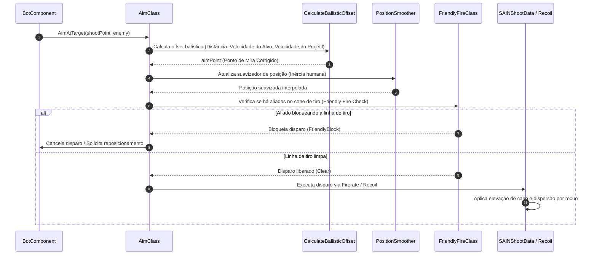

# SAIN — Sistema de Combate: Mira, Tiro e Recoil

O sistema de combate do **SAIN** reescreve a balística, a dinâmica de mira e a cadência de tiro dos bots. Em vez de utilizar o "tiro a laser" vanilla ou precisão instantânea na cabeça (*head-eyes instantâneo*), o SAIN simula a inércia humana de visada, compensação real de recuo (*recoil*), dispersão balística preditiva e controle dinâmico de rajadas e granadas táticas.

---

## 1. Pipeline de Mira e Disparo

O ciclo de mira é gerenciado pela classe [`AimClass`](../modded/SAIN/Classes/Bot/WeaponFunction/AimClass.cs) em conjunto com o controlador de visada [`AimDownSightsController`](../modded/SAIN/Classes/Bot/WeaponFunction/AimDownSightsController.cs):



---

## 2. Balística Preditiva e Suavização de Mira

Para atingir alvos em movimento com realismo, o SAIN não "cola" a mira diretamente no centro da cabeça do jogador:
1. **Compensação Balística Preditiva:**
   Utilizando a velocidade do projétil (`BulletSpeed`) da munição atual e o vetor de velocidade (`Velocity`) do alvo, a função `CalculateBallisticOffset` projeta o ponto de impacto futuro:
   $$\vec{P}_{\text{mira}} = \vec{P}_{\text{alvo}} + \vec{V}_{\text{alvo}} \times \left( \frac{\text{Distância}}{V_{\text{projétil}}} \right) + \text{CompensaçãoGravidade}$$
2. **Inércia e Suavização Humana ([`PositionSmoother`](../modded/SAIN/Classes/Bot/WeaponFunction/AimClass.cs)):**
   A mira se desloca com velocidade angular limitada. Se o jogador faz mudanças bruscas de direção (*ADAD strafe*), o bot precisa de frações de segundo para reajustar a visada.
3. **Prevenção de Fogo Amigo ([`SAINFriendlyFireClass`](../modded/SAIN/Classes/Bot/Decision/SAINFriendlyFireClass.cs)):**
   Antes de acionar o gatilho, um raio cilíndrico de segurança é traçado a partir da boca do cano (`FirePort`). Se um colega de esquadrão estiver cruzando a linha de fogo, o bot cessa o disparo imediatamente.

---

## 3. Seleção de Modo de Tiro e Controle de Cadência

A cadência de disparo é regulada pelas classes [`Firerate`](../modded/SAIN/Classes/Bot/WeaponFunction/Firerate.cs) e [`Firemode`](../modded/SAIN/Classes/Bot/WeaponFunction/Firemode.cs):

| Distância do Alvo | Modo de Tiro Selecionado | Comportamento de Rajada / Intervalo |
|---|---|---|
| **Curto Alcance (< 10m)** | Automático (*Full-Auto*) | Disparo contínuo com dispersão crescente e controle de recuo pesado. |
| **Médio Alcance (10m – 45m)** | Rajadas Curtas (*Burst*) | Rajadas controladas de 2 a 4 tiros seguidas de pausa para estabilização do recuo. |
| **Longo Alcance (> 45m)** | Semiautomático (*Single-Tap*) | Disparos individuais cadenciados, aguardando o retorno da mira ao ponto central. |
| **Snipers / DMRs** | Tiro Único com Visada Total | O bot aguarda o alinhamento da luneta com *Hold Breath* antes de disparar. |

---

## 4. Sistema Dinâmico de Recoil e Dispersão

O recuo é simulado em [`Recoil.cs`](../modded/SAIN/Classes/Bot/WeaponFunction/Recoil.cs) e reage às estatísticas reais da arma empunhada:
- **Recuo Vertical e Horizontal:** Armas com alto recuo (ex.: SA-58 stock, espingardas cal. 12) sobem violentamente após os primeiros tiros, forçando os bots a errar disparos subsequentes caso insistam em rajadas longas.
- **Fadiga e Vigor do Bot:** Bots sem vigor (*stamina* esgotada) ou com braços fraturados sofrem tremores severos de mira (*weapon sway*).
- **Postura Corporal:** Estar agachado ou deitado (*prone*) reduz drasticamente o recuo e a dispersão dos tiros dos bots.

---

## 5. Fogo de Supressão e Fogo Cego (*Blindfire*)

O SAIN implementa mecânicas realistas de supressão através de [`SAINBotSuppressClass`](../modded/SAIN/Classes/Bot/WeaponFunction/SAINBotSuppressClass.cs):

```mermaid
graph TD
    EnemyHiding["Inimigo Escondeu-se Atrás de Cobertura Conhecida"] --> CheckSuppress{Bot tem munição suficiente (> 50%)?}
    CheckSuppress -- Sim --> SuppressFire["SAINBotSuppressClass : Disparo Supressivo"]
    SuppressFire --> ShootEdge["Dispara nas bordas e cantos da cobertura do alvo"]
    ShootEdge --> Effect["Mantém o jogador sob efeito de choque acústico e tremor"]
    CheckSuppress -- Não --> HoldCover["Economiza munição e aguarda exposição do alvo"]
```

- **Fogo Supressivo:** Quando o jogador se esconde atrás de uma parede fina ou caixa de madeira, os bots continuam disparando contra a borda da cobertura por 1 a 3 segundos para mantê-lo acuado enquanto aliados flanqueiam.
- **Fogo Cego (*Blindfire*):** Em coberturas baixas ou esquinas apertadas, bots podem esticar a arma por cima ou pela lateral da proteção sem expor a cabeça.

---

## 6. Lançamento e Evasão Tática de Granadas

O subsistema de granadas é dividido em:
- **Lançador de Granadas ([`BotGrenadeManager`](../modded/SAIN/Classes/Bot/WeaponFunction/Grenades/BotGrenadeManager.cs)):**
  - Calcula arcos balísticos reais para arremesso de granadas de fragmentação e fumaça.
  - Verifica linha de desobstrução no ar (evita rebater granadas em tetos baixos ou janelas bloqueadas).
  - Lança granadas para desalojar inimigos acampados (*campers*) em cantos sem linha direta de tiro.
- **Reação a Granadas Inimigas ([`GrenadeReactionClass`](../modded/SAIN/Classes/Bot/WeaponFunction/Grenades/GrenadeReactionClass.cs)):**
  - Ao escutar o som do pino (`GrenadePin`) ou avistar uma granada em voo, a camada [`SAINAvoidThreatLayer`](../modded/SAIN/Layers/SAINAvoidThreatLayer.cs) (Prioridade 80) assume o controle imediato.
  - O bot abandona qualquer ação de combate e corre na direção oposta ao vetor de queda do explosivo.
