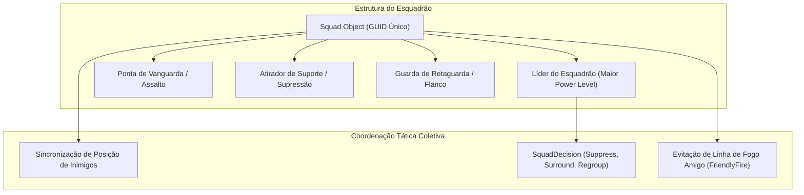
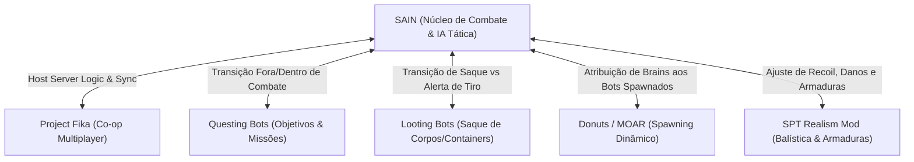

# SAIN — Táticas de Esquadrão, Comunicação e Interoperabilidade

O **SAIN** transforma grupos de bots em **esquadrões táticos coordenados**. Em vez de agirem como indivíduos isolados que entram em combate desordenadamente, os membros de um grupo compartilham informações sobre alvos em tempo real, cobrem setores de tiro, realizam manobras de avanço e recuo mútuo (*bounding overwatch*) e comunicam-se realisticamente por rádio e linhas de voz.

---

## 1. Topologia e Liderança de Esquadrão

O gerenciamento de grupos é centralizado em [`BotSquads`](../modded/SAIN/Classes/BotManager/BotSquads.cs) e instanciado em objetos [`Squad`](../modded/SAIN/Classes/BotManager/Squad.cs):

### Atribuição de Liderança e Papéis:
- **Líder do Esquadrão:** Selecionado automaticamente com base no maior `Power Level` (equipamento de melhor qualidade e nível mais alto). O líder define as decisões globais (`SquadDecision`), rotas de extração e transições de busca.
- **Ponta / Assalto (*Point Man*):** Bots com personalidades agressivas (*GigaChad/Chad*) assumem a linha de frente para abrir portas e invadir salas.
- **Suporte / Supressão:** Bots armados com metralhadoras leves (LMGs) ou fuzis de assalto fornecem fogo contínuo para permitir o avanço dos colegas.

---

## 2. Comunicação e Linhas de Voz (`SAINBotTalkClass`)

A comunicação vocal é governada por [`SAINBotTalkClass`](../modded/SAIN/Classes/Bot/Talk/SAINBotTalkClass.cs) e [`GroupTalk`](../modded/SAIN/Classes/Bot/Talk/GroupTalk.cs):

| Evento de Áudio | Gatilho Tático | Efeito no Jogo |
|---|---|---|
| **Contato Visual (*Contact!*)** | Um bot do grupo avista um inimigo pela primeira vez. | Emite comando de voz informando direção e alerta todos os colegas no raio de rádio. |
| **Sob Fogo (*Under Fire / Need Help!*)** | Bot sofre dano ou projéteis passam raspando. | Aciona a decisão de esquadrão `ESquadDecision.Help`, atraindo suporte imediato. |
| **Provocação (*Taunt*)** | Bots agressivos (*Chads*) em combate ativo. | Intimida o jogador humano, revelando a personalidade do bot. |
| **Silêncio de Emboscada** | Bots furtivos (*Rats*) ou esquadrões preparando cerco. | Suprime 100% das linhas de voz para evitar denunciar sua posição. |
| **Falso Grito de Morte (*Fake Death*)** | Rara chance de bot fingir gemido de morte antes de emboscar. | Tenta induzir o jogador a baixar a guarda e avançar desprevenido. |

---

## 3. Matriz de Interoperabilidade e Compatibilidade de Mods

O SAIN atua como o núcleo de combate da comunidade e integra-se harmoniosamente com os principais mods do ecossistema SPT via [`ModDetection`](../modded/SAIN/Plugin/ModDetection.cs):

### Detalhes das Integrações Canônicas:

1. **Project Fika ([`FikaInterop`](../modded/SAIN/Plugin/ModDetection.cs)):**
   - No modo cooperativo dedicado, a verificação `FikaBackendUtils.IsServer` garante que o servidor/host compute toda a IA do SAIN, enquanto clientes (`IsClient`) apenas sincronizam as animações e disparos, eliminando conflitos de rede.
2. **Questing Bots:**
   - O Questing Bots conduz os PMCs pelas missões enquanto estão fora de combate. Ao avistar um inimigo ou sofrer disparos, as camadas do SAIN (`CombatSoloLayer` / `CombatSquadLayer`, prioridades 69–70) assumem o controle absoluto do bot até o término do engajamento.
3. **Looting Bots:**
   - Bots interrompem imediatamente qualquer animação de saque ao detectar passos próximos ou disparos, alternando instantaneamente para a postura de combate do SAIN.
4. **SPT Realism Mod:**
   - O SAIN detecta a presença do Realism Mod e desativa seus próprios cálculos redundantes de dispersão de blindagem para honrar as mecânicas balísticas e posturas do Realism.
