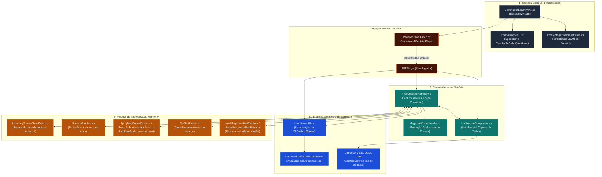
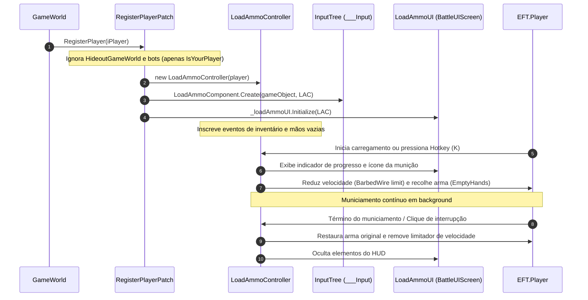

# SPT-ContinuousLoadAmmo — Visão Geral e Arquitetura

O **SPT-ContinuousLoadAmmo** é um mod client-side para o **Single Player Tarkov (SPT 4.0 / EFT 0.16.9)** projetado para transformar e aprimorar a ergonomia do gerenciamento de munições e carregadores durante as incursões (*in-raid*).

No jogo base, a ação de municiar ou desmuniciar carregadores requer a permanência estrita na tela de inventário, travando a movimentação e a consciência situacional do operador. O ContinuousLoadAmmo desacopla o processo de recarga contínua da interface estática, permitindo que o jogador:
1. Feche o inventário e continue se deslocando enquanto as balas são inseridas ou removidas uma a uma.
2. Inicie o municiamento rápido (*Quick Load*) diretamente em combate via tecla de atalho configurável.
3. Aplique *Magazine Presets* complexos (distribuições customizadas de munições no topo, ciclo e fundo do pente) diretamente durante a raid.

---

## 1. Identificação e Metadados do Plugin

As definições centrais do mod e declaração de dependências estão localizadas em [ContinuousLoadAmmo.cs](../modded/ContinuousLoadAmmo.cs):

| Propriedade | Valor | Descrição |
| :--- | :--- | :--- |
| **Plugin GUID** | `com.ozen.continuousloadammo` | Identificador canônico no ecossistema BepInEx |
| **Plugin Name** | `Continuous Load Ammo` | Nome de exibição do mod |
| **Versão** | `1.1.7` | Versão SemVer mantida em [ContinuousLoadAmmo.csproj](../modded/ContinuousLoadAmmo.csproj) |
| **Dependência Suave (Soft)** | `com.tyfon.uifixes` / `Tyfon.UIFixes` | Interoperabilidade com o sistema de seleção múltipla do UIFixes |
| **Alvo Runtime** | `.NET Standard 2.1` / Unity 2019.4 | Compilado para execução no cliente SPT/EFT |

---

## 2. Mapa Geral de Arquitetura e Subsistemas

O mod é estruturado em quatro camadas fundamentais: **Core/Lifecycle**, **Controladores de Negócio**, **Apresentação/UI no HUD** e **Interceptação/Patches Harmony**.

---

## 3. Fluxo de Vida em Raid (Lifecycle Sequence)

O ciclo de vida do mod é ativado exclusivamente quando o jogador humano entra em uma sessão de jogo válida:

---

## 4. Estrutura Modular de Documentação

A documentação técnica detalhada do mod foi particionada nos seguintes tópicos temáticos:

| Documento | Foco Temático | Principais Componentes Abordados |
| :--- | :--- | :--- |
| [01. Visão Geral e Arquitetura](./01-visao-geral-e-arquitetura.md) | Arquitetura geral, ciclo de vida e mapa estrutural | [ContinuousLoadAmmo.cs](../modded/ContinuousLoadAmmo.cs), [RegisterPlayerPatch.cs](../modded/Patches/RegisterPlayerPatch.cs) |
| [02. Ciclo de Recarga e Controle de Jogador](./02-ciclo-de-recarga-e-controle-de-jogador.md) | FSM do operador, mãos vazias, debuff de velocidade, corrotinas | [LoadAmmoController.cs](../modded/Controllers/LoadAmmoController.cs), [ScreensPatches.cs](../modded/Patches/ScreensPatches.cs) |
| [03. Sistema de Quick Load e Seleção de Munição](./03-sistema-de-quick-load-e-selecao-de-municao.md) | Interceptação de input, carrossel no HUD e algoritmos de seleção | [LoadAmmoComponent.cs](../modded/Components/LoadAmmoComponent.cs), [LoadAmmoUI.cs](../modded/Controllers/LoadAmmoUI.cs) |
| [04. Sistema de Presets de Carregador em Raid](./04-sistema-de-presets-de-carregador-em-raid.md) | Parsing de presets (Bottom/Loop/Top), retomada e persistência | [MagazinePresetLoader.cs](../modded/Controllers/MagazinePresetLoader.cs), [ProfileMagazinePresetStore.cs](../modded/Utils/ProfileMagazinePresetStore.cs) |
| [05. Patches Harmony e Interoperabilidade](./05-patches-harmony-e-interoperabilidade.md) | Interceptadores Harmony, integração com UIFixes e LoadAmmoAnim | [InventoryScreenClosePatch.cs](../modded/Patches/InventoryScreenClosePatch.cs), [MultiSelectInterop.cs](../modded/Utils/MultiSelectInterop.cs) |

---

## 5. Configurações Globais (F12 BepInEx)

O mod expõe seus parâmetros configuráveis no menu F12 via `BepInEx.Configuration`, mapeados em [PROPRIEDADES.md](../PROPRIEDADES.md):

| Seção | Propriedade | Tipo | Padrão | Descrição Funcional |
| :--- | :--- | :---: | :---: | :--- |
| **General** | `Speed Limit` | `float` | `0.45` (45%) | Percentual da velocidade máxima de caminhada aplicada enquanto carrega munição. |
| **General** | `Reachable Places Only` | `bool` | `true` | Restringe munições e carregadores aos bolsos, colete tático e contêiner seguro (ignora mochila para recarga rápida). |
| **General** | `Inventory Tabs` | `bool` | `true` | Impede que a troca de abas no inventário (mapa, quests, habilidades) aborte o municiamento em andamento. |
| **General** | `Mag Preset Fallback` | `bool` | `true` | Recorre à melhor munição avulsa se faltar algum cartucho específico do preset de carregador. |
| **Quick Load** | `Hotkey` | `KeyboardShortcut` | `K` | Tecla de atalho de combate para acionar o municiamento rápido fora da tela de inventário. |
| **Quick Load** | `Mode` | `QuickLoadMode` | `LastMagazinePreset` | Critério de seleção automática de munição (`HighestPenetration`, `LastBulletMagazine`, `LastMagazinePreset`). |
| **Quick Load** | `Notify` | `bool` | `true` | Notifica no canto superior direito qual munição e quantidade estão sendo carregadas. |
