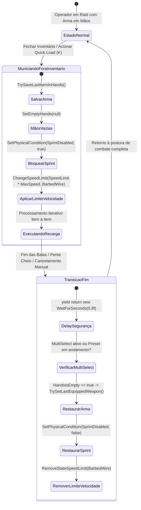
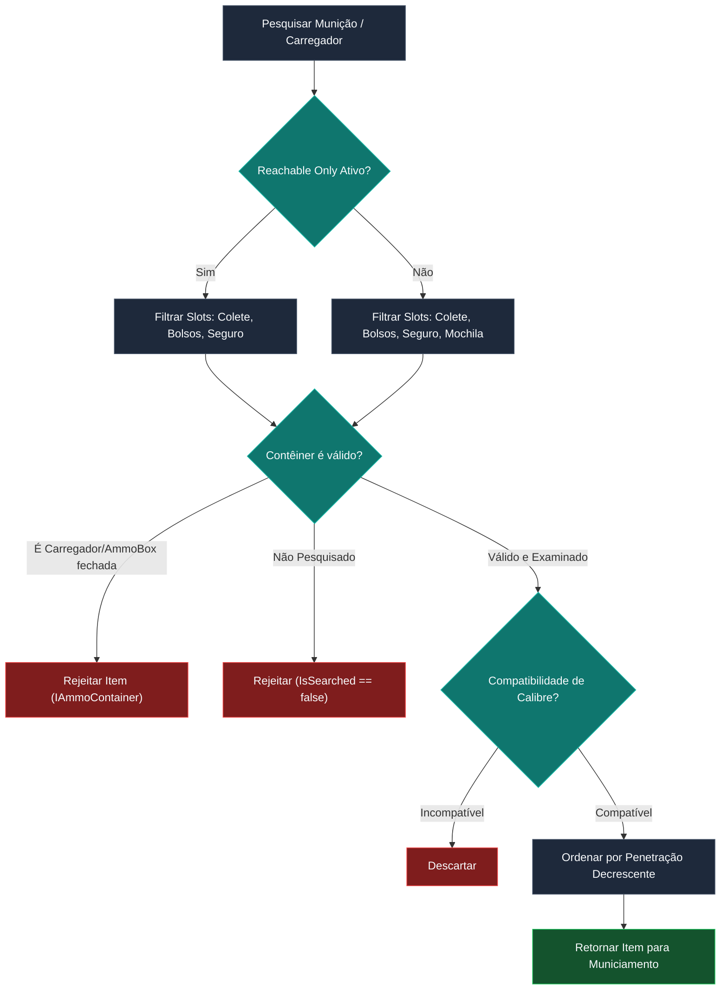

# SPT-ContinuousLoadAmmo — Ciclo de Recarga e Controle do Jogador

O gerenciamento de estado do operador durante o municiamento ou desmuniciamento contínuo é coordenado pelo [LoadAmmoController.cs](../modded/Controllers/LoadAmmoController.cs). Esta camada é responsável por sincronizar a física de movimentação do operador no motor do Escape from Tarkov, a pose das mãos do personagem (*Hands Controller*), as restrições de inventário acessível e o encerramento suave das transições através de corrotinas na Unity Main Thread.

---

## 1. Máquina de Estados do Operador Durante o Municiamento

Quando o jogador fecha a tela de inventário com um processo de municiamento ativo, ou quando inicia um *Quick Load* em campo, o controlador transiciona o personagem para um estado restrito de movimentação e manipulação de armas:



---

## 2. Restrições Físicas e Modificadores de Movimento

Para manter o balanceamento tático e o realismo do Tarkov, o operador não pode correr (*sprint*) nem se mover com velocidade total enquanto insere munições manualmente:

### A. Bloqueio de Corrida
O bloqueio é acionado diretamente no `MovementContext` nativo do EFT:
```csharp
_player.MovementContext.SetPhysicalCondition(EPhysicalCondition.SprintDisabled, startAnim);
```
Isso desativa a transição de corrida sem interferir na estamina base de pulo ou agachamento.

### B. Modificador de Limite de Velocidade
A velocidade máxima permitida durante o municiamento é calculada dinamicamente:
```csharp
_player.MovementContext.ChangeSpeedLimit(
    ContinuousLoadAmmo.SpeedLimit.Value * _player.MovementContext.MaxSpeed,
    ESpeedLimit.BarbedWire
);
```
> [!NOTE]
> O mod utiliza o slot interno `ESpeedLimit.BarbedWire` da engine do EFT para aplicar o limite de velocidade. Ao finalizar ou cancelar a recarga, o limite é limpo com `_player.MovementContext.RemoveStateSpeedLimit(ESpeedLimit.BarbedWire)`. Caso o jogador toque em arame farpado real durante o processo, o valor pode ser sobrescrito pelo ambiente até a saída do contato.

---

## 3. Gerenciamento de Mãos e Transições de Corrotina

O ciclo de troca de itens nas mãos do operador requer sincronia estrita com a Unity Main Thread para prevenir congelamentos de animação ou dessincronização de armas:

### A. Fluxo de Recolhimento e Mãos Vazias
1. O controlador executa `_player.TrySaveLastItemInHands()`, armazenando a referência da arma atualmente equipada (fuzil, pistola ou faca).
2. Invoca `_player.SetEmptyHands(null)`, guardando a arma no coldre/bandoleira.
3. Se o jogador trocar voluntariamente de arma durante o processo (por exemplo, selecionando uma granada ou trocando para arma secundária com teclado numérico), o método `StopLoadingOnHandsChange` intercepta o evento:

```csharp
private void StopLoadingOnHandsChange(AbstractHandsController oldHands, AbstractHandsController newHands)
{
    if (!IsActive) return;

    // Não interrompe se as mãos transicionaram para EmptyHands ou para o controlador do LoadAmmoAnim
    if (newHands is not (null or EmptyHandsController) && newHands.GetType().Name != "LoadAmmoBundleController")
    {
        StopLoading();
    }
}
```

### B. Restauração Assíncrona com Delay Defensivo (0.8s)
Ao encerrar o municiamento, é disparada a corrotina `SetPlayerStateRoutine(false)`:
- Aplica uma espera controlada `yield return new WaitForSeconds(0.8f)` para permitir a conclusão da animação de empacotamento da munição antes de sacar a arma.
- Confere se o subsistema de **MultiSelect** (`MultiSelectInterop.MultiSelectLoadSerializerIsActive`) ou o **PresetLoader** (`_magazinePresetLoader.PresetLoaderIsActive`) ainda possuem itens em fila. Se houver processos subsequentes, a recuperação da arma é postergada até o último cartucho da fila inteira ser processado.
- Se as mãos permanecerem livres (`_player.HandsIsEmpty`), chama `_player.TrySetLastEquippedWeapon()`, rearmando o operador instantaneamente.

---

## 4. Política de Locais Acessíveis (*Reachable Places*)

O sistema avalia dinamicamente se o carregador e as caixas de munição estão em posições do corpo que permitam manipulação tática rápida sem abrir a mochila:

| Modo de Acesso | Slots Válidos do Operador | Varredura de Contêineres Aninhados |
| :--- | :--- | :---: |
| **Reachable Places Only = true** | • `TacticalVest` (Colete Tático)<br>• `Pockets` (Bolsos)<br>• `ArmBand` (Braçadeira)<br>• `SecuredContainer` (Contêiner Seguro) | ❌ Apenas itens no topo (sem descer em mochilas) |
| **Reachable Places Only = false** | • `TacticalVest`<br>• `Pockets`<br>• `ArmBand`<br>• `SecuredContainer`<br>• `Backpack` (Mochila Completa) | ✔️ Varredura recursiva completa |

### Algoritmo de Validação de Contêineres (`ContainerPredicate`)
Para evitar comportamentos anômalos ou travas de inventário, a busca ignora:
1. Munições que estejam presas dentro de outros carregadores ou caixas de munição fechadas (`container is not IAmmoContainer`).
2. Bolsos ou bolsas que ainda não tenham sido examinados ou pesquisados pelo operador (`PlayerInventoryController.SearchController.IsSearched(searchable)`).



---

## 5. Proteção de Transição de Abas do Inventário

No cliente base do Tarkov, trocar da aba de equipamentos (*Gear*) para o mapa (*Map*), tarefas (*Tasks*) ou resumo de habilidades (*Skills*) dispara automaticamente o método `PlayerInventoryController.StopProcesses()`, cancelando qualquer ação de carga.

O módulo [ScreensPatches.cs](../modded/Patches/ScreensPatches.cs) implementa uma flag global de bypass (`_toSkip`):

```csharp
[PatchPrefix]
public static bool Prefix()
{
    if (_toSkip)
    {
        return false; // Ignora a interrupção ao alternar entre telas da UI
    }
    return true;
}
```

Telas protegidas contra interrupção indevida:
1. `TasksScreen.Show` (Aba de Quests e Objetivos).
2. `ItemsPanel.Show` (Painel Geral de Itens).
3. `MapScreen.Show` (Aba de Mapas e Rotas).
4. `InventoryPlayerModelWithStatsWindow.Show` (Janela de Estatísticas e Modelo 3D).
5. `SkillsAndMasteringScreen.Show` (Aba de Perícias e Domínio de Armas).
