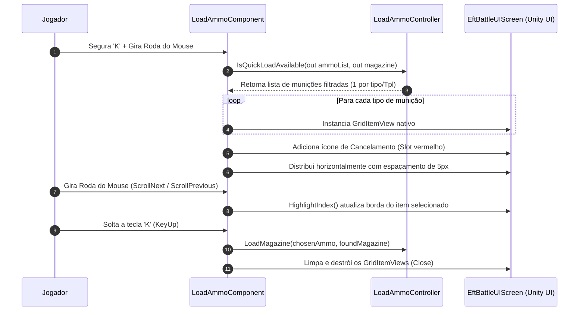
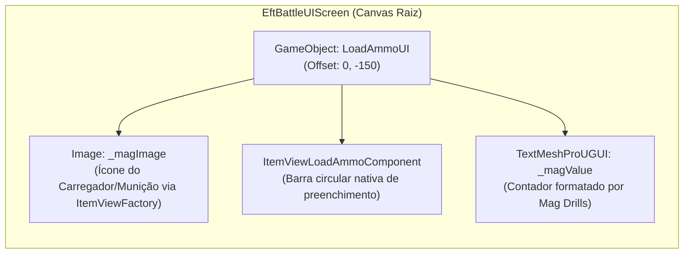

# SPT-ContinuousLoadAmmo — Sistema de Quick Load e Seleção de Munição

O sistema de **Quick Load** é o mecanismo de interação em tempo real do mod, permitindo que o operador insira munições em carregadores sem abrir o inventário e escolha visualmente qual tipo de projétil utilizar diretamente na tela de combate do EFT.

A implementação combina o [LoadAmmoComponent.cs](../modded/Components/LoadAmmoComponent.cs) (que herda de `InputNode` para interceptar a árvore de inputs do Tarkov) e o [LoadAmmoUI.cs](../modded/Controllers/LoadAmmoUI.cs) (que renderiza elementos dinâmicos do HUD em combate).

---

## 1. Interceptação de Entrada na Árvore de Input (`InputTree`)

O Escape from Tarkov utiliza uma árvore hierárquica de nós de entrada (`InputTree` localizado no GameObject raiz `___Input`). O `LoadAmmoComponent` é registrado diretamente nessa árvore para capturar comandos mesmo com o inventário fechado:

```mermaid
flowchart TD
    Update["Update() / InputTree"] --> CheckHotkey{"Tecla QuickLoad (K)?"}
    
    CheckHotkey -->|Pressionar K + Scroll Roda Mouse| Selector["Abrir Seletor Radial/Carrossel (OpenAmmoSelectorAsync)"]
    CheckHotkey -->|Soltar K (KeyUp) sem Carrossel| DirectAction["Executar Modo Configurado (QuickLoadMode)"]
    CheckHotkey -->|Clique Esquerdo / Direito durante Recarga| Cancel["Interromper Recarga (StopLoading)"]

    Selector --> Scroll{"ScrollNext / ScrollPrevious"}
    Scroll --> Highlight["Mudar Índice e Destacar GridItemView"]
    Highlight --> ReleaseK{"Soltar Tecla K?"}
    ReleaseK --> SetAmmo["Confirmar Munição Selecionada e Iniciar Carga"]

    DirectAction --> Mode{"Qual Modo Ativo?"}
    Mode -->|HighestPenetration| HighPen["Buscar Maior Penetração"]
    Mode -->|LastBulletMagazine| MatchMag["Parear com Última Bala do Pente"]
    Mode -->|LastMagazinePreset| ExecPreset["Executar Preset do Calibre Atual"]

    classDef proc fill:#1e293b,stroke:#475569,color:#f8fafc;
    classDef decision fill:#0f766e,stroke:#14b8a6,color:#f8fafc;
    classDef action fill:#0284c7,stroke:#38bdf8,color:#f8fafc;

    class Update,Highlight,SetAmmo proc;
    class CheckHotkey,Scroll,ReleaseK,Mode decision;
    class Selector,DirectAction,Cancel,HighPen,MatchMag,ExecPreset action;
```

---

## 2. Modos de Carregamento Rápido (`QuickLoadMode`)

Definido no enum [QuickLoadMode.cs](../modded/Models/QuickLoadMode.cs), o comportamento ao pressionar a tecla de atalho é dividido em 3 estratégias:

| Modo (`QuickLoadMode`) | Critério de Escolha de Munição | Comportamento de Fallback |
| :--- | :--- | :--- |
| **`HighestPenetration`** | Varre todos os locais acessíveis e seleciona a munição com o maior atributo `PenetrationPower`. Em caso de empate, escolhe a pilha com menor quantidade para liberar espaço. | Retorna erro na tela se não houver munição do calibre. |
| **`LastBulletMagazine`** | Inspeciona o carregador da arma em mãos (`FirstRealAmmo()`) e busca munição idêntica nos bolsos/colete para continuar enchendo com o mesmo tipo de bala. | Se o pente estiver vazio ou a munição correspondente esgotar, carrega a primeira munição acessível disponível. |
| **`LastMagazinePreset`** | Consulta o banco de presets do perfil (`ProfileMagazinePresetStore`) para o calibre da arma empunhada e replica o padrão (ex.: topo AP, base tracer). | Se nenhum preset tiver sido usado para aquela arma/calibre, recorre automaticamente ao modo `HighestPenetration`. |

---

## 3. Carrossel Visual de Munições em Combate

Ao segurar a tecla de atalho (`K`) e girar a roda do mouse (*Mouse Scroll*), o mod abre um carrossel horizontal de seleção renderizado na tela de combate:



### Detalhes de Implementação do Carrossel:
1. **Filtro de Duplicatas:** O conjunto `_seenAmmoTplScratch` descarta itens com `TemplateId` repetido, exibindo apenas uma opção por variante de munição (ex.: 1 ícone para M855A1, 1 para M995, 1 para SOST).
2. **Slot de Cancelamento:** Um elemento visual especial é gerado ao final da lista (`AddCancelView`) com transparência total (`alpha = 0`) e listras vermelhas de seleção ativa (`ChangeSelectedStatus(true)`), permitindo cancelar o municiamento sem soltar a tecla em falso.
3. **Alinhamento Central:** A função `SetLayout()` calcula a largura total (`totalWidth = ((count - 1) * itemWidth)`) e centraliza perfeitamente a barra em `Vector2(0, -150f)` no espaço da tela.

---

## 4. Indicador de Progresso e HUD Dinâmico (`LoadAmmoUI`)

O [LoadAmmoUI.cs](../modded/Controllers/LoadAmmoUI.cs) clona componentes visuais internos do EFT para exibir o progresso de recarga em combate:



### Recursos do HUD em Combate:
- **Ícone Nativo do Item:** Carregado assincronamente através de `ItemViewFactory.LoadItemIcon(item)`, exibindo a imagem real do carregador ou caixa de munição manipulada.
- **Barra de Progresso:** Utiliza o template nativo `ItemViewLoadAmmoComponent`, sincronizado com a duração de carregamento por bala (`oneAmmoDuration`, `ammoTotal`, `ammoDone`).
- **Contador Formatado por Perícia (*Mag Drills*):** O texto de contagem respeita o nível da habilidade de domínio de carregadores do operador (`_player.Profile.MagDrillsMastering` e `CheckedMagazineSkillLevel`). Se o jogador tiver perícia baixa, o HUD exibe aproximações táticas como `~15/30` ou `Cheio/Vazio`, idêntico à inspeção nativa de carregador.
- **Sincronização em Tempo Real:** Escuta os eventos `PlayerInventoryController.OnAmmoLoaded` e `OnAmmoUnloaded`, atualizando a contagem a cada cartucho inserido ou ejetado.
