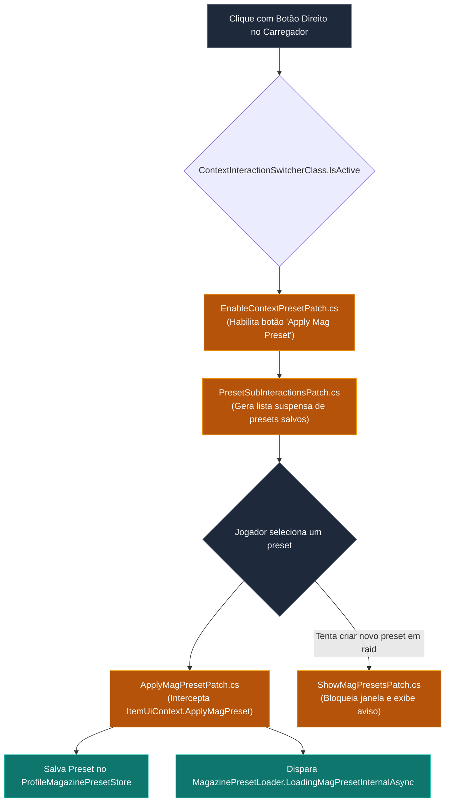
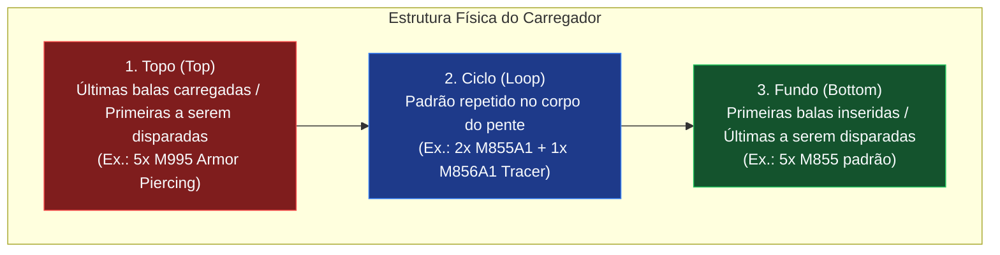
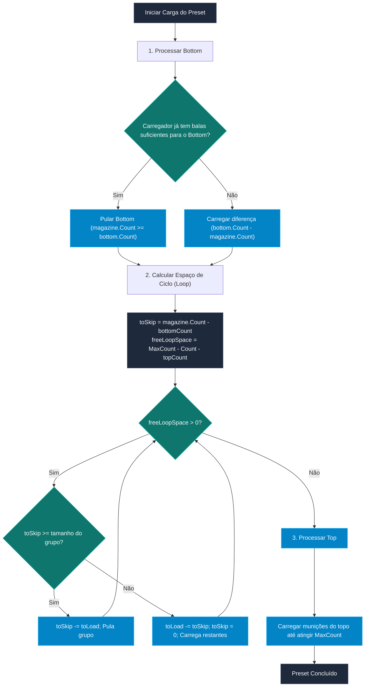

# SPT-ContinuousLoadAmmo — Sistema de Presets de Carregador em Raid

Os **Presets de Carregadores** (*Magazine Presets / Magazine Builds*) são modelos pré-definidos de distribuição de munição (ex.: topo com cartuchos perfurantes, centro alternando munições comuns com traçantes, e fundo com munição econômica).

Originalmente no Escape from Tarkov, a aplicação de presets só é permitida fora de raid ou no esconderijo (*Hideout*). O **SPT-ContinuousLoadAmmo** desbloqueia a aplicação direta de presets durante incursões, com suporte à retomada inteligente de carregadores parcialmente cheios e persistência do último preset utilizado por calibre e perfil de jogador.

---

## 1. Habilitação do Menu de Contexto em Raid

A ativação dos presets in-raid é viabilizada por três patches cirúrgicos:



> [!NOTE]
> A criação ou edição de novos presets in-raid é intencionalmente bloqueada por [ShowMagPresetsPatch.cs](../modded/Patches/ShowMagPresetsPatch.cs), pois o editor nativo de presets do EFT pode causar travamento de contexto se acionado durante o loop de combate. O jogador deve carregar presets já criados previamente no menu principal.

---

## 2. Estrutura Canônica de um Preset (`MagazineBuildPresetClass`)

Um preset no Tarkov é composto por três partições funcionais:



---

## 3. Algoritmo de Municiamento Parcial e Retomada (`toSkip`)

O motor [MagazinePresetLoader.cs](../modded/Controllers/MagazinePresetLoader.cs) implementa um algoritmo avançado capaz de preencher carregadores que já contêm munição, calculando o ponto exato da fila de montagem para não duplicar etapas:



### Tratamento de Falta de Munição (*Fallback*):
Se uma munição específica requerida pelo preset não for encontrada no colete/bolsos:
1. Uma notificação de alerta é disparada na tela (`Missing: <NomeDaMunição>, Count: N`).
2. Se `ContinuousLoadAmmo.MagPresetFallback.Value` estiver ativado (`true`), o carregador não é abortado vazio: o sistema seleciona automaticamente a melhor munição alternativa disponível (`GetValidAmmo`) para completar a carga.

---

## 4. Persistência de Presets por Perfil (`ProfileMagazinePresetStore`)

A seleção do último preset de carregador utilizado por calibre é serializada em disco no arquivo [lastMagPresets.json](../modded/Utils/ProfileMagazinePresetStore.cs):

### A. Estrutura de Armazenamento
O arquivo é gravado na pasta do plugin `BepInEx/plugins/ozen-ContinuousLoadAmmo/lastMagPresets.json` e possui a seguinte árvore JSON:

```json
{
  "profile_id_pmc_player_01": {
    "556x45NATO": "preset_uuid_m4a1_heavy_penetration",
    "545x39": "preset_uuid_ak74m_mixed_cqb",
    "762x51": "preset_uuid_fal_tracer_top",
    "9x19Para": "preset_uuid_vector_rip"
  },
  "profile_id_pmc_player_02": {
    "556x45NATO": "preset_uuid_m4a1_standard"
  }
}
```

### B. Mapeamento de Tipos de Armazenamento:
```csharp
// Mapeamento: ProfileId -> Caliber -> Preset ID
public class ProfileLastMagPresets : Dictionary<string, CaliberLastPreset>;
public class CaliberLastPreset : Dictionary<string, MongoID>;
```

### C. Ciclo de Vida da Persistência:
- **Inicialização (`Awake`):** O método `ProfileMagazinePresetStore.LoadProfileLastPresets()` carrega o JSON para a memória no boot do BepInEx.
- **Atualização (`UpdateMagPreset`):** Disparado sempre que o jogador seleciona um preset pelo menu de contexto ou pela tecla de atalho.
- **Isolamento de Perfil:** Garante que diferentes perfis (ex.: PMC Normal vs Perfil Zero to Hero) mantenham suas preferências de calibres e armas isoladas.
