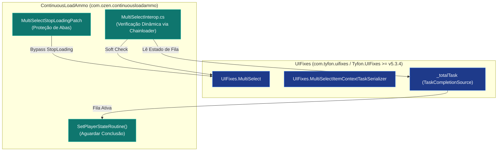

# SPT-ContinuousLoadAmmo — Patches Harmony e Interoperabilidade

Este documento detalha o conjunto completo de patches aplicados via **Harmony / SPT Reflection** pelo ContinuousLoadAmmo, bem como a arquitetura de interoperabilidade dinâmica (*Soft Dependencies* e *Reflection Delegates*) com outros mods da comunidade, como o **UIFixes** e o **LoadAmmoAnim**.

---

## 1. Tabela Completa de Patches Harmony

| Patch | Classe / Método Alvo | Tipo | Finalidade Técnica |
| :--- | :--- | :---: | :--- |
| [RegisterPlayerPatch.cs](../modded/Patches/RegisterPlayerPatch.cs) | `GameWorld.RegisterPlayer` | `Postfix` | Identifica o surgimento do jogador local (`IsYourPlayer`), instancia o [LoadAmmoController](../modded/Controllers/LoadAmmoController.cs), registra o nó de entrada [LoadAmmoComponent](../modded/Components/LoadAmmoComponent.cs) e inicializa a interface [LoadAmmoUI](../modded/Controllers/LoadAmmoUI.cs). Ignora o `HideoutGameWorld` e bots. |
| [InventoryScreenClosePatch.cs](../modded/Patches/InventoryScreenClosePatch.cs) | `InventoryScreen.Close` | `Prefix` | Desativa o cancelamento forçado de tarefas ao fechar a interface (`SetNextProcessLocked(false)` e supressão de `StopProcesses`), permitindo a continuidade da recarga no ambiente de jogo. |
| [LoadMagazineStartPatch.cs](../modded/Patches/LoadMagazineStartPatch.cs) | `PlayerInventoryController.Class1204.Start` | `Postfix` (Async) | Aguarda a conclusão assíncrona da inserção de munição e dispara o evento global `OnLoadingEnd`. |
| [UnloadMagazineStartPatch.cs](../modded/Patches/UnloadMagazineStartPatch.cs) | `PlayerInventoryController.Class1207.Start` | `Postfix` (Async) | Aguarda a conclusão assíncrona do desmuniciamento e dispara o evento global `OnLoadingEnd`. |
| [ApplyMagPresetPatch.cs](../modded/Patches/ApplyMagPresetPatch.cs) | `ItemUiContext.ApplyMagPreset` | `Prefix` | Intercepta a aplicação de presets de carregadores in-raid, armazena no histórico do perfil e delega a execução para o [MagazinePresetLoader](../modded/Controllers/MagazinePresetLoader.cs). |
| [EnableContextPresetPatch.cs](../modded/Patches/EnableContextPresetPatch.cs) | `ContextInteractionSwitcherClass.IsActive` | `Prefix` | Habilita o botão `ApplyMagPreset` no menu de clique direito de carregadores durante a raid. |
| [PresetSubInteractionsPatch.cs](../modded/Patches/PresetSubInteractionsPatch.cs) | `GClass3757.CreateSubInteractions` | `Prefix` | Popula o submenu de contexto com os presets salvos no `MagBuildsStorage` da sessão do jogador. |
| [ShowMagPresetsPatch.cs](../modded/Patches/ShowMagPresetsPatch.cs) | `ItemUiContext.ShowMagPresetsWindow` | `Prefix` | Suprime a abertura da janela de edição de presets in-raid, emitindo uma notificação preventiva e evitando congelamentos de UI. |
| [OnClickPatch.cs](../modded/Patches/OnClickPatch.cs) | `ItemView.OnClick` | `Prefix` | Intercepta cliques de cancelamento manual no carregador em municiamento (sem modificadores Shift/Ctrl) e interrompe o loader de presets. |
| [ScreensPatches.cs](../modded/Patches/ScreensPatches.cs) | `TasksScreen.Show`, `ItemsPanel.Show`, `MapScreen.Show`, `PlayerModel.Show`, `Skills.Show` | `Prefix` / `Postfix` | Define a flag `_toSkip = true` durante a troca de abas da UI do inventário para suprimir chamadas indesejadas de interrupção. |
| [ScreensPatches.StopProcessesPatch](../modded/Patches/ScreensPatches.cs) | `PlayerInventoryController.StopProcesses` | `Prefix` | Bloqueia a interrupção de processos caso `_toSkip` esteja ativo (troca de abas). |
| [ScreensPatches.MultiSelectStopLoadingPatch](../modded/Patches/ScreensPatches.cs) | `UIFixes.MultiSelect.StopLoading` | `Prefix` | Bloqueia a parada de recarga do mod UIFixes durante a transição de telas do inventário. |

---

## 2. Interoperabilidade com UIFixes (`MultiSelectInterop`)

O mod possui integração nativa com o **UIFixes** (desenvolvido por *Tyfon*), que permite o municiamento/desmuniciamento de múltiplos carregadores em lote (*Multi-Select*).



### Mecanismo de Carregamento Suave (*Soft Dependency*):
1. **Inspeção sem Dependência Rígida:** O mod não referencia a DLL do UIFixes em tempo de compilação. Em runtime, consulta `Chainloader.PluginInfos` para localizar `com.tyfon.uifixes` ou `Tyfon.UIFixes` (versão mínima exigida: `5.3.4`).
2. **Resolução de Delegados via Reflection:**
   ```csharp
   var multiSelectType = Type.GetType("UIFixes.MultiSelect, Tyfon.UIFixes");
   var taskSerializerType = Type.GetType("UIFixes.MultiSelectItemContextTaskSerializer, Tyfon.UIFixes");
   _loadUnloadSerializerGetter = AccessTools.MethodDelegate<Func<object>>(AccessTools.PropertyGetter(multiSelectType, "LoadUnloadSerializer"));
   _totalTaskField = AccessTools.FieldRefAccess<TaskCompletionSource>(taskSerializerType, "_totalTask");
   ```
3. **Prevenção de Troca Prematura de Arma:** O método `MultiSelectLoadSerializerIsActive` verifica se o `_totalTask` do UIFixes ainda não foi completado. Enquanto houver outros carregadores da fila sendo processados, o operador permanece com as mãos vazias sem puxar e guardar a arma repetidamente a cada pente cheio.

---

## 3. Compatibilidade com LoadAmmoAnim

O mod **LoadAmmoAnim** (desenvolvido por *Lacyway* e *Borkel*) introduz animações em primeira pessoa para a inserção de balas em carregadores:

### Ponto Crítico de Compatibilidade:
No jogo padrão, quando o jogador não tem itens em mãos, seu controlador é um `EmptyHandsController`. O mod LoadAmmoAnim substitui temporariamente as mãos do jogador por uma classe proprietária chamada `LoadAmmoBundleController`.

No método `StopLoadingOnHandsChange` de [LoadAmmoController.cs](../modded/Controllers/LoadAmmoController.cs):
```csharp
// Não interrompe o municiamento se o controlador de mãos for o bundle animado
if (newHands is not (null or EmptyHandsController) && newHands.GetType().Name != "LoadAmmoBundleController")
{
    StopLoading();
}
```
Essa checagem nominal dinâmica garante que a transição para a animação customizada em primeira pessoa não seja interpretada como se o jogador estivesse puxando uma arma de fogo, permitindo total harmonia visual e funcional entre os dois mods.
