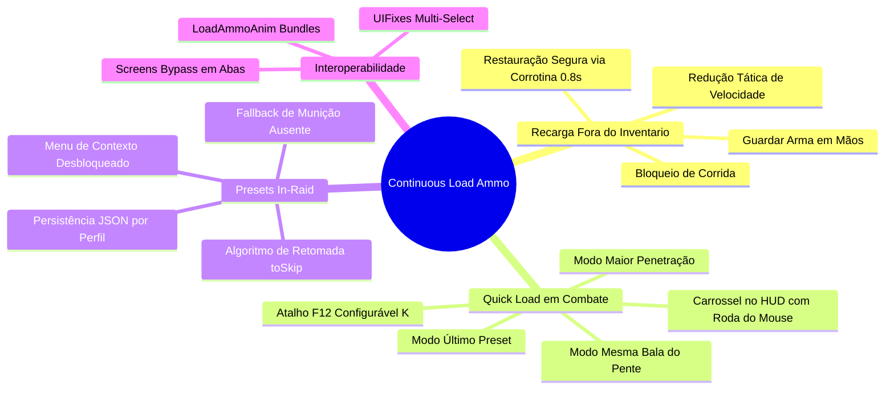

# Documentação Técnica — SPT-ContinuousLoadAmmo

Guia canônico e documentação modular da arquitetura, ciclo de vida de raid, sistemas de carregamento rápido (*Quick Load*), suporte a presets in-raid e interoperabilidade do mod **Continuous Load Ammo** para **Single Player Tarkov (SPT 4.0 / EFT 0.16.9)**.

---

## 📚 Índice Modular da Documentação

| Documento | Tema / Escopo | Status |
| :--- | :--- | :---: |
| [01. Visão Geral e Arquitetura](./01-visao-geral-e-arquitetura.md) | Arquitetura geral, ciclo de vida do plugin BepInEx, grafo de componentes e configurações F12 | 🟢 Vivo |
| [02. Ciclo de Recarga e Controle de Jogador](./02-ciclo-de-recarga-e-controle-de-jogador.md) | Máquina de estados do operador, mãos vazias (`SetEmptyHands`), restrições físicas (`SprintDisabled`, `ESpeedLimit.BarbedWire`) e corrotinas | 🟢 Vivo |
| [03. Sistema de Quick Load e Seleção de Munição](./03-sistema-de-quick-load-e-selecao-de-municao.md) | Interceptação na `InputTree`, HUD interativo em combate (`EftBattleUIScreen`), carrossel `GridItemView` e modos de seleção | 🟢 Vivo |
| [04. Sistema de Presets de Carregador em Raid](./04-sistema-de-presets-de-carregador-em-raid.md) | Desbloqueio de presets in-raid, parsing estrutural (`Bottom`/`Loop`/`Top`), retomada (`toSkip`) e persistência por perfil (`lastMagPresets.json`) | 🟢 Vivo |
| [05. Patches Harmony e Interoperabilidade](./05-patches-harmony-e-interoperabilidade.md) | Tabela completa de patches Harmony, integração suave com **UIFixes** (`MultiSelectInterop`) e compatibilidade com **LoadAmmoAnim** | 🟢 Vivo |
| [Relatório de Auditoria Técnica de Código (Review 01)](./relatorio-auditoria-codigo-01.md) | Auditoria estática profunda com 6 achados técnicos (Retenção estática, AP-04, Zero-Alloc, GC) | 🟢 Vivo |
| [Relatório de Auditoria e Code Review (Review 02)](./relatorio-auditoria-codigo-02.md) | Validação e aprovação técnica da v1.1.8 após resolução completa de todos os achados | 🟢 Vivo |

---

## 🗂️ Mapeamento do Código-Fonte (`modded/`)

| Arquivo | Subsistema | Linhas | Descrição Técnica |
| :--- | :--- | :---: | :--- |
| [ContinuousLoadAmmo.cs](../modded/ContinuousLoadAmmo.cs) | Core / BepInEx | 110 | Entrypoint do plugin, vinculação de configurações F12, instanciação de patches e carregamento inicial do store de presets. |
| [ConfigurationManagerAttributes.cs](../modded/ConfigurationManagerAttributes.cs) | Core / UI | 118 | Atributos customizados para formatação visual dos menus de configuração do BepInEx. |
| [LoadAmmoComponent.cs](../modded/Components/LoadAmmoComponent.cs) | Componentes / Input | 321 | Nó `InputNode` registrado na `InputTree` para gerenciar atalhos de combate, seleção radial/carrossel e cancelamento manual. |
| [LoadAmmoController.cs](../modded/Controllers/LoadAmmoController.cs) | Controladores / FSM | 513 | Orquestrador central: máquina de estados, corrotinas na main thread, busca de itens acessíveis e gerenciamento de mãos vazias. |
| [LoadAmmoUI.cs](../modded/Controllers/LoadAmmoUI.cs) | Controladores / HUD | 178 | Gerenciamento de elementos gráficos clonados no `EftBattleUIScreen` (ícone da munição, anel de progresso e texto formatado por Mag Drills). |
| [MagazinePresetLoader.cs](../modded/Controllers/MagazinePresetLoader.cs) | Controladores / Presets | 235 | Motor assíncrono para execução de presets de carregadores in-raid com algoritmo de pulo de balas pré-existentes (`toSkip`). |
| [QuickLoadMode.cs](../modded/Models/QuickLoadMode.cs) | Modelos / Enums | 16 | Enumeração dos modos de carregamento rápido: `HighestPenetration`, `LastBulletMagazine` e `LastMagazinePreset`. |
| [RegisterPlayerPatch.cs](../modded/Patches/RegisterPlayerPatch.cs) | Patches / Lifecycle | 43 | Injeção no `GameWorld.RegisterPlayer` para acoplar os controladores e nós de input exclusivamente ao jogador humano local. |
| [InventoryScreenClosePatch.cs](../modded/Patches/InventoryScreenClosePatch.cs) | Patches / Engine | 40 | Evita o cancelamento da fila de municiamento ao fechar o inventário, mantendo o processo ativo fora da UI. |
| [LoadMagazineStartPatch.cs](../modded/Patches/LoadMagazineStartPatch.cs) | Patches / Eventos | 30 | Postfix assíncrono sobre `Class1204.Start` para monitorar a finalização de carregamento de munições. |
| [UnloadMagazineStartPatch.cs](../modded/Patches/UnloadMagazineStartPatch.cs) | Patches / Eventos | 30 | Postfix assíncrono sobre `Class1207.Start` para monitorar a finalização de desmuniciamento de carregadores. |
| [ApplyMagPresetPatch.cs](../modded/Patches/ApplyMagPresetPatch.cs) | Patches / Presets | 41 | Intercepta a aplicação de presets in-raid, atualiza o histórico do perfil e direciona para o loader customizado. |
| [EnableContextPresetPatch.cs](../modded/Patches/EnableContextPresetPatch.cs) | Patches / UI | 24 | Habilita a opção `ApplyMagPreset` no menu de clique direito de carregadores durante a raid. |
| [PresetSubInteractionsPatch.cs](../modded/Patches/PresetSubInteractionsPatch.cs) | Patches / UI | 27 | Constrói a lista suspensa de presets salvos do jogador no menu de contexto in-raid. |
| [ShowMagPresetsPatch.cs](../modded/Patches/ShowMagPresetsPatch.cs) | Patches / Defensivo | 29 | Bloqueia a abertura do editor de presets in-raid, prevenindo travamento de contexto do EFT. |
| [OnClickPatch.cs](../modded/Patches/OnClickPatch.cs) | Patches / Input | 42 | Intercepta cliques de mouse diretos no carregador para permitir cancelamento manual imediato. |
| [ScreensPatches.cs](../modded/Patches/ScreensPatches.cs) | Patches / UI | 181 | Protege processos de recarga contra cancelamento ao alternar entre telas de mapa, tarefas, estatísticas e perícias. |
| [CommonUtils.cs](../modded/Utils/CommonUtils.cs) | Utilitários | 167 | Métodos de extensão para busca não alocativa de itens no inventário, acesso ao HUD, `InputTree` e notificações. |
| [MultiSelectInterop.cs](../modded/Utils/MultiSelectInterop.cs) | Utilitários / Interop | 77 | Ponte de integração suave com o mod **UIFixes** para suporte a municiamento em lote de múltiplos carregadores. |
| [ProfileMagazinePresetStore.cs](../modded/Utils/ProfileMagazinePresetStore.cs) | Utilitários / Dados | 123 | Persistência do último preset de carregador utilizado por calibre em formato JSON por perfil de jogador. |

---

## 🔍 Resumo Funcional e Fluxo de Dados

