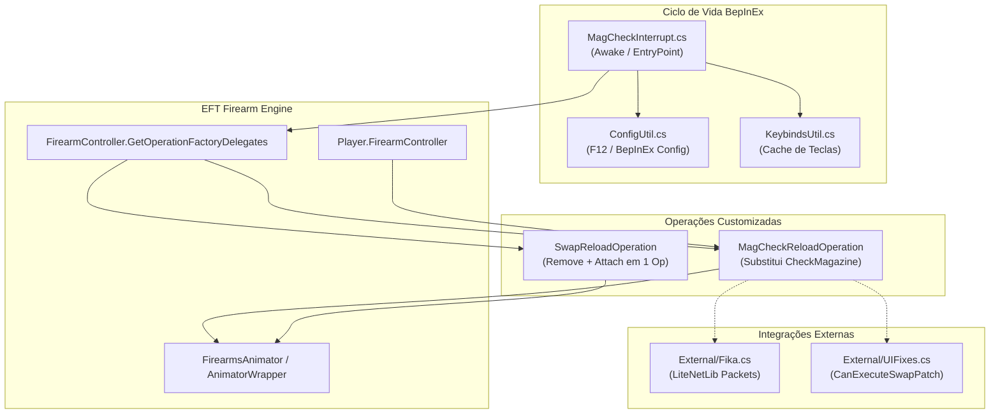
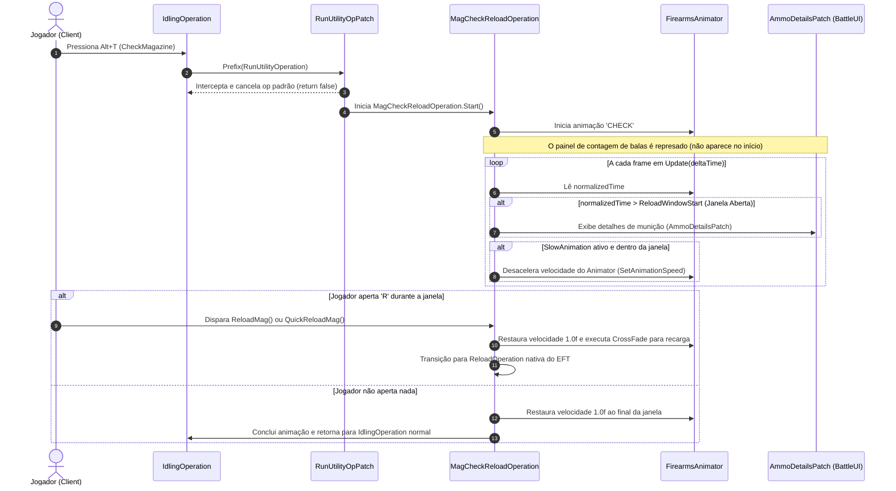

# Visão Geral e Arquitetura do SPT-MagCheckInterrupt

## 1. Propósito e Filosofia do Mod

No *Escape from Tarkov* baunilha, ao inspecionar o carregador (atalho padrão `Alt + T`), o jogador entra em uma animação de utilitário (`UtilityOperation.EUtilityType.CheckMagazine`) na qual o personagem retira o carregador da arma, avalia visualmente a quantidade de munição e insere o mesmo carregador de volta. Durante todo esse período, a arma permanece inoperante e o jogador fica totalmente vulnerável caso surja uma ameaça repentina, sendo incapaz de abortar o movimento para recarregar com um novo carregador ou acelerar a transição.

O mod **SPT-MagCheckInterrupt** substitui essa limitação mecânica estática por uma máquina de operações dinâmica que permite:
1. **Interrupção e Transição Imediata:** Ao pressionar a tecla de recarga (`R`) durante a inspeção do carregador, a animação de checagem é cancelada de forma fluida via *CrossFade* e conecta-se diretamente à fase de inserção de um novo carregador (recarga normal ou rápida).
2. **Janela de Decisão com Slow Motion Opcional (*Slow Animation*):** Permite desacelerar a animação de inspeção do carregador no exato instante em que as balas ficam visíveis, oferecendo uma janela de reação tática configurável para decidir se a recarga é necessária.
3. **Resolução de Conflitos de Keybinds:** Lida com combinações em que a mesma tecla é compartilhada para recarga e checagem (por exemplo, toque simples vs toque duplo ou segurar).
4. **Cooperação Total de Rede (FIKA) e Inventário (UIFixes):** Envia pacotes de sincronização customizados para o FIKA Headless/Host para evitar que o cliente remoto "avance" prematuramente o estado da animação, e suporta as operações de troca de carregador (*Swap*) do mod UIFixes.

---

## 2. Diagrama Arquitetural de Componentes

O mod atua como uma ponte entre o controlador de armas do Tarkov ([`FirearmController`](../../../references/eft-decompiled/Assembly-CSharp/EFT/Player.cs)), o Animator de mãos do Unity, o netcode do FIKA e as regras de inventário.

---

## 3. Fluxo de Vida de uma Inspeção de Carregador

O ciclo de vida padrão de uma checagem de carregador com o mod ativo segue o seguinte pipeline:

---

## 4. Mapeamento de Arquivos e Responsabilidades

| Arquivo / Classe | Namespace | Papel Arquitetural |
| :--- | :--- | :--- |
| [`MagCheckInterrupt.cs`](../original/MagCheckInterrupt/MagCheckInterrupt.cs) | `MagCheckInterrupt` | Ponto de entrada BepInEx (`[BepInPlugin]`). Registra logs, inicializa `ConfigUtil`, ativa patches e conecta integrações opcionais (FIKA e UIFixes). |
| [`MagCheckReloadOperation.cs`](../original/MagCheckInterrupt/Components/MagCheckReloadOperation.cs) | `MagCheckInterrupt.Components` | Classe principal derivada de `UtilityOperation`. Controla o estado de inspeção, o cálculo de janela de recarga, o slow-motion e a transição para reload. |
| [`SwapReloadOperation.cs`](../original/MagCheckInterrupt/Components/SwapReloadOperation.cs) | `MagCheckInterrupt.Components` | Operação composta derivada de `FirearmOperation` que orquestra a remoção e inserção simultânea de carregadores no inventário do EFT. |
| [`AnimationUtil.cs`](../original/MagCheckInterrupt/Utils/AnimationUtil.cs) | `MagCheckInterrupt.Utils` | Mapeamento de hashes de animação Mecanim (`CHECK`, `RELOAD OUT`, etc.), normalização de tempo e execução do `CrossFade`. |
| [`ConfigUtil.cs`](../original/MagCheckInterrupt/Utils/ConfigUtil.cs) | `MagCheckInterrupt.Utils` | Gerenciamento de configurações F12 (BepInEx), faixas percentuais, listeners de alteração e espelhamento host-client. |
| [`KeybindsUtil.cs`](../original/MagCheckInterrupt/Utils/KeybindsUtil.cs) | `MagCheckInterrupt.Utils` | Avaliação em tempo real dos estados das teclas de recarga e checagem de carregador para detectar pressões simultâneas conflitantes. |
| [`External/Fika.cs`](../original/MagCheckInterrupt/External/Fika.cs) | `MagCheckInterrupt.External` | Módulo de cooperação de rede. Registra listeners de eventos do FIKA e manipula o envio e recepção de pacotes LiteNetLib. |
| [`External/UIFixes.cs`](../original/MagCheckInterrupt/External/UIFixes.cs) | `MagCheckInterrupt.External` | Habilita o patch `CanExecuteSwapPatch` permitindo que operações de swap do UIFixes rodem dentro de `MagCheckReloadOperation`. |

---

## 5. Próximos Artigos Relacionados

* Para os detalhes técnicos das classes de operação e animação, consulte [02 — Operações de Recarga e Máquina de Estados](02-operacoes-de-recarga-e-maquina-de-estados.md).
* Para a lista e lógica dos patches Harmony, veja [03 — Patches Harmony e Interceptação de Input](03-patches-harmony-e-interceptacao-de-input.md).
* Para o protocolo e pacotes de rede cooperativa, veja [04 — Integração FIKA e Sincronização de Rede](04-integracao-fika-e-sincronizacao-de-rede.md).
* Para a cooperação com o inventário do UIFixes, veja [05 — Compatibilidade com UIFixes e Reload in Place](05-compatibilidade-com-uifixes-e-reload-in-place.md).
