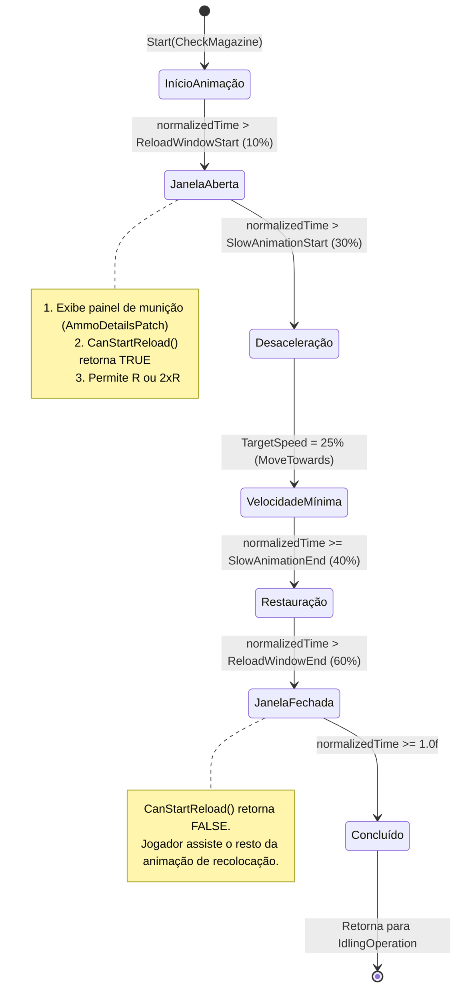
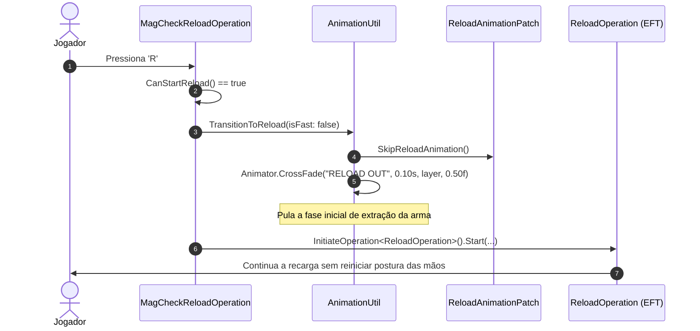

# Operações de Recarga e Máquina de Estados

O coração técnico do mod reside em duas implementações customizadas de operações de arma que herdam das classes base do EFT: [`MagCheckReloadOperation`](../original/MagCheckInterrupt/Components/MagCheckReloadOperation.cs) e [`SwapReloadOperation`](../original/MagCheckInterrupt/Components/SwapReloadOperation.cs). Ambas são registradas na factory de operações do EFT por meio do [`OperationFactoryPatch`](../original/MagCheckInterrupt/Patches/OperationFactoryPatch.cs).

---

## 1. Operação `MagCheckReloadOperation`

Herdeira de `Player.FirearmController.UtilityOperation`, essa classe substitui o comportamento padrão da checagem de carregador. Em vez de uma animação puramente passiva, ela atua como um coordenador ativo de inputs, exibição de interface e controle dinâmico da velocidade do Animator.

### Ciclo de Execução em Tempo Real (`Update`)

A cada frame, o método `Update(float deltaTime)` inspeciona a posição da animação nas mãos do operador:

```csharp
var normalizedTime = FirearmsAnimator_0.GetNormalizedTime(FirearmsAnimator.HANDS_LAYER_INDEX);
```



### Máquina de Velocidade da Animação (`SpeedState`)

A desaceleração e restauração da velocidade da animação não acontecem de maneira abrupta. É utilizada a interpolação suave `Mathf.MoveTowards`:

| Estado (`SpeedState`) | Condição de Ativação | Ação no Animator |
| :--- | :--- | :--- |
| `Normal` | `normalizedTime <= ConfigUtil.SlowAnimationStart` | Mantém velocidade em `1.0f`. |
| `Slowed` | `normalizedTime > ConfigUtil.SlowAnimationStart` | Altera `_targetSpeed` para o valor de configuração (padrão `0.25f` = 25% da velocidade normal). |
| `Restored` | `normalizedTime >= ConfigUtil.SlowAnimationEnd` | Restabelece `_targetSpeed = 1.0f`. O interpolador suaviza a transição a uma taxa definida por `SlowSmoothing * deltaTime`. |

---

## 2. Transição para Recarga (`TransitionToReload`)

Quando o jogador aciona a recarga durante a janela válida (`CanStartReload() == true`), `ReloadMag` ou `QuickReloadMag` é disparado:

1. **Restauração Imediata da Escala de Tempo:** `FirearmsAnimator_0.SetAnimationSpeed(1f)` força a velocidade de volta a 100% para não deixar a recarga em câmera lenta.
2. **Desativação de Mira e Gatilho:** Interrompe a visada pela mira e reseta o gatilho (`DisableAimingOnReload()`, `SetTriggerPressed(false)`).
3. **Cálculo de Inventário:** Executa `ReloadResult.Run(...)` para validar espaço e disponibilidade de carregadores compatíveis.
4. **CrossFade no Mecanim:** Aciona [`AnimationUtil.TransitionToReload`](../original/MagCheckInterrupt/Utils/AnimationUtil.cs), que faz o *CrossFade* direto entre o estado `CHECK` e o estado `RELOAD OUT` (ou `RELOAD OUT ALL` para recarga rápida).
5. **Supressão de Animação Baunilha:** O método nativo `GClass2016.Start` tentaria reiniciar a animação de recarga do zero. O mod ativa a flag `_toSkip` no [`ReloadAnimationPatch`](../original/MagCheckInterrupt/Patches/ReloadAnimationPatch.cs), impedindo que a animação seja reiniciada e permitindo que o *CrossFade* transicione perfeitamente a mão do operador.



---

## 3. Operação Composta `SwapReloadOperation`

Quando uma recarga in-place ou troca de carregador é solicitada, a classe [`SwapReloadOperation`](../original/MagCheckInterrupt/Components/SwapReloadOperation.cs) gerencia a remoção do carregador antigo e a fixação do novo dentro de um único fluxo de evento de arma, garantindo coerência visual e lógica:

### Mapa de Eventos de Animação Manipulados

A operação reage aos eventos da malha do modelo 3D da arma durante o ciclo do Mecanim:

| Método / Evento de Animação | Momento da Animação | Operação Lógica no Jogo |
| :--- | :--- | :--- |
| `OnMagPulledOutFromWeapon()` | O carregador se desprende da arma | `SetAmmoOnMag(0)`, `SetMagInWeapon(false)` e atualiza estado de bipé. |
| `OnMagPuttedToRig()` | A mão do personagem guarda o carregador | `WeaponManagerClass.RemoveMod(_weaponMagazineSlot)` e instancia `AttachModResult.Run(...)` para preparar o novo magazine. |
| `OnShellEjectEvent()` | O ferrolho é recuado | Se houver munição não deflagrada ou falha (`Misfire`), ejeta o cartucho via `WeaponManagerClass.StartSpawnShell`. |
| `RemoveAmmoFromChamber()` | A câmara é limpa | Remove o projétil da câmara e solta no chão se for o caso (`ThrowPatronAsLoot`). |
| `OnMagAppeared()` | O novo carregador surge na mão | Instancia o prefab do novo carregador do `PoolManagerClass` e fixa no slot da arma. |
| `OnMagInsertedToWeapon()` | O novo carregador trava no poço da arma | Atualiza contador visual de munição, marca `SetMagInWeapon(true)` e confere compatibilidade. |
| `OnAddAmmoInChamber()` | O ferrolho fecha alimentando a câmara | Carrega a munição na câmara (`SetRoundIntoWeapon`), atualiza `ChamberAmmoCount` e finaliza a operação (`EndOperation()`). |

### Casos Especiais de Armas e Ferrolhos

1. **Armas com Bolt Catch (Trava de Ferrolho):** Armas como a SKS sem munição na câmara recebem tratamento especial em `AnimationUtil.DoReloadCrossfade`: em vez de *CrossFade*, o mod aciona diretamente `PullOutMagInInventoryMode()` para evitar deformações visuais no ferrolho travado aberto.
2. **Engasgos e Misfire:** Se a arma estiver em estado de pane (`Weapon.EMalfunctionState.Misfire`), a camada de animação de malfunção é zerada (`MALFUNCTION_LAYER_INDEX = 0`) para permitir que a recarga limpe a pane sem sobreposição de animações conflitantes.
