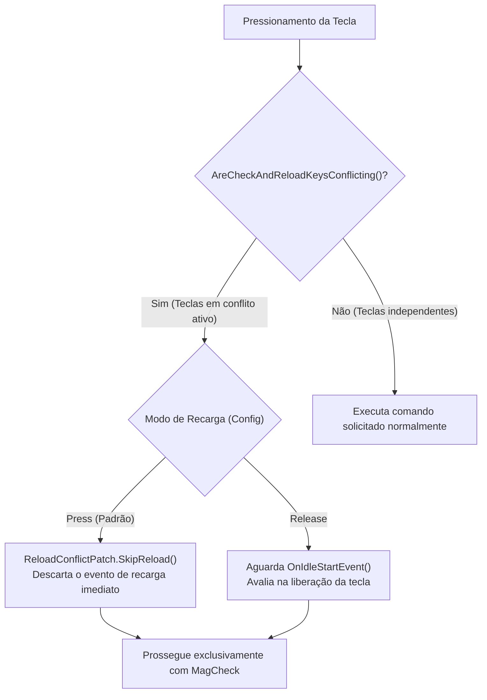

# Patches Harmony e Interceptação de Input

O **SPT-MagCheckInterrupt** utiliza a biblioteca Harmony através da infraestrutura de patching do SPT (`SPT.Reflection.Patching.ModulePatch`). Os patches interceptam pontos críticos do ciclo de input, animação do EFT e UI de combate.

---

## 1. Inventário Geral dos Patches Harmony

| Patch | Classe Alvo no EFT | Método Alvo | Tipo | Propósito Principal |
| :--- | :--- | :--- | :---: | :--- |
| [`RunUtilityOpPatch`](../original/MagCheckInterrupt/Patches/RunUtilityOpPatch.cs) | `Player.FirearmController.IdlingOperation` | `RunUtilityOperation` | `Prefix` | Desvia a checagem de carregador padrão para a operação customizada `MagCheckReloadOperation`. |
| [`OperationFactoryPatch`](../original/MagCheckInterrupt/Patches/OperationFactoryPatch.cs) | `Player.FirearmController` | `GetOperationFactoryDelegates` | `Postfix` | Registra as fábricas de `MagCheckReloadOperation` e `SwapReloadOperation` no controlador de armas. |
| [`CanQuickReloadPatch`](../original/MagCheckInterrupt/Patches/CanQuickReloadPatch.cs) | `Class1730` | Getter de `Boolean_1` | `Postfix` | Permite ao jogador executar a recarga rápida (dois toques em R) durante a checagem. |
| [`ReloadAnimationPatch`](../original/MagCheckInterrupt/Patches/ReloadAnimationPatch.cs) | `FirearmsAnimator` | `Reload(bool)` | `Prefix` | Suprime a reinicialização da animação de recarga baunilha quando um *CrossFade* ativo já foi disparado. |
| [`ReloadFastAnimationPatch`](../original/MagCheckInterrupt/Patches/ReloadFastAnimationPatch.cs) | `FirearmsAnimator` | `ReloadFast(bool)` | `Prefix` | Suprime a reinicialização da animação de recarga rápida quando um *CrossFade* ativo já foi disparado. |
| [`AmmoDetailsPatch`](../original/MagCheckInterrupt/Patches/AmmoDetailsPatch.cs) | `GamePlayerOwner` | `method_8` | `Prefix` | Represa a exibição imediata do painel de quantidade de munição na HUD para exibi-lo no momento tático correto. |
| [`UpdateBindingsPatch`](../original/MagCheckInterrupt/Patches/UpdateBindingsPatch.cs) | `InputBindingsDataClass` | `UpdateBindings` | `Postfix` | Atualiza o cache interno de teclas monitoradas (`ReloadWeapon` e `CheckAmmo`). |
| [`ReloadConflictPatch`](../original/MagCheckInterrupt/Patches/ReloadConflictPatch.cs) | `Class1730` | `method_13` | `Prefix` | Cancela disparos espúrios de recarga ao soltar ou pressionar teclas compartilhadas. |

---

## 2. Detalhamento dos Patches Críticos

### 2.1. Desvio de Operação (`RunUtilityOpPatch`)

Ao pressionar o comando de inspeção, o Tarkov invoca `IdlingOperation.RunUtilityOperation(utilityType)`:

```csharp
[PatchPrefix]
public static bool Prefix(IdlingOperation __instance, UtilityOperation.EUtilityType utilityType)
{
    if (utilityType != UtilityOperation.EUtilityType.CheckMagazine) return true;
    if (__instance.Player_0.IsAI) return true; // Ignora bots para evitar problemas de animação remota

    if (!WeaponUsesExternalMag(__instance.Weapon_0))
    {
        // Se a arma for de carregador interno (ex: SKS sem carregador destacável), mantém fluxo original
        if (__instance.Player_0.FirstPersonPointOfView)
        {
            AmmoDetailsPatch.ShowLastAmmoDetail();
        }
        return true;
    }

    __instance.Player_0.BodyAnimatorCommon.SetFloat(PlayerAnimator.RELOAD_FLOAT_PARAM_HASH, 1f);
    __instance.State = EOperationState.Finished;
    __instance.FirearmController_0.InitiateOperation<MagCheckReloadOperation>().Start(utilityType);
    return false;
}
```

* O patch garante que armas com carregador interno fixo continuem usando a animação baunilha sem quebras.
* Bots de inteligência artificial (`IsAI == true`) são expressamente ignorados para manter a integridade dos controladores de IA do jogo.

---

### 2.2. Resolução de Conflitos de Teclas (`ReloadConflictPatch` & `KeybindsUtil`)

Em certas configurações de atalhos do Tarkov, jogadores utilizam a mesma tecla física (exemplo: `R`) tanto para recarregar (pressionamento rápido) quanto para checar o carregador (segurar ou combinação com modificador).



O método [`KeybindsUtil.AreCheckAndReloadKeysConflicting`](../original/MagCheckInterrupt/Utils/KeybindsUtil.cs) verifica se os estados de combinação de teclas (`KeyCombinationState`) de ambos os atalhos estão ativos simultaneamente em estado `Down` ou `Hold`. Se houver sobreposição, o patch bloqueia a chamada em `Class1730.method_13`, prevenindo recargas acidentais no início da checagem.

---

### 2.3. Controle do Painel de Munição na HUD (`AmmoDetailsPatch`)

Por padrão, o Tarkov exibe imediatamente o painel inferior direito com a estimativa de munição no momento em que a tecla de checagem é acionada. O [`AmmoDetailsPatch`](../original/MagCheckInterrupt/Patches/AmmoDetailsPatch.cs) altera essa dinâmica:

1. O prefixo em `GamePlayerOwner.method_8` armazena a estrutura `AmmoDetails` em memória e retorna `false`, silenciando a exibição imediata.
2. O painel só é revelado quando a animação atinge `ReloadWindowStart` (quando o operador realmente olhou para o carregador).
3. Se o jogador transiciona para a recarga (`TransitionToReload`), o método `HideAmmoCount()` oculta o painel instantaneamente, eliminando elementos residuais na interface durante a colocação do novo carregador.
