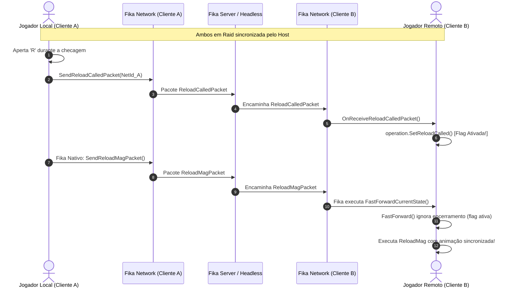

# Integração FIKA e Sincronização de Rede

O **SPT-MagCheckInterrupt** possui um módulo dedicado de compatibilidade com o **Project Fika** ([`External/Fika.cs`](../original/MagCheckInterrupt/External/Fika.cs)), viabilizando partidas cooperativas sem desync de animações ou divergência de configurações entre jogadores.

---

## 1. Carregamento Seguro e Soft Dependency

O mod declara uma dependência suave com o FIKA no cabeçalho do plugin:

```csharp
[BepInDependency("com.fika.core", BepInDependency.DependencyFlags.SoftDependency)]
```

Para evitar que o motor do .NET/Mono tente carregar classes do `Fika.Core.dll` em sessões puramente singleplayer onde o FIKA não está instalado, as inscrições no despachante de eventos usam instâncias explícitas de `Action`:

```csharp
// Inscrição explícita para não gerar classe estática oculta do compilador
FikaEventDispatcher.SubscribeEvent(new Action<FikaNetworkManagerCreatedEvent>(OnFikaNetworkManagerCreated));
FikaEventDispatcher.SubscribeEvent(new Action<PeerConnectedEvent>(OnPeerConnected));
FikaEventDispatcher.SubscribeEvent(new Action<FikaRaidStartedEvent>(OnRaidStarted));
FikaEventDispatcher.SubscribeEvent(new Action<FikaGameEndedEvent>(OnGameEnded));
```

---

## 2. Pacotes de Rede LiteNetLib

O subsistema de rede do mod implementa dois pacotes leves transmitidos via canal confiável do LiteNetLib:

### 2.1. `ConfigPacket` ([`ConfigPacket.cs`](../original/MagCheckInterrupt.Net/ConfigPacket.cs))
* **Conteúdo:** Array de strings contendo todas as variáveis serializadas do [`ConfigUtil`](../original/MagCheckInterrupt/Utils/ConfigUtil.cs).
* **Finalidade:** O Host atua como autoridade sobre as janelas de recarga e animação lenta. Ao conectar um cliente (`PeerConnectedEvent`), o servidor transmite o pacote de configuração.
* **Comportamento no Cliente:** O cliente armazena suas configurações locais em cache, aplica os valores do Host, marca o menu F12 como somente-leitura (`ConfigUtil.SetReadOnly(true)`) e exibe o banner azul de autoridade do Host. Ao fim da raid (`FikaGameEndedEvent`), as preferências pessoais do cliente são restauradas.

---

### 2.2. `ReloadCalledPacket` ([`ReloadCalledPacket.cs`](../original/MagCheckInterrupt.Net/ReloadCalledPacket.cs))
* **Conteúdo:** `int NetId` identificando o jogador que iniciou a recarga.
* **Problema Resolvido:** No FIKA, quando um jogador remoto dispara uma recarga, o cliente observador executa o método nativo [`AbstractHandsController.FastForwardCurrentState`](../../../references/eft-decompiled/Assembly-CSharp/EFT/Player.cs) para sincronizar o estado das mãos antes de iniciar o `ReloadMag`.
* **Risco de Dessincronia:** Se o `FastForward` rodasse na `MagCheckReloadOperation` sem aviso, a operação concluiria imediatamente e retornaria ao estado ocioso (`IdlingOperation`), descartando a transição de recarga em andamento.
* **Solução:** Antes que o FIKA envie seu próprio pacote de recarga, o cliente local envia `ReloadCalledPacket`. O cliente remoto recebe o pacote, ativa `operation.SetReloadCalled()` e, quando o `FastForward` é acionado pelo FIKA, ele detecta a flag e não cancela a operação:

```csharp
public override void FastForward()
{
    if (_reloadCalled)
    {
        // Pula o encerramento do FastForward, mantendo a operação pronta para receber o ReloadMag!
        return;
    }

    FirearmsAnimator_0.SetAnimationSpeed(1f);
    State = EOperationState.Ready;
    OnIdleStartEvent();
}
```

---

## 3. Diagrama de Sequência de Rede (Transição de Recarga em Coop)



---

## 4. Tabela de Eventos de Ciclo de Vida do FIKA

| Evento do FIKA | Papel do Host / Servidor | Papel do Cliente |
| :--- | :--- | :--- |
| `FikaNetworkManagerCreatedEvent` | Captura configurações e registra listener para retransmitir mudanças feitas no menu F12. | Trava menu F12 como somente-leitura, exibe aviso e registra handler de `ConfigPacket`. |
| `PeerConnectedEvent` | Transmite imediatamente o `ConfigPacket` para o novo peer conectado. | Não utilizado no cliente. |
| `FikaRaidStartedEvent` | Verifica integridade de conexões. | Confere se recebeu a configuração do Host. Se não recebeu, exibe notificação persistente avisando de possível desync. |
| `FikaGameEndedEvent` | Sem ação de restauração. | Restaura as configurações locais do jogador e destrava a edição no menu F12. |
