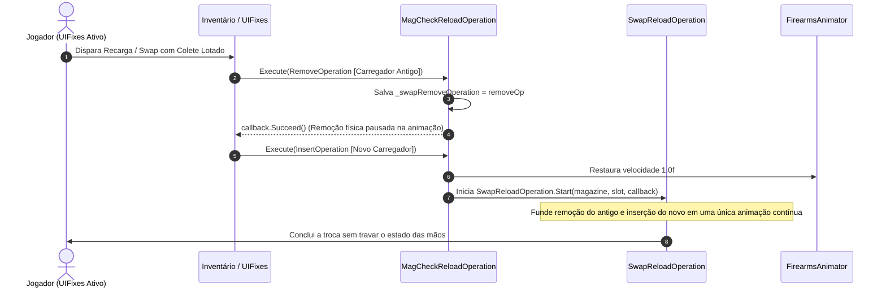

# Compatibilidade com UIFixes e Reload in Place

Uma das integrações mais refinadas do **SPT-MagCheckInterrupt** é com o mod **UIFixes** ([`External/UIFixes.cs`](../original/MagCheckInterrupt/External/UIFixes.cs)), especificamente no recurso de **Reload in Place** (recarregar a arma trocando o carregador de lugar no colete mesmo sem nenhum espaço livre adicional no inventário).

---

## 1. O Desafio Técnico do Swap Durante a Checagem

Por padrão no Tarkov, quando uma operação de arma está em andamento (como inspecionar o carregador), o `FirearmController.CanExecute` rejeita qualquer operação de inventário externa (`SwapOperationClass`, `RemoveOperation`, `AttachOperation`) retornando `false`.

Se o jogador tentar recarregar via swap de carregador ou arrastar um novo carregador para a arma enquanto o personagem está checando o magazine, a operação seria imediatamente abortada pelo jogo.

Para permitir a coexistência dessas mecânicas, o mod injeta o patch [`CanExecuteSwapPatch`](../original/MagCheckInterrupt/External/UIFixes.cs):

```csharp
[PatchPostfix]
public static void Postfix(FirearmController __instance, IInventoryOperation operation, ref bool __result)
{
    if (__result) return;
    if (__instance.CurrentOperation is not MagCheckReloadOperation) return;
    if (operation is not (SwapOperationClass or RemoveOperation or AttachOperation)) return;

    __result = true; // Autoriza a execução da troca de inventário pelo UIFixes
}
```

---

## 2. Orquestração da Operação de Swap no `MagCheckReloadOperation`

Quando a operação de inventário do UIFixes é validada e enviada para o controlador de armas, o método [`MagCheckReloadOperation.Execute`](../original/MagCheckInterrupt/Components/MagCheckReloadOperation.cs) intercepta a sequência em duas fases coordenadas:



### Fases de Interceptação de Inventário

1. **Fase 1 — Remoção (`From1.IsChildOf(Weapon_0)`):**
   * O mod intercepta a requisição de remoção do carregador que estava na arma. Em vez de descartar o modelo imediatamente, ele armazena a referência em `_swapRemoveOperation` e responde `callback.Succeed()`.
2. **Fase 2 — Inserção (`To1.IsChildOf(Weapon_0)`):**
   * Ao receber a ordem de inserção do novo magazine, o mod encerra o `MagCheckReloadOperation` (`State = EOperationState.Finished`) e instancia a [`SwapReloadOperation`](../original/MagCheckInterrupt/Components/SwapReloadOperation.cs), passando o carregador removido e o slot de destino.

---

## 3. Relação com as Correções de Desync do UIFixes (v5.3.12 / v5.3.13)

A evolução recente do UIFixes no workspace impacta diretamente como o MagCheckInterrupt opera em partidas cooperativas (FIKA):

| Versão do UIFixes | Comportamento do Reload in Place | Impacto no MagCheckInterrupt |
| :--- | :--- | :--- |
| **v5.3.11 (Original)** | Executava um `InteractionsHandlerClass.Swap` forçado de inventário e cancelava o método nativo `ReloadMag`, quebrando o envio de pacotes ao Headless do FIKA. | O `MagCheckInterrupt` interceptava o swap via `CanExecuteSwapPatch`, mas no coop o cliente remoto ficava com o gatilho travado (`WaitingForCallback`). |
| **v5.3.12 / v5.3.13 (Workspace)** | Substituído o swap forçado por resolução dinâmica de endereço (`ref ItemAddress itemAddress`) deixando o `ReloadMag` nativo rodar com netcode. | O fluxo normal de recarga passa por `MagCheckReloadOperation.ReloadMag`, aproveitando o pacote de sincronização `ReloadCalledPacket` e garantindo 100% de consistência sem desync. |

---

## 4. Matriz de Resiliência de Operações

| Cenário de Execução | Comportamento Esperado | Resultado Prático |
| :--- | :--- | :--- |
| **Checagem sem ação do jogador** | A animação completa os 100% do tempo normalizado e recoloca o mesmo magazine. | Retorno seguro para `IdlingOperation`. |
| **Recarga normal (tecla R)** | Transição para `ReloadOperation` nativa do Tarkov. | Animação suave via *CrossFade* Mecanim. |
| **Recarga rápida (2x R)** | Transição para `QuickReloadMag` soltando o carregador no chão. | Transição instantânea para `RELOAD OUT ALL`. |
| **Swap com inventário cheio** | Disparo de `SwapReloadOperation` unificada. | Troca visual e lógica sem travar o modelo de mãos. |
| **Tentativa de swap inválida (erro de item)** | Se `_swapRemoveOperation` for nulo na inserção. | Aciona fallback seguro: encerra o swap e retorna a arma para `IdlingOperation`. |
