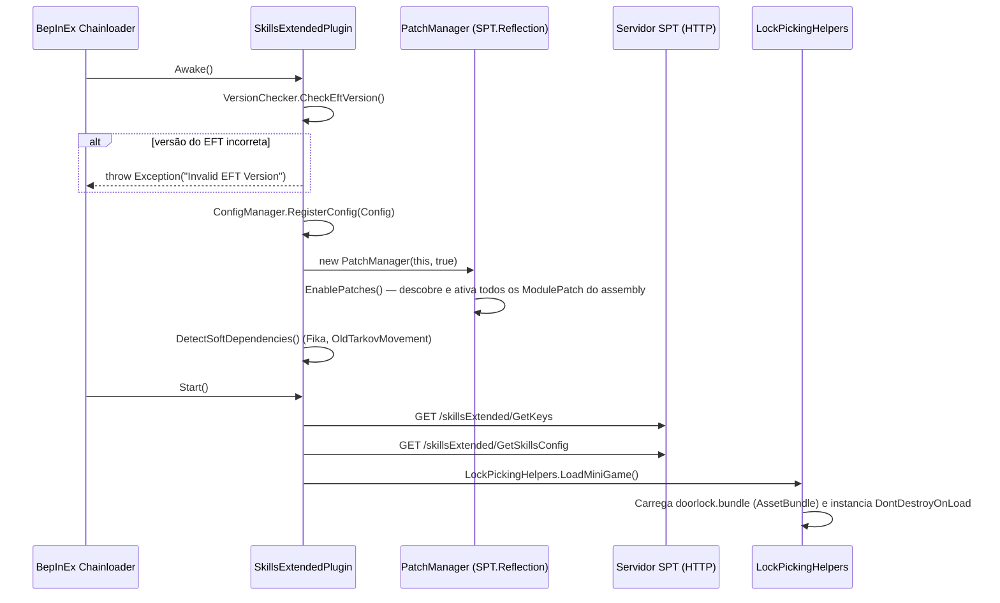
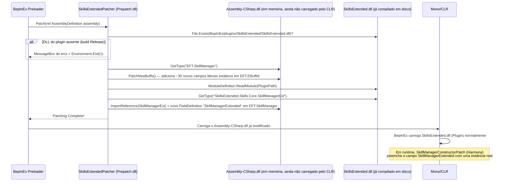
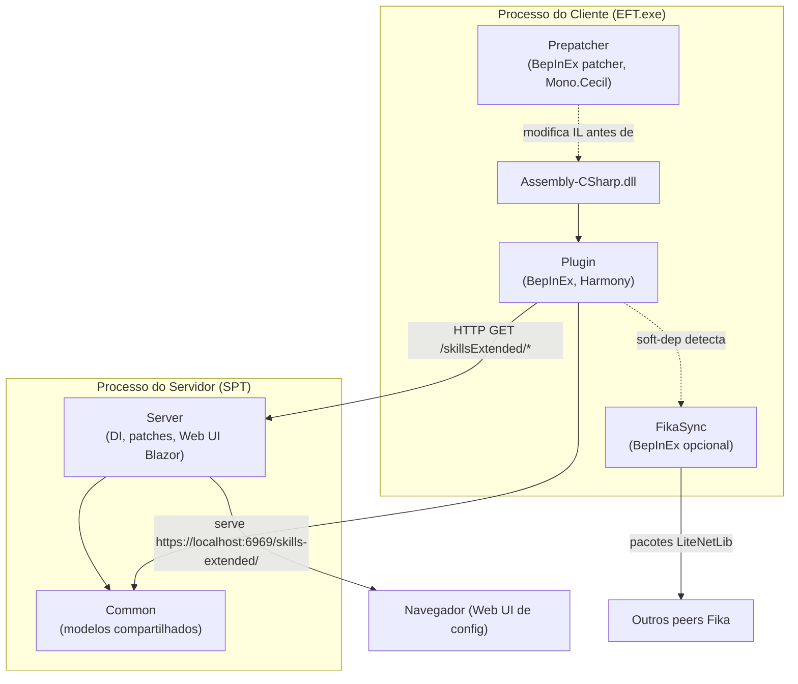

# Visão Geral e Arquitetura

## O que é

**Skills-Extended** (GUID `com.cj.SkillsExtended`, versão base `2.2.2`) é um mod híbrido para SPT 4.0.2 / EFT 0.16.x que reativa e expande skills do jogo que a BSG deixou "dormentes" ou pouco desenvolvidas (Lockpicking, Prone Movement, Silent Ops) e adiciona skills inteiramente novas (Usec Ar Systems, Bear Ak Systems, Usec Negotiations, Bear Raw Power). Ele injeta bônus percentuais configuráveis por nível em quase todas as skills físicas e de combate, e implementa um minigame customizado de lockpicking com um sistema de dificuldade por porta/mapa.

O mod é **licenciado sob CC BY-NC-ND 4.0** — uso e modificação local são permitidos, mas redistribuir uma versão modificada é proibido pela cláusula NoDerivatives. Isso não bloqueia esta documentação interna, apenas o compartilhamento de builds derivadas.

## Os 6 Projetos

O mod é organizado em uma única solução Visual Studio ([Skills Extended.sln](../original/Skills%20Extended.sln)) com 6 projetos:

| Projeto | Framework | Papel | Saída |
|---|---|---|---|
| [`Prepatcher/`](../original/Prepatcher/Patcher.cs) | `netstandard2.1` | BepInEx **preloader/patcher** — reescreve o IL de `Assembly-CSharp.dll` via Mono.Cecil antes do jogo carregar | `BepInEx/patchers/SkillsExtended_PrePatch.dll` |
| [`Plugin/`](../original/Plugin/SkillsExtendedPlugin.cs) | `netstandard2.1` | Plugin BepInEx cliente — toda a lógica de skills, buffs, patches Harmony e o minigame de lockpicking | `BepInEx/plugins/SkillsExtended/SkillsExtended.dll` |
| [`Server/`](../original/Server/Metadata.cs) | `net9.0` | Mod C# server-side SPT 4.0.2 — injeção de dados no DB, patches Harmony server-side, Web UI Blazor de configuração | `SPT/user/mods/SkillsExtended/` |
| [`Common/`](../original/Common/SkillsExtendedInfo.cs) | `netstandard2.1` | Biblioteca compartilhada — modelos de configuração (`SkillsConfig`), constantes de versão, extensões | Referenciado por `Plugin`, `Server` e `FikaSync` |
| [`FikaSync/`](../original/FikaSync/FikaSyncPlugin.cs) | `netstandard2.1` | Plugin BepInEx **separado e opcional** — sincroniza o minigame de lockpicking entre peers Fika | `BepInEx/plugins/SkillsExtended/SkillsExtendedFika.dll` (fora do zip principal) |
| `__BUILD_RELEASE__/` | `net9.0` | Projeto de agregação — não contém lógica, só copia as saídas dos outros 5 projetos e gera os `.zip` de release | `release/SkillsExtended-<versão>.zip` |

Todos os `ProjectReference` são internos — o mod é auto-contido, sem dependência de outro repositório do workspace. Dependências externas: DLLs do EFT (`Assembly-CSharp`, `UnityEngine*`), BepInEx/Harmony (`0Harmony`, `BepInEx`), pacotes SPT (`spt-reflection`, `spt-custom`, `spt-common` no cliente; `SPTarkov.Reflection`/`Server.Core`/`Server.Web` 4.0.2 via NuGet no servidor) e `Fika-Core.dll` (apenas no `FikaSync`).

## Ciclo de vida do Plugin cliente

[`SkillsExtendedPlugin.cs`](../original/Plugin/SkillsExtendedPlugin.cs) é a classe `[BepInPlugin("com.cj.SkillsExtended", "Skills Extended", SkillsExtendedInfo.VERSION)]`.



Pontos-chave:

- **`Awake()`** primeiro valida a versão do EFT (`SkillsExtendedInfo.TARKOV_VERSION = 40087`); se não bater, lança exceção e registra um erro visual vermelho no painel F12 via `ConfigurationManagerAttributes.CustomDrawer` (ver [PROPRIEDADES.md](../PROPRIEDADES.md)).
- **`PatchManager`** não faz parte do código deste mod — é uma classe utilitária de `SPT.Reflection.Patching` (pacote `spt-reflection`). `new PatchManager(this, true).EnablePatches()` varre o assembly do plugin em busca de todas as subclasses de `ModulePatch`/`AbstractPatch` e as aplica automaticamente via Harmony — não há uma lista central de patches no código do mod. Uma classe pode **optar por sair** desse auto-registro com o atributo `[IgnoreAutoPatch]`, como faz [`KeyCardDoorActionPatch.cs`](../original/Plugin/Skills/LockPicking/Patches/KeyCardDoorActionPatch.cs) (o corpo do postfix está inteiramente comentado — funcionalidade de hacking de porta com keycard ainda não finalizada).
- **`Start()`** busca a configuração do servidor via HTTP (`SPT.Common.Http.RequestHandler.GetJson`) nas rotas expostas pelo [`SkillsStaticRouter`](../original/Server/Core/SkillsStaticRouter.cs) — é assim que o JSON do servidor (`SkillsConfig.json`) chega ao cliente em tempo de execução, sem precisar embutir a configuração no assembly do plugin.
- **`DetectSoftDependencies()`** verifica `com.boogle.oldtarkovmovement` via `Chainloader.PluginInfos` e, se presente, resolve via reflection o tipo `OldIdleState` (necessário porque o lockpicking só permite iniciar quando o jogador está parado, e o mod "Old Tarkov Movement" substitui o estado `IdleStateClass` padrão por um próprio).

## O Prepatcher — IL patching com Mono.Cecil

Este é o mecanismo mais incomum do mod. Um **BepInEx preloader patcher** roda **antes** de `Assembly-CSharp.dll` (o assembly do jogo) ser carregado pelo CLR, e o modifica fisicamente no disco/memória usando [Mono.Cecil](../original/Prepatcher/Patcher.cs).

Por que isso é necessário: Harmony só consegue interceptar **métodos** já existentes (prefix/postfix/transpiler). Ele não consegue **adicionar novos campos** a uma classe nem **novos literais a um enum** compilado — para isso é preciso reescrever o IL do assembly antes de ele ser carregado. É exatamente isso que o Prepatcher faz, em dois passos, dentro de `SkillsExtendedPatcher.Patch(ref AssemblyDefinition assembly)`:



### Passo 1 — `PatchNewBuffs`: novos valores de `EBuffId`

O método [`CreateNewEnum`](../original/Prepatcher/Patcher.cs) cria um `FieldDefinition` com `FieldAttributes.Public | Static | Literal | HasDefault` e `Constant = index` (a numeração começa em `1000` para não colidir com os `EBuffId` nativos), mais um `CustomAttribute` do tipo `GAttribute24` (atributo de nome usado pelo enum decompilado do EFT) contendo o nome legível do buff. Esses campos são adicionados diretamente à definição do enum `EFT.EBuffId` dentro do assembly do jogo.

São ~30 novos IDs de buff, agrupados por skill (ver tabela completa na [documentação do sistema central de buffs](02-sistema-central-de-skills-e-buffs.md)): `FirstAidHealingSpeed`, `FieldMedicineSkillCap`, `UsecArSystemsRecoil`, `BearAkSystemsRecoil`, `LockpickingTimeIncrease`, `SilentOpsIncMeleeSpeed`, `StrengthColliderSpeedBuff`, `ShadowConnectionsScavCooldownTimeDec`, `BearRawPowerPraporTraderCostDec`, `UsecNegotiationsPeacekeeperTraderCostDec`, entre outros.

### Passo 2 — `PatchSkillManager`: novo campo em `EFT.SkillManager`

Este passo é mais delicado: ele **lê o assembly do próprio plugin** (`ModuleDefinition.ReadModule(PluginPath)`, apontando para `BepInEx/plugins/SkillsExtended/SkillsExtended.dll`), localiza o tipo `SkillsExtended.Skills.Core.SkillManagerExt` dentro dele, importa uma referência a esse tipo para dentro do módulo de `Assembly-CSharp`, e adiciona um novo `FieldDefinition` público chamado `SkillManagerExtended` do tipo `SkillManagerExt` à classe `EFT.SkillManager`.

Isso significa que **o plugin precisa já estar compilado e copiado para a pasta de plugins antes que o prepatcher rode** — daí a checagem `File.Exists(PluginPath)` no início de `Patch()`, que aborta com uma `MessageBox` de erro em builds não-`DEBUG` se o plugin não for encontrado.

Depois que o IL modificado é carregado pelo CLR, o campo `SkillManagerExtended` existe fisicamente em toda instância de `SkillManager`, mas começa `null` — quem o **preenche** em runtime é o patch Harmony [`SkillManagerConstructorPatch`](../original/Plugin/Skills/Core/Patches/SkillManagerConstructorPatch.cs) (ver [documento 02](02-sistema-central-de-skills-e-buffs.md)).

## Dependências (soft e hard)

| Dependência | Tipo | Onde é declarada | Efeito quando presente |
|---|---|---|---|
| `com.boogle.oldtarkovmovement` | `SoftDependency` | [`SkillsExtendedPlugin.cs`](../original/Plugin/SkillsExtendedPlugin.cs) | Resolve via reflection o tipo `OldIdleState` para que o lockpicking também aceite esse estado "parado" alternativo como pré-condição de início ([`ReflectionHelper.GetOldMovementTypes`](../original/Plugin/Helpers/ReflectionHelper.cs)) |
| `com.fika.core` | `SoftDependency` | `SkillsExtendedPlugin.cs` | Seta `SkillsExtendedInfo.IsFikaPresent = true`; se o plugin **`FikaSync` não estiver instalado**, a UI de lockpicking é escondida em multiplayer (ver [documento 07](07-multiplayer-fika.md)) |
| `com.fika.headless` | `SoftDependency` | `SkillsExtendedPlugin.cs` | Seta `SkillsExtendedInfo.IsFikaHeadless = true`; desativa sons de porta e a inicialização de lockpicking/XP médica na instância headless (que não tem `MainPlayer`) |
| `com.cj.SkillsExtended` (≥ `2.2.0`) | `BepInDependency` **hard** | [`FikaSyncPlugin.cs`](../original/FikaSync/FikaSyncPlugin.cs) | O `FikaSync` não carrega sem o plugin principal |
| `com.fika.core` (≥ `2.2.4`) | `BepInDependency` **hard** | `FikaSyncPlugin.cs` | O `FikaSync` não carrega sem o Fika |

## Constantes de versão ([`SkillsExtendedInfo.cs`](../original/Common/SkillsExtendedInfo.cs))

| Constante | Valor | Propósito |
|---|---|---|
| `TARKOV_VERSION` | `40087` | Build do EFT contra o qual o plugin foi compilado; checado em `Awake()` via `FileVersionInfo` do executável |
| `SPT_VERSION` | `~4.0.2` | Faixa semver de compatibilidade com o servidor SPT |
| `VERSION` | `2.2.2` | Versão do plugin/mod (usada no `[BepInPlugin]`) |
| `SYNC_VERSION` | `1.0.1` | Versão do plugin `FikaSync` |
| `MIN_MOD_VERSION_FOR_SYNC` | `2.2.0` | Versão mínima do plugin principal exigida pelo `FikaSync` |
| `MIN_FIKA_VERSION` | `2.2.4` | Versão mínima do Fika exigida pelo `FikaSync` |
| `IsBeta` | `false` (constante) | Desativa o `UpdateChecker` no servidor quando `true` |
| `IsFikaPresent` / `IsFikaHeadless` / `SyncPluginPresent` | flags runtime | Setadas em `Awake()` de cada plugin, consultadas por diversos patches |

## Diffs conhecidos vs. upstream

> ⚠️ Esta seção documenta uma correção já aplicada nesta sandbox (`modded/`), fora do escopo somente-leitura de `original/`.

**Bug:** [`MeleeSpeedPatch.cs`](../original/Plugin/Skills/SilentOps/Patches/MeleeSpeedPatch.cs) (upstream) chama `GameUtils.GetSkillManager()` — que é `[CanBeNull]` pelo próprio contrato de [`GameUtils.cs`](../original/Plugin/Utils/GameUtils.cs) (resolve via `GameWorld.MainPlayer`, que não é garantido, por exemplo em instâncias headless/dedicadas ou clientes em transição) — e desreferencia o resultado com `!` (null-forgiving) sem checar `null`:

```csharp
speed *= 1 + GameUtils.GetSkillManager()!.SkillManagerExtended.SilentOpsIncMeleeSpeedBuff;
```

Como `SetMeleeSpeed` dispara para **qualquer** item empunhado por **qualquer** jogador (não só o `MainPlayer`), isso é alcançável na prática e gera `NullReferenceException`.

**Correção aplicada** em [`modded/Plugin/Skills/SilentOps/Patches/MeleeSpeedPatch.cs`](../modded/Plugin/Skills/SilentOps/Patches/MeleeSpeedPatch.cs) (v2.2.3): adiciona um guard-clause explícito antes de acessar `SkillManagerExtended`:

```csharp
var skillManager = GameUtils.GetSkillManager();
if (skillManager == null)
{
    return;
}

speed *= 1 + skillManager.SkillManagerExtended.SilentOpsIncMeleeSpeedBuff;
```

O restante desta documentação técnica descreve exclusivamente o comportamento de **`original/`** (upstream intocado).

## Diagrama de arquitetura geral


