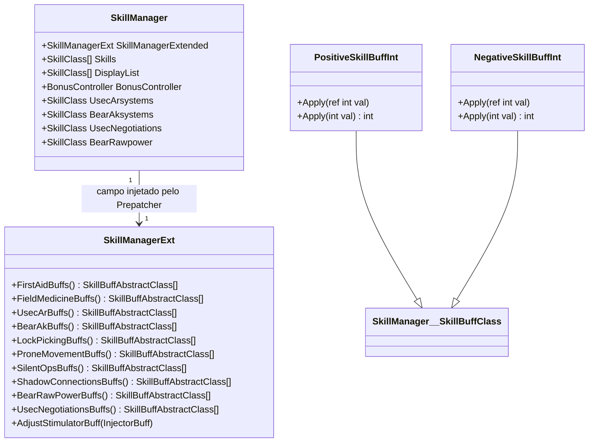
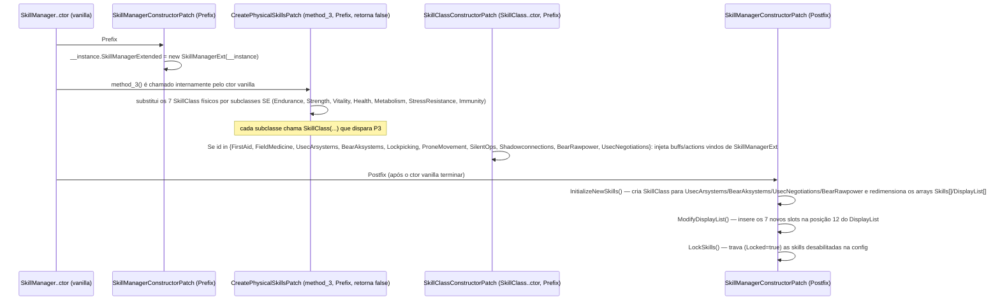

# Sistema Central de Skills e Buffs

## Visão geral

O núcleo do mod gira em torno de uma única classe, [`SkillManagerExt`](../original/Plugin/Skills/Core/SkillManagerExt.cs), que é anexada em runtime a **toda instância** de `EFT.SkillManager` através do campo `SkillManagerExtended` — campo esse que só existe porque o [Prepatcher](01-visao-geral-e-arquitetura.md#o-prepatcher--il-patching-com-monocecil) o injetou fisicamente no assembly do jogo antes do carregamento. Este documento cobre como esse campo é populado, como os buffs são definidos e como as skills novas/dormentes são "plugadas" no `SkillManager` vanilla via patches de construtor.



## `SkillManagerExt` — o registro central de buffs e ações

[`SkillManagerExt.cs`](../original/Plugin/Skills/Core/SkillManagerExt.cs) é um `class SkillManagerExt(SkillManager skillManager)` construído com referência de volta ao `SkillManager` dono. Ele expõe duas categorias de membros `readonly`:

- **Buffs** (`SkillManager.SkillBuffClass`, `NegativeSkillBuffInt`, ou `SkillManager.GClass2257` para buffs de nível elite) — cada um instanciado com um `Id = EBuffId.<NovoValor>` (os valores criados pelo Prepatcher).
- **Ações** (`SkillManager.SkillActionClass`) — os "gatilhos" de ganho de XP de cada skill nova.

Cada skill nova expõe um método público que **monta o array de buffs daquela skill a partir do JSON de configuração** (`SkillsExtendedPlugin.SkillData`, carregado do servidor — ver [documento 06](06-servidor-configuracao-e-web-ui.md)), aplicando a extensão `NormalizeToPercentage()` ([`MathExtensions.cs`](../original/Common/Extensions/MathExtensions.cs) — divide por 100, ex.: `0.75` vira `0.0075`) e os métodos fluentes `PerLevel(...)`, `.Elite(...)`, `.Max(...)`, `.Default(...)`, `.Factor(...)`, `.Where(...)`. **Esses métodos fluentes não são implementados neste mod** — pertencem à própria API de `SkillManager.SkillBuffAbstractClass`/`SkillActionClass` do EFT decompilado (Assembly-CSharp); o mod apenas os consome.

### Tabela de buffs novos (`EBuffId` injetados pelo Prepatcher)

| Skill | Campo em `SkillManagerExt` | `EBuffId` | Tipo de buff | Config-fonte (`SkillsConfig.json`) |
|---|---|---|---|---|
| First Aid | `FirstAidItemSpeedBuff` | `FirstAidHealingSpeed` | `SkillBuffClass` (PerLevel) | `FirstAid.ItemSpeedBonus` |
| First Aid | `FirstAidResourceCostBuff` | `FirstAidResourceCost` | `NegativeSkillBuffInt` (PerLevel) | `FirstAid.MedkitUsageReduction` |
| First Aid | `FirstAidMovementSpeedBuffElite` | `FirstAidMovementSpeedElite` | `GClass2257` (Elite) | — (booleano de nível elite) |
| Field Medicine | `FieldMedicineSkillCap` | `FieldMedicineSkillCap` | `SkillBuffClass` (PerLevel) | `FieldMedicine.SkillBonus` |
| Field Medicine | `FieldMedicineDurationBonus` | `FieldMedicineDurationBonus` | `SkillBuffClass` (PerLevel) | `FieldMedicine.DurationBonus` |
| Field Medicine | `FieldMedicineChanceBonus` | `FieldMedicineChanceBonus` | `SkillBuffClass` (PerLevel) | `FieldMedicine.PositiveEffectChanceBonus` |
| Usec Ar Systems | `UsecArSystemsErgoBuff` | `UsecArSystemsErgo` | `SkillBuffClass` (PerLevel) | `NatoWeapons.ErgoMod` |
| Usec Ar Systems | `UsecArSystemsRecoilBuff` | `UsecArSystemsRecoil` | `SkillBuffClass` (PerLevel) | `NatoWeapons.RecoilReduction` |
| Bear Ak Systems | `BearAkSystemsErgoBuff` | `BearAkSystemsErgo` | `SkillBuffClass` (PerLevel) | `EasternWeapons.ErgoMod` |
| Bear Ak Systems | `BearAkSystemsRecoilBuff` | `BearAkSystemsRecoil` | `SkillBuffClass` (PerLevel) | `EasternWeapons.RecoilReduction` |
| Lockpicking | `LockPickingTimeBuff` | `LockpickingTimeIncrease` | `SkillBuffClass` (PerLevel) | `LockPicking.PickStrengthPerLevel` |
| Lockpicking | `LockPickingForgiveness` | `LockpickingForgivenessAngle` | `SkillBuffClass` (PerLevel) | `LockPicking.SweetSpotRangePerLevel` |
| Lockpicking | `LockPickingUseBuffElite` | `LockpickingUseElite` | `GClass2257` (Elite) | — (uso infinito de picks) |
| Silent Ops | `SilentOpsIncMeleeSpeedBuff` | `SilentOpsIncMeleeSpeed` | `SkillBuffClass` (PerLevel) | `SilentOps.MeleeSpeedInc` |
| Silent Ops | `SilentOpsReduceVolumeBuff` | `SilentOpsRedVolume` | `SkillBuffClass` (PerLevel) | `SilentOps.VolumeReduction` |
| Silent Ops | `SilentOpsSilencerCostRedBuff` | `SilentOpsSilencerCostRed` | `SkillBuffClass` (PerLevel) | `SilentOps.SilencerPriceReduction` |
| Strength | `StrengthBushSpeedIncBuff` | `StrengthColliderSpeedBuff` | `SkillBuffClass` (Max) | `Strength.ColliderSpeedBuffMax` |
| Strength | `StrengthBushSpeedIncBuffElite` | `StrengthColliderSpeedBuffElite` | `GClass2257` (Elite) | — (ignora limitação de colisor) |
| Shadow Connections | `ScavCooldownTimeReductionBuff` | `ShadowConnectionsScavCooldownTimeDec` | `SkillBuffClass` (PerLevel) | `ShadowConnections.ScavCooldownTimeDec` |
| Shadow Connections | `CultistCircleReturnTimeReductionBuff` | `ShadowConnectionsCultistCircleReturnTimeDec` | `SkillBuffClass` (PerLevel) | `ShadowConnections.CultistCircleReturnTimeReduction` |
| Shadow Connections | `ScavCooldownTimeReductionEliteBuff` | `ShadowConnectionsScavCooldownTimeElite` | `GClass2257` (Elite) | — |
| Shadow Connections | `ScavGenerateAsCultistChance` | `ScavGenerateAsCultistChance` | `SkillBuffClass` (PerLevel) | `ShadowConnections.ScavGenerateAsCultistChance` |
| Bear Raw Power | `BearRawPowerPraporTraderCostDec` | `BearRawPowerPraporTraderCostDec` | `SkillBuffClass` (PerLevel) | `BearRawPower.PraporTradingCostDec` |
| Bear Raw Power | `BearRawPowerQuestRewardExpInc` | `BearRawPowerQuestRewardExpInc` | `SkillBuffClass` (PerLevel) | `BearRawPower.QuestExpRewardInc` |
| Bear Raw Power | `BearRawPowerAllTraderCostDec` | `BearRawPowerAllTraderCostDec` | `SkillBuffClass` (Elite) | `BearRawPower.AllTraderCostDecrease` |
| Usec Negotiations | `UsecNegotiationsPeacekeeperTraderCostDec` | `UsecNegotiationsPeacekeeperTraderCostDec` | `SkillBuffClass` (PerLevel) | `UsecNegotiations.PeacekeeperTradingCostDec` |
| Usec Negotiations | `UsecNegotiationRewardMoneyInc` | `UsecNegotiationRewardMoneyInc` | `SkillBuffClass` (PerLevel) | `UsecNegotiations.QuestMoneyRewardInc` |
| Usec Negotiations | `UsecNegotiationsAllTraderCostDec` | `UsecNegotiationsAllTraderCostDec` | `SkillBuffClass` (Elite) | `UsecNegotiations.AllTraderCostDecrease` |

> Nota: **Prone Movement** não tem buffs novos em `EBuffId` — ele reutiliza dois campos que já existem nativamente em `SkillManager` (`ProneMovementSpeed`, `ProneMovementVolume`), apenas alimentados com valores vindos do JSON via `ProneMovementBuffs()`.

### `SkillBuffs.cs` — os tipos de buff auxiliares deste mod

[`SkillBuffs.cs`](../original/Plugin/Skills/Core/SkillBuffs.cs) define dois tipos concretos que o mod adiciona à hierarquia de `SkillManager.SkillBuffClass`:

```csharp
public class PositiveSkillBuffInt : SkillManager.SkillBuffClass
{
    public void Apply(ref int val) => val = Mathf.CeilToInt(val * (1 + Value));
    public int Apply(int val) => Mathf.CeilToInt(val * (1 + Value));
}

public class NegativeSkillBuffInt : SkillManager.SkillBuffClass
{
    public void Apply(ref int val) => val = Mathf.CeilToInt(val * (1 - Value));
    public int Apply(int val) => Mathf.CeilToInt(val * (1 - Value));
}
```

Diferente do padrão de buffs `float` do vanilla (multiplicador direto), esses dois tipos existem para aplicar o buff em **valores inteiros** (ex.: o custo em "recursos" de um curativo, que precisa ser um `int`), arredondando sempre para cima (`CeilToInt`) para nunca zerar um custo por completo. `FirstAidResourceCostBuff` (usado em [`HealthEffectComponentPatch`](../original/Plugin/Skills/FirstAid/Patches/HealthEffectComponentPatch.cs), documento 04) é o principal consumidor de `NegativeSkillBuffInt.Apply`.

## Como as skills novas são "plugadas" no `SkillManager` vanilla

Três patches Harmony trabalham em conjunto, todos disparados no **construtor** de `SkillManager` ou `SkillClass` — ou seja, uma única vez por instância (por perfil/por jogador), não por frame.



### `SkillManagerConstructorPatch`

[`SkillManagerConstructorPatch.cs`](../original/Plugin/Skills/Core/Patches/SkillManagerConstructorPatch.cs) faz o patch mais fundamental — é o único ponto onde `SkillManagerExtended` é efetivamente instanciado:

- **Prefix**: `__instance.SkillManagerExtended = new SkillManagerExt(__instance);`
- **Postfix**: chama `InitializeNewSkills`, `ModifyDisplayList` e `LockSkills` (usa `AccessTools.Field(typeof(SkillClass), "Locked")` para escrever um campo privado via reflection).

`InitializeNewSkills` cria `SkillClass` novos apenas para as 4 skills que **não existem em nenhuma forma no vanilla**: `UsecArsystems`, `BearAksystems`, `UsecNegotiations`, `BearRawpower` (classes de skill `Combat`/`Special`). As outras três skills "novas" do ponto de vista do jogador — `Lockpicking`, `ProneMovement`, `SilentOps` — **já existem como campos em `SkillManager`** (dormentes/inativas no vanilla) e são apenas reaproveitadas nos arrays `Skills`/`DisplayList` (evidência direta: o código lê `skillManager.Lockpicking`, `skillManager.ProneMovement`, `skillManager.SilentOps` sem jamais instanciá-los — só os 4 realmente novos recebem `new SkillClass(...)`).

`Array.Resize(ref skills, skills.Length + 7)` mostra que os **7 novos slots de skill** adicionados ao array `Skills[]` são: `UsecArsystems`, `BearAksystems`, `Lockpicking`, `ProneMovement`, `SilentOps`, `UsecNegotiations`, `BearRawpower`.

### `CreateSkillPatches.cs` — `CreatePhysicalSkillsPatch`

[`CreateSkillPatches.cs`](../original/Plugin/Skills/Core/Patches/CreateSkillPatches.cs) faz o patch de `SkillManager.method_3` (Prefix retornando `false`, ou seja, **substitui totalmente** a lógica vanilla de criação das 7 skills físicas) por instâncias das subclasses do mod (ver [documento 03](03-skills-fisicas-e-combate.md)):

```csharp
__instance.Endurance = new EnduranceSkill(__instance);
__instance.Strength = new StrengthSkill(__instance);
__instance.Vitality = new VitalitySkill(__instance);
__instance.Health = new HealthSkill(__instance);
__instance.Metabolism = new MetabolismSkill(__instance);
__instance.StressResistance = new StressResistanceSkill(__instance);
__instance.Immunity = new ImmunitySkill(__instance);
return false;
```

### `SkillClassConstructorPatch`

[`SkillClassConstructorPatch.cs`](../original/Plugin/Skills/Core/Patches/SkillClassConstructorPatch.cs) faz Prefix no construtor **genérico** de `SkillClass(SkillManager, ESkillId, ESkillClass, SkillActionClass[], SkillBuffAbstractClass[])`. Ele intercepta os parâmetros `buffs`/`actions` **por referência** antes que o construtor vanilla os utilize, e — via `switch (id)` sobre o `ESkillId` — substitui os arrays vazios (`[]`) passados pelos criadores de cada `SkillClass` por aqueles retornados por `SkillManagerExt` (via `skillManager.SkillManagerExtended`). Cada `.Factor(x)` na ação define o multiplicador de XP daquela ação específica (ex.: `FirstAidAction.Factor(0.35f)`).

| `ESkillId` | Fator de XP das ações |
|---|---|
| `FirstAid` | `0.35` |
| `FieldMedicine` | `0.35` |
| `UsecArsystems` | `0.5` |
| `BearAksystems` | `0.5` |
| `Lockpicking` | `0.25` |
| `ProneMovement` | `0.25` |
| `SilentOps` | `0.75` (melee) / `0.50` (arma) |
| `Shadowconnections` | `1.0` |
| `BearRawpower` | `1.0` |
| `UsecNegotiations` | `1.0` |

### `SkillClassOnTriggerPatch` — guarda de `BonusController`

[`SkillClassOnTriggerPatch.cs`](../original/Plugin/Skills/Core/Patches/SkillClassOnTriggerPatch.cs) é um patch defensivo: `SkillClass.OnTrigger` (chamado sempre que uma skill sobe de nível/dispara um buff) depende de `SkillManager.BonusController`, que pode ainda não estar setado para as skills novas na primeira vez que disparam. O Prefix garante que, se `BonusController` for `null`, ele é resolvido a partir do perfil correto (`Savage` para scav, `Usec` para PMC — bear e usec compartilham o mesmo perfil de `BonusController`) antes de prosseguir.

## Bloqueio de skills por configuração (`LockSkills`)

`LockSkills` usa reflection para escrever o campo privado `Locked` de `SkillClass` com base nos flags `Enabled` do JSON de configuração — isso é o que faz uma skill aparecer "trancada" (ícone de cadeado) na árvore de skills do jogo quando desabilitada no [`SkillsConfig.json`](../original/Server/Resources/Configs/SkillsConfig.json):

| Skill | Config que controla o bloqueio |
|---|---|
| `UsecArsystems` | `NatoWeapons.Enabled` |
| `BearAksystems` | `EasternWeapons.Enabled` |
| `Lockpicking` | `LockPicking.Enabled` |
| `FieldMedicine` | `FieldMedicine.Enabled` |
| `FirstAid` | `FirstAid.Enabled` |
| `ProneMovement` | `ProneMovement.Enabled` |
| `SilentOps` | `SilentOps.Enabled` |
| `Shadowconnections` | `ShadowConnections.Enabled` |

`UsecNegotiations` e `BearRawpower` **não** são bloqueadas por `LockSkills` — em vez disso, sua visibilidade no painel de skills é controlada dinamicamente por [`SkillPanelDisablePatch`](../original/Plugin/Skills/UI/Patches/SkillPanelDisablePatch.cs) (ver [documento 03](03-skills-fisicas-e-combate.md)), que também considera a facção do jogador (`FactionLocked`).
