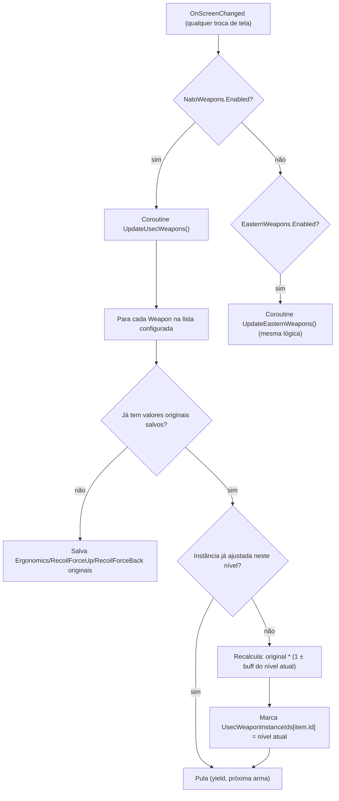
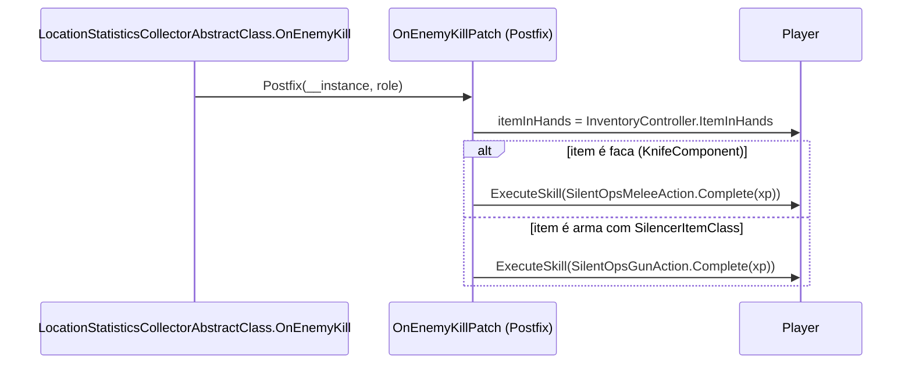

# Skills Físicas, Movimento e Combate

## Escopo deste documento

Cobre as 7 skills físicas do vanilla reimplementadas pelo mod ([`Plugin/Skills/SkillClasses/Physical/`](../original/Plugin/Skills/SkillClasses/Physical/)), as duas novas skills de proficiência de arma (`Plugin/Skills/WeaponSkills/`), Silent Ops (`Plugin/Skills/SilentOps/`), o patch de velocidade de Strength em obstáculos/vegetação (`Plugin/Skills/Strength/`) e Prone Movement (`Plugin/Skills/ProneMovement/`).

## Skills Físicas (`SkillClasses/Physical/`)

Todas as 7 skills físicas do jogo são **totalmente substituídas** pelo [`CreatePhysicalSkillsPatch`](../original/Plugin/Skills/Core/Patches/CreateSkillPatches.cs) (ver [documento 02](02-sistema-central-de-skills-e-buffs.md#createskillpatchescs--createphysicalskillspatch)) por subclasses próprias que herdam de `SkillClass` e sobrescrevem `GetActions`/`GetBuffs` — mas continuam usando os **mesmos campos de buff nativos** do `SkillManager` vanilla (ex.: `skillManager.EnduranceBuffEnduranceInc`), apenas alimentados com os multiplicadores vindos do [`SkillsConfig.json`](../original/Server/Resources/Configs/SkillsConfig.json) em vez dos valores hard-coded da BSG. Nenhum `EBuffId` novo é criado para essas 7 skills.

| Skill | Classe | Config (`Common/Config/Skills/`) | Observação |
|---|---|---|---|
| Endurance | [`EnduranceSkill.cs`](../original/Plugin/Skills/SkillClasses/Physical/EnduranceSkill.cs) | [`EnduranceData.cs`](../original/Common/Config/Skills/EnduranceData.cs) | XP de sprint/movimento só é concedido quando `Overweight > 0` OU `AlwaysLevelEndurance = true` |
| Strength | [`StrengthSkill.cs`](../original/Plugin/Skills/SkillClasses/Physical/StrengthSkill.cs) | [`StrengthData.cs`](../original/Common/Config/Skills/StrengthData.cs) | Também referencia o buff de arbusto/pântano criado por `SkillManagerExt` (`StrengthBushSpeedIncBuff`); `AlwaysLevelStrength` idem a Endurance |
| Vitality | [`VitalitySkill.cs`](../original/Plugin/Skills/SkillClasses/Physical/VitalitySkill.cs) | [`VitalityData.cs`](../original/Common/Config/Skills/VitalityData.cs) | Reduz chance de sangramento e aumenta "sobrevivibilidade" |
| Health | [`HealthSkill.cs`](../original/Plugin/Skills/SkillClasses/Physical/HealthSkill.cs) | [`HealthData.cs`](../original/Common/Config/Skills/HealthData.cs) | XP ganho é proporcional ao progresso de Endurance/Strength/Vitality (`SkillProgress.Where(IsSkillRelatedToHealth)`) |
| Metabolism | [`MetabolismSkill.cs`](../original/Plugin/Skills/SkillClasses/Physical/MetabolismSkill.cs) | [`MetabolismData.cs`](../original/Common/Config/Skills/MetabolismData.cs) | XP só quando hidratação/energia aumentam (`GreaterThanZero`) |
| Stress Resistance | [`StressResistanceSkill.cs`](../original/Plugin/Skills/SkillClasses/Physical/StressResistanceSkill.cs) | [`StressResistanceData.cs`](../original/Common/Config/Skills/StressResistanceData.cs) | Reduz efeitos de dor (`IPain`) e duração de baixo HP |
| Immunity | [`ImmunitySkill.cs`](../original/Plugin/Skills/SkillClasses/Physical/ImmunitySkill.cs) | [`ImmunityData.cs`](../original/Common/Config/Skills/ImmunityData.cs) | Reduz efeitos negativos de intoxicação (`IIntoxication`) e de estimuladores |

### Tabela de buffs por skill física

| Skill | Buff nativo alimentado | Fonte de config (`.NormalizeToPercentage()`) |
|---|---|---|
| Endurance | `EnduranceBuffEnduranceInc` (Max+Elite) | `BuffBreathTimeIncMax` / `BuffEnduranceIncElite` |
| Endurance | `EnduranceHands` (PerLevel+Elite) | `HandsPerLevel` / `HandsElite` |
| Endurance | `EnduranceBuffJumpCostRed` (Max) | `BuffJumpCostRedMax` |
| Endurance | `EnduranceBuffBreathTimeInc` (Max) | `BuffBreathTimeIncMax` |
| Endurance | `EnduranceBuffRestoration` (Max+Elite) | `BuffRestorationMax` / `BuffRestorationElite` |
| Strength | `StrengthBuffJumpHeightInc` / `LiftWeightInc` / `MeleePowerInc` / `SprintSpeedInc` / `ThrowDistanceInc` / `AimFatigue` (todos Max) | `Buff*Max` respectivos |
| Strength | `StrengthBuffMeleeCrits` (PerLevel+Elite) | `BuffMeleeCritsPerLevel` / `BuffMeleeCritsEliteBonus` |
| Strength | `SkillManagerExtended.StrengthBushSpeedIncBuff` (Max) + `...Elite` | `ColliderSpeedBuffMax` (ver [Strength — velocidade em obstáculos](#strength--velocidade-em-obstáculos-e-vegetação-swamp)) |
| Vitality | `VitalityBuffBleedChanceRed` (PerLevel) | `BuffBleedChanceRedPerLevel` |
| Vitality | `VitalityBuffSurviobilityInc` (PerLevel) | `BuffSurviobilityIncPerLevel` |
| Health | `HealthBreakChanceRed` / `HealthEnergy` / `HealthHydration` (PerLevel) | `BreakChanceRedPerLevel` / `EnergyPerLevel` / `HydrationPerLevel` |
| Metabolism | `MetabolismRatioPlus` / `MetabolismMiscDebuffTime` (PerLevel) | `RatioPlusPerLevel` / `MiscDebuffTimePerLevel` |
| Stress Resistance | `StressPain` / `StressTremor` (PerLevel) | `StressPainPerLevel` / `StressTremorPerLevel` |
| Immunity | `ImmunityMiscEffects` / `ImmunityPoisonBuff` / `ImmunityPainKiller` (PerLevel) | `MiscEffectsPerLevel` / `PoisonBuffPerLevel` / `PainKillerPerLevel` |
| Immunity | `ImmunityAvoidPoisonChance` / `ImmunityAvoidMiscEffectsChance` (Elite) | `AvoidPoisonChanceElite` / `AvoidMiscEffectsChanceElite` |

## Weapon Skills (`Usec Ar Systems` / `Bear Ak Systems`)

As duas skills de proficiência de arma (Usec = armas ocidentais/NATO, Bear = armas do leste) aumentam ergonomia e reduzem recoil de uma **lista configurável de `TemplateId`** de armas (`NatoWeapons.Weapons` / `EasternWeapons.Weapons`, `HashSet<string>` em [`WeaponSkillData.cs`](../original/Common/Config/Skills/WeaponSkillData.cs)).

### Aplicação do buff — `UpdateWeaponsPatch`

[`UpdateWeaponsPatch.cs`](../original/Plugin/Skills/WeaponSkills/Patches/UpdateWeaponsPatch.cs) faz Prefix em `MenuTaskBar.OnScreenChanged` (ou seja, dispara sempre que o jogador troca de tela no menu de stash/inventário) e inicia uma **coroutine** que percorre todas as armas do inventário do jogador cujo `TemplateId` está na lista configurada:



Os dicionários `UsecOriginalWeaponValues`/`EasternOriginalWeaponValues` (por `TemplateId`) guardam os valores **originais** da arma para que os recálculos sejam sempre feitos a partir da base, nunca cumulativamente; `UsecWeaponInstanceIds`/`EasternWeaponInstanceIds` (por `Id` de instância) evitam reprocessar uma arma que já foi ajustada no nível de skill atual.

### Ganho de XP — assinatura em `OnGameStartedPatch`

O ganho de XP de arma **não** depende de matar inimigos — é assinado ao evento nativo `Player.Skills.OnMasteringExperienceChanged` dentro de [`Shared/Patches/OnGameStarted.cs`](../original/Plugin/Skills/Shared/Patches/OnGameStarted.cs) (`ApplyNatoRifleXp`/`ApplyEasternRifleXp`), condicionado a `NatoWeapons.Enabled`/`EasternWeapons.Enabled`. Cada handler verifica se a arma **atualmente em mãos** (`Player.HandsController.GetItem()`) está na lista configurada antes de conceder XP; se `SkillShareEnabled`, uma fração (`SkillShareXpRatio`) do XP também é aplicada à skill "irmã" da outra facção (compartilhamento cross-faction).

| Config | Efeito |
|---|---|
| `Enabled` | Ativa/desativa a skill inteira (bloqueia via `LockSkills`) |
| `XpPerAction` | XP por evento de mastering |
| `SkillShareEnabled` / `SkillShareXpRatio` | Se a skill "irmã" também recebe uma fração do XP |
| `ErgoMod` / `RecoilReduction` | Percentual máximo de bônus por nível (buff `PerLevel`) |
| `Weapons` | Lista de `TemplateId` afetados |

## Silent Ops

Skill dormente do vanilla reativada para conceder: velocidade de ataque corpo-a-corpo, redução de volume sonoro de portas e desconto no custo de silenciadores.

| Patch | Método-alvo | Efeito |
|---|---|---|
| [`MeleeSpeedPatch.cs`](../original/Plugin/Skills/SilentOps/Patches/MeleeSpeedPatch.cs) | `ObjectInHandsAnimator.SetMeleeSpeed` (Prefix) | `speed *= 1 + SilentOpsIncMeleeSpeedBuff` — **ver o bug conhecido no [documento 01](01-visao-geral-e-arquitetura.md#diffs-conhecidos-vs-upstream)** |
| [`DoorSoundPatch.cs`](../original/Plugin/Skills/SilentOps/Patches/DoorSoundPatch.cs) | `WorldInteractiveObject.PlaySound` (Prefix, substitui totalmente) | Reduz o volume aleatório do som de abrir/ranger portas por `1 - SilentOpsReduceVolumeBuff`; desativado inteiramente na instância headless do Fika (`IsFikaHeadless`) |
| [`GetBarterPricePatch.cs`](../original/Plugin/Skills/SilentOps/Patches/GetBarterPricePatch.cs) (`GetBarterPricePatch`) | `TraderAssortmentControllerClass.GetBarterPrice` (Postfix) | Aplica desconto (`1 - SilentOpsSilencerCostRedBuff`) apenas a itens `SilencerItemClass` no preço de barganha |
| `GetBarterPricePatch.cs` (`RequiredItemsCountPatch`) | getter `RequiredItemsCount` (Postfix, reflection `PatchConstants.EftTypes`) | Mesma redução aplicada à contagem de itens requeridos, só quando o item selecionado é um silenciador |

Ganho de XP (`OnEnemyKillPatch.HandleSilentOps`, em [`Shared/Patches/OnEnemyKillPatch.cs`](../original/Plugin/Skills/Shared/Patches/OnEnemyKillPatch.cs)): concede XP de melee (`SilentOpsMeleeAction`) se o item em mãos tem `KnifeComponent`, ou XP de arma (`SilentOpsGunAction`) se a arma em mãos tem algum `SilencerItemClass` equipado — em ambos os casos, apenas se a skill não estiver no nível elite.



## Strength — velocidade em obstáculos e vegetação (swamp)

[`MovementContextSetSpeedLimitPatch.cs`](../original/Plugin/Skills/Strength/Patches/MovementContextSetSpeedLimitPatch.cs) substitui **inteiramente** (`Prefix` retorna `false`) o método vanilla `MovementContext.method_0`, que normalmente aplica limitações de velocidade quando o jogador está em colisores com "swamp speed limit" (vegetação densa, pântano). A versão do mod:

1. Recalcula as condições físicas (`EPhysicalCondition`) a partir dos colisores atualmente atravessados (`EnteredObstacles`).
2. Se o buff elite `StrengthBushSpeedIncBuffElite` está ativo, **pula completamente** a desativação de sprint/pulo que o vanilla aplicaria nesses colisores.
3. Se algum colisor tem `HasSwampSpeedLimit`, aplica um limite de velocidade de `1.0` (sem limite, elite) ou `0.2 * (1 + StrengthBushSpeedIncBuff)` (não-elite, buff incremental por nível) via `AddStateSpeedLimit(..., Player.ESpeedLimit.Swamp)`.

Isso é o que faz a skill Strength (nesta versão estendida) permitir atravessar vegetação densa mais rápido com o nível, culminando em velocidade normal no nível elite.

## Prone Movement

Skill dormente reativada para dar bônus de velocidade e redução de ruído enquanto rastejando (prone). Dois patches em [`ProneMoveStatePatch.cs`](../original/Plugin/Skills/ProneMovement/Patches/ProneMoveStatePatch.cs):

- **`ProneMoveStatePatch`** — Prefix em `MovementContext.ClampSpeed`, retorna `false` (substitui a lógica vanilla) apenas quando o estado atual é `ProneMoveStateClass` e é o jogador local (`player.IsYourPlayer`). Aplica `speed * (1 + ProneMovementSpeed)`, clampado ao `StateSpeedLimit`, e concede XP de ação (`ProneAction.Complete`) enquanto a skill não é elite. Tem `[HarmonyAfter(["RealismMod"])]` — ordena explicitamente este patch para rodar **depois** de um patch equivalente do mod RealismMod, indicando um problema de compatibilidade conhecido/mitigado entre os dois mods.
- **`ProneMoveVolumePatch`** — Prefix no getter `MovementContext.CovertMovementVolume`, aplica `volume * (1 - ProneMovementVolume)`, mesma condição de estado/jogador local.

| Config (`ProneMovementData`) | Efeito |
|---|---|
| `Enabled` | Ativa/desativa a skill |
| `XpPerAction` | XP por tick de movimento em prone |
| `MovementSpeedInc` | Bônus de velocidade por nível |
| `MovementVolumeDec` | Redução de ruído por nível |

## Painel de skills — visibilidade condicional por facção

[`SkillPanelDisablePatch.cs`](../original/Plugin/Skills/UI/Patches/SkillPanelDisablePatch.cs) faz Prefix em `SkillPanel.Show`, decidindo se o painel de uma skill é exibido:

```csharp
return skill.Id switch
{
    ESkillId.UsecNegotiations => SkillUtils.IsUsecNegotiationsAvailable(),
    ESkillId.BearRawpower => SkillUtils.IsBearRawPowerAvailable(),
    _ => !skill.Locked
};
```

[`SkillUtils.cs`](../original/Plugin/Utils/SkillUtils.cs) implementa `IsUsecNegotiationsAvailable`/`IsBearRawPowerAvailable`: além de checar `Enabled`, respeita `FactionLocked` — se travado por facção, só aparece para Usec (Negotiations) ou Bear (Raw Power) respectivamente; se não travado, aparece para ambas as facções.
