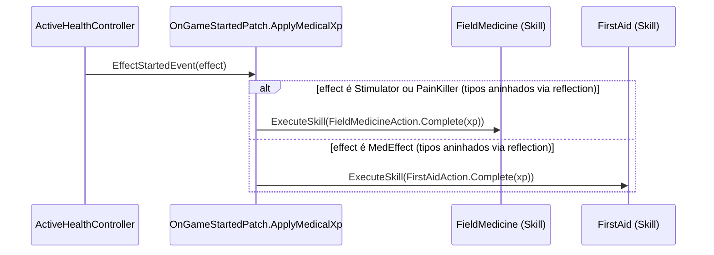
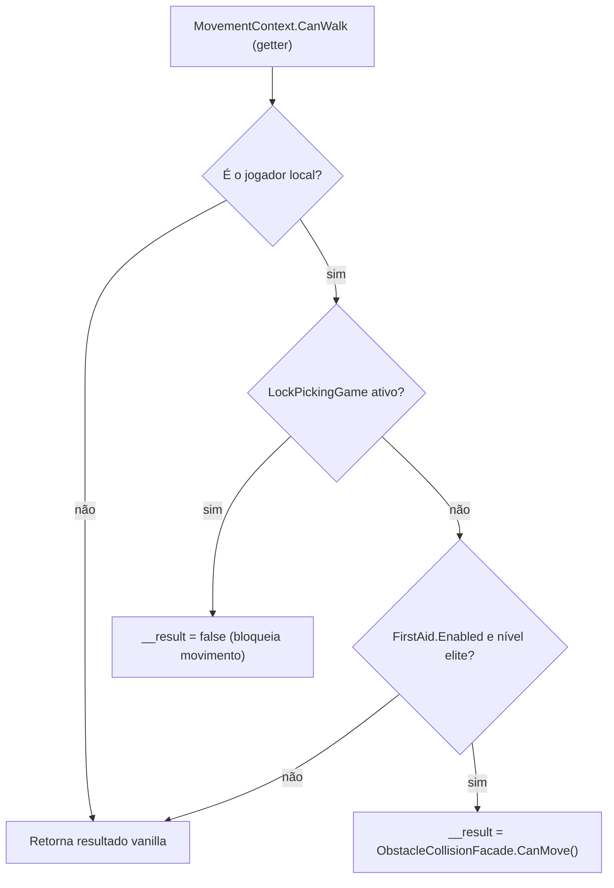

# Medicina de Campo (Field Medicine e First Aid)

## Visão geral

Duas skills de suporte médico com patches concentrados em [`Plugin/Skills/FieldMedicine/`](../original/Plugin/Skills/FieldMedicine/) e [`Plugin/Skills/FirstAid/`](../original/Plugin/Skills/FirstAid/). Ambas compartilham a mesma fonte de XP — o evento nativo `Player.ActiveHealthController.EffectStartedEvent`, assinado uma única vez em [`OnGameStartedPatch`](../original/Plugin/Skills/Shared/Patches/OnGameStarted.cs) — mas atuam sobre efeitos de tipos diferentes.



Os três tipos `Stimulator`, `PainKiller` e `MedEffect` são classes **aninhadas privadas** de `ActiveHealthController` no assembly do jogo — só acessíveis via reflection (`GetNestedTypes(BindingFlags.NonPublic | BindingFlags.Instance)`), resolvidas uma única vez em `GetTargetMethod()` do patch.

## Field Medicine

Field Medicine aumenta o **teto máximo de bônus** que estimuladores/analgésicos podem conceder (normalmente capado em nível 51 no vanilla) e ajusta a duração/chance de efeitos positivos dos injetáveis.

### `AdjustStimulatorBuff` — o cálculo central

Definido em [`SkillManagerExt.cs`](../original/Plugin/Skills/Core/SkillManagerExt.cs):

```csharp
public void AdjustStimulatorBuff(InjectorBuff injectorBuff)
{
    injectorBuff.Duration *= 1f + FieldMedicineDurationBonus;
    if (!injectorBuff.Chance.ApproxEquals(1f))
    {
        injectorBuff.Chance *= 1f + FieldMedicineChanceBonus;
    }
}
```

`Chance` só é ajustada se não for exatamente `1.0` (100% de chance) — efeitos garantidos não recebem bônus de chance, apenas de duração.

### Novo teto de skill cap

O vanilla limita a contribuição de um `Buff` (nível efetivo do estimulador) a `51` (nível elite). O mod eleva esse teto proporcionalmente ao bônus configurado:

```csharp
var newSkillCap = 60 * (1 + skillManager.SkillManagerExtended.FieldMedicineSkillCap);
```

Esse cálculo aparece em **três** patches, sempre com o mesmo padrão (`60 * (1 + FieldMedicineSkillCap)`), cada um cobrindo um ponto de leitura diferente do jogo:

| Patch | Método-alvo | Papel |
|---|---|---|
| [`AbstractSkillClassSummaryLevelPatch.cs`](../original/Plugin/Skills/FieldMedicine/Patches/AbstractSkillClassSummaryLevelPatch.cs) | getter `AbstractSkillClass.SummaryLevel` (Prefix, retorna `false`) | Recalcula o "nível de resumo" (level + buff) usado por toda a UI/lógica de skill, usando o novo teto em vez do `51` fixo |
| [`StimulatorApplyBuffPatch.cs`](../original/Plugin/Skills/FieldMedicine/Patches/StimulatorApplyBuffPatch.cs) | `ActiveHealthController.Stimulator.smethod_0` (Prefix, retorna `false`, reflection) | Recalcula o valor efetivo do buff do estimulador aplicado ao jogador, clampado ao novo teto em vez do limite vanilla |
| [`PersonalBuffPatch.cs`](../original/Plugin/Skills/FieldMedicine/Patches/PersonalBuffPatch.cs) | `BuffSettings.GetPersonalBuffSettings` (Postfix) | Aplica `AdjustStimulatorBuff` a uma cópia (`.Clone()`) do buff pessoal calculado, para refletir duração/chance ajustadas |
| [`PersonalBuffStringPatches.cs`](../original/Plugin/Skills/FieldMedicine/Patches/PersonalBuffStringPatches.cs) (`PersonalBuffFullStringPatch`) | `InjectorBuff.GetStringValue` (Prefix) | Ajusta uma cópia do buff **antes** de gerar a string de descrição/tooltip, para que o texto mostrado ao jogador já reflita os valores modificados |

Todos os três primeiros patches checam `SkillsExtendedPlugin.SkillData.FieldMedicine.Enabled` e retornam cedo (delegando ao comportamento vanilla, `return true`/sem sobrescrever) se a skill estiver desabilitada ou o `SkillManager` for `null`.

| Config (`FieldMedicineData`) | Efeito |
|---|---|
| `Enabled` | Ativa/desativa a skill |
| `XpPerAction` | XP por uso de estimulador/analgésico |
| `SkillBonus` | Multiplicador do novo teto de skill cap (`60 * (1 + SkillBonus)`) |
| `DurationBonus` | Bônus percentual de duração de efeitos de injetáveis |
| `PositiveEffectChanceBonus` | Bônus percentual de chance de efeitos positivos (ignorado se `Chance == 1.0`) |

## First Aid

First Aid reduz o tempo de uso de itens médicos, o custo de recursos consumidos por curativos, e — no nível elite — permite se mover livremente durante o tratamento.

| Patch | Método-alvo | Efeito |
|---|---|---|
| [`HealthEffectUseTimePatch.cs`](../original/Plugin/Skills/FirstAid/Patches/HealthEffectUseTimePatch.cs) (`HealthEffectUseTimePatch`) | getter `HealthEffectsComponent.UseTime` (Postfix) | `result *= 1 - FirstAidItemSpeedBuff` — reduz o tempo de uso do item |
| `HealthEffectUseTimePatch.cs` (`SpawnPatch`) | `Player.MedsController.Spawn` (Prefix) | `animationSpeed *= 1 + FirstAidItemSpeedBuff` — acelera a animação de uso proporcionalmente |
| [`HealthEffectComponentPatch.cs`](../original/Plugin/Skills/FirstAid/Patches/HealthEffectComponentPatch.cs) | construtor `HealthEffectsComponent(Item, IHealthEffect)` (Postfix) | Reduz o **custo em recursos** (`Cost`) de curar `LightBleeding`, `HeavyBleeding` e `Fracture`, via `FirstAidResourceCostBuff.Apply(ref cost)` (`NegativeSkillBuffInt`, arredonda para cima) |
| [`CanWalkPatch.cs`](../original/Plugin/Skills/FirstAid/Patches/CanWalkPatch.cs) | getter `MovementContext.CanWalk` (Postfix) | Ver seção abaixo — patch "de dupla função" |

### `HealthEffectComponentPatch` — rastreamento de custo original

Este patch mantém dois dicionários estáticos por `TemplateId` do item médico:

- `OriginalCosts` — guarda o custo **original** (antes de qualquer buff) de cada tipo de dano curável, para que o recálculo nunca componha sobre um valor já reduzido.
- `InstanceIdsChangedAtLevel` — registra em qual nível de First Aid o template já foi ajustado, evitando reprocessamento redundante na mesma sessão/nível (resetado via `ResetLevelChangedAt` quando o nível muda).

Há também uma checagem defensiva não documentada no código-fonte (`meds.TemplateId.LocalizedName().Contains("Name")` → `return`) marcada com o comentário `// Why? -- I don't know, but leave it for now because something probably broke` — comportamento preservado tal como está no upstream, sem explicação adicional disponível no código.

### `CanWalkPatch` — patch de dupla função

Este patch é notável por servir **dois propósitos não relacionados** no mesmo método:

1. **Bloqueio de movimento durante o minigame de lockpicking**: se `LockPickingHelpers.LockPickingGame.activeSelf` (minigame de lockpicking ativo), força `__result = false` incondicionalmente para o jogador local, independente de qualquer configuração de First Aid.
2. **Bônus elite de First Aid**: se a skill First Aid estiver habilitada e no nível elite (`FirstAidMovementSpeedBuffElite`), usa `ObstacleCollisionFacade.CanMove()` em vez do resultado vanilla — permitindo o jogador se mover livremente por obstáculos que normalmente bloqueariam `CanWalk` enquanto trata ferimentos.



| Config (`FirstAidData`) | Efeito |
|---|---|
| `Enabled` | Ativa/desativa a skill |
| `XpPerAction` | XP por uso de item médico do tipo `MedEffect` |
| `MedkitUsageReduction` | Redução percentual do custo de recursos de curativos por nível |
| `ItemSpeedBonus` | Redução percentual do tempo de uso de itens médicos por nível |

## Referências cruzadas

- O buff `FirstAidMovementSpeedElite` e os três buffs de Field Medicine (`FieldMedicineSkillCap`, `FieldMedicineDurationBonus`, `FieldMedicineChanceBonus`) são valores de `EBuffId` criados pelo [Prepatcher](01-visao-geral-e-arquitetura.md#o-prepatcher--il-patching-com-monocecil) — ver tabela completa no [documento 02](02-sistema-central-de-skills-e-buffs.md).
- Os fatores de XP (`0.35` para ambas as skills) são definidos em [`SkillClassConstructorPatch`](02-sistema-central-de-skills-e-buffs.md#skillclassconstructorpatch).
