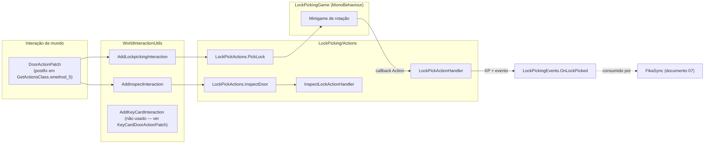
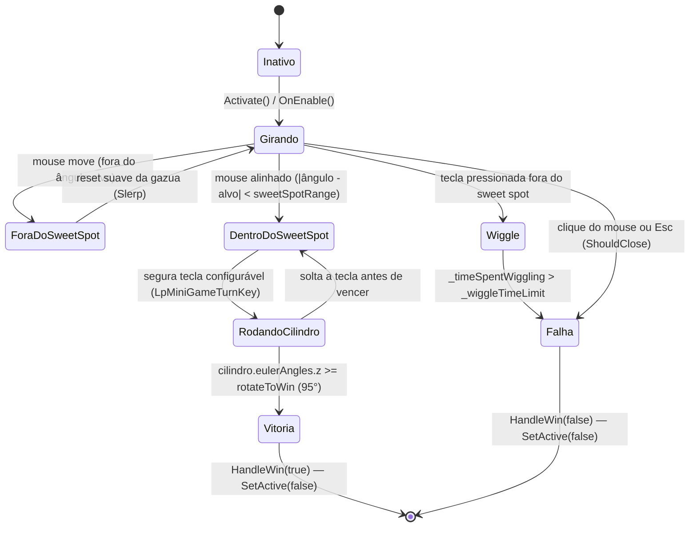

# Lockpicking e Minigame

## Visão geral

O subsistema de Lockpicking ([`Plugin/Skills/LockPicking/`](../original/Plugin/Skills/LockPicking/)) é o mais complexo do mod: adiciona uma interação de contexto em portas trancadas, um minigame de arrombamento estilo Skyrim/Fallout (girar a gazua até achar o "ponto doce", depois girar o cilindro), um sistema de dificuldade por porta/mapa, e uma trilha (hoje desativada) de hacking de portas com fechadura eletrônica via keycard.



## Registro da interação de contexto

[`DoorActionPatch.cs`](../original/Plugin/Skills/LockPicking/Patches/DoorActionPatch.cs) faz Postfix em `GetActionsClass.smethod_5` (o método interno do EFT que monta a lista de ações de interação de um `WorldInteractiveObject`, ex. "Abrir", "Fechar"). Antes de adicionar qualquer ação, valida em cascata:

1. `Singleton<GameWorld>.Instance?.MainPlayer` existe (não é a instância headless).
2. Se `SkillsExtendedInfo.IsFikaPresent` é `true` **mas** `SkillsExtendedInfo.SyncPluginPresent` é `false` → aborta sem adicionar nada. Isso evita que jogadores em uma partida Fika vejam o minigame de lockpicking se o companheiro [`FikaSync`](07-multiplayer-fika.md) não estiver instalado (o estado da porta não seria sincronizado entre peers).
3. `SkillsExtendedPlugin.SkillData.LockPicking.Enabled`.
4. `!WorldInteractionUtils.IsBotInteraction(owner)` — só jogadores reais, não bots.
5. `owner.Player.Side != EPlayerSide.Savage` — scavs não podem arrombar fechaduras.

Se tudo passar: `worldInteractiveObject.AddLockpickingInteraction(...)` e `.AddInspectInteraction(...)`.

> [`KeyCardDoorActionPatch.cs`](../original/Plugin/Skills/LockPicking/Patches/KeyCardDoorActionPatch.cs) — o equivalente para portas com fechadura eletrônica (`KeycardDoor`) — está marcado `[IgnoreAutoPatch]` e todo o corpo do Postfix está comentado. **A trilha de "hackear terminal com Flipper Zero" existe no código (`Actions/HackingActionHandler.cs`, `LockPickActions.HackTerminal`, `WorldInteractionUtils.AddKeyCardInteraction`) mas está desativada/incompleta nesta versão** — o próprio `LockPickActions.HackTerminal` termina com um comentário `// TODO RE-IMPLEMENT THIS` sem nunca invocar o `Action<bool>` construído.

### `WorldInteractionUtils.cs` — validação e construção das ações

[`WorldInteractionUtils.cs`](../original/Plugin/Skills/LockPicking/WorldInteractionUtils.cs) define os métodos de extensão que constroem os itens de menu:

| Método | Condição de validade | Ação no clique |
|---|---|---|
| `AddLockpickingInteraction` | `IsDoorValidForLockPicking`: porta `Locked`, `Operatable`, e `KeyId` presente em `SkillsExtendedPlugin.Keys.KeyLocale` | `LockPickActions.PickLock` |
| `AddInspectInteraction` | `IsValidDoorForInspect`: mesmas condições + `KeyId` não vazio | `LockPickActions.InspectDoor` |
| `AddKeyCardInteraction` (não chamado em produção) | idem, para `KeycardDoor` | `LockPickActions.HackTerminal` (incompleto) |

Se a porta não é válida mas já está `Open`/`Shut`, nenhuma ação é adicionada (evita poluir o menu de portas já abertas/fechadas manualmente). Caso contrário, uma ação "Door cannot be opened" desabilitada é mostrada.

## Dificuldade por porta e por mapa

[`LockPickingHelpers.cs`](../original/Plugin/Skills/LockPicking/LockPickingHelpers.cs) mantém o dicionário estático `LocationDoorIdLevels`, que mapeia o `LocationId` do SPT (ex. `"bigmap"`, `"laboratory"`, `"Sandbox"`) para o sub-dicionário de nível por `DoorId` correspondente em [`LockPickingData.DoorPickLevels`](../original/Common/Config/Skills/LockpickingData.cs):

| Mapa (`LocationId`) | Campo em `DoorPickLevels` |
|---|---|
| `factory4_day`, `factory4_night` | `Factory` |
| `Woods` | `Woods` |
| `bigmap` | `Customs` |
| `Interchange` | `Interchange` |
| `RezervBase` | `Reserve` |
| `Shoreline` | `Shoreline` |
| `laboratory` | `Labs` |
| `Lighthouse` | `Lighthouse` |
| `TarkovStreets` | `Streets` |
| `Sandbox`, `Sandbox_high` | `GroundZero` |
| `Labyrinth` | `Labyrinth` |

`GetLevelForDoor(locationId, doorId)` retorna `-1` se a porta não constar na tabela (gerando notificações de erro visíveis ao jogador, pedindo para reportar ao desenvolvedor — ver `LockPickActions.ShowErrorNotification` e `OnGameStartedPatch.LogMissingDoors` em modo `DEBUG`).

`InitializeLockpickingForLocation(location)` é chamado uma vez por raid, a partir de [`OnGameStartedPatch`](../original/Plugin/Skills/Shared/Patches/OnGameStarted.cs), e **pré-computa** o `_sweetSpotRange` de **cada porta do mapa** de uma vez (armazenado em `DoorSweetSpotRanges`), usando a fórmula:

```
skillMod   = 1 + LockPickingForgiveness (buff da skill)
doorMod    = clamp(nível_da_porta / 35, 0.05, 1.5)
sweetSpot  = clamp((SweetSpotRangeBase - doorMod) * skillMod, 0, 20)   // em graus
```

Também zera `InspectedDoors`, `DoorAttempts` (contadores de tentativa/falha) a cada nova raid.

## Fluxo de uma tentativa de arrombamento

```mermaid
sequenceDiagram
    participant UI as Menu de interação
    participant LPA as LockPickActions.PickLock
    participant Game as LockPickingGame (MonoBehaviour)
    participant Handler as LockPickActionHandler
    participant Events as LockPickingEvents

    UI->>LPA: TryPickLock()
    LPA->>LPA: Tem lock pick no inventário? (TemplateId fixo 6622c28aed7e3bc72e301e22)
    LPA->>LPA: Tentativas < AttemptsBeforeBreak?
    LPA->>LPA: Jogador parado (IdleStateClass / OldIdleState)?
    LPA->>Game: Activate(owner, door, handler.PickLockAction, sweetSpotRange)
    Game->>Game: Update() a cada frame — gira gazua, detecta sweet spot, gira cilindro
    alt Cilindro gira >= rotateToWin (95°)
        Game->>Handler: PickLockAction(true)
        Handler->>Handler: ApplyLockPickActionXp() + InteractiveObject.Unlock()
        Handler->>Events: InvokeLockPickAction({Unlocked=true})
    else Tempo de wiggle esgotado OU Esc/clique
        Game->>Handler: PickLockAction(false)
        Handler->>Handler: incrementa DoorAttempts; se >= AttemptsBeforeBreak: quebra a fechadura
        Handler->>Handler: ApplyLockPickActionXp(isFailure: true) + RemoveUseFromLockPick()
        Handler->>Events: InvokeLockPickAction({Broken?, Attempts})
    end
```

### `LockPickingGame.cs` — máquina de estados do minigame

[`LockPickingGame.cs`](../original/Plugin/Skills/LockPicking/LockPickingGame.cs) é um `MonoBehaviour` carregado a partir de um `AssetBundle` (`bundles/doorlock.bundle`, instanciado uma vez com `DontDestroyOnLoad` em `LockPickingHelpers.LoadMiniGame`, chamado em `SkillsExtendedPlugin.Start()`) e ativado/desativado via `SetActive(true/false)` — nunca destruído durante a sessão.



Mecânica passo a passo (`Update()`, roda a cada frame enquanto o `GameObject` está ativo):

1. **`MoveLockPick()`** mapeia a posição X do mouse na tela (`0..Screen.width`) para um ângulo de `0` a `180°` na gazua (`lockpick.eulerAngles`). `_inSweetSpot` é `true` quando `|_lockPickSetAngle - lockpick.eulerAngles.z| < _sweetSpotRange`.
2. Enquanto a tecla configurável (`ConfigManager.LpMiniGameTurnKey`, padrão `A` — ver [PROPRIEDADES.md](../PROPRIEDADES.md)) está pressionada (`_isRotating`):
   - Se dentro do sweet spot: `MoveCylinder()` gira o cilindro visualmente e, ao atingir `rotateToWin` (95°), chama `HandleWin(true)`.
   - Se fora do sweet spot: `ResetCylinder(wiggle: true)` faz a gazua "tremer" (posição aleatória pequena) e acumula `_timeSpentWiggling`; se ultrapassar `_wiggleTimeLimit`, `HandleWin(false)` (derrota por tempo).
3. Soltar a tecla fora do sweet spot: `ResetCylinder()` sem wiggle, apenas retorna o cilindro suavemente à posição zero (`Vector3.Slerp`).
4. `ShouldClose()` (clique esquerdo/direito do mouse ou `Esc`) força `HandleWin(false)` a qualquer momento — abandonar a tentativa conta como derrota.

`_lockPickSetAngle` (o ângulo-alvo secreto) é sorteado (`Random.Range(0, 180)`) a cada `Activate()`. `_sweetSpotRange` (graus de tolerância) e `_wiggleTimeLimit` (segundos antes de falhar por tempo) são recebidos prontos de `LockPickingHelpers.DoorSweetSpotRanges`/calculados via `SetTimeLimit(doorLevel)` — a mesma fórmula de `skillMod`/`doorMod` explicada acima, mas para o tempo:

```
skillMod = 1 + LockPickingTimeBuff
doorMod  = clamp(nível_da_porta / 50, 0.05, 1)
tempo    = clamp((PickStrengthBase - doorMod) * skillMod, 1, 20) segundos, randomizado ±10%
```

Também existe um modo `ActivatePractice(doorLevel)` (sem `WorldInteractiveObject` real), usado presumivelmente para treino/depuração, que recalcula `_sweetSpotRange` localmente via `SetSweetSpotRange` em vez de receber o valor pré-computado.

Em `DEBUG`, o jogo desenha um indicador visual do sweet spot (`sweetSpotIndicator`, uma barra colorida verde/amarela) — código inteiramente compilado fora de builds de release.

### Consequências de vitória/derrota (`LockPickActionHandler`)

[`LockPickActionHandler.cs`](../original/Plugin/Skills/LockPicking/Actions/LockPickActionHandler.cs):

- **Vitória** (`unlocked = true`): `ApplyLockPickActionXp(door, owner)`, `InteractiveObject.Unlock()`, dispara `LockPickingEvents.OnLockPicked` com `{DoorId, Unlocked = true}`.
- **Derrota** (`unlocked = false`): incrementa `LockPickingHelpers.DoorAttempts[doorId]`; se atingir `AttemptsBeforeBreak`, `BreakLock()` — zera `KeyId`, marca `Operatable = false` e chama `DoorStateChanged(EDoorState.None)`, tornando a porta **permanentemente impossível de arrombar ou destrancar com chave** pelo resto da raid. Aplica XP reduzido (`ApplyLockPickActionXp(isFailure: true)`) e consome um uso da gazua via `RemoveUseFromLockPick()` — **a menos que** o buff elite `LockPickingUseBuffElite` esteja ativo (uso infinito de gazuas no nível elite). Se a gazua (`KeyItemClass`) atinge `MaximumNumberOfUsage`, é descartada do inventário (`InteractionsHandlerClass.Discard`); falha nessa operação lança `SkillsExtendedException`.

### Inspeção de fechadura (`InspectLockActionHandler`)

[`InspectLockActionHandler.cs`](../original/Plugin/Skills/LockPicking/Actions/InspectActionHandler.cs) é uma ação passiva e sem risco: mostra o nome da chave e o nível da porta via notificação (`LockPickingHelpers.DisplayInspectInformation`), concede XP reduzido (`InspectLockXpRatio`) e só pode ser usada **uma vez por porta por raid** (deduplicado por `LockPickingHelpers.InspectedDoors`).

### Tabela de XP

`ApplyLockPickActionXp` busca o XP base na tabela `LockPickingData.XpTable` (`Dictionary<string, float>`, chave = nível da porta como string) e aplica dois multiplicadores independentes:

| Cenário | Multiplicador |
|---|---|
| Inspeção (não é tentativa de arrombar) | `× InspectLockXpRatio` |
| Falha (tentativa de arrombar sem sucesso) | `× FailureLockXpRatio` |
| Skill já elite | XP **não** é concedido (early return) |

## Tabela de configuração (`LockPickingData`)

| Campo | Efeito |
|---|---|
| `Enabled` | Ativa/desativa toda a skill (bloqueia via `LockSkills`, esconde a interação de contexto) |
| `PickStrengthBase` / `PickStrengthPerLevel` | Base do tempo de wiggle antes de falhar, e bônus por nível (via `LockPickingTimeBuff`) |
| `SweetSpotRangeBase` / `SweetSpotRangePerLevel` | Base do ângulo de tolerância, e bônus por nível (via `LockPickingForgiveness`) |
| `AttemptsBeforeBreak` | Tentativas falhas permitidas antes da fechadura quebrar permanentemente |
| `InspectLockXpRatio` | Multiplicador de XP para a ação de inspecionar |
| `FailureLockXpRatio` | Multiplicador de XP para uma tentativa falha |
| `XpTable` | XP base por nível de porta (chave = nível como string) |
| `DoorPickLevels` | Nível de dificuldade por `DoorId`, por mapa (ver tabela acima) |

O F12 expõe apenas o keybind de girar o cilindro (`LP Mini Game > Turn Cylinder Key bind`, padrão `A`) — todo o resto é ajustado via [`SkillsConfig.json`](../original/Server/Resources/Configs/SkillsConfig.json) ou pela Web UI (ver [PROPRIEDADES.md](../PROPRIEDADES.md) e [documento 06](06-servidor-configuracao-e-web-ui.md)).

## Itens envolvidos

| Item | `TemplateId` | Papel |
|---|---|---|
| Gazua (lock pick) | `6622c28aed7e3bc72e301e22` | Consumível necessário para iniciar `PickLock`; tem usos limitados (`KeyComponent.NumberOfUsages`) a menos que elite |
| Flipper Zero | `662400eb756ca8948fe64fe8` | Necessário para `HackTerminal` (trilha desativada); pulado explicitamente na importação de itens do servidor (`DatabaseImporter.CreateItems`, comentário `// Skip PDA for now`) |
