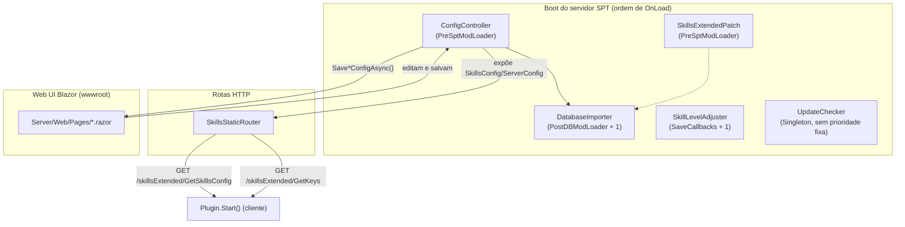
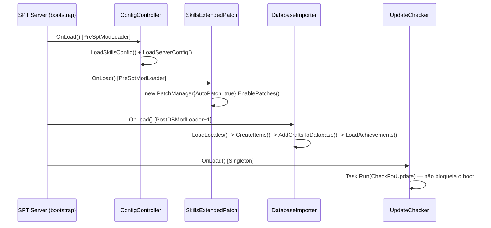

# Servidor, Configuração e Web UI

## Visão geral

O projeto [`Server/`](../original/Server/) é um mod C# server-side para SPT 4.0.2 (`net9.0`, `SPTarkov.Server.Core`/`Server.Web` 4.0.2 via NuGet). Ele usa o padrão de injeção de dependência (`[Injectable]`) e o ciclo de vida `IOnLoad` do SPT 4.0, expõe rotas HTTP estáticas consumidas pelo cliente, aplica patches Harmony **do lado do servidor**, injeta itens/receitas/locales/conquistas no banco de dados, e serve uma Web UI Blazor de configuração.

Para o catálogo de configuração F12 do lado cliente, ver [PROPRIEDADES.md](../PROPRIEDADES.md) — este documento não duplica aquele conteúdo.

## Bootstrap e DI (`Server/Core/`)

Cada classe abaixo é registrada via `[Injectable]` (do pacote `SPTarkov.DI.Annotations`) e implementa `IOnLoad`, com uma prioridade de carregamento (`OnLoadOrder`) definida no atributo:

| Classe | `OnLoadOrder` | Responsabilidade |
|---|---|---|
| [`ConfigController.cs`](../original/Server/Core/ConfigController.cs) | `PreSptModLoader` | Carrega/salva `SkillsConfig.json` e `ServerConfig.json` de `Server/Resources/Configs/`; detecta se o Fika está entre os mods carregados (`loadedMods.Any(m => m.ModMetadata.ModGuid == "Fika")`) |
| [`SkillsExtendedPatch.cs`](../original/Server/Core/SkillsExtendedPatch.cs) | `PreSptModLoader` | Instancia um `PatchManager { AutoPatch = true }` e chama `EnablePatches()` — **o mesmo padrão de auto-descoberta de patches do lado cliente** (documento 01), mas aqui varrendo as subclasses de `AbstractPatch` em `Server/Patches/` |
| [`DatabaseImporter.cs`](../original/Server/Core/DatabaseImporter.cs) | `PostDBModLoader + 1` | Importa locales, cria itens (gazua, Flipper Zero) via clone, adiciona receitas de hideout e conquistas ao banco |
| [`SkillLevelAdjuster.cs`](../original/Server/Core/SkillLevelAdjuster.cs) | `SaveCallbacks + 1` | Expõe helpers de leitura de skills (`GetPmcSkillsForProfile`/`GetScavSkillsForProfile`) sobre todos os perfis salvos — usado pela Web UI ([`SkillLevelChanger.razor`](../original/Server/Web/Pages/SkillLevelChanger.razor)) |
| [`UpdateChecker.cs`](../original/Server/Core/UpdateChecker.cs) | `Singleton` | Consulta a API do GitHub (`CJ-SPT/Skills-Extended/releases/latest`) de forma assíncrona e não-bloqueante, se `ServerConfig.CheckForUpdates` estiver ativo e o build não for beta |

### `DatabaseImporter` — importação de dados

- **Locales**: lê todos os arquivos de [`Server/Resources/Locales/`](../original/Server/Resources/Locales/) (um por idioma, ex. `en.json`), usa o `en` como base para **todos** os idiomas do jogo (`AddTransformer`) e depois sobrescreve com o conteúdo específico de cada idioma disponível — garante que o mod nunca fique com texto ausente em idiomas sem tradução completa.
- **Itens**: lê [`Server/Resources/Items/Items.json`](../original/Server/Resources/Items/) e cria cada item via `customItemService.CreateItemFromClone`. Um item (`662400eb756ca8948fe64fe8` — o Flipper Zero, apesar do comentário no código dizer `// Skip PDA for now`) é explicitamente pulado nesta importação. Itens criados são adicionados aos filtros de slots especiais (`AddItemToSpecSlots`, alvo: pockets/rig com IDs `627a4e6b255f7527fb05a0f6` e `65e080be269cbd5c5005e529`).
- **Crafts**: lê [`Items/Crafting.json`](../original/Server/Resources/Items/) e adiciona receitas de hideout (`HideoutProduction`).
- **Achievements**: lê todos os arquivos de [`Server/Resources/Achievements/`](../original/Server/Resources/Achievements/) e os adiciona ao banco de conquistas.

### `GetKeyLocales` — a ponte de nomes de chave

`DatabaseImporter.GetKeyLocales()` varre todos os itens do banco cuja classe base é `KEY`/`KEY_MECHANICAL`, extrai o nome localizado (`{itemId} Name`) e monta o `KeysData` servido pela rota `/skillsExtended/GetKeys`. É este dicionário (`KeyLocale: Dictionary<TemplateId, NomeLocalizado>`) que o cliente usa para exibir "DOOR KEY: <nome>" no minigame de lockpicking e para validar se uma porta tem uma chave conhecida (ver [documento 05](05-lockpicking-e-minigame.md)).

## Rotas HTTP (`SkillsStaticRouter`)

[`SkillsStaticRouter.cs`](../original/Server/Core/SkillsStaticRouter.cs) registra duas rotas estáticas, consumidas exclusivamente pelo `SkillsExtendedPlugin.Start()` do cliente via `SPT.Common.Http.RequestHandler.GetJson`:

| Rota | Retorna | Consumida por |
|---|---|---|
| `/skillsExtended/GetSkillsConfig` | `ConfigController.SkillsConfig` serializado | `SkillsExtendedPlugin.SkillData` (estático, cliente) |
| `/skillsExtended/GetKeys` | `DatabaseImporter.GetKeyLocales()` serializado | `SkillsExtendedPlugin.Keys` (estático, cliente) |

Esse mecanismo é o que permite editar `SkillsConfig.json` (ou usar a Web UI) e ter o cliente refletir a mudança **sem recompilar o plugin** — a configuração só é resolvida em tempo de execução, na conexão inicial do cliente com o servidor.

## Patches Harmony do lado servidor (`Server/Patches/`)

Todos herdam de `AbstractPatch` (`SPTarkov.Reflection.Patching`, o equivalente server-side do `ModulePatch` cliente) e resolvem suas dependências via `ServiceLocator.ServiceProvider.GetRequiredService<T>()` — não recebem DI por construtor, pois são instanciados internamente pelo `PatchManager`, não pelo container de DI.

| Patch | Método-alvo | Efeito |
|---|---|---|
| `StartSacrificePatch` (em [`CultistProductionPatch.cs`](../original/Server/Patches/CultistProductionPatch.cs)) | `CircleOfCultistService.StartSacrifice` | Captura o `sessionId` do perfil que inicia um sacrifício no círculo dos cultistas, para uso pelo patch seguinte |
| `CultistProductionPatch` | `CircleOfCultistService.GetCircleCraftingInfo` (Postfix) | Reduz o tempo de retorno do círculo dos cultistas com base no nível de Shadow Connections (`ShadowConnections.CultistCircleReturnTimeReduction`) |
| [`GeneratePlayerScavPatch.cs`](../original/Server/Patches/GeneratePlayerScavPatch.cs) | `BotGenerator.GeneratePlayerScav` (Prefix + Postfix) | Chance (`ScavGenerateAsCultistChance × nível`) de o scav do jogador spawnar como `sectantWarrior`, herdando aparência e vida cheia do template do bot |
| [`GetTraderAssortPatch.cs`](../original/Server/Patches/GetTraderAssortPatch.cs) | `TraderAssortHelper.GetAssort` (Postfix) | Aplica descontos acumulativos ao preço em dinheiro de barganhas: Peacekeeper (Usec Negotiations), Prapor (Bear Raw Power), e descontos "todos os traders" no nível elite de cada skill |
| [`QuestExperienceRewardPatch.cs`](../original/Server/Patches/QuestExperienceRewardPatch.cs) | `RewardHelper.ApplyRewards` (Postfix) | Bônus de XP de missão (`BearRawPower.QuestExpRewardInc × nível`), respeitando `FactionLocked` |
| [`QuestMoneyRewardPatch.cs`](../original/Server/Patches/QuestMoneyRewardPatch.cs) | `QuestRewardHelper.GetQuestMoneyRewardBonusMultiplier` (Postfix) | Bônus de recompensa em dinheiro de missão (`UsecNegotiations.QuestMoneyRewardInc × nível`) |
| [`ScavCooldownTimerPatch.cs`](../original/Server/Patches/ScavCooldownTimerPatch.cs) | `PlayerScavGenerator.SetScavCooldownTimer` (Prefix, retorna `false`) | Reduz o cooldown de scav run com base no nível de Shadow Connections; nível elite reduz o cooldown para ~5 segundos |

### Descontos de trader — regra de acumulação

`GetTraderAssortPatch.ModifyMoneyPrice` acumula um `discount` (float, aditivo) considerando, nesta ordem: desconto Peacekeeper (Usec), desconto Prapor (Bear), desconto "todos os traders" elite de Usec Negotiations, desconto "todos os traders" elite de Bear Raw Power. O desconto final é clampado entre `10%` e `100%` do preço original (`Math.Clamp(1 - discount, 0.10f, 1.0f)`) — ou seja, **nunca é possível zerar o preço**, o piso é sempre 10% do valor original.

### `SkillUtil.cs` — helper compartilhado

[`Server/Utils/SkillUtil.cs`](../original/Server/Utils/SkillUtil.cs) centraliza a leitura de nível de skill a partir de um `MongoId` de perfil: `TryGetSkillLevel` (nível clampado entre `0` e `5100` — que dividido por 100 dá o range vanilla `0..51`) e `IsEliteLevel` (`skillLevel == 51`). Usado por praticamente todos os patches server-side acima.

## Metadados do mod (`SeModMetadata`)

[`Metadata.cs`](../original/Server/Metadata.cs) implementa `AbstractModMetadata`/`IModWebMetadata` (o contrato de metadados de mod do SPT 4.0), declarando `ModGuid = "com.cj.SkillsExtended"`, `SptVersion = ~4.0.2`, `IsBundleMod = true` e a licença CC BY-NC-ND. `SeModMetadata.ResourcesDirectory` (calculado a partir da localização do assembly em execução) é a base de todos os caminhos de leitura/escrita de configuração e recursos.

## Configuração via JSON

| Arquivo | Conteúdo | Modelo |
|---|---|---|
| [`Server/Resources/Configs/SkillsConfig.json`](../original/Server/Resources/Configs/SkillsConfig.json) | Todos os parâmetros numéricos de todas as skills (XP, bônus por nível, listas de armas, dificuldade de lockpicking por porta/mapa) | [`SkillsConfig.cs`](../original/Common/Config/SkillsConfig.cs) — agrega um modelo `*Data` por skill em `Common/Config/Skills/` |
| [`Server/Resources/Configs/ServerConfig.json`](../original/Server/Resources/Configs/ServerConfig.json) | Apenas `CheckForUpdates` (bool) | [`ServerConfig.cs`](../original/Server/Models/ServerConfig.cs) |

O detalhamento campo-a-campo de cada `*Data` (Endurance, Strength, LockPicking, etc.) está distribuído pelos documentos temáticos correspondentes (03, 04, 05) — este documento cobre apenas o mecanismo de carregamento/persistência, não repete os valores.

## Web UI (Blazor)

Servida em `https://localhost:6969/skills-extended/` enquanto o servidor SPT está rodando (ver [PROPRIEDADES.md](../PROPRIEDADES.md)), a partir de [`Server/Web/`](../original/Server/Web/) e assets estáticos em `Server/wwwroot/`.

| Página (`.razor`) | Skill configurada |
|---|---|
| [`Home.razor`](../original/Server/Web/Pages/Home.razor) | Página inicial/índice |
| [`SkillLevelChanger.razor`](../original/Server/Web/Pages/SkillLevelChanger.razor) | Editor de nível de skill por perfil salvo (usa `SkillLevelAdjuster`) |
| [`SkillConfigs/FirstAid.razor`](../original/Server/Web/Pages/SkillConfigs/FirstAid.razor) | First Aid |
| [`SkillConfigs/FieldMedicine.razor`](../original/Server/Web/Pages/SkillConfigs/FieldMedicine.razor) | Field Medicine |
| [`SkillConfigs/NatoRifle.razor`](../original/Server/Web/Pages/SkillConfigs/NatoRifle.razor) | Usec Ar Systems |
| [`SkillConfigs/EasternRifle.razor`](../original/Server/Web/Pages/SkillConfigs/EasternRifle.razor) | Bear Ak Systems |
| [`SkillConfigs/Lockpicking.razor`](../original/Server/Web/Pages/SkillConfigs/Lockpicking.razor) | Lockpicking |
| [`SkillConfigs/ProneMovement.razor`](../original/Server/Web/Pages/SkillConfigs/ProneMovement.razor) | Prone Movement |
| [`SkillConfigs/SilentOps.razor`](../original/Server/Web/Pages/SkillConfigs/SilentOps.razor) | Silent Ops |
| [`SkillConfigs/Endurance.razor`](../original/Server/Web/Pages/SkillConfigs/Endurance.razor) | Endurance |
| [`SkillConfigs/Strength.razor`](../original/Server/Web/Pages/SkillConfigs/Strength.razor) | Strength |
| [`SkillConfigs/Vitality.razor`](../original/Server/Web/Pages/SkillConfigs/Vitality.razor) | Vitality |
| [`SkillConfigs/Health.razor`](../original/Server/Web/Pages/SkillConfigs/Health.razor) | Health |
| [`SkillConfigs/Metabolism.razor`](../original/Server/Web/Pages/SkillConfigs/Metabolism.razor) | Metabolism |
| [`SkillConfigs/StressResistance.razor`](../original/Server/Web/Pages/SkillConfigs/StressResistance.razor) | Stress Resistance |
| [`SkillConfigs/Immunity.razor`](../original/Server/Web/Pages/SkillConfigs/Immunity.razor) | Immunity |
| [`SkillConfigs/ShadowConnections.razor`](../original/Server/Web/Pages/SkillConfigs/ShadowConnections.razor) | Shadow Connections |
| [`SkillConfigs/BearRawPower.razor`](../original/Server/Web/Pages/SkillConfigs/BearRawPower.razor) | Bear Raw Power |
| [`SkillConfigs/UsecNegotiations.razor`](../original/Server/Web/Pages/SkillConfigs/UsecNegotiations.razor) | Usec Negotiations |
| [`Layouts/BaseLayout.razor`](../original/Server/Web/Layouts/BaseLayout.razor) / [`Shared/NavMenu.razor`](../original/Server/Web/Shared/NavMenu.razor) | Layout e navegação compartilhados |

> Não foi possível confirmar, apenas pela leitura estática dos `.razor`, o mecanismo exato de persistência acionado por cada botão de salvar da Web UI (presumivelmente `ConfigController.SaveSkillsConfig`/`SaveServerConfig`) — marcado aqui como **a confirmar** caso um binding diferente seja usado internamente pelas páginas.
