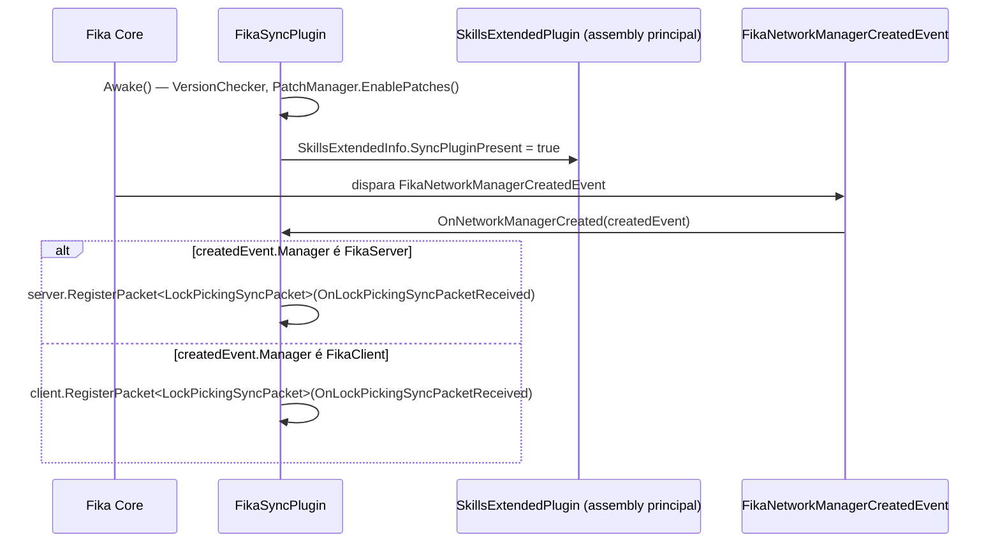
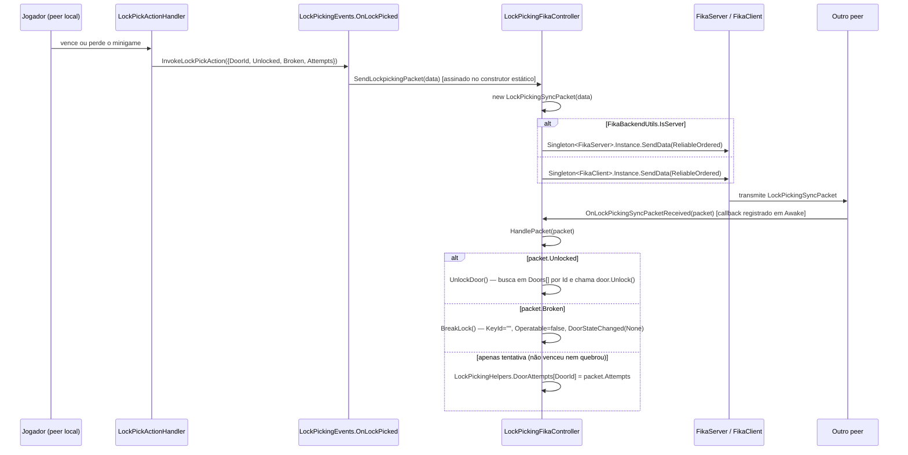

# Multiplayer (Fika)

## Visão geral

[`FikaSync/`](../original/FikaSync/) é um **plugin BepInEx separado e opcional** (`SkillsExtendedFika.dll`, GUID `com.cj.SkillsExtendedFika`), não incluído no `.zip` de release principal do mod (o `__BUILD_RELEASE__` explicitamente o remove da pasta de plugins do release principal e o empacota em um `.zip` à parte — ver [documento 01](01-visao-geral-e-arquitetura.md)). Ele existe exclusivamente para sincronizar o estado do **minigame de lockpicking** entre os peers de uma partida Fika (host/cliente), já que sem ele cada jogador veria o estado da porta de forma dessincronizada.

## Dependência: hard, não soft

Ao contrário do plugin principal — que trata Fika como `SoftDependency` — o `FikaSync` declara duas dependências **obrigatórias** via `[BepInDependency]` "hard" (sem `DependencyFlags.SoftDependency`):

```csharp
[BepInDependency("com.cj.SkillsExtended", SkillsExtendedInfo.MIN_MOD_VERSION_FOR_SYNC)] // >= 2.2.0
[BepInDependency("com.fika.core", SkillsExtendedInfo.MIN_FIKA_VERSION)]                  // >= 2.2.4
```

| Comparação | Plugin principal | FikaSync |
|---|---|---|
| Dependência de `com.cj.SkillsExtended` | N/A (é o próprio) | Hard, `>= 2.2.0` |
| Dependência de `com.fika.core` | Soft (`DependencyFlags.SoftDependency`) | Hard, `>= 2.2.4` |
| Comportamento sem a dependência | Continua funcionando (Fika ausente = single-player normal) | BepInEx recusa carregar o plugin inteiramente |

Isso reflete a natureza do `FikaSync`: ele **só faz sentido** em uma partida multiplayer com o mod principal já carregado — não há um "modo degradado" a suportar.

## Ciclo de vida (`FikaSyncPlugin.cs`)

[`FikaSyncPlugin.cs`](../original/FikaSync/FikaSyncPlugin.cs) segue o mesmo padrão do plugin principal: valida a versão do EFT ([`VersionChecker.cs`](../original/FikaSync/VersionChecker.cs) — uma cópia praticamente idêntica do checker do plugin principal, mas como classe separada neste assembly), registra seus próprios `ModulePatch` via `new PatchManager(this, true).EnablePatches()`, e depois:

```csharp
SkillsExtendedInfo.SyncPluginPresent = true;
FikaEventDispatcher.SubscribeEvent<FikaNetworkManagerCreatedEvent>(OnNetworkManagerCreated);
```

O flag estático `SkillsExtendedInfo.SyncPluginPresent = true` é a peça-chave de integração entre os dois assemblies: o plugin principal consulta esse flag em [`DoorActionPatch`](05-lockpicking-e-minigame.md#registro-da-interação-de-contexto) para decidir se mostra ou esconde a interação de lockpicking quando `IsFikaPresent` também é verdadeiro.



## Captura das portas (`OnGameStartedPatch`)

[`FikaSync/Patches/OnGameStartedPatch.cs`](../original/FikaSync/Patches/OnGameStartedPatch.cs) é um `ModulePatch` **próprio deste assembly**, distinto do [`OnGameStartedPatch` do plugin principal](../original/Plugin/Skills/Shared/Patches/OnGameStarted.cs) — ambos fazem Postfix no mesmo método vanilla (`GameWorld.OnGameStarted`), mas cada um roda no seu próprio assembly/instância de Harmony e faz um trabalho diferente:

- **Plugin principal**: inicializa a dificuldade de lockpicking do mapa (`LockPickingHelpers.InitializeLockpickingForLocation`), assina XP de medicina/armas, corrige portas com chave ausente.
- **FikaSync**: chama `LockPickingFikaController.GetDoors()`, que varre `LocationScene.GetAllObjectsAndWhenISayAllIActuallyMeanIt<WorldInteractiveObject>()` e guarda em uma lista estática (`Doors`) **apenas** as portas com `KeyId` não vazio — essa lista é usada depois para localizar a porta correta ao aplicar um pacote de sincronização recebido da rede.

## Fluxo de sincronização de um arrombamento



### `LockPickingSyncPacket` — payload de rede

[`Packets/LockPickingSyncPacket.cs`](../original/FikaSync/Packets/LockPickingSyncPacket.cs) implementa `INetSerializable` (contrato do LiteNetLib usado internamente pelo Fika):

| Campo | Tipo | Origem |
|---|---|---|
| `DoorId` | `string` | `WorldInteractiveObject.Id` da porta afetada |
| `Attempts` | `int` | Contador de tentativas falhas acumuladas para aquela porta |
| `Unlocked` | `bool` | `true` se a porta foi destrancada com sucesso |
| `Broken` | `bool` | `true` se a fechadura foi quebrada permanentemente |

Serialização é manual e posicional (`writer.Put(...)`/`reader.Get...()`, mesma ordem nos dois lados) — não há versionamento de schema do pacote em si; a compatibilidade de protocolo é garantida pelo `[BepInDependency]` hard em `MIN_MOD_VERSION_FOR_SYNC`/`MIN_FIKA_VERSION`.

### `LockPickingFikaController` — roteamento de pacotes

[`Controllers/LockPickingFikaController.cs`](../original/FikaSync/Controllers/LockPickingFikaController.cs) é uma classe `static` cujo construtor estático já assina `LockPickingEvents.OnLockPicked += SendLockpickingPacket` — ou seja, a assinatura acontece na primeira vez que a classe é tocada pelo CLR (tipicamente ao registrar o patch `OnGameStartedPatch` deste assembly), sem exigir uma chamada de inicialização explícita.

`GetDoors()` precisa ser chamada a cada raid (o que o `OnGameStartedPatch` deste assembly garante) porque a lista `Doors` é estática e persistiria portas de uma raid anterior/mapa diferente se não fosse limpa (`Doors.Clear()` no início do método).

## `VersionChecker.cs` — checagem de versão duplicada

[`VersionChecker.cs`](../original/FikaSync/VersionChecker.cs) neste assembly é estruturalmente **idêntico** ao `VersionChecker` privado dentro de [`SkillsExtendedPlugin.cs`](../original/Plugin/SkillsExtendedPlugin.cs) do plugin principal (mesmo `TARKOV_VERSION`, mesmo `ErrorLabelDrawer` desenhando o aviso vermelho no F12). Isso é esperado — cada assembly BepInEx precisa da sua própria verificação de compatibilidade de build do EFT, já que `FikaSyncPlugin` pode ser carregado independentemente (embora dependa em cascata do plugin principal via `[BepInDependency]`).

## Por que a sincronização é necessária

Sem o `FikaSync`, cada peer processaria o minigame de lockpicking **inteiramente localmente** — `LockPickingGame`, `LockPickActionHandler` e o estado de `WorldInteractiveObject` (que é replicado pelo Fika via seu próprio sistema, mas não instantaneamente nem com garantia de causar o mesmo efeito colateral de "quebrar a fechadura" nos outros peers). O pacote customizado garante que:

1. Quando um peer destranca uma porta pelo minigame, todos os outros peers também chamam `Unlock()` naquela mesma instância local do objeto, refletindo o estado imediatamente.
2. Quando uma fechadura quebra (excesso de tentativas falhas), todos os peers aplicam a mesma penalidade (`KeyId` vazio, `Operatable = false`) — evitando que um peer veja a porta arrombável enquanto outro já a vê como definitivamente quebrada.
3. O contador de tentativas (`DoorAttempts`) fica consistente entre peers, para que o limite `AttemptsBeforeBreak` seja respeitado globalmente e não por peer.
