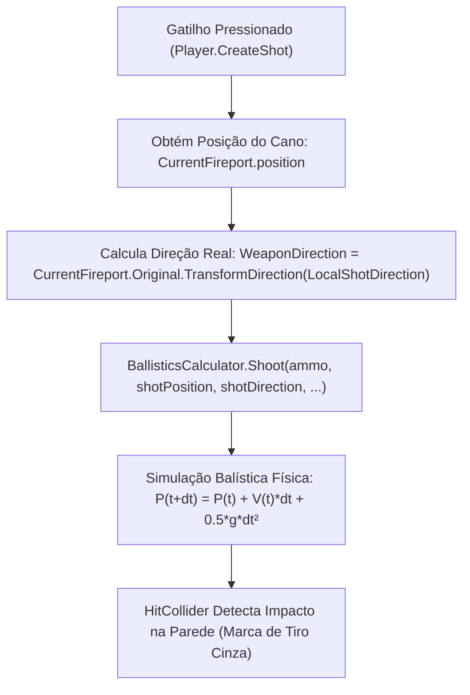

# Relatório Técnico — Como o EFT Calcula o Hit da Munição e Como Sincronizar o Laser

> **Objetivo:** Engenharia reversa de como o Escape From Tarkov calcula o ponto de saída do tiro, a trajetória do projétil e o ponto de impacto (Hit), com a modelagem matemática para fazer o `LaserBeam` seguir a mesmíssima linha de tiro da arma.

---

## 1. Como o Hit da Munição (Tiro) é Calculado no EFT

Inspecionando os métodos `Player.FirearmController.CreateShot()` e `InitiateShot()` no Assembly descompilado do EFT:

### Os 3 Pilares da Balística Real do Tarkov:

1. **Origem do Projétil (`shotPosition`):**
   - Nasce em `CurrentFireport.position` (a ponta física do osso `fireport` na boca do cano).
2. **Vetor de Direção do Disparo (`WeaponDirection`):**
   - Calculado através da matriz de mundo do osso do cano:
     $$\vec{D}_{tiro} = \text{CurrentFireport.Original.TransformDirection}(\text{\_player.LocalShotDirection})$$
   - Onde `LocalShotDirection = Vector3.down` (convenção de modelagem 3D do rig da BSG onde o eixo `-up` aponta para a frente do cano).
3. **Trajetória e Ponto de Impacto (Hit):**
   - O `BallisticsCalculator` simula a gravidade ($g = -9.81\text{ m/s}^2$) e o arrasto do ar (`airDrag`).
   - Em distâncias de CQB (0 a 30 metros), o tempo de voo é inferior a $0.03\text{s}$, fazendo com que o projétil atinja a parede em **linha reta perfeita ao longo de $\vec{D}_{tiro}$**.

---

## 2. Por que o Tiro sempre segue o Alinhamento Perfeito da Arma?

- O `fireport` é um osso filho do corpo da arma (`HandsContainer.Weapon`).
- Qualquer rotação ou translação aplicada na arma pelo mod é transmitida de forma rígida e imediata para `CurrentFireport.Original`.
- Quando o jogador atira, o tiro sai **sempre na direção física real para onde o cano está virado**.

---

## 3. Por que o Laser divergia da Marca do Tiro?

| Característica | **O Tiro (Munição)** | **O Laser (`LaserBeam`)** |
| :--- | :--- | :--- |
| **Origem** | `CurrentFireport.position` (Boca do cano) | `base.transform.position` (Lente do acessório) |
| **Vetor de Direção** | `CurrentFireport.Original.TransformDirection(Vector3.down)` | `base.transform.forward` (Transform do slot tático) |
| **Ponto Fraco** | Sempre lê a matriz consolidada do cano | Se o slot tático tiver micro-rotação de montagem ou se a hierarquia sofrer defasagem no `LateUpdate`, o `transform.forward` aponta para um vetor diferente de `WeaponDirection` |

---

## 4. A Fórmula para o Laser Seguir o Tiro (Convergência Perfeita)

Para que o feixe do laser e o ponto vermelho na parede fiquem **100% idênticos ao local onde a bala acerta**:

1. **Origem:** O laser continua nascendo fisicamente na lente do módulo tático (`startPos = base.transform.position`).
2. **Direção:** Em vez de usar `base.transform.forward`, o raycast do laser passa a usar **o mesmo vetor de disparo da arma**:
   $$\vec{D}_{laser} = \text{Player.FirearmController.WeaponDirection}$$
3. **Renderização do Feixe e do Ponto:**
   - O raycast é disparado: `Physics.Raycast(startPos, WeaponDirection, out hitInfo, ...)`.
   - O feixe 3D é desenhado alinhado com a direção do cano: `Graphics.DrawMesh(mesh_1, startPos, Quaternion.LookRotation(WeaponDirection), ...)`.
   - O ponto 2D na parede é desenhado em `hitInfo.point`.

---

## 5. Conclusão

Atrelando o vetor do laser ao `WeaponDirection` (que rege a balística real do Tarkov), garantimos que:
- O feixe saia da lente do acessório na lateral da arma.
- O feixe viaje em linha paralela perfeita ao cano.
- O ponto vermelho na parede acerte **exatamente no buraco cinza da bala**, eliminando qualquer erro de alinhamento em qualquer ângulo de CQB.
