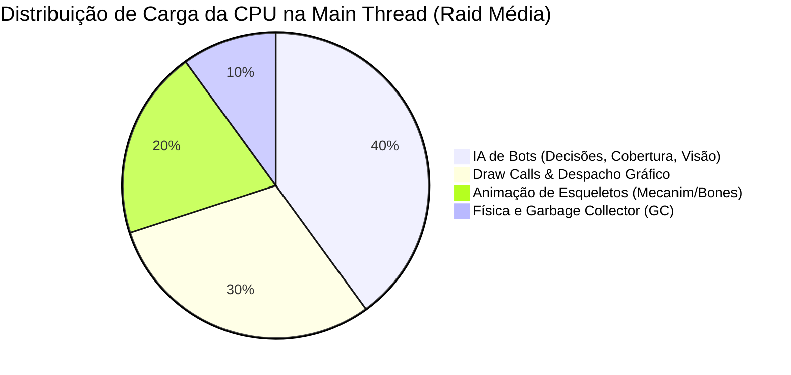

# Diagnóstico de Desempenho de CPU e Motor — TRL-CoreSight

Este documento consolida a arquitetura técnica, os gargalos de CPU e as frentes de otimização identificadas para o Escape from Tarkov (SPT 4.0.13 / EFT 0.16.9). Ele serve como base para orientar o desenvolvimento do **TRL-CoreSight** e será expandido conforme os mods já instalados no servidor forem mapeados e analisados.

---

## 1. A Realidade da CPU na Unity e o Mito do Multithread

No Escape from Tarkov, a esmagadora maioria dos subsistemas roda restrita a **uma única thread principal (Main Thread)**.

* **Trava da Main Thread (Unity C++):** Qualquer chamada que acesse ou altere objetos da Unity (`Transform`, `GameObject`, `Component`, `Physics`, `Animator`, `NavMesh`, `Camera`) só pode ser feita na Main Thread. Chamadas em threads secundárias disparam `UnityException`.
* **Uso Real de Multithreading da BSG:** O jogo já utiliza o **Unity C# Job System** (`IJob`, `IJobParallelFor`), mas apenas para estruturas com dados puros (structs blittable sem referências a classes gerenciadas):
  - Interseção de frustum no [`CullingManager.cs:111`](file:///d:/Projetos/GITHUB%20TARKOV/tarkov-spt-4.0/references/eft-decompiled/Assembly-CSharp/CullingManager.cs#L111).
  - Oclusão de iluminação em [`GStruct77.cs:8`](file:///d:/Projetos/GITHUB%20TARKOV/tarkov-spt-4.0/references/eft-decompiled/Assembly-CSharp/GStruct77.cs#L8).
  - Controle climático em [`ToDController.cs:19`](file:///d:/Projetos/GITHUB%20TARKOV/tarkov-spt-4.0/references/eft-decompiled/Assembly-CSharp/EFT.Weather/ToDController.cs#L19).
* **O Desafio do SPT:** Como a máquina local atua simultaneamente como **Cliente E Servidor**, ela processa todo o loop de simulação das IAs e a renderização do jogador, concentrando o peso em 1 ou 2 núcleos da CPU.

---

## 2. Divisão de Subsistemas: IA / Bots vs. Motor / Mundo

### 🤖 Grupo 1: Relacionado a IA / Bots
*(Responsável por 60% a 70% do gargalo contínuo da CPU no SPT)*

| Subsistema | Descrição do Custo na CPU | Referência no Código | Estratégia de Otimização no CoreSight |
| :--- | :--- | :--- | :--- |
| **Árvore de Decisão** | Avaliação contínua da máquina de estados e tática de cada bot (atacar, recuar, curar, patrulhar). | [`AICoreControllerClass.cs:37`](file:///d:/Projetos/GITHUB%20TARKOV/tarkov-spt-4.0/references/eft-decompiled/Assembly-CSharp/AICoreControllerClass.cs#L37) | **Time-Slicing**: Escalar a taxa de decisão de bots distantes ou fora de combate (ex: de 60Hz para 15Hz). |
| **Busca de Cobertura** | Varredura contínua de pontos de abrigo no mapa através de grafos de nós. | [`CoverPointMaster.cs:9`](file:///d:/Projetos/GITHUB%20TARKOV/tarkov-spt-4.0/references/eft-decompiled/Assembly-CSharp/CoverPointMaster.cs#L9) | **Cache de Cobertura**: Reutilização temporal de pontos já computados; evitar recalcular todo segundo. |
| **Sensores de Visão** | Múltiplos raycasts por segundo checando linha de visão contra jogadores e outros bots. | `BotLookSensor` / `EnemyChooser` | **Limitação Angular e de Distância**: Throttling de checagens quando não há alvos próximos. |
| **Navegação (NavMesh)** | Recálculo de rotas, desvios e interpolação de curvas de movimento. | [`BotMover.cs:8`](file:///d:/Projetos/GITHUB%20TARKOV/tarkov-spt-4.0/references/eft-decompiled/Assembly-CSharp/BotMover.cs#L8) | **Path Throttle**: Diminuir a frequência de cálculo de caminho para bots que patrulham rotas longas. |
| **Esqueleto e Animações** | Cálculo das matrizes de transformação de mais de 60 ossos por bot a cada frame. | [`PlayableAnimator.cs:9`](file:///d:/Projetos/GITHUB%20TARKOV/tarkov-spt-4.0/references/eft-decompiled/Assembly-CSharp/FastAnimatorSystem/PlayableAnimator.cs#L9) | **Animation LOD / Culling**: Setar `AnimatorCullingMode.CullUpdateTransforms` para bots fora de visão. |

---

### 🌐 Grupo 2: NÃO Relacionado a IA / Bots (Motor, Mundo e Renderização)
*(Responsável por 30% a 40% do gargalo da CPU e pelos micro-travamentos / stutters)*

| Subsistema | Descrição do Custo na CPU | Referência no Código | Estratégia de Otimização no CoreSight |
| :--- | :--- | :--- | :--- |
| **Draw Calls (Despacho)** | A CPU prepara os buffers e comandos de milhares de objetos estáticos e dinâmicos para a GPU. | [`CullingManager.cs:10`](file:///d:/Projetos/GITHUB%20TARKOV/tarkov-spt-4.0/references/eft-decompiled/Assembly-CSharp/CullingManager.cs#L10) | **Layer Cull Distances**: Descartar detritos, caixas vazias e pequenos props a distâncias menores. |
| **Cálculo de Sombras** | A CPU projeta as 4 passadas de cascata de sombra da luz do sol mesmo sobre o mundo exterior invisível. | [`TOD_Sky.cs`](file:///d:/Projetos/GITHUB%20TARKOV/tarkov-spt-4.0/references/eft-decompiled/Assembly-CSharp/TOD_Sky.cs) | **Dynamic Interior Shadow Culling**: Reduzir `shadowDistance` para 25m dentro de salas e quartos. |
| **Áudio Espacial** | A CPU simula reflexões, oclusão de paredes e filtros passa-baixa em tempo real. | [`BaseSpatialRoom.cs:7`](file:///d:/Projetos/GITHUB%20TARKOV/tarkov-spt-4.0/references/eft-decompiled/Assembly-CSharp/BaseSpatialRoom.cs#L7) | **Culling de Emissores Secundários**: Limitar o teto de áudios ambientais calculados simultaneamente. |
| **Garbage Collector (GC)** | O coletor de lixo Mono pausa o jogo periodicamente (*Stop-the-World*) para limpar memória descartada. | Mono Runtime GC | **Zero-GC no Hot Path**: Substituir alocações contínuas (`new`, LINQ) por buffers e forçar coleta em fim de raid. |
| **Física do Mundo (PhysX)** | Corpos caídos (*ragdolls*), colisões de portas, vidros e cartuchos de munição no chão. | `PhysicsModule` | **Sleep de Ragdolls**: Desativar física ativa de corpos mortos após assentarem no solo. |
| **Mira Dupla (PiP)** | A CPU prepara a renderização da cena duas vezes quando miras ópticas com zoom estão ativas. | `OpticCameraManager` | **LOD Bias Dinâmico**: Elevar a fidelidade geométrica na mira e mantê-la enxuta no movimento geral. |

---

## 3. Matriz de Oportunidades de Otimização

| Frente de Otimização | Alvo Principal | Complexidade | Ganho Estimado | Status no CoreSight |
| :--- | :--- | :--- | :--- | :--- |
| **Interior Shadow Culling** | GPU & CPU (Cascades) | Baixa | +10% a 20% FPS em prédios | 🟢 Implementado |
| **Bot Animation LOD** | CPU (Mecanim/Bones) | Média | +15% a 25% FPS geral | 🟢 Implementado |
| **Dynamic LOD Bias (ADS)** | GPU & Draw Calls | Muito Baixa | +5% a 10% FPS e estabilidade | 🟢 Implementado |
| **Time-Slicing de Decisão de Bots** | CPU (IA Main Thread) | Média | +15% a 30% FPS geral | ⚪ Planejado (Próxima Fase) |
| **Layer Cull Distances (Props)** | CPU (Draw Calls) | Baixa | +5% a 15% FPS | ⚪ Planejado |
| **Offloading Matemático em Worker Thread** | CPU (Multithreading) | Média | +5% a 10% FPS | ⚪ Planejado |
| **Zero-GC & Sleep de Ragdolls** | CPU (Eliminação de Stutters) | Média | Redução drástica de micro-travamentos | ⚪ Planejado |

---

## 4. Mapeamento de Interação com Outros Mods

Nesta seção documentamos os mods ativos no servidor, analisando o que cada um já processa na CPU/GPU, potenciais sobreposições e como o **TRL-CoreSight** se posiciona para maximizar a sinergia sem retrabalho.

---

### 1. `spt-bigbrain` (DrakiaXYZ-BigBrain)
* **Tipo:** Client BepInEx (`DrakiaXYZ-BigBrain.dll`).
* **Código de Referência:** [`references/spt-bigbrain/`](file:///d:/Projetos/GITHUB%20TARKOV/tarkov-spt-4.0/references/spt-bigbrain/).
* **O que faz na CPU/GPU:**
  - Atua estritamente como **infraestrutura e framework de roteamento**.
  - Intercepta os cérebros nativos do EFT ([`BrainManager.cs:12-60`](file:///d:/Projetos/GITHUB%20TARKOV/tarkov-spt-4.0/references/spt-bigbrain/Brains/BrainManager.cs#L12-L60)) e gerencia a injeção ordenada de camadas customizadas (`CustomLayer`) no [`AICoreControllerClass`](file:///d:/Projetos/GITHUB%20TARKOV/tarkov-spt-4.0/references/eft-decompiled/Assembly-CSharp/AICoreControllerClass.cs).
* **Impacto na CPU:** Praticamente nulo. Overhead mínimo de despacho de métodos.
* **Possível sobreposição com CoreSight:** Nenhuma.
* **Sinergia recomendada:** Nenhuma intervenção necessária. O BigBrain é a fundação estável onde SAIN e ORBIT se apoiam.

---

### 2. `SAIN` (`mods/SAIN/modded-multithread`)
* **Tipo:** Client BepInEx (`SAIN.dll`) + Server Mod.
* **Código de Referência:** [`mods/SAIN/modded-multithread/`](file:///d:/Projetos/GITHUB%20TARKOV/tarkov-spt-4.0/mods/SAIN/modded-multithread/).
* **O que faz na CPU/GPU:**
  - Controla toda a **IA tática de combate, visão, audição, recoil e personalidades**.
  - **Otimização Interna Ativa (`AUD-LOD-01`)**: O arquivo [`BotComponent.cs:189-296`](file:///d:/Projetos/GITHUB%20TARKOV/tarkov-spt-4.0/mods/SAIN/modded-multithread/SAIN/Components/BotComponent.cs#L189-L296) já implementa um sistema adaptativo de LOD de IA:
    - **Tier 0 (Full Tick - 60+ Hz):** Ativo para bots em combate, sob fogo, ou a menos de 50 metros do jogador humano (`LOD_CLOSE_DIST = 50f`).
    - **Tier 1 (Mid LOD - ~25 Hz):** Bots entre 50m e 150m rodam a lógica do SAIN a cada 40ms.
    - **Tier 2 (Far LOD - ~8 Hz):** Bots a mais de 150m rodam a lógica do SAIN apenas 8 vezes por segundo.
    - **Despertar Instantâneo (`ForceInstantWakeup`):** Sai do LOD imediatamente ao ser alvejado ou detectar ameaças.
* **Possível sobreposição com CoreSight:**
  - O CoreSight **não deve** tentar reescrever o throttling da lógica de decisão do SAIN, pois isso causaria conflitos ou duplicidade desnecessária.
* **Sinergia recomendada:**
  - O CoreSight cobre o ponto cego que o SAIN não toca: **as animações e transformações de ossos do motor nativo do EFT** ([`PlayableAnimator`](file:///d:/Projetos/GITHUB%20TARKOV/tarkov-spt-4.0/references/eft-decompiled/Assembly-CSharp/FastAnimatorSystem/PlayableAnimator.cs)). Enquanto o SAIN reduz a frequência de seus próprios scripts, o CoreSight força `AnimatorCullingMode.CullUpdateTransforms` na Unity para bots ocluídos, eliminando o custo de CPU que a Unity continuava gastando com o corpo do bot.

---

### 3. `ORBIT` (`mods/ORBIT/modded`)
* **Tipo:** Client BepInEx (`Orbit.dll`).
* **Código de Referência:** [`mods/ORBIT/modded/`](file:///d:/Projetos/GITHUB%20TARKOV/tarkov-spt-4.0/mods/ORBIT/modded/).
* **O que faz na CPU/GPU:**
  - Gerencia **objetivos macro de raid (Looting de salas/caixas, Quests e PvP Hotspots)** baseando-se no motor Phobos (campos de advecção e células espaciais).
  - Coordena esquadrões: o líder ancora a célula principal e os seguidores processam alvos secundários (*splinters*) dentro da mesma célula, evitando cálculos repetidos de rota.
* **Impacto na CPU:** Muito mais otimizado que os antigos `QuestingBots + LootingBots`, mas ainda consome ciclos de busca de itens no chão e pathfinding no NavMesh.
* **Possível sobreposição com CoreSight:** Nenhuma. O ORBIT atua na camada de macro-objetivos de navegação.
* **Sinergia recomendada:**
  - Como o ORBIT move os bots para salas e quartos internos para saquear, o **Dynamic Interior Shadow Culling** do CoreSight se beneficia imensamente: os tiroteios em ambientes fechados ganham folga de GPU e CPU exatamente onde o ORBIT concentra os bots.

---

### 4. Matriz de Coexistência e Delimitação de Papéis

| Mod | Responsabilidade Canônica | O que NÃO deve tocar |
| :--- | :--- | :--- |
| **BigBrain** | Roteamento e prioridade de camadas no `AICoreController`. | Regras de tick, visibilidade ou renderização. |
| **SAIN (multithread)** | Combate, audição, recuo e LOD da lógica interna do SAIN. | Animações nativas do EFT e pipeline gráfico da Unity. |
| **ORBIT** | Decisão de onde o bot vai no mapa (looting e quests). | Combate tático ou culling de renderers/sombras. |
| **TRL-CoreSight** | **1. Culling de sombras em interiores (`shadowDistance`).** **2. LOD de esqueleto/ossos da Unity (`Animator.cullingMode`).** **3. LOD Bias dinâmico da câmera (ADS).** **4. Declutter inteligente & Layer Culling de detritos cosméticos.** | Decisões de combate tático ou rotas de looting. |

---

## 5. Análise Técnica do `Simple-Declutter` (`gitTerebi`)

* **Tipo:** Client BepInEx (`somtam.simple.declutter` / `SimpleDeclutter.dll`).
* **Código de Referência:** [`mods/Simple-Declutter/modded/src/`](file:///d:/Projetos/GITHUB%20TARKOV/tarkov-spt-4.0/mods/Simple-Declutter/modded/src/).

### 5.1 Como o Simple-Declutter Funciona
1. **Hook no Início da Raid:**
   - Intercepta `GameWorld.OnGameStarted` via [`RaidStartPatch.cs:21-36`](file:///d:/Projetos/GITHUB%20TARKOV/tarkov-spt-4.0/mods/Simple-Declutter/modded/src/RaidStartPatch.cs#L21-L36) (ignorando o Hideout / `bunker_2`).
2. **Varredura Completa da Cena:**
   - Executa `GameObject.FindObjectsOfType<GameObject>()` para coletar todos os objetos carregados nas cenas ativas do mapa.
3. **Filtro de Inclusão Primária:**
   - Apenas objetos contendo `LODGroup`, `StaticDeferredDecal` ou `ParticleSystem` são considerados elegíveis.
4. **Lista de Proteção Estrita (`isBadThing` & `dontDisableDictionary`):**
   - **NUNCA desativa componentes do Tarkov:**
     - *Loot:* `LootableContainer`, `LootableContainersGroup`, `ObservedLootItem`, `LootItem`, `WeaponModPoolObject`.
     - *Entidades:* `LocalPlayer`, `Player`, `BotOwner`, `BotSpawner`.
     - *Oclusão e Culling BSG:* `CullingObject`, `CullingLightObject`, `CullingGroup`, `DisablerCullingObject`, `ObservedCullingManager`, `PerfectCullingCrossSceneGroup`, `BakedLodContent`, `ScreenDistanceSwitcher`, `GuidComponent`, `OcclusionPortal`, `MultisceneSharedOccluder`.
     - *Física/Mundo:* `WindowBreaker`, `BallisticCollider`, colisor ativo com balística, `RainCondensator`.
   - **NUNCA desativa palavras-chave de segurança:**
     - `item_`, `weapon_`, `barter_`, `mod_`, `audio`, `container`, `trigger`, `culling`, `collider`, `colider`, `group`, `manager`, `scene`, `player`, `portal`, `bakelod`, `door`, `shadow`, `mine`.
5. **Critério de Geometria e Tamanho:**
   - Verifica se o objeto tem malha (`MeshRenderer`) e se seu tamanho no eixo vertical (`sizeOnY`) é menor ou igual a `2f * declutterScaleOffset`.
   - Se o objeto tiver colisor com física balística ou for maior que 2 metros de altura (ex: caixas que servem de rampa/cobertura sólida), ele **é preservado**.
6. **Ação:**
   - Se passar em todos os filtros e contiver os nomes-chave (lixo, papéis, cacos, latas, poças, decalques), armazena na lista `savedClutterObjects` e executa `obj.SetActive(false)`.

### 5.2 O que Há de Útil para Absorver no `TRL-CoreSight`
* 🥇 **Taxonomia de Exclusão de Segurança:** A lista de tipos protegidos (`isBadThing`) é extremamente refinada e evita 100% de bugs com quebra de loot, sumiço de portas, quebra de portais de oclusão (`OcclusionPortal`) e falha de colisão balística.
* 🥇 **Dicionário Curado de Detritos Inúteis:** As chaves de nomes para papéis, latas vazias, cacos de vidro cosméticos, decalques de chão e sujeira superficial (`turniket_`, `paper_`, `canned_`, `trashbag_`, `shards_`, `decal_dirt`) representam dezenas de milhares de draw calls desnecessárias em mapas densos (Streets, Interchange e Reserve).

### 5.3 Limitações do Simple-Declutter e Como o `TRL-CoreSight` Fará Melhor

| Aspecto | `Simple-Declutter` | Como o `TRL-CoreSight` Vai Implementar |
| :--- | :--- | :--- |
| **Custo de Coleta de Objetos** | Usa `GameObject.FindObjectsOfType<GameObject>()` na thread principal, gerando pico severo de alocação no Garbage Collector (GC Spike) e micro-stutter. | Fatiar a coleta através das cenas ativas com `Scene.GetRootGameObjects()` de forma assíncrona por frames (Zero-GC / Time-sliced), sem congelar a entrada da raid. |
| **Método de Desativação** | `obj.SetActive(false)` no GameObject inteiro (pode quebrar scripts filhos de áudio ou iluminação estática). | Opção de desabilitar apenas o `Renderer.enabled = false` ou aplicar `Camera.layerCullDistances` para ocultação eficiente na GPU sem alterar estados de GameObjects. |
| **Gestão de Sombras ("Potato Shadow")** | Desliga as sombras do jogo inteiro (`QualitySettings.shadows = Disable`), arruinando a estética da raid. | **Shadow Distance Dinâmico:** Preserva sombras completas ao ar livre e atenua/desativa apenas as cascatas solares caras quando o jogador está abrigado em interiores. |
| **Configuração Dinâmica** | Recarrega e itera listas completas via Linq no evento BepInEx. | Flags indexadas em bits / HashSets para consulta instantânea `O(1)`. |

