# 012 — Especificação Técnica: Otimização de Stuttering e Coesão de Esquadrão

**Mod:** TRL-DynamicSpawn  
**Status:** 🟢 Entregue  
**Versão:** 3.7.7  
**Data:** 2026-09-15  
**Autor:** Antigravity  

---

## 1. Arquitetura do Pipeline de Spawn Escalonado

```mermaid
sequenceDiagram
    autonumber
    participant DSM as DynamicSpawnManager
    participant SPT as SPT Backend / BotCreator
    participant PM as PoolManagerClass
    participant EFT as BotSpawner / LocalPlayer
    participant AI as BotOwner / BotsGroup / SAIN

    DSM->>SPT: [CR-012-01] BotCreationDataClass.Create (groupSize N, Atômico)
    SPT-->>DSM: Retorna botResult com N perfis e ShallBeGroup compartilhado
    DSM->>PM: [CR-012-02] LoadBundlesAndCreatePools (Pre-Warming de todos os N perfis)
    PM-->>DSM: Conclusão assíncrona (Bundles carregados em RAM/VRAM)
    
    rect rgb(30, 45, 60)
        Note over DSM,AI: Membro 0: Líder do Esquadrão
        DSM->>EFT: [CR-012-03] TryToSpawnInZoneAndDelay (Líder, Profile[0])
        EFT->>AI: Init LocalPlayer + bot.Boss.SetBoss(N-1) + EBotState.Active
        DSM->>DSM: yield return WaitForSeconds(1.2s a 1.5s) [Frames livres na Unity]
    end

    rect rgb(45, 60, 45)
        Note over DSM,AI: Membros 1 a N: Seguidores Adjacentes
        loop Para cada seguidor
            DSM->>EFT: [CR-012-04] TryToSpawnInZoneAndDelay (Ponto Próximo ao Líder)
            EFT->>AI: BotFollower.Activate() -> Encontra Líder Ativo -> OfferSelf
            DSM->>AI: Safety Linker (Garante BotsGroup idêntico + Tática Protect)
            DSM->>DSM: yield return WaitForSeconds(1.2s a 1.5s)
        end
    end
```



---

## 2. Evidências do Assembly Descompilado (`references/eft-decompiled/`)

### 2.1. O Gargalo Síncrono da Unity (`LocalPlayer.cs:81`)
```csharp
// Assembly-CSharp/EFT/LocalPlayer.cs:81
await localPlayer.Init(..., async: false);
```
* **Diagnóstico:** A flag `async: false` suprime o `JobScheduler.Yield()`. O binding de ossos (`SkinnedMeshRenderer.bones`) e instanciação de dezenas de GameObjects filhos para miras, canos e acessórios congela a thread principal da Unity por ~80ms por bot. Três a quatro bots no mesmo frame travam o jogo por >300ms contínuos.

### 2.2. O Ciclo de Liderança e Seguidores (`BotSpawner.cs` e `BotFollower.cs`)
```csharp
// Assembly-CSharp/EFT/BotSpawner.cs:1012-1016
if (shallBeGroup && !data.SpawnParams.ShallBeGroup.IsBossSetted)
{
    data.SpawnParams.ShallBeGroup.IsBossSetted = true;
    bot.Boss.SetBoss(data.SpawnParams.ShallBeGroup.StartCount);
}
```
```csharp
// Assembly-CSharp/BotFollower.cs:213-228
foreach (BotOwner item in botOwners)
{
    if (item.BotState != EBotState.Active || !item.HealthController.IsAlive || !item.Boss.IamBoss || item.Id == BotOwner_0.Id || item.Boss.Followers.Count >= item.Boss.TargetFollowersCount || item.BotsGroup.BotZone != BotOwner_0.BotsGroup.BotZone)
    {
        continue;
    }
    // ...
    botBoss?.OfferSelf(BotOwner_0);
}
```
* **Diagnóstico de Desagregação:** O líder só se torna `IamBoss = true` no callback `method_11` do EFT. Se todos os bots nascem no mesmo frame, os seguidores executam `BotFollower.Activate()` quando o líder ainda está inativo. Sem encontrar chefe ativo, eles permanecem com `BossToFollow == null` e dispersam-se pela zona com táticas individuais.

---

## 3. Rastreabilidade Técnica das Alterações

### [CR-012-01] Geração Atômica de Perfis
* **Local:** [DynamicSpawnManager.cs:1181](file:///d:/Projetos/GITHUB/tarkov-spt-4.0/mods/TRL-DynamicSpawn/modded/Client/Components/DynamicSpawnManager.cs#L1181)
* **Ação:** Requisita todos os `groupSize` perfis em uma única chamada `BotCreationDataClass.Create`. Preserva o objeto `ShallBeGroupParams` original com `StartCount = groupSize`, `RemainCount = groupSize` e `Group = true`.

### [CR-012-02] Pré-Carregamento Assíncrono de Bundles (Pre-Warming)
* **Local:** [DynamicSpawnManager.cs:1214](file:///d:/Projetos/GITHUB/tarkov-spt-4.0/mods/TRL-DynamicSpawn/modded/Client/Components/DynamicSpawnManager.cs#L1214)
* **Ação:** Itera sobre `botResult.Profiles`, extrai `profile.GetAllPrefabPaths(allCustomization: false)` e invoca `Singleton<PoolManagerClass>.Instance.LoadBundlesAndCreatePools` em segundo plano antes da chamada física de spawn.

### [CR-012-03] Spawning Escalonado (Staggered Spawning)
* **Local:** [DynamicSpawnManager.cs:1265-1310](file:///d:/Projetos/GITHUB/tarkov-spt-4.0/mods/TRL-DynamicSpawn/modded/Client/Components/DynamicSpawnManager.cs#L1265-L1310)
* **Ação:** O Membro 0 nasce primeiro como Líder. A corrotina aguarda um intervalo de `staggerDelay` (1.2s a 1.5s, com clamp de segurança em `[0.8f, 1.8f]` lido de `Settings.smoothSpawningDelay.Value`), permitindo que a Unity processe os frames livremente e o Líder atinja `EBotState.Active` e `IamBoss = true`.

### [CR-012-04] Coesão Tática, Ancoragem Espacial, Safety Linker e Sucessão de Liderança
* **Local:** [DynamicSpawnManager.cs:1310-1400](file:///d:/Projetos/GITHUB/tarkov-spt-4.0/mods/TRL-DynamicSpawn/modded/Client/Components/DynamicSpawnManager.cs#L1310-L1400)
* **Ação:**
  1. **Ancoragem:** Seleciona para os seguidores os `ISpawnPoint` da zona que estejam adjacentes (< 20m) à posição do Líder.
  2. **Safety Linker:** No callback do seguidor, se não estiver vinculado, adiciona ao `BotsGroup` do líder, chama `leader.Boss.OfferSelf(follower)` e define `BotsGroup.BotCurrentTactic.Protect`.
  3. **Sucessão de Liderança:** Se o Líder morrer antes dos seguidores nascerem, o seguidor seguinte assume `follower.Boss.SetBoss(squadCount - mIdx)` e passa a coordenar os membros restantes do esquadrão.

### [CR-012-05] Utilitário `LoSCache` com Filtro de 150m e Purga Periódica
* **Local:** [LoSCache.cs](file:///d:/Projetos/GITHUB/tarkov-spt-4.0/mods/TRL-DynamicSpawn/modded/Client/Helpers/LoSCache.cs)
* **Ação:**
  - Filtro estrito de raio: jogadores além de 150m são ignorados (`sqrDist > 150f * 150f`).
  - Quantização em grade espacial de 1.5m com chave composta `long`.
  - Cache com TTL de 1.5s.
  - Teto de segurança de 1.000 entradas com purga periódica automática a cada ≥5 segundos para garantir consumo de memória estritamente limitado (< 40 KB) em raids longas.
  - Integrado em `IsValidSpawnZone` e `TryToSpawnInZoneAndDelayPatch`.

### [CR-012-06] Versionamento e Configuração F12
* **Ação:** Versão SemVer atualizada para `3.7.7` em todos os manifestos e descritores. Todos os logs sob a chave `Settings.enableDebugLogs` (desativada por padrão).
