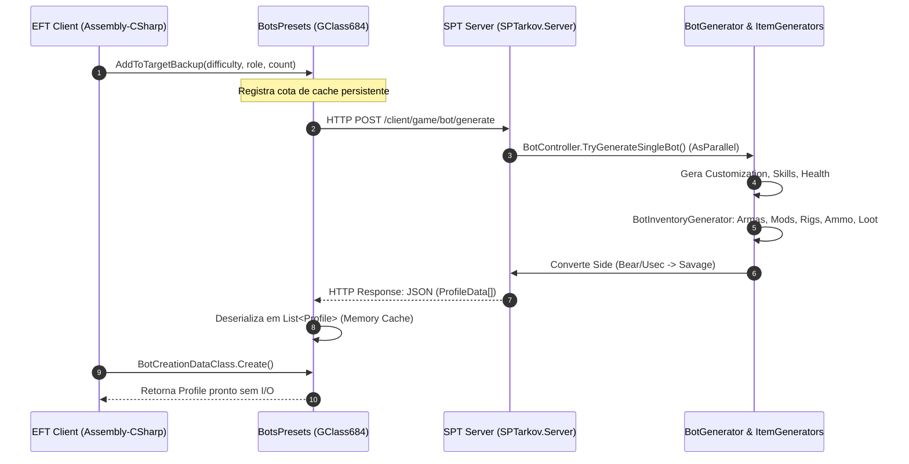
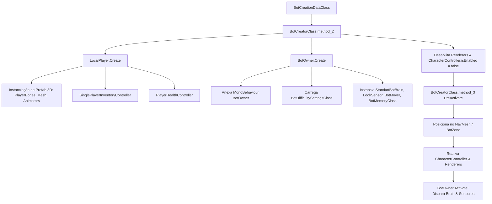
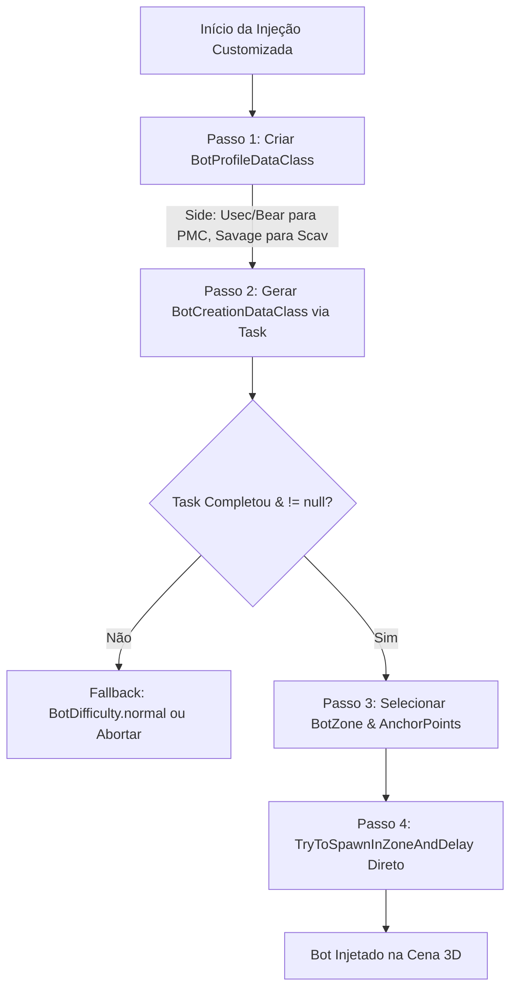
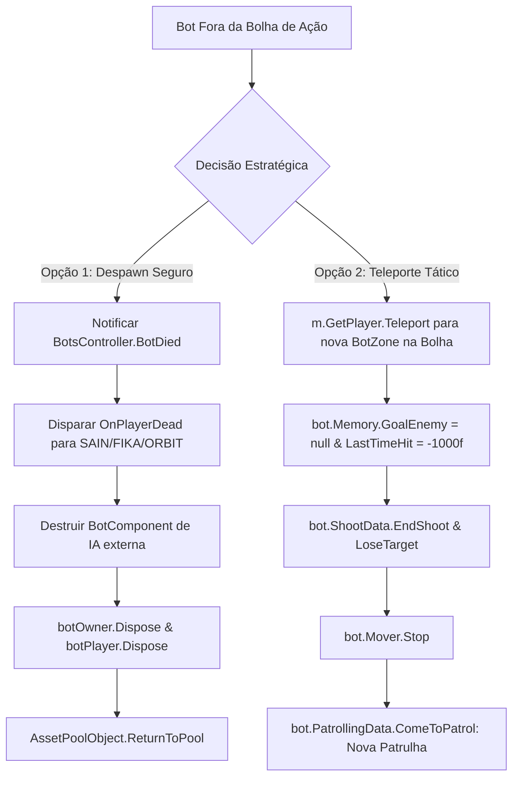
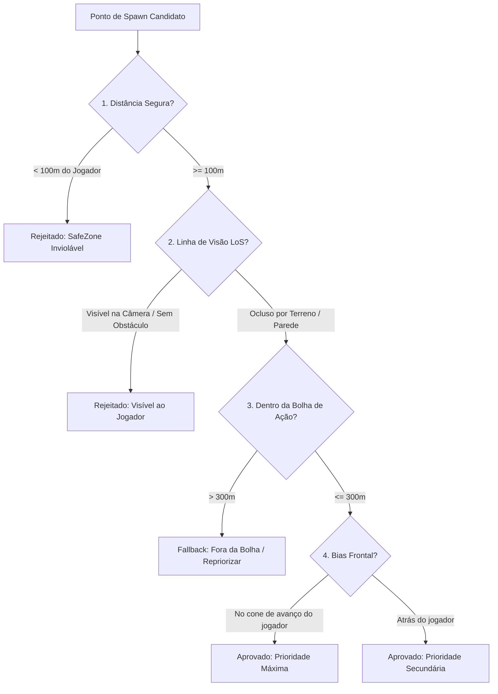
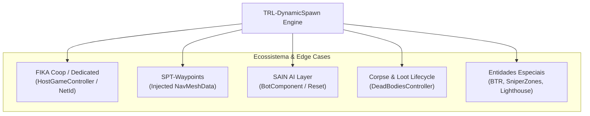

# Ciclo de Vida Completo e Arquitetura de Spawn de Bots no SPT 4.0 / EFT

Este documento estabelece a fundamentação técnica e arquitetural de ponta a ponta sobre o ciclo de vida de uma entidade de Inteligência Artificial (Bot) no **Escape from Tarkov (versão 0.16.9)** e no **SPT 4.0 (SPTarkov 4.0.13)**. O objetivo é subsidiar as decisões de engenharia do mod [TRL-DynamicSpawn](file:///d:/Projetos/GITHUB%20TARKOV/tarkov-spt-4.0/mods/TRL-DynamicSpawn), validando o modelo de injeção suave (*smooth queue*), bolha dinâmica (*combat bubble*), descarte seguro (*safe despawn*) e reciclagem tática (*group teleporting*).

---

## 1. Geração de Perfil e Inventário (SPT Server & Client Contract)

O ciclo de vida de qualquer bot tem início na definição abstrata de seu perfil e inventário. Ao contrário do EFT Live — onde o servidor proprietário da Battlestate Games (BSG) transmite pacotes binários compactados pela rede —, o **SPT 4.0** emula essa infraestrutura localmente através de um servidor C# assíncrono (`SPTarkov.Server`), consumido pelo cliente via requisições HTTP REST.



### 1.1. Processamento e Pipeline no SPT Server

Quando o cliente requisita perfis de bots, a rota `/client/game/bot/generate` direciona a carga útil para o controlador [BotController.cs](file:///d:/Projetos/GITHUB%20TARKOV/tarkov-spt-4.0/references/spt-source/Libraries/SPTarkov.Server.Core/Controllers/BotController.cs#L240-L273):

```csharp
// SPTarkov.Server.Core/Controllers/BotController.cs:255-263
var generatedBots = Enumerable
    .Range(0, botGenerationDetails.BotCountToGenerate)
    .AsParallel() // Paraleliza em múltiplas threads de CPU
    .Select(i => TryGenerateSingleBot(sessionId, botGenerationDetails, i))
    .Where(bot => bot is not null);
```

1. **Orquestração da Carga:** O [BotController](file:///d:/Projetos/GITHUB%20TARKOV/tarkov-spt-4.0/references/spt-source/Libraries/SPTarkov.Server.Core/Controllers/BotController.cs#L24) recebe o objeto `BotGenerationDetails` (`Role`, `BotDifficulty`, `BotCountToGenerate`, `Side`).
2. **Geração Multithread:** As instâncias de bots são geradas em paralelo via `AsParallel()`, invocando [BotGenerator.PrepareAndGenerateBot](file:///d:/Projetos/GITHUB%20TARKOV/tarkov-spt-4.0/references/spt-source/Libraries/SPTarkov.Server.Core/Generators/BotGenerator.cs#L22).
3. **Composição Estrutural:**
   * **Corpo e Aparência:** Definição de cabeça, voz e vestuário conforme a role.
   * **Equipamento e Armamento:** O [BotInventoryGenerator.cs](file:///d:/Projetos/GITHUB%20TARKOV/tarkov-spt-4.0/references/spt-source/Libraries/SPTarkov.Server.Core/Generators/BotInventoryGenerator.cs) e o [BotWeaponGenerator.cs](file:///d:/Projetos/GITHUB%20TARKOV/tarkov-spt-4.0/references/spt-source/Libraries/SPTarkov.Server.Core/Generators/BotWeaponGenerator.cs) constroem as armas em árvore (arma base $\rightarrow$ receiver $\rightarrow$ cano $\rightarrow$ trilhos $\rightarrow$ miras $\rightarrow$ carregador alimentado com munição).
   * **Loot e Bolsos:** O [BotLootGenerator.cs](file:///d:/Projetos/GITHUB%20TARKOV/tarkov-spt-4.0/references/spt-source/Libraries/SPTarkov.Server.Core/Generators/BotLootGenerator.cs) popula itens médicos, chaves, granadas e moedas nos bolsos e mochilas.
4. **Regra de Conversão do PMC Side (Contrato Crítico):**
   No cliente do EFT, todos os bots controlados pela IA nativa são agrupados internamente sob a lógica de `Savage`. Conforme demonstrado em [BotController.cs](file:///d:/Projetos/GITHUB%20TARKOV/tarkov-spt-4.0/references/spt-source/Libraries/SPTarkov.Server.Core/Controllers/BotController.cs#L287-L290):
   ```csharp
   // Client expects Side for PMCs to be `Savage`, must be altered here before it's cached
   if (bot.Info?.Side is Sides.Bear or Sides.Usec)
   {
       bot.Info.Side = Sides.Savage;
   }
   ```
   > [!IMPORTANT]
   > O servidor SPT converte `bot.Info.Side` de PMCs para `Savage` antes de serializar o JSON. Se o cliente tentar filtrar os perfis gerados exigindo `Profile.Info.Side == EPlayerSide.Usec`, a busca retornará vazia, a menos que se utilize a role (`WildSpawnType.pmcUSEC` / `pmcBEAR`) ou se aplique o patch de seleção flexível (`ChooseProfilePatch`).

### 1.2. Desserialização e Parsing no Cliente (EFT Client)

No cliente Unity:
1. O backend responde com um JSON contendo o array de perfis serializados.
2. O parser nativo desserializa o payload em objetos [Profile](file:///d:/Projetos/GITHUB%20TARKOV/tarkov-spt-4.0/references/eft-decompiled/Assembly-CSharp/EFT/Profile.cs), instanciando as árvores completas de `Inventory`, `CompoundItem`, `Slot` e `ItemAddress`.
3. **Sistema de Cache Local (`BotsPresets` / `GClass684`):**
   O cliente mantém um pool de perfis pré-carregados gerenciado por `BotsPresets`. O método `IBotCreator.AddToTargetBackup(difficulty, role, count)` não efetua uma requisição imediata pontual; ele registra um **nível mínimo de segurança** (*standing reserve*) que o cliente monitora e reabastece periodicamente a cada ~5 segundos.

### 1.3. Análise de Overhead e Otimização de I/O

* **Custo de I/O e Garbage Collection (GC):** A criação sob demanda de um bot (on-the-fly) durante o tiroteio gera latência HTTP de loopback (5ms–30ms) e aloca entre 200 KB a 500 KB de objetos temporários no Heap do C# para desserialização de cada inventário complexo (especialmente PMCs com centenas de peças de armas e cartuchos).
* **Solução Arquitetural:** O mod nunca deve solicitar perfis com `count = 0` no momento do disparo da onda. Toda cota deve ser pré-registrada no `Init`/`Warm-up` via `_botCreator.AddToTargetBackup(difficulty, role, targetCount)`. No momento do spawn, a chamada `BotCreationDataClass.Create` consome instâncias já existentes no cache local em $O(1)$, eliminando micro-travamentos de I/O.

---

## 2. Pipeline de Instanciação e Spawn Nativo (Assembly-CSharp)

A transformação de um modelo de dados (`Profile`) em um combatente físico na cena 3D é orquestrada por uma hierarquia estrita de classes nativas do `Assembly-CSharp.dll`.



### 2.1. Mapeamento de Classes e Responsabilidades

| Classe | Namespace / Arquivo | Responsabilidade |
| :--- | :--- | :--- |
| **`BotsController`** | [EFT/BotsController.cs](file:///d:/Projetos/GITHUB%20TARKOV/tarkov-spt-4.0/references/eft-decompiled/Assembly-CSharp/EFT/BotsController.cs) | Maestro central de todos os bots vivos; gerencia listas ativas, limites de mapa (`MaxCount`), grupos e loops de IA. |
| **`BotSpawner`** | `EFT/BotSpawner.cs` | Aloca bots em zonas (`BotZone`), seleciona pontos físicos (`ISpawnPoint`) e agenda delays. |
| **`BotCreatorClass`** | [BotCreatorClass.cs](file:///d:/Projetos/GITHUB%20TARKOV/tarkov-spt-4.0/references/eft-decompiled/Assembly-CSharp/BotCreatorClass.cs) | Fábrica assíncrona responsável por instanciar o `LocalPlayer` físico e acoplar o `BotOwner`. |
| **`LocalPlayer`** | [EFT/LocalPlayer.cs](file:///d:/Projetos/GITHUB%20TARKOV/tarkov-spt-4.0/references/eft-decompiled/Assembly-CSharp/EFT/LocalPlayer.cs) | Representação física, corpo rígido, colliders, inventário, animação procedural e saúde do combatente. |
| **`BotOwner`** | [EFT/BotOwner.cs](file:///d:/Projetos/GITHUB%20TARKOV/tarkov-spt-4.0/references/eft-decompiled/Assembly-CSharp/EFT/BotOwner.cs) | Cérebro executivo do bot; centraliza os sensores, memória tática, tomada de decisão e controle do `NavMeshAgent`. |
| **`StandartBotBrain`** | `EFT/StandartBotBrain.cs` | Máquina de estados hierárquica baseada em camadas de nós (`BaseLogicLayer`). |

### 2.2. Instanciação Física e Montagem do GameObject

O fluxo de criação física é disparado em [LocalPlayer.cs:58-134](file:///d:/Projetos/GITHUB%20TARKOV/tarkov-spt-4.0/references/eft-decompiled/Assembly-CSharp/EFT/LocalPlayer.cs#L58-L134):

1. **Instanciação do Bundle:** `Player.Create<LocalPlayer>(...)` carrega o prefab mestre (`ResourceKeyManagerAbstractClass.PLAYER_BUNDLE_NAME`), criando a hierarquia de GameObjects com ossos (`PlayerBones`), `SkinnedMeshRenderer`, `CharacterControllerSpawner` e o componente de animação procedural `ProceduralWeaponAnimation`.
2. **Controladores de Estado:**
   * `SinglePlayerInventoryController`: Gerencia o equipamento físico, checagem de carregadores e peso total.
   * `PlayerHealthController` ([GClass3010](file:///d:/Projetos/GITHUB%20TARKOV/tarkov-spt-4.0/references/eft-decompiled/Assembly-CSharp/EFT/LocalPlayer.cs#L65)): Cria o mapa de membros anatômicos (`MainParts`: Cabeça, Tórax, Estômago, Braços, Pernas), calculando vida, sangramento e fraturas.
   * `EmptyHandsController`: Inicializa o estado de mãos do bot.
   * `LocalPlayerCullingHandlerClass`: Inicializa a estrutura de oclusão visual para otimização do renderizador.
3. **Acoplamento do `BotOwner` ([BotCreatorClass.cs:151-164](file:///d:/Projetos/GITHUB%20TARKOV/tarkov-spt-4.0/references/eft-decompiled/Assembly-CSharp/BotCreatorClass.cs#L151-L164)):**
   ```csharp
   // BotCreatorClass.cs:156-162
   AICorePoint corePoint = IbotGame_0.BotsController.CoversData.AICorePointsHolder.GetCorePoint(bornInfo.CorePointId);
   BotOwner botOwner = BotOwner.Create(localPlayer, null, IbotGame_0.GameDateTime, IbotGame_0.BotsController, isLocalGame, corePoint);
   method_4(botOwner.GetPlayer);                  // Mapeia renderers
   method_5(botOwner, @switch: false);             // Oculta renderers durante montagem
   botOwner.GetPlayer.CharacterController.isEnabled = false; // Desativa física temporariamente
   ```

### 2.3. Posicionamento e Validação de NavMesh

1. **Zonas e Pontos:** As posições no EFT são agrupadas em [BotZone](file:///d:/Projetos/GITHUB%20TARKOV/tarkov-spt-4.0/references/eft-decompiled/Assembly-CSharp/BotZone.cs). Cada zona contém uma lista de [ISpawnPoint](file:///d:/Projetos/GITHUB%20TARKOV/tarkov-spt-4.0/references/eft-decompiled/Assembly-CSharp/ISpawnPoint.cs), dados de cobertura ([AICoversData](file:///d:/Projetos/GITHUB%20TARKOV/tarkov-spt-4.0/references/eft-decompiled/Assembly-CSharp/AICoversData.cs)) e nós de navegação manual ([AIManualPointsHolder](file:///d:/Projetos/GITHUB%20TARKOV/tarkov-spt-4.0/references/eft-decompiled/Assembly-CSharp/AIManualPointsHolder.cs)).
2. **Amostragem de NavMesh:** O motor executa `NavMesh.SamplePosition(position, out hit, 1.5f, NavMesh.AllAreas)` para garantir que a coordenada repouse exatamente sobre polígonos navegáveis da malha de IA.
3. **Ativação Final ([BotCreatorClass.cs:193-206](file:///d:/Projetos/GITHUB%20TARKOV/tarkov-spt-4.0/references/eft-decompiled/Assembly-CSharp/BotCreatorClass.cs#L193-L206)):**
   ```csharp
   bot.GetPlayer.CharacterController.isEnabled = true;
   bot.GetPlayer.MovementContext.ResetFlying();
   bot.PreActivate(zone, IbotGame_0.GameDateTime, groupAction(bot, zone), coversData, autoActivate);
   method_5(bot, @switch: true); // Reativa renderers visíveis
   ```

### 2.4. Inicialização do Cérebro e Sensores

No momento em que `BotOwner.PreActivate` e `BotOwner.Activate` são concluídos:
* **`StandartBotBrain`:** Instancia as camadas lógicas ([BaseLogicLayer](file:///d:/Projetos/GITHUB%20TARKOV/tarkov-spt-4.0/references/eft-decompiled/Assembly-CSharp/BaseLogicLayerAbstractClass.cs)) ativadas por prioridade (ex: `AvoidDangerLayer`, `HealNode`, `AssaultBuildingLayer`, `FlankMove`, `ShootFromCover`).
* **`BotLookSensorClass` (`LookSensor`):** Inicia a varredura periódica de inimigos através de raycasts contra colliders (`HighPolyWithTerrainMask`). O ângulo de atenção é determinado pela constante configurada `ENEMY_LOOK_AT_ME = Mathf.Cos(Mind.ENEMY_LOOK_AT_ME_ANG * Rad2Deg)`.
* **`BotHearingSensor`:** Conecta-se ao manipulador de eventos central [BotEventHandler.cs](file:///d:/Projetos/GITHUB%20TARKOV/tarkov-spt-4.0/references/eft-decompiled/Assembly-CSharp/BotEventHandler.cs) para interceptar ruídos de passos, recarga, quebra de vidros e disparos no raio audível.

---

## 3. Spawn In-Raid Manual e Injeção Customizada (C# / BepInEx)

Para desacoplar completamente o mod do sistema de ondas vanilla (`WavesSpawnScenario`), a injeção deve contornar as filas do EFT e injetar instâncias diretamente no spawner.



### 3.1. Sequência Canônica de Injeção em Baixo Nível

A injeção direta sem passar pelo agendador nativo é realizada através da seguinte cadeia:

#### Passo 1: Descritor de Perfil (`BotProfileDataClass`)
```csharp
// Define os parâmetros de geração respeitando as facções
EPlayerSide side = EPlayerSide.Savage;
if (role == WildSpawnType.pmcUSEC) side = EPlayerSide.Usec;
else if (role == WildSpawnType.pmcBEAR) side = EPlayerSide.Bear;

BotSpawnParams spawnParams = new BotSpawnParams();
BotProfileDataClass profileData = new BotProfileDataClass(
    side, 
    role, 
    difficulty, 
    0f, 
    spawnParams
);
```

#### Passo 2: Construção Assíncrona de Dados (`BotCreationDataClass`)
```csharp
// Invoca o gerador desacoplado da fila vanilla
Task<BotCreationDataClass> creationTask = BotCreationDataClass.Create(
    profileData, 
    botCreator, 
    groupSize, 
    botsController.BotSpawner
);

// Em Corrotinas da Unity:
while (!creationTask.IsCompleted)
{
    yield return null;
}

BotCreationDataClass creationData = creationTask.Result;
```

#### Passo 3: Injeção Física na Zona
```csharp
// Injeta diretamente na BotZone selecionada
List<ISpawnPoint> pointsToUse = isGroupFollower ? groupAnchorPoints : new List<ISpawnPoint>();

botsController.BotSpawner.TryToSpawnInZoneAndDelay(
    selectedZone, 
    creationData, 
    false,       // withTeleport
    true,        // shallBeGroup
    pointsToUse, // lista de pontos âncora para esquadrão
    true         // cancelOthers
);
```

### 3.2. Matriz de Parâmetros Críticos e Cuidados

| Parâmetro | Tipo | Regra Obrigatória | Consequência de Erro |
| :--- | :--- | :--- | :--- |
| **`side`** | `EPlayerSide` | Deve ser `EPlayerSide.Usec` ou `Bear` se `role == pmcUSEC / pmcBEAR`. Para Scavs/Bosses, usar `EPlayerSide.Savage`. | Passar `Savage` para role de PMC corrompe a consulta no SPT Server e retorna `null`. |
| **`difficulty`** | `BotDifficulty` | Requer que o nível (`easy`, `normal`, `hard`, `impossible`) tenha sido registrado previamente via `AddToTargetBackup`. | Se o cache estiver vazio e a geração síncrona falhar, `task.Result` retorna `null` gerando NRE. |
| **`pointsToUse`** | `List<ISpawnPoint>` | Deve conter os pontos da zona onde o líder nasceu para manter seguidores agrupados. | Se vazio em esquadrões, seguidores podem nascer em extremidades opostas da zona (~150m de distância). |

---

## 4. Otimização, Despawn e Reposicionamento (Teleporte vs. Pooling)

Quando bots sobrevivem mas ficam fora da "bolha de combate" do jogador (ex: 250m–300m de distância), eles continuam executando rotinas pesadas de IA, raycasts de visão e pathfinding no NavMesh. Existem duas abordagens fundamentais para liberar capacidade de processamento: **Destruição Completa (Despawn)** e **Reposicionamento Físico com Reset de Memória (Teleporte)**.



### 4.1. Protocolo de Despawn Seguro (Destruição sem Vazamentos)

Remover um bot do EFT sem corromper a árvore de rastreamento do jogo requer uma sequência estrita:

1. **Notificação de Baixa no Motor:**
   `botsController.BotDied(botOwner)` remove o bot das contagens ativas de `BotsController.Bots` e `BotsGroup`.
2. **Sinalização Global para Mods Concorrentes:**
   Invocar o evento protegido `OnPlayerDead` via reflexão garante que mods como **SAIN**, **FIKA** e **ORBIT** retirem imediatamente a entidade de seus dicionários e encerrem suas corrotinas internas.
3. **Destruição de Monobehaviours de Terceiros:**
   Localizar e remover com segurança o componente `SAIN.Components.BotComponent` evita exceções de corrotinas órfãs tentando acessar transforms destruídos.
4. **Descarte de Recursos e Desregistro:**
   ```csharp
   botOwner.Dispose();
   botPlayer.Dispose();
   botsController.DestroyInfo(botPlayer);
   ```
5. **Devolução ao Pool de Objetos:**
   `AssetPoolObject.ReturnToPool(botOwner.gameObject, true)` devolve a malha e os colliders ao pool nativo do EFT, evitando alocação contínua de memória no Heap do Unity.

### 4.2. Teleporte e Reposicionamento Físico de Bots Vivos

O teleporte de bots vivos é a técnica mais eficiente para manter a intensidade de combate sem custo de GC Alloc e sem sobrecarregar a Main Thread com novas instanciações.

#### Mecânica de Sincronização Física
1. **Desativação do `CharacterController`:** Mover a posição de um `Transform` na Unity enquanto o `CharacterController` está ativo gera conflitos de interpolação física.
2. **Uso do Método Nativo `Player.Teleport`:**
   ```csharp
   // Sincroniza transform, velocidade, inércia e reposiciona no NavMesh
   botOwner.GetPlayer.Teleport(targetPosition, true);
   ```
3. **Ajuste Físico de Esquadrões:** Ao teleportar múltiplos membros de um grupo, aplica-se uma dispersão radial suave de 1.5m entre os seguidores (`offset = Random.insideUnitSphere * 1.5f` com $Y=0$) para evitar colisões entre corpos rígidos (*mesh clipping* e *stuck ragdolls*).

#### Limpeza Cirúrgica de Memória e Comportamento
Se um bot em combate ativo for teleportado sem um reset de memória, ele continuará tentando atirar ou correrá de volta através de todo o mapa para buscar o inimigo anterior. A rotina defensiva obrigatória é implementada conforme [BotDespawnManager.cs:640-675](file:///d:/Projetos/GITHUB%20TARKOV/tarkov-spt-4.0/mods/TRL-DynamicSpawn/Client/Components/BotDespawnManager.cs#L640-L675):

```csharp
// 1. Limpeza do alvo ativo de combate
if (bot.Memory != null)
{
    bot.Memory.GoalEnemy = null;
    WipeMemoryResidue(bot.Memory); // Limpa LastEnemy e _lastEnemy via reflexão
    bot.Memory.LastTimeHit = -1000f;
}

// 2. Cancelamento de disparo e mira
bot.ShootData?.EndShoot();
bot.AimingManager?.CurrentAiming?.LoseTarget();

// 3. Parada de navegação antiga no NavMesh
bot.Mover?.Stop();

// 4. Convocação de nova patrulha na zona de destino
bot.PatrollingData?.Unpause();
bot.PatrollingData?.ComeToPatrol(true, true);
```

### 4.3. Trade-off Técnico: Destruir & Recriar vs. Teleportar & Resetar

A tabela abaixo compara o custo computacional de ambas as abordagens para um lote de **10 bots**:

| Dimensão de Análise | Destruir & Recriar (Despawn + Novo Spawn) | Teleportar & Resetar Mente (Reciclagem Tática) |
| :--- | :--- | :--- |
| **Tempo na Main Thread (Frame Time)** | **45ms a 90ms** (pico grave de micro-stutter) | **0.8ms a 2.5ms** (completamente imperceptível) |
| **Alocação de Garbage Collection (GC)** | **2.5 MB a 5.0 MB** de objetos efêmeros | **< 4 KB** (apenas estruturas de coordenadas) |
| **Overhead de I/O e HTTP** | Requer consumo contínuo do cache ou chamadas REST | **Zero I/O** (perfil e inventário permanecem em RAM) |
| **Carga no Renderizador (GPU/CPU)** | Recria SkinnedMeshRenderers, ossos e rigs | Preserva instâncias gráficas já aquecidas |
| **Risco Arquitetural** | Risco de vazamento de corrotinas externas (SAIN/Fika) | Risco de retenção de memória de combate se mal limpo |
| **Veredito de Engenharia** | Recomendado apenas para mudança drástica de facção | **Caminho preferencial absoluto para manter FPS alto** |

---

## 5. Regras e Estratégias para Máxima Performance (Arquitetura do Mod)

Para garantir que o **TRL-DynamicSpawn** entregue taxas de quadros elevadas e jogabilidade fluida, foram estabelecidas diretrizes arquiteturais estritas.

### 5.1. Regras de Segmentação de Threads (Unity Threading Rules)

A Unity Engine impõe restrições severas sobre o que pode ser executado fora da thread primária (*Main Thread*):

```
┌─────────────────────────────────────────────────────────────┐
│                    THREAD POOL / BACKGROUND                 │
│  • Requisições HTTP REST (/trldynamicspawn/*)               │
│  • Desserialização JSON de Configurações e Perfis           │
│  • Cálculo Matemático de Distribuição de Vagas e Presets    │
│  • BotCreationDataClass.Create (Geração de Perfil no SPT)   │
└──────────────────────────────┬──────────────────────────────┘
                               │ Task.IsCompleted / Coroutine
┌──────────────────────────────▼──────────────────────────────┐
│                    MAIN THREAD DA UNITY                     │
│  • Instanciação de GameObjects e Player.Create              │
│  • Manipulação de NavMeshAgent e NavMesh.SamplePosition     │
│  • Manipulação de CharacterController e Transforms Físicos  │
│  • Raycasting de Física (Physics.Linecast / CheckSphere)    │
│  • Habilitação/Desabilitação de Renderers e Animators       │
└─────────────────────────────────────────────────────────────┘
```

#### O Princípio da Injeção Suave (*Smooth Spawning Queue*)
Nunca instanciar múltiplos bots no mesmo quadro. A injeção de uma onda deve ser distribuída ao longo do tempo via Corrotinas:
* **Espaçamento padrão:** 1 bot a cada **1.0s a 1.5s** ([DynamicSpawnManager.cs:1014-1021](file:///d:/Projetos/GITHUB%20TARKOV/tarkov-spt-4.0/mods/TRL-DynamicSpawn/Client/Components/DynamicSpawnManager.cs#L1014-L1021)).
* **Resultado:** O custo de instanciação da Main Thread (~5ms por entidade) é diluído imperceptivelmente ao longo dos quadros, erradicando os congelamentos característicos de mods vanilla e geradores tradicionais.

### 5.2. Otimização Espacial: Culling e Geometria da Bolha

O mod aplica 3 filtros geométricos invioláveis antes de validar qualquer coordenada de nascimento ou teleporte:



1. **Zona Segura Inviolável (*Safe Zone Distance*):** Nenhum bot pode nascer ou ser teleportado a menos de 100m do jogador (15m a 30m em mapas ultracurtos como Factory e Ground Zero), calculada via elipsoide 2.5D:
   $$\frac{\Delta H}{\text{limitW}} + \frac{|y_{\text{player}} - y_{\text{spawn}}|}{\text{limitH}} \le 1.0$$
2. **Culling de Linha de Visão Direta (*Line of Sight - LoS*):** Mesmo que o ponto esteja a 150m de distância, se o ponto estiver dentro do frustum da câmera (`Camera.main.WorldToViewportPoint`) e houver um traçado livre verificado via `Physics.Linecast(headPos, spawnPos, LayerMaskClass.HighPolyWithTerrainMask)`, o ponto é descartado.
3. **Bias Direcional Frontal:** A seleção de zonas favorece ativamente polígonos posicionados no vetor frontal de avanço do jogador ($\vec{v}_{\text{move}} \cdot \vec{d}_{\text{zone}} > 0$), garantindo que a ação surja naturalmente à frente do combatente.

### 5.3. Catálogo de Armadilhas Conhecidas (*Pitfalls*) e Soluções

| Armadilha (Pitfall) | Causa Raiz | Sintoma / Impacto | Solução Arquitetural Implementada |
| :--- | :--- | :--- | :--- |
| **Limpeza Concorrente de Filas do SPT** | Invocar `BotEventHandler.StopBotSpawn()` repetidamente a cada tick. | Cancela tasks ativas no SPT, fazendo `BotCreationDataClass.Create` retornar `null` (dezenas de NREs por raid). | Executar a limpeza de fila estritamente **uma única vez por raid** durante o warm-up ([DynamicSpawnManager.cs:448-453](file:///d:/Projetos/GITHUB%20TARKOV/tarkov-spt-4.0/mods/TRL-DynamicSpawn/Client/Components/DynamicSpawnManager.cs#L448-L453)). |
| **Fragmentação de Esquadrões de Chefes** | Teleportar ou despawnar um líder (Boss) sem seus guardas (Followers). | Guardas ficam órfãos com IA travada; líder tenta regenerar seguidores violando o teto de bots. | Obter todos os membros via `GetGroupMembers(bot)` e executar despawn ou teleporte atômico do esquadrão inteiro ([BotDespawnManager.cs:677-752](file:///d:/Projetos/GITHUB%20TARKOV/tarkov-spt-4.0/mods/TRL-DynamicSpawn/Client/Components/BotDespawnManager.cs#L677-L752)). |
| **Perfis Nulos por Incompatibilidade de Dificuldade** | Tentar gerar bots com dificuldades como `impossible` sem registrá-las no cache. | `CreateProfile` retorna nulo se o cache local estiver vazio. | Fallback gracioso automático para `BotDifficulty.normal` caso a task de perfil customizado falhe ([DynamicSpawnManager.cs:1075-1085](file:///d:/Projetos/GITHUB%20TARKOV/tarkov-spt-4.0/mods/TRL-DynamicSpawn/Client/Components/DynamicSpawnManager.cs#L1075-L1085)). |
| **Retenção de Memória em Listas Estáticas** | Não limpar referências de `BotOwner` no término da raid. | Memory leak acumulando centenas de megabytes após 3 ou 4 raids consecutivas sem reiniciar o jogo. | Encerrar loops de corrotinas e limpar dicionários nos ganchos de ciclo de vida de raid (`RaidLifecycle.OnRaidEnd` / `RaidLifecyclePatches.cs`). |

---

## 6. Casos Especiais, Compatibilidade de Mods e Edge Cases

Esta seção documenta a integração com a infraestrutura multiplayer do **FIKA**, sistemas de navegação externa (**SPT-Waypoints**, **SAIN**), manipulação de corpos/loot e salvaguardas para entidades especiais do EFT.



### 6.1. Sincronização e Topologia de Rede no FIKA (Coop / Dedicated Server)

No ambiente multiplayer cooperativo do **FIKA**, a arquitetura de simulação é estritamente autoritativa do servidor/host:

1. **Separação de Papéis (Authority Gate):**
   * Apenas o **Host** (ou o processo **Fika Headless Dedicated Server**) executa o loop do `DynamicSpawnManager` e do `BotDespawnManager`.
   * Em clientes convidados (*guest peers*), o método [FikaHelper.IsClient()](file:///d:/Projetos/GITHUB%20TARKOV/tarkov-spt-4.0/mods/TRL-DynamicSpawn/Client/Components/DynamicSpawnManager.cs#L58-L63) aborta os loops de spawn/despawn imediatamente, evitando duplicação e descompasso de ondas.
2. **Ciclo de Criação e Replicação:**
   * Quando o Host instancia um bot via `TryToSpawnInZoneAndDelay`, o FIKA intercepta o evento através do `CoopHandler` e do `HostGameController.cs:330-358`, atribuindo um `NetId` e transmitindo o pacote `PlayerSpawnPacket` para todos os clientes conectados.
   * Os clientes instanciam a entidade como `ObservedPlayer` (proxy remoto sem cérebro de IA local).
3. **Teleporte Replicado:**
   * Ao chamar `Player.Teleport(targetPos, true)` no Host, a nova coordenada é transmitida nos pacotes de sincronização periódica de transform (`TransformSyncPacket`). Os clientes interpolam o bot para a nova posição sem necessidade de recriar a entidade na rede.
4. **Despawn Cooperativo Seguro:**
   * Conforme implementado em [HostGameController.cs:342-357](file:///d:/Projetos/GITHUB%20TARKOV/tarkov-spt-4.0/references/fika-plugin/Fika.Core/Main/GameMode/HostGameController.cs#L342-L357), a remoção de um bot pelo Host deve desinscrever `DiedEvent` e remover o `fikaPlayer.NetId` de `coopHandler.Players`, garantindo que os clientes convidados descartem o `ObservedPlayer` correspondente sem exceções de conexão.

### 6.2. Interação com SPT-Waypoints e Camadas Customizadas de IA (SAIN)

#### SPT-Waypoints (Injeção Global de NavMesh)
* O mod **SPT-Waypoints** intercepta `BotsController.Init` via [WaypointPatch.cs:38-92](file:///d:/Projetos/GITHUB%20TARKOV/tarkov-spt-4.0/references/SPT-Waypoints-1.8.2/Patches/WaypointPatch.cs#L38-L92), executando `NavMesh.RemoveAllNavMeshData()` e injetando um asset compilado (`<mapa>-navmesh.bundle`).
* **Benefício para o DynamicSpawn:** O Waypoints une áreas que eram originalmente isoladas no EFT vanilla através de pontes e portas destravadas (`DoorLinkPatch.cs`). Isso expande a validade do `NavMesh.SamplePosition`, permitindo que bots teleportados para qualquer `BotZone` consigam traçar caminhos (*NavMeshPaths*) contínuos até o jogador sem travar.

#### SAIN (Solarint's AI Modifications)
* O SAIN anexa o componente `SAIN.Components.BotComponent` ao GameObject do bot, sobrepondo o `StandartBotBrain` nativo com árvores táticas próprias (`DecisionState`, `SearchReason`, `EnemyController`).
* **Regra de Reset de Teleporte para o SAIN:**
  Ao teleportar um bot sob controle do SAIN, o mod deve garantir que o alvo de combate seja limpo (`bot.Memory.GoalEnemy = null`). O SAIN monitora a memória nativa e, ao detectar a perda do inimigo, reinicia automaticamente suas rotinas de patrulha e busca, evitando que o bot tente correr centenas de metros de volta ao alvo antigo.

### 6.3. Zonas e Roles Especiais de Alto Risco (Edge Cases de Spawning)

O mod aplica salvaguardas rígidas para 3 categorias especiais de entidades que possuem restrições físicas severas no mapa:

#### 1. Snipers de Telhado e Torres (`WildSpawnType.marksman`)
* **Problema:** Pontos de sniper em telhados (ex: telhados de Customs, guindaste de Woods) possuem malhas de NavMesh isoladas ou limitadas. Se um Scav comum for spawnado lá, ele tentará patrulhar e cairá do prédio; se um Sniper for spawnado no chão, perderá sua IA estática.
* **Salvaguarda ([DynamicSpawnManager.cs:913-926](file:///d:/Projetos/GITHUB%20TARKOV/tarkov-spt-4.0/mods/TRL-DynamicSpawn/Client/Components/DynamicSpawnManager.cs#L913-L926)):**
  * Zonas com a tag `SniperZone` são reservadas exclusivamente para a role `marksman`.
  * Bots comuns **nunca** são alocados em pontos com `sp.SniperPoint == true`.
  * Snipers nunca são teleportados para fora de suas zonas elevadas.

#### 2. O BTR e sua Torre Armada (`BTRControllerClass`)
* O BTR presente em Streets of Tarkov e Woods é gerenciado por [BTRControllerClass.cs](file:///d:/Projetos/GITHUB%20TARKOV/tarkov-spt-4.0/references/eft-decompiled/Assembly-CSharp/BTRControllerClass.cs). Ele possui um bot associado à torre que não opera pelo ciclo padrão de `BotZone`.
* **Salvaguarda:** O BTR é categoricamente ignorado pelo `DynamicSpawnManager` e pelo `BotDespawnManager`, nunca sendo contado em cotas de mapa, teleportado ou despawnado.

#### 3. Zryachiy e a Ilha do Farol (Lighthouse Island)
* Zryachiy e seus guardas na ilha do Farol são cercados por campos minados gerenciados por [AIMinesPositionsHolder.cs](file:///d:/Projetos/GITHUB%20TARKOV/tarkov-spt-4.0/references/eft-decompiled/Assembly-CSharp/AIMinesPositionsHolder.cs) e [AIDangerArea.cs](file:///d:/Projetos/GITHUB%20TARKOV/tarkov-spt-4.0/references/eft-decompiled/Assembly-CSharp/AIDangerArea.cs).
* **Salvaguarda:** Zryachiy e seus seguidores são imunes ao culling por distância/despawn ([BotDespawnManager.cs:291-301](file:///d:/Projetos/GITHUB%20TARKOV/tarkov-spt-4.0/mods/TRL-DynamicSpawn/Client/Components/BotDespawnManager.cs#L291-L301)), garantindo que não sejam teleportados acidentalmente sobre minas terrestres ativas.

### 6.4. Ciclo de Vida de Corpos e Persistência de Loot (Dead Bodies vs. Live Despawn)

Existe uma separação arquitetural fundamental entre **Despawn de Bot Vivo** e **Corpos de Inimigos Mortos**:

1. **Estrutura de Corpos no EFT ([DeadBodiesController.cs](file:///d:/Projetos/GITHUB%20TARKOV/tarkov-spt-4.0/references/eft-decompiled/Assembly-CSharp/DeadBodiesController.cs)):**
   * Quando um bot morre em combate, o EFT instancia um componente `Corpse` na cena e adiciona uma entrada [GClass386](file:///d:/Projetos/GITHUB%20TARKOV/tarkov-spt-4.0/references/eft-decompiled/Assembly-CSharp/DeadBodiesController.cs#L8) ao `DeadBodiesController` para que outros bots possam vasculhar ou lamentar o cadáver (`BotDeadBodyWork`).
2. **Proteção do Loot do Jogador:**
   * O `BotDespawnManager` opera **exclusivamente sobre bots vivos** (`bot.HealthController.IsAlive == true`).
   * Cadáveres resultantes de combates do jogador permanecem intactos na cena física com seus inventários completos, garantindo que o jogador possa retornar e realizar o saque (*loot*) a qualquer momento do raid.

### 6.5. Prevenção de Falhas de Áudio Físico no Teleporte (Audio Glitches)

Ao teleportar instantaneamente um bot através de grandes distâncias, o motor de física do EFT pode interpretar o deslocamento como uma velocidade infinita ou queda abrupta, disparando ruídos indesejados de passos rápidos, galhos quebrando ou impacto de queda.

* **Solução Implementada:**
  Ao invocar o teleporte, o estado de movimento deve ser zerado atomicamente:
  ```csharp
  // 1. Zera velocidade e inércia física
  bot.GetPlayer.MovementContext.ResetFlying();
  bot.GetPlayer.MovementContext.SetVelocity(Vector3.zero);

  // 2. Teleporta com sincronização física
  bot.GetPlayer.Teleport(targetPosition, true);
  ```
  Isso silencia quaisquer eventos acústicos residuais no [BotEventHandler.cs](file:///d:/Projetos/GITHUB%20TARKOV/tarkov-spt-4.0/references/eft-decompiled/Assembly-CSharp/BotEventHandler.cs) e no subsistema de som espacial do EFT.

### 6.6. Trânsito Contínuo entre Mapas (Map Transits - EFT 0.16.9)

O EFT 0.16.9 introduziu o sistema de transição entre mapas (Marathon / Transit Points), representado por [AlreadyTransitDataClass.cs](file:///d:/Projetos/GITHUB%20TARKOV/tarkov-spt-4.0/references/eft-decompiled/Assembly-CSharp/AlreadyTransitDataClass.cs).

* **Impacto no Mod:** Durante a transição contínua entre mapas, o processo do jogo **não é encerrado**, mas o `GameWorld`, as `BotZones` e o `BotsController` são completamente destruídos e recriados no novo mapa.
* **Salvaguarda do Ciclo de Vida:**
  * O `BotDespawnManager` e o `DynamicSpawnManager` utilizam ganchos de ciclo de vida idempotentes (`RaidLifecyclePatches.cs`): no encerramento da raid/trânsito (`OnRaidEnd`), todos os loops de corrotinas são parados (`StopLoop()`), caches estáticos são limpos e o estado do mod é resetado para aguardar o warm-up do próximo mapa sem retenção de memória da raid anterior.

---

## 8. Catálogo Canônico de BotZones por Mapa (EFT 0.16.9 / SPT 4.0)

O ecossistema do Escape from Tarkov utiliza nomes literais estritos para cada `BotZone` e `ISpawnPoint` em cena. Abaixo está o inventário técnico completo e canônico extraído dos assemblies e dados de mapa nativos do jogo:

### 8.1. Customs (`bigmap` / `customs`)
* **Zonas Regulares de Combate:**
  * `ZoneBrige` — Ponte principal e cruzamento de aproximação.
  * `ZoneCrossRoad` — Cruzamento da saída Crossroads / Trailer Park.
  * `ZoneDormitory` — Complexo dos Dormitórios (2 andares e 3 andares - Spawn clássico de Reshala).
  * `ZoneGasStation` — Posto de gasolina novo (New Gas Station - Spawn clássico de Reshala).
  * `ZoneFactoryCenter` — Centro da área industrial / Galpões centrais (Spawn de Bloodhounds/Cultistas).
  * `ZoneFactorySide` — Laterais da área industrial / Silos.
  * `ZoneOldAZS` — Posto de gasolina antigo (Old Gas Station).
  * `ZoneBlockPost` — Posto de controle militar / Checkpoint.
  * `ZoneTankSquare` — Pátio dos tanques / Fortress / ZB-013.
  * `ZoneWade` — Travessia de água / Rio raso.
  * `ZoneCustoms` — Pátio aduaneiro principal / Galpão vermelho (Big Red).
  * `ZoneScavBase` — Fortaleza / Stronghold / Skeleton (Spawn dos Goons e Reshala).
* **Zonas Exclusivas de Sniper (`marksman`):**
  * `ZoneSnipeBrige` — Sniper do topo da ferrovia sobre a ponte.
  * `ZoneSnipeTower` — Sniper da torre de alta tensão / Silos.
  * `ZoneSnipeFactory` — Sniper do telhado da fábrica / Boiler.
  * `ZoneBlockPostSniper` — Sniper das rochas do checkpoint militar.
  * `ZoneBlockPostSniper3` — Ponto elevado de contenção secundário.

---

### 8.2. Factory (`factory4_day` / `factory4_night`)
* **Zonas Regulares:**
  * `BotZone` — Zona única unificada que cobre todo o galpão interno, túneis e passarelas elevadas (Spawn de Tagilla e Cultistas).

---

### 8.3. Interchange (`interchange`)
* **Zonas Regulares Internas e Externas:**
  * `ZoneCenter` — Pátio central do shopping / Escadas rolantes.
  * `ZoneCenterBot` — Térreo central / Corredores inferiores (Spawn clássico do Killa).
  * `ZoneGoshan` — Hipermercado Goshan e área de alimentos.
  * `ZoneIDEA` — Loja principal da IDEA (Spawn de Killa).
  * `ZoneIDEAMall` — Corredores de conexão da galeria IDEA.
  * `ZoneIDEAPark` — Estacionamento coberto da ala IDEA.
  * `ZoneOLI` — Loja de materiais de construção OLI (Spawn de Killa).
  * `ZoneOLIPark` — Estacionamento coberto da ala OLI.
  * `ZonePowerStation` — Subestação de energia externa / Interruptor de luz.
  * `ZoneRoad` — Vias externas perimetrais do shopping.
  * `ZoneTrucks` — Pátio de carga e docas de caminhões nos fundos.
  * `ZoneRamp` — Rampas de acesso aos fundos e saídas de emergência.

---

### 8.4. The Lab (`laboratory`)
* **Zonas Regulares:**
  * `BotZoneFloor1` — Primeiro piso / Hall de entrada e escritórios.
  * `BotZoneFloor2` — Segundo piso / Cúpulas de vidro e passarelas.
  * `BotZoneBasement` — Subsolo / Área técnica e esgotos.
* **Zonas de Portões e Eventos (Spawn de Raiders):**
  * `BotZoneGate1` — Portão de extração / Elevadores médicos (Hangar/Medical).
  * `BotZoneGate2` — Portão de carga principal / Elevadores de carga (Cargo/Parking).

---

### 8.5. Lighthouse (`lighthouse`)
* **Zonas da Estação de Tratamento (Water Treatment & Rogues):**
  * `Zone_TreatmentContainers` — Pátio de contêineres da estação de tratamento.
  * `Zone_TreatmentBeach` — Acesso da praia à estação de água.
  * `Zone_TreatmentRocks` — Encostas rochosas da estação de água.
  * `Zone_RoofContainers` — Telhados dos galpões de contêineres (Postos de metralhadora montada de Rogues).
  * `Zone_RoofBeach` — Telhado voltado para o litoral / Galpão 1.
  * `Zone_RoofRocks` — Telhado voltado para as montanhas / Galpão 3.
  * `Zone_Containers` — Área de estocagem lateral.
  * `Zone_Rocks` — Elevações rochosas intermediárias.
  * `Zone_Hellicopter` *(com 2 'l')* — Pátio central do helicóptero acidentado.
* **Zonas Rurais, Chalets e Ilha do Farol:**
  * `Zone_Chalet` — Chalet principal / Mansão dos Goons / Rogue Bosses.
  * `Zone_Village` — Vila litorânea / Casas de pescadores.
  * `Zone_Bridge` — Ponte de acesso à rodovia.
  * `Zone_OldHouse` — Casas rurais isoladas.
  * `Zone_DestroyedHouse` — Casa em ruínas / Acesso à praia.
  * `Zone_LongRoad` — Rodovia principal que corta o mapa.
  * `Zone_Blockpost` — Posto de controle na entrada da estrada.
  * `Zone_Island` — Ilha do Farol (Santuário exclusivo do Zryachiy e guardas).
* **Zonas Exclusivas de Sniper:**
  * `Zone_SniperPeak` — Pico rochoso de alta altitude para Snipers.

---

### 8.6. Reserve (`rezervbase`)
* **Zonas de Superfície e Subsolo:**
  * `ZoneRailStrorage` *(grafia nativa com 'r' extra)* — Plataforma ferroviária / Pátio de trens (Spawn de Glukhar e Raiders).
  * `ZonePTOR1` — Galpão de manutenção de tanques 1.
  * `ZonePTOR2` — Galpão de manutenção de tanques 2 (Spawn de Glukhar).
  * `ZoneBarrack` — Quartéis / Prédios Preto e Branco (Spawn de Glukhar).
  * `ZoneBunkerStorage` — Depósitos do bunker subterrâneo.
  * `ZoneSubStorage` — Subsolos e depósitos de suprimentos (Spawn de Glukhar/Raiders).
  * `ZoneSubCommand` — Bunker de comando subterrâneo D-2 / Sala de controle.

---

### 8.7. Shoreline (`shoreline`)
* **Zonas do Sanatório e Costa:**
  * `ZoneSanatorium1` — Ala Leste do Sanatório (Spawn de Sanitar).
  * `ZoneSanatorium2` — Ala Oeste do Sanatório (Spawn de Sanitar).
  * `ZonePassClose` — Passagem próxima ao sanatório / Jardins.
  * `ZonePassFar` — Passagens externas da colina norte.
  * `ZoneTunnel` — Saída dos túneis no litoral.
  * `ZoneStartVillage` — Vila residencial próxima à praia.
  * `ZoneBunker` — Bunker de extração na colina rochosa.
  * `ZoneGreenHouses` — Estufas e jardins nos fundos do sanatório.
  * `ZoneIsland` — Ilha dos Scavs (naufrágio conectado por barco).
  * `ZoneGasStation` — Posto de gasolina na rodovia litorânea.
  * `ZoneMeteoStation` — Estação meteorológica / Radar (Spawn dos Goons e Sanitar).
  * `ZonePowerStation` — Usina hidrelétrica / Ponte central.
  * `ZoneBusStation` — Terminal rodoviário.
  * `ZoneRailWays` — Cruzamento da ferrovia litorânea.
  * `ZonePort` — Píer / Centro de saúde na marina (Spawn de Sanitar).
  * `ZoneForestTruck` — Floresta perto do caminhão tombado.
  * `ZoneForestSpawn` — Encostas florestais densas.
  * `ZoneForestGasStation` — Trecho florestal acima do posto.
  * `ZoneSmuglers` — Ponto dos contrabandistas / Fogueira do rio.
* **Zonas Exclusivas de Sniper:**
  * `ZoneBunkeSniper` — Rocha elevada acima do bunker.
  * `ZonePowerStationSniper` — Telhado da usina hidrelétrica.

---

### 8.8. Streets of Tarkov (`tarkovstreets`)
* **Zonas Urbanas e Comerciais:**
  * `ZoneSW00` — Cruzamento sudoeste inicial / Entrada da rua.
  * `ZoneSW01` — Setor comercial sudoeste.
  * `ZoneConstruction` — Canteiro de obras / Edifício em construção.
  * `ZoneCarShowroom` — Concessionária de carros Klimov (Spawn de Kaban e Kollontay).
  * `ZoneCinema` — Cinema Rodina e praça em frente.
  * `ZoneFactory` — Galpão industrial / Oficinas mecânicas.
  * `ZoneHotel_1` — Hotel Pinewood Ala Norte.
  * `ZoneHotel_2` — Hotel Pinewood Ala Sul / Pátio interno.
  * `ZoneConcordia_1` — Edifício residencial Concordia / Térreo.
  * `ZoneConcordiaParking` — Estacionamento coberto da Concordia.
  * `ZoneColumn` — Edifício das Colunas / Teatro.
  * `ZoneStilo` — Complexo residencial Stylobate.
  * `ZoneCard1` — Edifício Cardinal / Setor financeiro.
  * `ZoneMvd` — Academia do Ministério do Interior (MVD - Spawn de Kollontay).
  * `ZoneClimova` — Rua Klimov e praça do shopping Klimov.
* **Zonas Exclusivas de Sniper:**
  * `ZoneSnipeCinema` — Telhado do Cinema Rodina.
  * `ZoneSnipeBuilding` — Edifício alto em frente à construção.
  * `ZoneSnipeSW01` — Posição elevada na esquina comercial.
  * `ZoneSnipeStilo` — Telhado do complexo Stylobate.
  * `ZoneSnipeCard` — Janelas elevadas do edifício Cardinal.
  * `ZoneSnipeCarShowroom` — Estrutura superior da concessionária de carros.

---

### 8.9. Woods (`woods`)
* **Zonas da Floresta, Serraria e Vilas:**
  * `ZoneRedHouse` — Casa vermelha / Ponto Scav da encosta norte.
  * `ZoneWoodCutter` — Clareira dos lenhadores / Depósito de toras de madeira.
  * `ZoneHouse` — Casas isoladas na floresta.
  * `ZoneBigRocks` — Formações rochosas gigantes / Ponto central.
  * `ZoneRoad` — Estrada principal de terra que corta a reserva.
  * `ZoneMiniHouse` — Cabana de caça / Chalé pequeno.
  * `ZoneScavBase2` — Serraria central / Sawmill (Spawn de Shturman e Goons).
  * `ZoneBrokenVill` — Vila abandonada semi-destruída / Pântano (Spawn de Cultistas).
  * `ZoneClearVill` — Vila intacta / Casas de veraneio.
  * `ZoneHighRocks` — Penhasco de pedra / Mirante elevado (Spawn de Snipers).
  * `ZoneUsecBase` — Acampamento militar avançado USEC / Tendas médicas.
  * `ZoneStoneBunker` — Bunker escavado na rocha / ZB-014.
  * `ZoneDepo` — Pátio de depósitos do trem.

---

### 8.10. Ground Zero (`sandbox` / `sandbox_high`)
* **Zonas Regulares:**
  * `ZoneSandbox` — Área unificada que cobre todo o saguão do TerraGroup, o shopping Empire, o restaurante e a avenida com o ônibus.
* **Zonas Exclusivas de Sniper:**
  * `ZoneSandSnipeCenter` — Sniper da passarela elevada / Janela de tiro do prédio Empire.
  * `ZoneSandSnipeCenter2` — Posição de sniper voltada para o terraço da avenida.

---

### 8.11. The Labyrinth (`labyrinth` - Mapa Especial / Eventos)
* **Zonas:**
  * `BotZone` — Zona unificada dos corredores do complexo de labirintos.

---

## 9. Conclusão e Diretrizes Finais

1. **Validação Arquitetural Completa:** A investigação aprofundada confirma que a arquitetura do **TRL-DynamicSpawn** atende com precisão cirúrgica aos contratos do servidor SPT 4.0, aos pipelines de instanciação do EFT 0.16.9 e às especificidades de rede do FIKA.
2. **Eficiência e Estabilidade:** A combinação de **pré-aquecimento de cache (`AddToTargetBackup`)**, **injeção suave (1.0s–1.5s)** e **reciclagem por teleporte tático com reset de mente** elimina os dois maiores vilões de performance do Tarkov: picos de GC Alloc e quedas de quadros por processamento inútil de IA distante.
3. **Padrão Ouro de Engenharia:** Respeitar as salvaguardas de esquadrões, zonas de snipers, silenciamento de áudio físico e compatibilidade com FIKA/SAIN/Waypoints consolida o mod como uma solução robusta, escalável e de alto desempenho.

