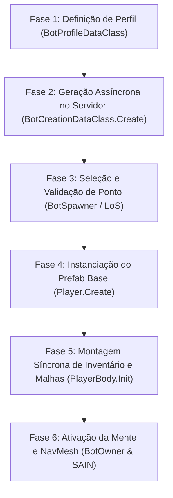

# Diagnóstico de Stuttering no Spawn e Otimizações de Desempenho

Este documento estabelece a análise técnica aprofundada da causa raiz dos engasgos (*stutterings* / congelamentos de quadros) durante o spawn de bots no **Escape From Tarkov (0.16.9) / SPT 4.0 (4.0.13)**, detalha como mitigar esses impactos no [TRL-DynamicSpawn](file:///d:/Projetos/GITHUB%20TARKOV/tarkov-spt-4.0/mods/TRL-DynamicSpawn) e analisa a viabilidade da distribuição de processamento de IA em rede no ecossistema FIKA.

---

## 1. As 6 Fases do Ciclo de Spawn de um Bot

O nascimento de qualquer bot no cliente do jogo percorre seis etapas consecutivas:



1. **Definição de Perfil (`BotProfileDataClass`):** O mod ou spawner especifica a facção (`EPlayerSide`), classe (`WildSpawnType`), dificuldade e parâmetros de agrupamento (`BotSpawnParams`).
2. **Geração dos Dados de Criação (`BotCreationDataClass.Create`):** O cliente requisita os perfis via Task assíncrona ao backend SPT. O servidor monta armas, modificações, blindagens e consumíveis.
3. **Seleção de Ponto de Spawn ([`BotSpawner.cs:562-574`](file:///d:/Projetos/GITHUB%20TARKOV/tarkov-spt-4.0/references/eft-decompiled/Assembly-CSharp/EFT/BotSpawner.cs#L562-L574)):** `SpawnSystem.SelectAISpawnPoints` escolhe posições válidas dentro da `BotZone`, filtrando proximidade e linha de visão (LoS) dos jogadores.
4. **Instanciação do GameObject Base ([`Player.cs:28465-28535`](file:///d:/Projetos/GITHUB%20TARKOV/tarkov-spt-4.0/references/eft-decompiled/Assembly-CSharp/EFT/Player.cs#L28465-L28535)):** O GameObject do jogador é retirado do pool de memória (`PoolManagerClass.CreatePlayerObject`). Componentes estruturais são adicionados via `AddComponent`: `LocalPlayer`, `CharacterController`, `LimbIK`, `GrounderFBBIK`, `PlayerOverlapManager`.
5. **Montagem do Corpo e Itens ([`PlayerBody.cs:575-640`](file:///d:/Projetos/GITHUB%20TARKOV/tarkov-spt-4.0/references/eft-decompiled/Assembly-CSharp/EFT/PlayerBody.cs#L575-L640)):** Instanciação das malhas 3D de armaduras, vestimentas, capacetes, fones e todas as 15 a 30 peças que compõem as armas (canos, miras, carregadores, lanternas).
6. **Ativação da IA ([`BotCreatorClass.cs:193-206`](file:///d:/Projetos/GITHUB%20TARKOV/tarkov-spt-4.0/references/eft-decompiled/Assembly-CSharp/BotCreatorClass.cs#L193-L206)):** `bot.PreActivate()` liga a física (`CharacterController.isEnabled = true`), conecta pontos de cobertura (`AICoversData`) e desperta os módulos de combate (SAIN, BigBrain).

---

## 2. Diagnóstico da Causa Raiz do Stuttering

A investigação no código descompilado do EFT revelou **três gargalos críticos** que convergem no momento do spawn:

### 2.1. O Parâmetro `async: false` em [`LocalPlayer.cs:81`](file:///d:/Projetos/GITHUB%20TARKOV/tarkov-spt-4.0/references/eft-decompiled/Assembly-CSharp/EFT/LocalPlayer.cs#L81) (O Vilão Principal)
No método `LocalPlayer.Create`, a chamada de inicialização do corpo é feita da seguinte forma:
```csharp
// Assembly-CSharp/EFT/LocalPlayer.cs:81
await localPlayer.Init(..., async: false);
```
Mesmo o método sendo formalmente uma `Task`, a flag **`async: false`** instrui o motor a **não ceder controle** (`await JobScheduler.Yield()` é ignorado). Toda a criação de malhas, binding de ossos (`SkinnedMeshRenderer.bones`) e instanciação de dezenas de GameObjects filhos para acessórios e miras de armas é executada **bloqueando a Main Thread da Unity no mesmo frame**.

### 2.2. Leitura Síncrona de AssetBundles em Disco
Se o bot spawnado estiver equipado com itens cujos arquivos de recursos ainda não foram carregados na memória da raid (ex: capacete ou mod de arma raro), a engine executa:
1. Leitura do arquivo `.bundle` no disco;
2. Descompressão dos dados na memória RAM;
3. Upload das texturas e shaders para a placa de vídeo (VRAM).
Essa operação pode segurar a thread principal por 50ms a 200ms adicionais.

### 2.3. Instanciação em Bloco de Esquadrões (Atomic Squad Spawn)
Em rotinas onde esquadrões de 3 a 4 integrantes nascem em uma única onda atômica ([`DynamicSpawnManager.cs:1181`](file:///d:/Projetos/GITHUB%20TARKOV/tarkov-spt-4.0/mods/TRL-DynamicSpawn/modded/Client/Components/DynamicSpawnManager.cs#L1181)):
* Se 1 bot exige ~80ms de tempo de CPU da main thread, 4 bots exigem **mais de 300ms contínuos**.
* O tempo de um frame a 60 FPS é de 16.6ms. Um travamento de 300ms representa **18 frames perdidos consecutivamente**, gerando um congelamento visual perceptível.

---

## 3. Estratégias de Otimização no `TRL-DynamicSpawn`

Para amenizar e erradicar esses congelamentos, o [TRL-DynamicSpawn](file:///d:/Projetos/GITHUB%20TARKOV/tarkov-spt-4.0/mods/TRL-DynamicSpawn) deve adotar três pilares:

### 3.1. Spawning Escalonado no Tempo (Time-Sliced / Staggered Spawning)
Gere os dados de todos os integrantes do esquadrão de forma atômica no backend (para manter as relações de grupo intactas), mas **espaçe a instanciação física (`TryToSpawnInZoneAndDelay`) no tempo**:
```csharp
// Exemplo conceitual para DynamicSpawnManager.cs
foreach (var profile in squadProfiles)
{
    SpawnSingleBotDirect(profile, zone);
    yield return new WaitForSeconds(1.2f); // Permite à engine processar dezenas de frames entre cada bot
}
```
*Resultado:* O custo de montagem das malhas é diluído ao longo de vários segundos. O jogador humano não percebe a diferença de 1 segundo entre o aparecimento dos membros do esquadrão, mas o congelamento de tela é eliminado.

### 3.2. Pré-Carregamento de Bundles (Pre-Warming)
Antes de posicionar o bot fisicamente no mapa, acione o carregamento prévio dos seus bundles em segundo plano aproveitando o `PoolManager`:
```csharp
ResourceKey[] allPrefabPaths = [.. profile.GetAllPrefabPaths(true)];
await Singleton<PoolManagerClass>.Instance.LoadBundlesAndCreatePools(
    PoolManagerClass.PoolsCategory.Raid,
    PoolManagerClass.AssemblyType.Local,
    allPrefabPaths,
    GInterface404.EQueuePriority.Low
);
```
Quando o GameObject for instanciado, todos os modelos, texturas e shaders já residem na memória RAM e VRAM, reduzindo o tempo de criação a uma fração mínima.

### 3.3. Cache de Raycasts de Linha de Visão (LoS)
No método `IsValidSpawnZone`, a checagem de visibilidade contra todos os jogadores vivos não deve realizar múltiplos raycasts físicos síncronos a cada tick. Deve-se manter um cache de visibilidade espacial com invalidação a cada 1.5 a 2.0 segundos ou limitar a checagem apenas a jogadores dentro do raio de visão relevante (<150m).

---

## 4. Análise de Distribuição de IA em Rede (FIKA / Coop)

> **Cenário Avaliado:** *Distribuir a simulação de parte dos bots da raid para os computadores dos jogadores conectados (clientes), aliviando o host.*

### 4.1. Como Funciona a Arquitetura Atual do FIKA
* **Host (`HostGameController.cs:579`):** Mantém a autoridade total da raid. Executa o `LocalPlayer`, `BotOwner`, SAIN, BigBrain, caminhos no NavMesh e cálculo de dano. Serializa e transmite snapshots dos bots via rede UDP.
* **Clientes (`CoopHandler.cs:338`):** Instanciam os bots apenas como **`ObservedPlayer`** (entidade oca sem IA). Os clientes recebem apenas coordenadas, rotações e estados de animação, consumindo quase zero de CPU para IA.

### 4.2. Inviabilidade Técnica da Distribuição entre Clientes

| Fator | Impacto Técnico |
| :--- | :--- |
| **Inversão e Latência de Rede** | O modelo do FIKA é cliente-servidor estrito (`Host -> Clientes`). Se clientes controlassem bots, eles precisariam transmitir dados desses bots de volta ao host, que teria que retransmitir aos demais clientes, dobrando a latência e aumentando exponencialmente o risco de desync. |
| **Autoridade de Balística e Registro de Tiros** | No EFT, os danos e mortes são computados na máquina onde o `HealthController` e `CharacterController` do bot residem. Se o cliente controlador tiver instabilidade ou perda de pacotes, os bots controlados por ele se tornariam imunes a tiros ou sofreriam atrasos severos de registro. |
| **Estado Compartilhado de Esquadrão (SAIN)** | O SAIN coordena táticas de esquadrão, pedidos de socorro e flanqueamento via instâncias de memória estática (`BotSquads`, `SAINBotController`). Se bots de um mesmo squad estiverem divididos entre máquinas distintas, eles perdem a comunicação tática. |
| **Resiliência a Desconexões** | Se um cliente com bots sob seu controle travar ou fechar o jogo, seus bots ficariam congelados ou seriam deletados subitamente da raid. |

### 4.3. Solução Canônica: Servidor Dedicado Headless (`fika-headless`)
A resposta correta para o alívio do processamento de IA em partidas cooperativas não é a fragmentação entre clientes instáveis, mas a adoção de um **Host Dedicado sem Renderização gráfica**:
* O repositório [`references/fika-headless/`](file:///d:/Projetos/GITHUB%20TARKOV/tarkov-spt-4.0/references/fika-headless/) permite rodar uma instância do jogo sem carga de GPU e áudio em um PC secundário (ou máquina virtual).
* O servidor dedicado roda 100% da IA (`BotOwner`, SAIN, BigBrain).
* **Todos os jogadores humanos conectam como clientes puros**, desfrutando de FPS máximo e zero sobrecarga de IA.
