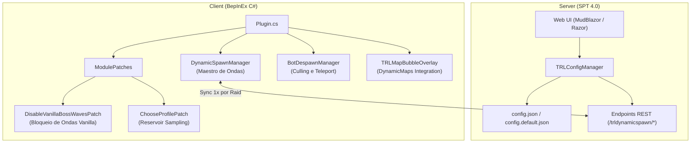
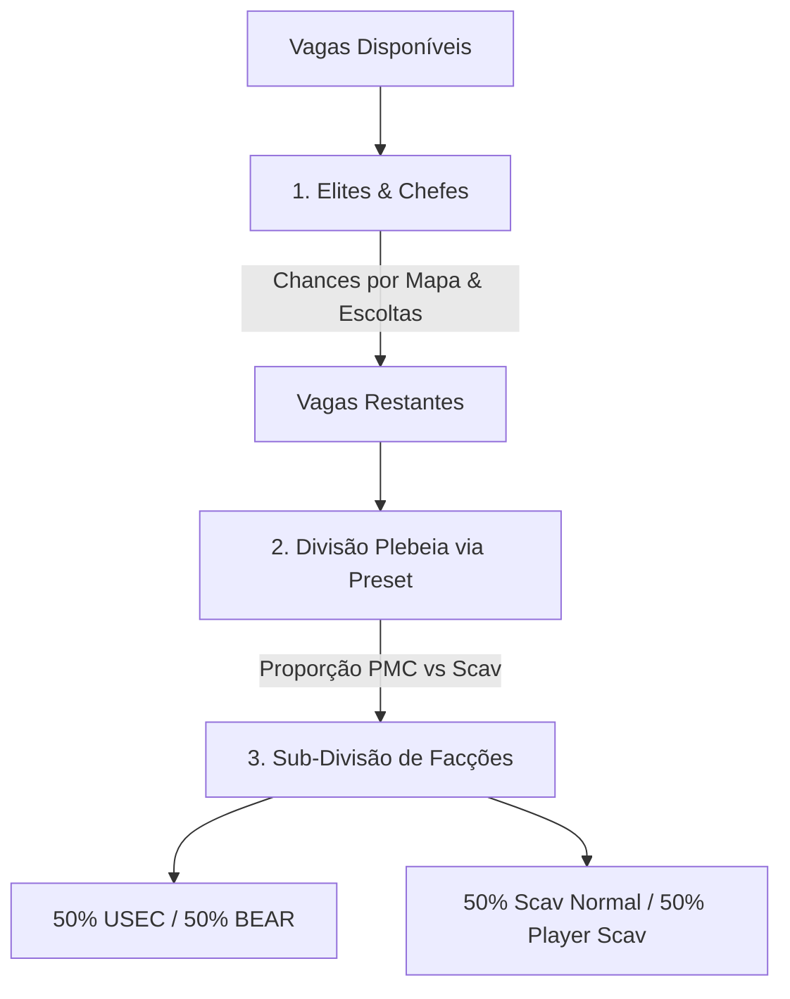

# TRL-DynamicSpawn — Especificação Técnica e Objetivos

O **TRL-DynamicSpawn** é um sistema completo de geração, controle demográfico e reciclagem dinâmica de bots para o **SPT 4.0** (Escape from Tarkov). Ele foi projetado para substituir completamente o sistema de spawn vanilla do EFT e geradores pré-calculados (como MOAR e SWAG/DONUTS), transferindo a inteligência e o controle de decisão para o **Cliente** de forma suave, sem filas acumuladas e com impacto mínimo no desempenho de CPU.

---

## 1. Visão Geral e Objetivos Centrais

### 🔴 O Problema do Spawn Tradicional (Vanilla e MOAR)
1. **Filas Estáticas e Congelamentos de FPS:** Geradores tradicionais pré-calculam centenas de bots antes da raid começar e os colocam em filas estáticas. Quando o limite de performance (`MaxBotCap`) é atingido, as ondas ficam presas em um buffer interno do SPT.
2. **Efeito "Spawn Instantâneo":** No exato momento em que o jogador elimina um bot, a fila descarrega imediatamente um substituto no mesmo ponto ou no campo de visão, gerando tiroteios infinitos sem respiro tático.
3. **Micro-Stutters Graves:** O ato de injetar múltiplos bots (8 a 15 entidades) no mesmo frame da Unity causa picos de alocação de memória e quedas drásticas de FPS.

### 🟢 O Propósito do TRL-DynamicSpawn
* **Cérebro no Cliente:** O cliente avalia o estado real do mapa ao vivo durante a raid, sem filas ocultas e sem acúmulo de spawns atrasados.
* **Ondas Discretas e Períodos de Calmaria:** As ondas ocorrem em intervalos temporais cravados (ex: a cada 6 minutos). Entre uma onda e outra, **nenhum spawn ocorre**, garantindo silêncio tático para loot, cura e reposicionamento.
* **Injeção Suave (Smooth Spawning):** Os bots de uma onda são injetados em fila espaçada (1 bot a cada 1.0s–1.5s), tornando o spawn imperceptível para o framerate.
* **Culling Inteligente por Linha de Visão e Bolha:** Bots nunca nascem no campo de visão direto do jogador e respeitam um raio operacional esférico ao redor do PMC.
* **Painel Web Nativo em C#:** Interface web rica (MudBlazor / Razor Pages) integrada diretamente ao servidor SPT para controle granular de mapas, timers, presets e chefes.

---

## 2. Arquitetura do Sistema (Dual Client-Server)

O mod é estruturado em dois módulos complementares que se comunicam via HTTP REST:



### 2.1. Módulo Cliente (`Client/`)
* **`DynamicSpawnManager.cs`:** Controlador principal do ciclo de vida da raid, timers de ondas, contagem de bots vivos, distribuição de cotas e corrotinas de injeção suave.
* **`BotDespawnManager.cs`:** Responsável por reciclar ou teleportar bots distantes/inativos para fora do combate, liberando vagas no `MaxBotCap`.
* **`TRLMapBubbleOverlay.cs`:** Desenha em tempo real os círculos da bolha ativa, zona segura e cone de visão no mod `SPT-DynamicMaps`.
* **`Patches/Patches.cs` & `SpawnGatePatches.cs`:**
  * `DisableVanillaBossWavesPatch`: Intercepta `BotsController.ActivateBotsByWave` e bloqueia 100% das ondas automáticas nativas do EFT para conceder controle absoluto ao mod.
  * `ChooseProfilePatch`: Seleção tolerante de perfis (exato $\rightarrow$ relaxado $\rightarrow$ fallback nativo) via amostragem de reservatório em passagem única, sem alocações LINQ.
  * `BotSpawnLoggerPatch`: Telemetria de diagnóstico de spawns ativada via BepInEx (`enableDebugLogs`).
  * `ZryachiyAggressivenessPatch`: Garante que Zryachiy e seus guardas mantenham comportamento hostil agressivo fora do Farol.

### 2.2. Módulo Servidor (`Server/`)
* **Hospedagem Web Nativa:** Painel administrativo completo rodando dentro do processo do SPT Server.
* **Persistência de Dados:** Configurações centralizadas em `Server/config/config.json` com backup imutável em `Server/config/config.default.json`.
* **Sincronização Segura:** O cliente busca a configuração do servidor **uma vez por raid** no warm-up (`/trldynamicspawn/getConfig`), suportando recarregamento em tempo real via menu F12.

---

## 3. Ciclo de Vida e Regras Temporais (Timers)

O ciclo de injeção de bots segue uma linha do tempo estrita e determinística:

```
[Início da Raid] ──> [Warm-up: 30s-60s] ──> [Onda 1: Injeção Suave] ──> [Calmaria: 360s] ──> [Onda 2] ──> ...
```

| Etapa | Duração Padrão | Comportamento |
| :--- | :---: | :--- |
| **Atraso Inicial (Warm-up)** | **30s a 60s** (por mapa) | O mod aguarda o jogador se mover e o mapa estabilizar antes de rodar a primeira onda. |
| **Execução da Onda** | **1.0s por bot** | Injeção progressiva dos bots calculados através de corrotinas assíncronas. |
| **Período de Calmaria** | **360s (6 min)** | Nenhum bot nasce no mapa, mesmo que o jogador elimine todos os inimigos. |
| **Influência de Presets** | Multiplicador | `Warzone` reduz o intervalo para **50%** (180s); `Quiet Raid` aumenta para **150%** (540s). |

---

## 4. Lógica de Vagas e Hierarquia Demográfica

No início de cada onda, o `DynamicSpawnManager` executa a seguinte matemática ao vivo:

$$\text{Vagas Disponíveis} = \text{MaxBotCap}(\text{Mapa}) - \text{AliveBots}(\text{Mapa})$$

Se $\text{Vagas Disponíveis} \le 0$, a onda é **descartada imediatamente** sem acumular fila. Se houver vagas, o preenchimento segue uma hierarquia estrita:



### 4.1. Hierarquia de Preenchimento
1. **Elites e Especiais (Prioridade Máxima):**
   * Avalia chances individuais configuradas no Painel Web para: Bosses Nativos, Guardas (Followers), Cultistas, Rogues (`exUsec`), Raiders (`pmcBot`), Bloodhounds e The Goons (`bossKnight`, `followerBigPipe`, `followerBirdEye`).
   * Grupos de Rogues e Raiders nascem como **esquadrões coesos** na mesma zona e no mesmo instante inicial.
2. **Divisão Plebeia (Presets):**
   * **Equilibrado (Balanced):** 50% PMCs / 50% Scavs.
   * **Guerra de PMCs (PMC War):** 80% PMCs / 20% Scavs (grupos maiores de PMCs).
   * **Infestação de Scavs (Scav Infestation):** 20% PMCs / 80% Scavs (hordas de Scavs).
   * **Zona de Guerra (Warzone):** Invasão constante de Raiders e Rogues aleatórios.
   * **Raid Silenciosa (Quiet Raid):** Grupos limitados a duplas e intervalos estendidos.
   * **Aleatório (Random):** Sorteia um preset diferente a cada onda.
3. **Sub-Divisão de Facções:**
   * Cota de PMCs: dividida em **50% BEARs** e **50% USECs**.
   * Cota de Scavs: dividida em **50% Scav Normal** e **50% pScav** (Simulação de Player Scav).
4. **Regra Especial de The Lab (`laboratory`):**
   * O mapa Laboratory possui trava estrita no código que **zera 100% das vagas de Scavs**, alocando toda a cota de população exclusivamente para PMCs e Raiders.

---

## 5. Algoritmos de Spawn, Culling e Performance

### 5.1. Smooth Spawning (Injeção Suave)
Para evitar congelamentos de tela quando 10 a 20 vagas são abertas:
* Os bots calculados para a onda entram em uma fila assíncrona (`_activeWaveCoroutine`).
* O mod instancia **1 bot a cada 1.0 a 1.5 segundos**.
* Uma onda com 12 bots leva cerca de 12 a 15 segundos para se materializar completamente no mapa, mantendo o framerate estável.

### 5.2. Bolha de Distância e Culling por Linha de Visão (LoS)
* **`spawnBubbleDistance`:** Define o raio máximo de engajamento a partir do jogador humano para permitir o nascimento de Scavs e PMCs (Chefes e Rogues são isentos).
* **Zona Segura Mínima:** Impede o spawn de inimigos a menos de 30–40 metros do jogador.
* **Line of Sight (LoS):** Executa um `Physics.Linecast` utilizando `LayerMaskClass.PlayerStaticCollisionsMask`. Se o ponto de spawn estiver visível no cone de visão direto do jogador, o spawn naquela posição é abortado.
* **Restrição Vertical (`heightLimit`):** Limite de 4.0 metros de altura para evitar que bots nasçam em andares incorretos ou em telhados inacessíveis.

### 5.3. Cache Permanente de Perfis (`AddToTargetBackup`)
Em vez de solicitar a geração de perfis de forma bloqueante durante o jogo:
* No início da raid, o mod registra no `IBotCreator` do SPT um **nível permanente de estoque de perfis** (padrão 15 USEC / 15 BEAR).
* O motor interno do SPT repõe esse estoque em segundo plano a cada ~30 segundos.
* Quando a onda dispara, o perfil do bot já está pronto e pré-carregado na memória, resultando em spawn instantâneo em 0 milissegundos.

---

## 6. Painel Web de Configuração (Web UI)

O mod inclui um Painel Web hospedado pelo SPT Server, acessível via navegador web:

```
http://localhost:6969/trldynamicspawn/index.html
```

### Principais Recursos do Painel:
* **Abas "ONDAS" e "BOTS":** Configuração independente de timers e demografia por mapa.
* **Roleta de Dificuldades:** Sliders de porcentagem ponderada para sortear dificuldades (Fácil, Normal, Difícil, Impossível).
* **Controle Individual de Chefes e Elites:** Liga/Desliga, chance de spawn (0% a 100%), BotZones exclusivas e opção de desativar escoltas (Followers).
* **Copiar Configuração entre Mapas:** Dropdown com clonagem profunda para replicar ajustes de um mapa para outro com um clique.
* **Restauração Segura de Padrões:** Botão PADRÃO com modal de confirmação em camada superior (`z-index: 99999`) que lê o arquivo canônico `config.default.json`.
* **Proteção I18N:** Elementos e tooltips utilizam tags `translate="no"` e binding por chaves internas, permitindo o uso seguro do Google Tradutor no navegador sem quebrar o salvamento de dados.

---

## 7. Compatibilidade e Integrações

| Mod / Sistema | Status | Como Funciona |
| :--- | :---: | :--- |
| **SPT 4.0.x / EFT 0.16.x** | 🟢 **Nativo** | Integração total com o pipeline de criação de bots do SPT. |
| **FIKA (Coop)** | 🟢 **100% Suportado** | `FikaHelper.IsClient()` detecta automaticamente clientes e desativa o gerenciador nos peers, centralizando todo o spawn e sincronização de rede no **Host**. |
| **SPT-DynamicMaps** | 🟢 **Integrado** | Desenha a bolha de spawn, raio de culling e cone de visão ao vivo no mapa tático do jogador. |
| **SAIN / Questing / Looting Bots** | 🟢 **Totalmente Compatível** | Os bots gerados recebem perfis nativos do Tarkov, permitindo que o SAIN e outros mods de comportamento assumam o controle da IA imediatamente após o spawn. |

---

## Histórico de Alterações

| Data | Versão | Descrição |
| :--- | :---: | :--- |
| 2026-08-24 | 3.2.9 | Criação da documentação formal de arquitetura, especificação técnica e regras de spawn. |
