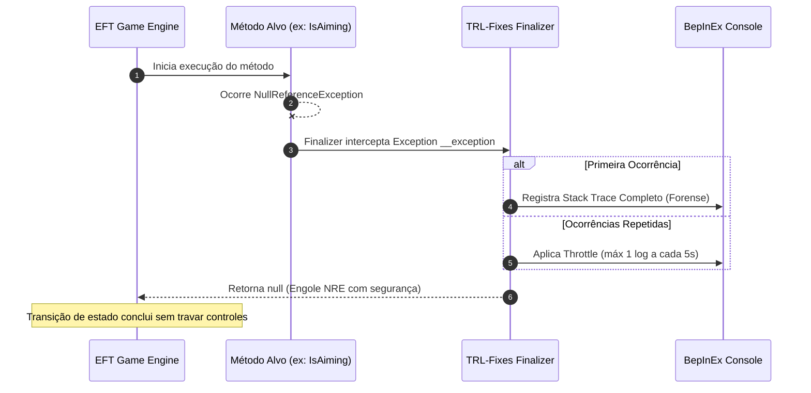

# TRL-Fixes — Visão Geral e Arquitetura

O **TRL-Fixes** é a suíte central de correções de infraestrutura, estabilidade de motor e interoperabilidade do ecossistema **Tarkov Red Line (TRL)** para o **Single Player Tarkov (SPT 4.0 / EFT 0.16.9)**. 

O mod funciona como uma camada defensiva de baixo nível, aplicando patches cirúrgicos via Harmony para interceptar exceções de ponteiro nulo (NREs), race conditions nativas do cliente Escape from Tarkov, limitações de sincronização do **FIKA Coop** e falhas de tomada de decisão de bots em conjunto com o **SAIN**.

---

## 1. Identificação e Metadados do Plugin

As definições fundamentais do plugin residem em [Plugin.cs](../modded-V2-audit/Plugin.cs):

| Propriedade | Valor | Descrição |
| :--- | :--- | :--- |
| **Plugin GUID** | `com.trl.fixes` | Identificador único no ecossistema BepInEx |
| **Plugin Name** | `TRL Fixes` | Nome canônico de exibição |
| **Versão** | `1.3.0` | Sincronizada com o [TRLFixes.csproj](../modded-V2-audit/TRLFixes.csproj) |
| **Dependência Opcional** | `com.fika.core` | Declarada como `SoftDependency` para garantir ordem de inicialização |
| **Alvo Runtime** | .NET Framework 4.7.2 / Unity 2019.4 | Compatível com EFT 0.16.9.1.34114 |

> [!IMPORTANT]
> A declaração de `[BepInDependency("com.fika.core", SoftDependency)]` é crítica: os patches do FIKA resolvem tipos por reflexão dinâmica (`AccessTools.TypeByName`). Sem essa declaração, a ordem de carregamento do BepInEx é indeterminada; se o TRL-Fixes carregar antes do FIKA, a resolução de tipos falha silenciosamente, desativando os patches cooperativos.

---

## 2. Mapa Geral de Patches e Subsistemas

O mod agrupa 10 componentes de correção distribuídos em três domínios funcionais:

```mermaid
graph TD
    Root["TRL-Fixes (com.trl.fixes)"] --> IA["1. IA e Combate"]
    Root --> Engine["2. Estabilidade do Jogo Base"]
    Root --> Fika["3. Sincronização FIKA Coop"]

    IA --> P1["BotMountWeaponFixPatch<br/>(Armas Estacionárias)"]
    IA --> P2["FlashbangBotPatch<br/>(Supressão SAIN)"]
    IA --> P3["FlashbangRadiusPatch<br/>(Periférico Flash)"]

    Engine --> P4["PickupAimingSafetyPatch<br/>(Trava de Controles)"]
    Engine --> P5["BotWeaponManagerSafetyPatch<br/>(NRE LateUpdate)"]
    Engine --> P6["DynamicMapsSafetyPatch<br/>(OnRaidEnd UI)"]

    Fika --> P7["FixFikaReviveRagdollPatch<br/>(Colisão Pós-Revive)"]
    Fika --> P8["FikaProceedEmptyHandsSafetyPatch<br/>(Pacotes EmptyHands)"]
    Fika --> P9["FikaRefreshSlotViewsSafetyPatch<br/>(Dicionário Multi-Slot)"]
    Fika --> P10["FikaMainThreadUISafetyPatch<br/>(UI Thread Safety)"]

    classDef core fill:#2d3748,stroke:#4a5568,color:#fff;
    classDef ia fill:#1e3a8a,stroke:#3b82f6,color:#fff;
    classDef engine fill:#78350f,stroke:#d97706,color:#fff;
    classDef fika fill:#14532d,stroke:#22c55e,color:#fff;

    class Root core;
    class IA,P1,P2,P3 ia;
    class Engine,P4,P5,P6 engine;
    class Fika,P7,P8,P9,P10 fika;
```



---

## 3. Matriz de Patches e Classes Alvo

A tabela abaixo resume os pontos de interceptação de cada componente:

| Patch | Classe Alvo | Método / Ponto de Hook | Técnica Harmony |
| :--- | :--- | :--- | :--- |
| [BotMountWeaponFixPatch.cs](../modded-V2-audit/Patches/BotMountWeaponFixPatch.cs) | `ExUsecBrainClass`<br/>`GClass81`<br/>`BotStationaryWeaponData`<br/>`FikaPlayer`<br/>`EFT.Player` | `.ctor(BotOwner)`<br/>`ShallUseNow()`<br/>`method_4()`<br/>`OperateStationaryWeapon()` | `ModulePatch` / Prefix / Postfix |
| [FlashbangBotPatch.cs](../modded-V2-audit/Patches/FlashbangBotPatch.cs) | `SAINActivationClass` | `ManualUpdate()` | Harmony Prefix (Conditional Skip) |
| [FlashbangRadiusPatch.cs](../modded-V2-audit/Patches/FlashbangRadiusPatch.cs) | `EFT.Grenade` | `Explosion()` | Harmony Postfix |
| [PickupAimingSafetyPatch.cs](../modded-V2-audit/Patches/PickupAimingSafetyPatch.cs) | `Player.FirearmController` | `set_IsAiming(bool)` | Harmony Finalizer (NRE Suppress) |
| [BotWeaponManagerSafetyPatch.cs](../modded-V2-audit/Patches/BotWeaponManagerSafetyPatch.cs) | `BotWeaponManager`<br/>`BotWeaponSelector` | `UpdateHandsController()`<br/>`OnWeaponTaken()` | Harmony Prefix + Finalizer |
| [DynamicMapsSafetyPatch.cs](../modded-V2-audit/Patches/DynamicMapsSafetyPatch.cs) | `ModdedMapScreen` / `GameWorldOnDestroyPatch` | `OnRaidEnd()` / `PatchPrefix()` | `ModulePatch` / Finalizer |
| [FixFikaReviveRagdollPatch.cs](../modded-V2-audit/Patches/FixFikaReviveRagdollPatch.cs) | `ReviveInteractable` | `RemoveRagdoll()` | Harmony Postfix (Physics Layer Reset) |
| [FikaProceedEmptyHandsSafetyPatch.cs](../modded-V2-audit/Patches/FikaProceedEmptyHandsSafetyPatch.cs) | `FikaServer` | `OnProceedRequestPacketReceived()` | Harmony Prefix (Packet Bypass) |
| [FikaRefreshSlotViewsSafetyPatch.cs](../modded-V2-audit/Patches/FikaRefreshSlotViewsSafetyPatch.cs) | `ObservedPlayer` | `RefreshSlotViews()` | Harmony Prefix (List Replacement) |
| [FikaMainThreadUISafetyPatch.cs](../modded-V2-audit/Patches/FikaMainThreadUISafetyPatch.cs) | `FikaUIGlobals` | `ShowFikaMessage(PreloaderUI, ...)` | `ModulePatch` / Prefix Dispatcher |

---

## 4. Padrões de Design e Estratégia de Patching

O mod combina duas abordagens de injeção Harmony:

### 4.1. `ModulePatch` (SPT Reflection Engine)
Utilizado em patches que se integram diretamente ao lifecycle padrão do SPT (`SPT.Reflection.Patching.ModulePatch`). Oferece proteção nativa na resolução de métodos virtuais e controle centralizado de ativação:
- [BotMountWeaponFixPatch.cs](../modded-V2-audit/Patches/BotMountWeaponFixPatch.cs)
- [DynamicMapsSafetyPatch.cs](../modded-V2-audit/Patches/DynamicMapsSafetyPatch.cs)
- [FikaMainThreadUISafetyPatch.cs](../modded-V2-audit/Patches/FikaMainThreadUISafetyPatch.cs)

### 4.2. Harmony Direto com Instâncias Dedicadas
Utilizado quando é necessário controle fino sobre hooks dinâmicos, resolução tardia de assemblies de terceiros (ex.: `SAIN`, `Fika.Core`) ou quando são aplicados múltiplos `PatchFinalizer` complexos:
```csharp
var harmony = new Harmony("com.trl.fixes.<subsystem>");
harmony.Patch(targetMethod, prefix: ..., postfix: ..., finalizer: ...);
```

### 4.3. Padrão Finalizer Defensivo (Exception Swallowing com Telemetria)
Em cenários onde o jogo base dispara exceções assíncronas inevitáveis (como na destruição de UI ou em corridas de animação), o TRL-Fixes utiliza Harmony Finalizers. A regra estabelecida é:
1. Capturar apenas a exceção esperada (`NullReferenceException`).
2. Retornar `null` para instruir o Harmony a abortar a propagação da falha, permitindo que a Unity Engine / FSM continue sua execução sem corrupção de estado.
3. Emitir logs forenses detalhados na primeira ocorrência e aplicar **Throttling de 5 segundos** para evitar degradação de FPS no console.



---

## 5. Estrutura de Diretórios do Projeto

```text
mods/TRL-Fixes/
├── modded-V2-audit/
│   ├── Patches/
│   │   ├── BotMountWeaponFixPatch.cs          # Correções de armas fixas (NSV/AGS)
│   │   ├── BotWeaponManagerSafetyPatch.cs     # NRE safety em controladores de armas de IA
│   │   ├── DynamicMapsSafetyPatch.cs          # Proteção OnRaidEnd do mod DynamicMaps
│   │   ├── FikaMainThreadUISafetyPatch.cs     # Dispatcher de UI thread-safe no Fika
│   │   ├── FikaProceedEmptyHandsSafetyPatch.cs# Bypass de validação de mãos vazias no FikaServer
│   │   ├── FikaRefreshSlotViewsSafetyPatch.cs # Lista segura contra colisão de slots de armas
│   │   ├── FixFikaReviveRagdollPatch.cs       # Restauração de física/hitboxes pós-revive
│   │   ├── FlashbangBotPatch.cs               # Supressão de IA SAIN sob efeito de flashbang
│   │   ├── FlashbangRadiusPatch.cs            # Cálculo periférico e raio de cegueira de granadas
│   │   └── PickupAimingSafetyPatch.cs         # Proteção contra freeze de controles no Pickup
│   ├── CHANGELOG.md                           # Histórico de versões
│   ├── Plugin.cs                              # Entrypoint e inicialização do BepInEx
│   └── TRLFixes.csproj                        # Configuração de build .NET 4.7.2
├── docs/                                      # Documentação técnica modular
├── PROPRIEDADES.md                            # Registro de opções configuráveis
└── README.md                                  # Índice geral do mod
```
